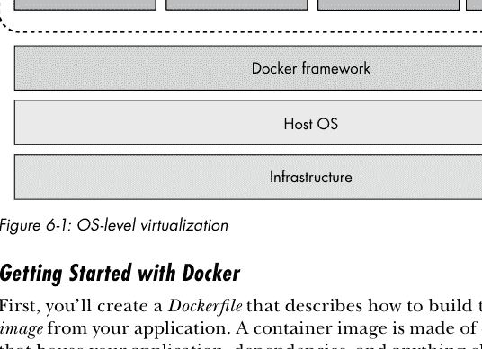
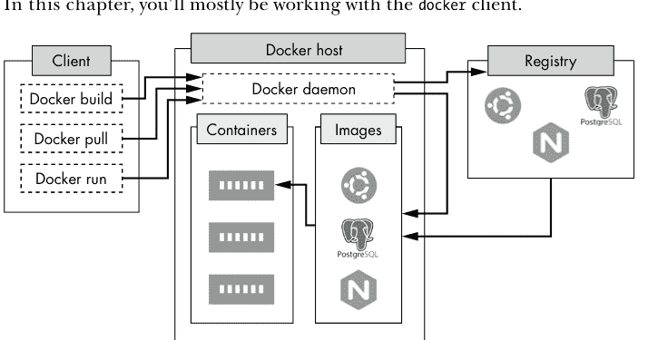
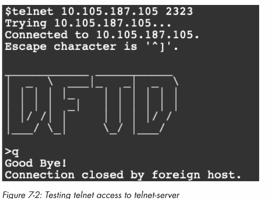
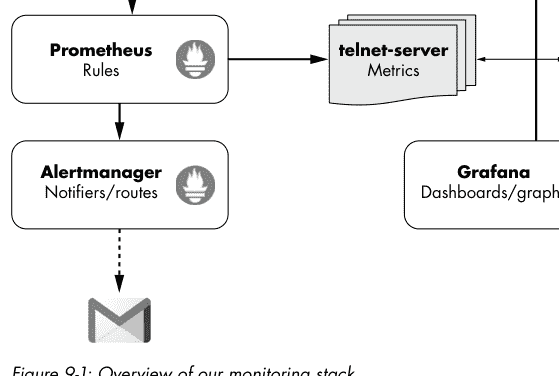
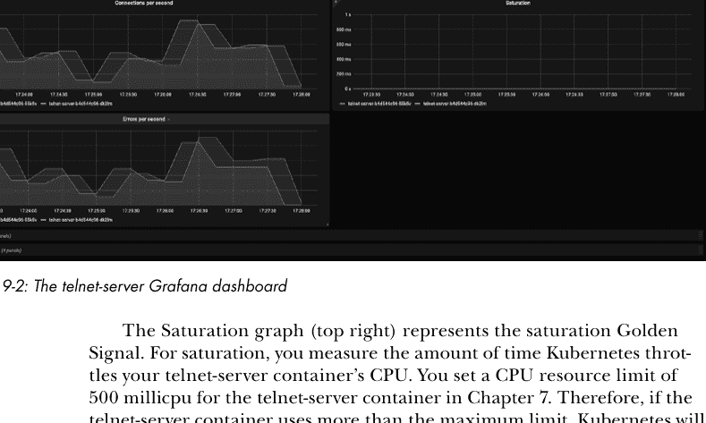
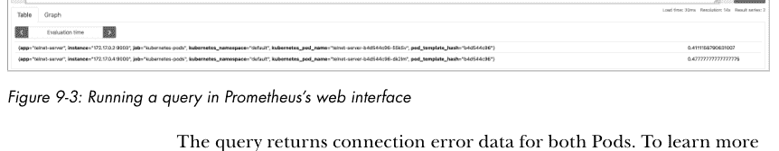
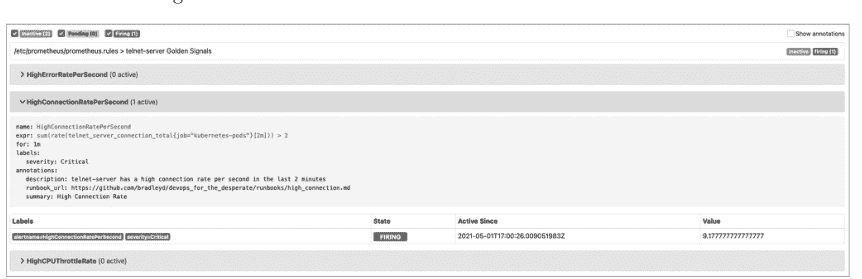
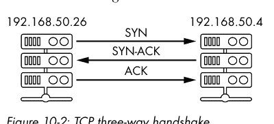

# 绝望者的 DevOps ： DevOps 实用指南


本书献给所有
辛苦坚守在值机岗位上的工程师们。

## 关于作者

布拉德利·史密斯是一位基础设施总监，居住在科罗拉多州丹佛市。他在众多大大小小的初创公司和企业中担任工程师已超过20年。他曾组建、培训并作为众多 DevOps、SRE 和软件工程团队的一员。布拉德利是波士顿本地人，毕业于马萨诸塞大学洛厄尔分校。

# 关于技术审校

昆汀·哈特曼在 DevOps 拥有名字之前就一直在与之打交道。他热爱技术，但更重要的是，他热爱看到 DevOps 实践如何让软件和构建它的人们的生活变得更好。在他近25年的技术职业生涯中，昆汀曾在公共教育、高等教育、非营利组织和私营企业工作过，这些机构的员工数量从3人到30万人不等。他管理过电信系统、数据中心以及公共和私有云。他曾担任过系统管理员、数据库管理员、网络工程师、事件响应者和领导者。这种广泛的经验为他奠定了坚实的 DevOps 基础，自2012年以来，这一直是他的主要关注点。无论身在何处，昆汀都将人置于技术之上，只有当他使用开源工具从事具有社会影响力的使命时，他才真正快乐。昆汀与家人住在科罗拉多州丹佛市附近。他经常可以被发现制作东西、烹饪和在树林里漫步。他可以通过 qhartman 在多个平台上联系，包括 Mastodon.social、Twitter 和 LinkedIn。


## 致谢

撰写致谢时，你会迅速意识到，有如此多的人共同促成了这本书的出版。如果我要感谢每一位以某种方式做出贡献的人，这一节将会非常冗长。既然这不是诺贝尔奖的获奖感言，我会尽量做到简短而真诚。如果我未能在此处提及你，请相信我深表感激。

首先，我要感谢No Starch Press的所有同仁。没有你们，这本书不可能面世。我的编辑Jill Franklin以及技术编辑Kyle Terrien和Quentin Hartman给予的指导是无价之宝。非常感谢你们将这个想法雕琢成书。我由衷地感谢你们所有人。

我们都需要朋友的帮助，而这本书上到处都留下了我朋友们的印记。你们中许多人提供了反馈，我万分感谢。尤其要感谢Rishi Malik、Jaden Grossman和Jeffrey Matthias。你们给予了支持，并且（更重要的是）借给了我你们宝贵的时间。我欠你们的！

最后，我要感谢我的家人。无数次，我请你们读一个句子或段落，然后告诉我你们的想法——即使你们完全不明白我在说什么。致我的妻子Leilani，你一直鼓励我，让我相信自己能做到。感谢你在我们生活中腾出时间，让我能专注于这本书的写作。致我的女儿Aiden和Akira，你们是我的灵感源泉，让我想成为最好的自己。我永远爱你们三个。

## 引言


DevOps工程师在日常工作中，始终沉浸在基于云的技术和趋势中。同时，工程领域的其他所有成员也被期望熟悉DevOps，并跟上其发展步伐。原因很简单：DevOps是软件开发中不可或缺的一部分。然而，你很可能没有时间在做好本职工作的同时，还要密切关注DevOps这个日新月异的领域——幸运的是，你不必如此。只需理解DevOps的基础概念、术语和策略，你就能取得很大进展。

另一方面，当需要交付代码时，你不能把头埋在沙子里，指望别人来处理。编写配置文件、实施可观测性以及设置持续集成/持续交付（CI/CD）管道，已成为软件开发的常态。因此，你需要精通代码和基础设施。

如果你是软件工程师、开发人员或系统管理员，本书将教你相关的概念、命令和技术，为你在DevOps、可靠性以及现代应用程序栈方面打下坚实基础。但请注意，这是一本DevOps入门书，而非终极指南。我选择降低知识灌输的强度，将重点放在以下几个基础概念上：

-   基础设施即代码
-   配置管理
-   安全
-   容器化与编排
-   交付
-   监控与告警
-   故障排除

还有许多其他优秀的书籍，会带你深入探索DevOps的概念和文化。我鼓励你去阅读它们，了解更多。但如果你只想从基础开始，*DevOps for the Desperate* 已为你准备就绪。

### DevOps的现状如何？

在过去的几年里，DevOps领域涌现出不同的趋势。人们高度关注微服务、容器编排（Kubernetes）、自动化代码交付（CI/CD）以及可观测性（详细的日志记录、链路追踪、监控和告警）。这些主题对DevOps社区来说并不新鲜，但它们正受到越来越多的关注，因为每个人都像是服用了红色药丸，走进了云计算与容器化的兔子洞。

自动化和测试“从代码到客户”的体验仍然是DevOps最重要的部分之一，并且随着后来者的追赶，它将持续如此。随着工程生态系统的成熟，越来越多的DevOps工作正向技术栈的上层转移。换句话说，DevOps工程师严重依赖工具和流程，以便软件工程师能够自助式地发布代码。正因如此，与功能团队共享DevOps实践和技术，对于交付标准化和可预测的软件至关重要。

还有几个新兴趋势值得在此简要提及。首先是安全。DevSecOps正成为构建过程中的一个必要部分，而非发布后的马后炮。另一个趋势是利用机器学习进行数据驱动的决策，例如告警。机器学习的洞察在启发式分析中极具价值，并且在未来将扮演更重要的角色。

---

场景：高内存使用率
-   free
-   vmstat
-   ps
-   后续步骤

场景：高I/O等待
-   iostat
-   iotop
-   后续步骤

场景：主机名解析失败
-   resolv.conf
-   resolvectl
-   dig
-   后续步骤

场景：磁盘空间不足
-   df
-   find
-   lsof
-   后续步骤

场景：连接被拒绝
-   curl
-   ss
-   tcpdump
-   后续步骤

搜索日志
-   常见日志
-   常用journalctl命令
-   解析日志

探测进程
-   strace

总结

**索引**


### 谁应该阅读这本书？

本书旨在帮助软件工程师在现代应用栈中游刃有余并取得成功。因此，它提供了关于DevOps任务的恰当入门信息。这并非意味着它对资深DevOps工程师毫无价值。恰恰相反，它提供了大量关于容器化、监控和故障排除的有用信息。如果你是一名小型团队的DevOps工程师或软件工程师，你甚至可以使用本书来帮助你创建从本地开发到生产环境的完整应用栈。

所以，如果你是一位寻求DevOps知识的软件开发者，这本书适合你。如果你有兴趣成为一名更全面的通才，这本书适合你。而如果我是付费请你来读这本书的——那么，这本书绝对是为你准备的。

### 本书结构

本书分为三个部分，如下：

*第一部分：基础设施即代码、配置管理、安全与管理*

第一部分介绍了基础设施即代码（IaC）和配置管理（CM）的概念，这些对于构建具有可重复、版本化和可预测状态的系统至关重要。我们还将探讨基于主机和基于用户的安全性。

- **第1章：设置虚拟机** 本章讨论了IaC和CM的概念，然后介绍了你将用来创建和配置Ubuntu虚拟机的两个技术：Vagrant和Ansible。

- **第2章：使用Ansible管理密码、用户和组** 本章探讨了如何使用CM进行用户和组创建，以限制文件和目录访问。它还解释了如何使用CM来强制执行复杂密码。

- **第3章：使用Ansible配置SSH** 本章向你展示如何设置SSH的公钥和双因素认证，从而使未授权用户更难访问你的主机和敏感数据。

- **第4章：使用sudo控制用户命令** 本章向你展示如何创建安全策略，为特定用户和组委托命令访问权限。控制用户和组在主机上的命令访问权限可以帮助你避免不必要的攻击风险。至少，它可以防止你拥有一个配置不当的操作系统。

- **第5章：自动化并测试基于主机的防火墙** 本章描述了如何创建并测试一个最小化的防火墙，它将阻止所有不需要的访问，同时允许已批准的流量。通过限制端口暴露，你可以减少主机和应用程序可能从外部遇到的漏洞。

#### 第二部分：容器化与现代应用程序部署

第二部分介绍了容器化、编排和交付的概念。它还探讨了构成现代栈的一些组件。

- **第6章：使用Docker容器化应用程序** 本章介绍容器和容器化，并展示如何创建一个示例容器化应用程序。对容器有基本的了解以及如何将其用于本地开发和生产环境，是你能够使用任何现代应用栈的关键。

- **第7章：使用Kubernetes进行编排** 本章介绍容器编排，并探讨如何使用Kubernetes和minikube等技术在本地集群上部署应用程序。它也作为一个如何搭建本地开发环境的示例。

- **第8章：部署代码** 本章讨论了持续集成和持续部署（CI/CD）的概念。它还探讨了一些核心技术，例如Skaffold，它允许你在本地Kubernetes集群上创建流水线。在构建了有效的CI/CD流水线之后，你将很好地理解如何构建、测试和部署软件。

#### 第三部分：可观测性与故障排除

最后，第三部分介绍了监控、告警和故障排除的概念。它研究了应用程序和主机的指标收集与可视化。它还讨论了一些常见的主机和应用程序问题，以及你可以用来诊断它们的工具。

- **第9章：可观测性** 本章介绍了监控和告警栈的概念，并探讨了构成该栈的技术（Prometheus、Alertmanager和Grafana）。你将学习如何检测系统状态，并在出现问题时发出告警。

- **第10章：主机故障排除** 最后一章讨论了主机上常见的问题和错误，以及你可以用来排除它们的一些工具。能够分析主机上的问题将帮助你在危机时刻应对，并帮助你理解自己代码和应用程序中的性能问题。

### 你需要什么

为了探索本书中的DevOps概念，你将安装一些工具以及免费的VirtualBox虚拟化技术，该技术适用于x86硬件，允许你在本地主机上运行其他操作系统。不幸的是，完成这些任务所需的一些工具在某些操作系统和CPU上无法原生运行，例如Windows和Apple Silicon。使用Linux或基于Intel的Mac作为主机是最直接的选择。以下列表总结了你可以为每种操作系统预期的情况：

#### Linux

如果你使用的是Linux主机，所有示例和示例应用程序都可以开箱即用。由于你将安装VirtualBox，你需要运行的是桌面版本的Linux，而不是无头服务器。

#### 基于Intel的Mac

如果你使用的是基于Intel的Mac，与Linux一样，所有示例和示例应用程序无需任何修改即可工作。使用Brew包管理器（https://brew.sh）安装软件。

#### Windows

如果你使用的是Windows主机，安装本书中所有的工具和应用程序可能是一个挑战。例如，你将使用Ansible来探索配置管理，但在Windows上没有简单的方法安装Ansible。作为解决方法，你可以使用一个Ubuntu虚拟机作为起点。我建议使用Hyper-V创建虚拟机，因为它是Windows原生的。你需要Windows 10或11专业版才能使用Hyper-V。有关在Hyper-V上创建Ubuntu虚拟机的说明，请参阅Ubuntu Wiki（https://wiki.ubuntu.com/Hyper-V）。

你还需要启用嵌套虚拟化，因为你将在Hyper-V Ubuntu虚拟机内部安装VirtualBox。要启用此功能，请在管理员PowerShell终端中输入以下命令：

```
Set-VMProcessor -VMName VMName -ExposeVirtualizationExtensions $true
```

你需要在Ubuntu虚拟机停止时运行此命令，否则它将失败。将*VMName*替换为你刚刚创建的Ubuntu虚拟机的名称。

在你的虚拟机启动并运行后，你将使用https://www.virtualbox.org/wiki/Linux_Downloads中列出的Ubuntu版本安装VirtualBox。完成安装后，你将能够从新创建的虚拟机中执行本书的示例。

对于旧版本的Windows，你可以使用VirtualBox（是的，VirtualBox within VirtualBox）或VMware（https://www.vmware.com/products/workstation-player.html）来创建Ubuntu虚拟机。这些选项的说明超出了本书的范围。

#### Apple Silicon

如果你使用Apple Silicon计算机作为主机，VirtualBox不是一个选项。Apple Silicon的CPU基于ARM架构，而VirtualBox仅适用于x86。相反，你需要使用虚拟化技术，如Parallels（https://parallels.com）、VMware Fusion（https://vmware.com）或Qemu（https://www.qemu.org）来创建一个基于ARM的虚拟机。前两个是付费软件，可能提供更好的用户体验。Qemu是免费且开源的，它需要一些额外的配置步骤。访问配套的GitHub仓库（https://github.com/bradleyd/devops_for_the_desperate/tree/main/apple-silicon/），获取如何设置一个合适的实验环境以在Apple Silicon Mac上跟随本书操作的详细说明。

为了获得最佳体验，你的主机应至少有8GB内存和至少20GB的可用磁盘空间；如果你的内存较少，体验可能会有所不同。本书还对你的Linux和命令行操作熟练程度做出了一些基本假设。你应该熟悉Bash并能够自如地编辑文件。

### 下载并安装VirtualBox

从https://www.virtualbox.org/wiki/Downloads/下载安装程序。选择最新版本以及适合你特定操作系统的正确下载。如前所述，使用Hyper-V的Windows用户将为Ubuntu Linux安装VirtualBox。对于基于Intel的Mac，点击“OS hosts”链接并下载安装程序。对于Linux，你猜对了——点击“Linux distributions”链接以找到适用于你发行版的下载。VirtualBox网站在https://www.virtualbox.org/manual/上为不同操作系统提供了优秀的说明。

从安装位置启动VirtualBox以验证其是否正常工作。如果一切正常，你应该会看到一个启动屏幕（参见图1）。


如果你决定使用操作系统的包管理器安装VirtualBox，请确保你拥有最新版本，因为旧版本可能与本书中的示例存在差异。


**警告**

如果你运行的是 macOS 系统，尝试启动虚拟机时，你需要允许 VirtualBox 获得额外的权限。系统会提示你允许 VirtualBox 控制你的计算机，你应该按提示操作。

### **配套仓库**

由于这是一本为“走投无路”者准备的书，我擅自创建了 IaC 文件、Kubernetes 清单文件、示例应用程序以及其他一些东西，以帮助你全程跟随练习。我将所有示例和源代码都放在了一个 Git 仓库中，地址是 https://github.com/bradleyd/devops_for_the_desperate.git。要跟随各章节和示例，你需要克隆本书的仓库。你的操作系统默认应该已安装 Git，但如果没有，请访问 https://git-scm.com/downloads 查看如何为你的特定操作系统下载和安装 Git 的信息。

在你的终端中，输入以下命令来克隆配套仓库：

```
$ git clone https://github.com/bradleyd/devops_for_the_desperate.git
```

你可以将这个仓库克隆到任何你喜欢的位置。我在 *README* 文件中也添加了一些信息，如果你需要任何额外的指导可以参考。我们将在本书中多次回顾这个仓库。

### **编辑器**

在本书中，你将需要编辑和查看文件以完成任务。例如，在一些 Ansible 文件中，我可能注释掉了你需要取消注释的部分，或者你需要填写一些缺失的信息。

我建议使用任何你习惯的编辑器。跟随本书学习，你不需要任何特殊的插件或依赖项。不过，如果你仔细寻找，我相信你能找到语法插件来帮助编辑不同类型的文件，比如 Ansible 和 Vagrant 清单文件。我个人使用 Vim 作为编辑器，但你可以随意使用你最喜欢的工具。

好了，所有背景知识都介绍完毕，你可以准备开始了！在第 1 章，我们将深入探讨设置本地虚拟机。

# 第一部分

基础设施即代码、配置管理、安全与管理

# 1

## 设置虚拟机

配置（即设置）虚拟机（VM）是为特定目的而配置 VM 的行为。这种目的可以是运行应用程序、跨不同平台测试软件，或应用更新。

设置 VM 需要两个步骤：创建然后配置。在这个示例中，你将使用 Vagrant 和 Ansible 来构建和配置一个 VM。Vagrant 自动化创建 VM 的过程，而 Ansible 则在 VM 运行后对其进行配置。你将在本地 VirtualBox 上设置和测试你的 VM。这个过程类似于在云中创建和配置服务器。你现在设置的 VM 将成为本书第一部分所有示例的基础。

## 为什么使用代码来构建基础设施？

使用代码来构建和配置基础设施，可以让你一致、快速、高效地管理和部署应用程序。这使得你的基础设施和服务能够扩展。它还可以降低运营成本、减少灾难恢复时间，并最大限度地减少配置错误的可能性。

> **注意**
*在 DevOps 领域，你经常会听到两个与创建和配置基础设施相关的术语：基础设施即代码（IaC）和配置管理（CM）。将基础设施视为代码是使用代码来描述和管理基础设施（如虚拟机、网络交换机以及云资源，例如 Amazon Relational Database Service (RDS)）的过程。CM 是以可预测、可重复的方式为特定目的配置这些资源的过程。我们正在使用的两个工具 Vagrant 和 Ansible 分别被认为是 IaC 和 CM。*

将基础设施视为代码的另一个好处是便于部署。应用程序在交付流水线中以相同的方式构建和测试。例如，像 Docker 镜像这样的制品使用相同版本的库和程序一致地创建和部署。将基础设施视为代码允许你构建可重用的组件、使用测试框架，并应用标准的软件工程最佳实践。

然而，有时将基础设施视为代码可能有些小题大做。例如，如果你只需要启动一个虚拟机或运行一个简单的 Bash 脚本，花时间去创建所有基础设施和 CM 代码来完成一件五分钟就能搞定的事情，可能并不值得。在决定采取哪种路线时，请运用你的最佳判断。

## Vagrant 入门

*Vagrant* 是一个使创建和管理 VM 变得简单的框架。它支持在多种平台上运行的多种操作系统（OS）。Vagrant 使用一个名为 *Vagrantfile* 的配置文件来用代码描述虚拟环境。你将使用它来创建本地基础设施。

### *安装*

要安装 Vagrant，请访问 Vagrant 网站 https://www.vagrantup.com/downloads.html。为你的主机选择正确的操作系统和体系结构。要完成安装，请下载二进制文件并按照针对你操作系统的说明进行操作。例如，由于我使用的是 Mac，我会选择 macOS 64 位链接来下载最新版本。

当你的 VM 启动时，你还需要确保它上面安装了 VirtualBox 的客户机增强功能。（你应该在遵循本书“简介”部分时已经安装了 VirtualBox。）*客户机增强功能*提供了更好的驱动程序支持、端口转发和仅主机网络。它们有助于你的 VM 运行得更快，并提供更多的可用选项。

安装完 Vagrant 后，在终端中输入以下命令来安装用于客户机增强功能的 Vagrant 插件：

```
$ vagrant plugin install vagrant-vbguest
Installing the 'vagrant-vbguest' plugin. This can take a few minutes…
Fetching vagrant-vbguest-0.30.0.gem
Installed the plugin 'vagrant-vbguest (0.30.0)'!
```

上面的输出显示 Vagrant 的 vbguest 插件安装成功。你的插件版本很可能不同，因为新版本会定期发布。一个好习惯是每次升级 Vagrant 和 VirtualBox 时都更新此插件。

### Vagrantfile 的结构

Vagrantfile 描述了如何构建和配置 VM。最佳实践是每个项目使用一个 Vagrantfile，这样你可以将配置文件添加到项目的版本控制中并与团队共享。配置文件的语法是用 Ruby 编程语言编写的，但你只需要理解一些基本原则就可以开始。

本书提供的 Vagrantfile 包含文档和合理的选项，以节省你的时间。这个文件太大，无法在此完整包含，所以我只讨论我相对于 Vagrant 默认值所做的修改部分。你将从文件顶部开始，一路向下，所以请随意打开它并跟随操作。它位于你从“简介”部分克隆的仓库的 *vagrant/* 目录下。在本章的后面，你将使用这个文件来创建你的 VM。

### 操作系统

Vagrant 默认支持许多操作系统基础镜像，称为 *boxes*。你可以在 *https://app.vagrantup.com/boxes/search/* 搜索 Vagrant 支持的 boxes 列表。一旦找到你想要的，就在 Vagrantfile 顶部附近使用 `vm.box` 选项进行设置，如下所示：

```
config.vm.box = "ubuntu/focal64"
```

在这个例子中，我将 vm.box 标识符设置为 ubuntu/focal64。

### 网络配置

你可以为不同的网络场景配置 VM 的网络选项，例如 *静态 IP* 或 *动态主机配置协议（DHCP）*。为此，请修改文件中间附近的 vm.network 选项：

```
config.vm.network "private_network", type: "dhcp"
```

对于这个示例，你希望 VM 通过 DHCP 从私有网络获取其 IP 地址。这样，你就可以轻松地从本地主机访问 VM 上的资源，比如 Web 服务器。


## 提供程序

*提供程序*是一种插件，它知道如何创建和管理虚拟机。Vagrant 支持多种提供程序来管理不同类型的机器。每个提供程序都有通用选项，如 CPU、磁盘和内存。Vagrant 将使用提供程序的应用程序编程接口 (API) 或命令行选项来创建虚拟机。你可以在 *https://www.vagrantup.com/docs/providers/* 找到支持的提供程序列表。提供程序在文件底部附近设置，如下所示：

```
config.vm.provider "virtualbox" do |vb|
  vb.memory = "1024"
  vb.name = "dftd"
  --snip--
end
```

## 基本 Vagrant 命令

现在你已经知道 Vagrantfile 的结构了，让我们来看一些基本的 Vagrant 命令。你最常用的四个命令是 `vagrant up`、`vagrant destroy`、`vagrant status` 和 `vagrant ssh`：

- `vagrant up` 以 Vagrantfile 为指导创建一个虚拟机
- `vagrant destroy` 销毁正在运行的虚拟机
- `vagrant status` 检查虚拟机的运行状态
- `vagrant ssh` 通过安全 Shell 访问虚拟机

每个命令都有附加选项。要查看这些选项是什么，请输入一个命令，然后添加 `--help` 标志以获取更多信息。要了解更多关于 Vagrant 的功能，请访问文档 *https://www.vagrantup.com/docs/*。

一旦你通过运行 `vagrant up` 创建了虚拟机，你将拥有一个具有所有操作系统默认设置的 Linux 核心系统。接下来，让我们看看如何通过配置系统来应用你自己的配置。

## Ansible 入门

Ansible 是一种配置管理工具，可以编排基础设施（如虚拟机）的配置。Ansible 使用*声明式配置风格*，这意味着它允许你描述基础设施的期望状态应该是什么样子。这与*命令式配置风格*不同，后者要求你提供期望基础设施状态的所有细节。由于其声明式风格，Ansible 对于不熟悉系统管理的软件工程师来说是一个很好的工具。Ansible 也是开源软件，可以免费使用。

Ansible 是用 Python 编写的，但你不需要理解 Python 就能使用它。你需要理解的一个依赖项是*另一种标记语言 (YAML)*，这是一种数据序列化语言，Ansible 用它来描述复杂的数据结构和任务。通过查看一些基本示例可以轻松上手，我将在后面回顾 Ansible 剧本和任务时提供一些示例。这里有两个值得注意的重要事项：YAML 使用缩进来组织元素，就像 Python 一样，并且它也区分大小写。你可以在 <https://docs.ansible.com/ansible/latest/reference_appendices/YAMLSyntax.html> 阅读更多关于 YAML 的信息。

Ansible 通过*安全 Shell (SSH)* 应用其配置更改，SSH 是一种与远程主机通信的安全协议。SSH 最常见的用途是访问远程主机上的命令行，但用户也可以使用它来转发网络流量和安全地复制文件。通过使用 SSH，Ansible 可以通过网络配置单个主机或一组主机。

## 安装

现在，你应该安装 Ansible，以便 Vagrant 可以使用它进行配置。请访问 Ansible 的文档 <https://docs.ansible.com/ansible/latest/installation_guide/intro_installation.html>。找到针对你特定操作系统的文档，并按照步骤安装 Ansible。例如，我使用的是 macOS，在 macOS 上安装 Ansible 的首选方式是使用 *pip*，这是一个用于安装应用程序和依赖项的 Python 包管理器。我找到了“在 macOS 上安装 Ansible”链接下的这些信息，该链接最终引导我使用“使用 pip 安装 Ansible”链接下的 pip 安装 Ansible。由于 Ansible 是用 Python 编写的，使用 pip 是安装最新版本的有效方法。

## Ansible 关键概念

现在你已经安装了 Ansible，你需要知道这些术语和概念，以便快速启动和运行：

- **剧本**：*剧本*是一系列有序的任务或角色的集合，你可以用来配置主机。

- **控制节点**：*控制节点*是任何安装了 Ansible 的 Unix 机器。你将从控制节点运行剧本或命令，并且你可以拥有任意数量的控制节点。

- **清单**：*清单*是一个包含 Ansible 可以与其通信的主机或主机组列表的文件。

- **模块**：*模块*封装了在不同操作系统上执行某些操作的详细信息，例如如何安装软件包。Ansible 预加载了许多模块。

- **任务**：*任务*是在托管主机上执行的命令或操作（例如安装软件或添加用户）。

- **角色**：*角色*是一组任务和变量的集合，这些任务和变量组织在标准化的目录结构中，为服务器定义了特定用途，并可以与其他用户共享以实现共同目标。一个典型的角色可以配置主机成为数据库服务器。该角色将包括安装数据库应用程序、配置用户权限和应用种子数据所需的所有文件和说明。

## Ansible 剧本

要配置虚拟机，你将使用我提供的 Ansible 剧本。这个名为 *site.yml* 的文件位于你从介绍中克隆的 *ansible/* 目录中。将剧本视为如何组装主机的说明书。现在，看看剧本文件本身。导航到 *ansible/* 目录，并在编辑器中打开 *site.yml* 文件。

你可以将剧本文件分解为不同的部分。第一部分充当标题，这是在整个剧本中设置全局变量的好地方。在标题中，你将设置诸如剧集名称、主机、*remote_user* 和特权升级方法等内容：

```
---
- name: Provision VM
  hosts: all
  become: yes
  become_method: sudo
  remote_user: ubuntu
--snip--
```

这些设置大多是样板代码，但让我们关注几点。务必为每个剧集命名，以便在出现问题时更容易查找和调试。上例中的剧集名称设置为 Provision VM。你可以在单个剧本中有多个剧集，但对于此示例，你只需要一个。接下来，`hosts` 选项设置为 `all`，以匹配任何 Vagrant 构建的虚拟机，因为 Vagrant 将动态生成 Ansible 清单文件。在主机上执行某些操作需要提升权限，因此 Ansible 允许你为特定用户*become*，或激活特权升级。由于你使用的是 Ubuntu，默认具有提升权限的用户是 ubuntu。你还可以设置用于授权的不同方法，在此示例中你将使用 sudo。

下一节是你将列出主机所有任务的地方。这是实际工作进行的地方。如果你将剧本视为说明书，那么*任务*只是该说明书中的各个步骤。任务部分如下所示：

```
--snip--
tasks:
  #- import_tasks: chapter2/pam_pwquality.yml
  #- import_tasks: chapter2/user_and_group.yml
--snip--
```

内置的 Ansible `import_tasks` 函数从两个单独的文件中加载任务：*pam_pwquality.yml* 和 *user_and_group.yml*。`import_tasks` 函数允许你更好地组织任务，并避免大型、杂乱的剧本。每个文件都可以包含一个或多个单独的任务。我将在后续章节中讨论任务和剧本的其他部分。目前，请注意这些任务被井号 (#) 符号注释掉了，在取消注释之前不会更改任何内容。

## 基本 Ansible 命令

Ansible 应用程序提供了多个命令，但你主要使用这两个：`ansible` 和 `ansible-playbook`。

你主要使用 `ansible` 命令来运行你从命令行执行的临时或一次性命令。例如，要指示一组 Web 服务器重启 Nginx，你可以输入以下命令：

```
$ ansible webservers -m service -a "name=nginx state=restarted" --become
```

这指示 Ansible 在名为 *webservers* 的一组主机上重启 Nginx。请注意，*webservers* 组的映射将位于清单文件中。Ansible 的 `service` 模块与操作系统交互以执行重启。`service` 模块需要一些额外的参数，它们通过 `-a` 标志传递。在这种情况下，指定了服务的名称 (nginx) 和它应该重启的事实。你需要 *root* 权限来重启服务，因此你将使用 `--become` 标志来请求特权升级。

`ansible-playbook` 命令运行剧本。实际上，这是 Vagrant 在配置阶段将使用的命令。要指示 `ansible-playbook` 对名为 *dockerhosts* 的一组主机执行 *aws-cloudwatch.yml* 剧本，你可以在终端中输入以下命令：

```
$ ansible-playbook -l dockerhosts aws-cloudwatch.yml
```

*dockerhosts* 需要列在清单文件中，命令才能成功。请注意，如果你没有使用 `-l` 标志提供主机子集，Ansible 将假定你想在清单文件中找到的所有主机上运行剧本。

## 创建 Ubuntu 虚拟机

到目前为止，我们一直在讨论概念和配置文件。现在，让我们运用这些知识来搭建和配置一些基础设施。要创建 Ubuntu 虚拟机，请确保你与 Vagrantfile 在同一目录中。这是因为 Vagrant 在创建虚拟机时需要引用配置文件。你将使用 `vagrant up` 命令来创建虚拟机，但在运行该命令之前，你应该知道它会产生大量输出，并且可能需要几分钟时间。因此，我这里只关注相关部分。在你的终端中输入以下命令：

```
$ vagrant up
```


首先需要查看的是 Vagrant 下载基础镜像的部分：

```
--snip--
Bringing machine 'default' up with 'virtualbox' provider...
==> default: Importing base box 'ubuntu/focal64'...
--snip--
```

这里，Vagrant 正在按预期下载 Ubuntu 镜像。镜像下载可能需要几分钟时间，具体取决于你的网络连接。

接下来，Vagrant 将配置一对公钥/私钥，以提供对虚拟机的 SSH 访问。（我们将在第 3 章更详细地讨论密钥对。）

```
--snip--
default: Vagrant insecure key detected. Vagrant will automatically replace
default: this with a newly generated keypair for better security.
default:
default: Inserting generated public key within guest...
default: Removing insecure key from the guest if it's present...
default: Key inserted! Disconnecting and reconnecting using new SSH key...
--snip--
```

Vagrant 将私钥存储在本地主机（`.vagrant/`）上，然后将公钥添加到虚拟机的 `~/.ssh/authorized_keys` 文件中。没有这些密钥，你将无法通过 SSH 连接到虚拟机。

默认情况下，Vagrant 和 VirtualBox 将在虚拟机内部挂载一个共享目录。此共享目录使你能够从虚拟机内部访问主机目录：

```
--snip--
==> default: Mounting shared folders...
    default: /vagrant => /Users/bradleyd/devops_for_the_desperate/vagrant
--snip--
```

你可以看到我的本地主机目录 `Users/bradleyd/devops_for_the_desperate/` 被挂载到虚拟机内的 `vagrant/` 目录。你的目录会有所不同。你可以使用此共享目录在主机和虚拟机之间传输源代码等文件。如果不需要共享目录，Vagrant 提供了配置选项来关闭它。详情请参阅 Vagrant 的文档。

最后，以下是 Ansible 配置器输出：

```
--snip--
==> default: Running provisioner: ansible...
    default: Running Ⓛansible-playbook...

PLAY [Provision VM] **************************************
⓽ TASK [Gathering Facts] *********************************
⓼ ok:  [default]

PLAY RECAP **********************************************
default      : ok=1   changed=0   unreachable=0   failed=0   skipped=0
rescued=0    ignored=0
```

这表明 Ansible 配置器使用 ansible-playbook ❶ 命令运行。Ansible 记录每个 TASK ❷ 以及主机上是否有任何更改 ❸。在这种情况下，所有任务都被注释掉了，因此虚拟机上没有进行任何更改 ❹。在评估成功或失败时，这是首先要查看的输出。

让我们执行一个健全性检查，看看虚拟机是否确实在运行。在终端中输入以下命令以显示虚拟机的当前状态：

```
$ vagrant status
Current machine states:
default    running (virtualbox)
--snip--
```

在这里，你可以看到虚拟机的状态是 running。这意味着你已经创建了虚拟机，并且应该可以通过 SSH 访问它。

如果你的输出看起来不同，请确保在继续之前 `vagrant up` 命令没有错误。如果需要更多信息，请在 up 命令中添加调试标志，让 Vagrant 增加输出详细程度：`vagrant up --debug`。此时你需要成功完成配置，否则很难跟上后续章节。

## 总结

在本章中，你安装了 Vagrant 和 Ansible 来创建和配置虚拟机。你学习了如何使用 Vagrantfile 配置 Vagrant，并获得了使用 Ansible playbook 和任务配置虚拟机的基础知识。既然你理解了这些基本概念，你应该能够创建和配置任何类型的基础设施，而不仅仅是虚拟机。

在下一章中，你将使用两个提供的 Ansible 任务来创建用户和群组。在配置主机时，你需要具备用户和群组管理的基础知识。

# 2 使用 ANSIBLE 管理密码、用户和群组


既然你已经构建了虚拟机，让我们继续执行用户管理等管理任务。自动化是构建和管理资源的 DevOps 实践的关键。要管理任何 Linux 主机，你需要对密码、用户和群组的工作原理有基本的了解。用户和密码是身份管理的基础，而群组允许你管理用户集合，并控制对文件、目录和命令的访问。在用户和群组之间划分职责可能意味着允许未授权访问和阻止未授权访问之间的区别。

在本章中，你将继续学习如何使用 Ansible，并且你还将配置刚刚创建的虚拟机以改进你的基本安全策略。你将使用一些提供的 Ansible 任务来强制执行复杂密码、管理用户和群组，以及控制对共享目录和文件的访问。一旦你学会了这些安全基础知识，你就可以将它们作为每个 playbook 的基础。

## 强制执行复杂密码

让用户自行决定什么是强密码可能会带来灾难，因此你需要在用户可以访问的每台主机上强制执行复杂密码。由于自动化是我们的指导原则之一，你将使用代码来为所有用户强制执行强密码。为此，你可以使用 Ansible 任务来安装 *可插拔认证模块 (PAM)* 的插件，这是一个大多数 Linux 发行版采用的用户认证框架。提供复杂密码的插件称为 `pam_pwquality`。此模块根据你设置的标准验证密码。

### 安装 libpam-pwquality

`pwquality` PAM 模块在 Ubuntu 软件仓库中以 `libpam-pwquality` 的名称提供。你将使用本书提供的 Ansible 任务来安装和配置此软件包。记住，目标是尽可能自动化一切，任务提供了执行管理工作的机制。这些任务位于你从引言部分克隆的仓库中。导航到 `ansible/chapter2/` 目录，并在你喜欢的编辑器中打开 `pam_pwquality.yml` 文件。此文件包含两个任务：Install libpam-pwquality 和 Configure pam_pwquality。

让我们专注于第一个任务，该任务使用 Ansible package 模块在虚拟机上安装 libpam-pwquality。在文件顶部，安装任务应如下所示：

```
---
- name: Install libpam-pwquality
  package:
    name: "libpam-pwquality"
    state: present
--snip--
```

每个 Ansible 任务都应以一个声明其目标的 name 声明开始。在这种情况下，名称是 Install libpam-pwquality。接下来，Ansible package 模块执行软件安装。package 模块要求你设置两个参数：name 和 state。在此示例中，软件包名称（在 Ubuntu 仓库中找到）应为 libpam-pwquality，state 应为 present。要删除软件包，请将 state 设置为 **absent**。这是一个声明性指令的好例子，因为你是在告诉 Ansible 确保安装此软件包。你不需要担心它是如何安装的，只要安装了就行。如果你安装了软件包（present）然后从 Ansible 中删除了任务，在下次配置时该软件包仍将被安装。如果你想让主机代表你期望的状态，你必须明确地将软件包设置为 absent。

如第 1 章所述，Ansible 模块（如上所述）在操作系统上执行常见操作，例如启用防火墙、管理用户或（在这种情况下）安装软件。Ansible 允许你的操作具有 *幂等性*，这意味着你可以重复执行特定操作，并且结果将与上次执行操作时相同。因此，你应该尽可能地实现自动化！你将节省时间并避免因人工疲劳导致的错误。想象一下，如果你每天必须配置 1,000 台机器。没有自动化几乎是不可能的！

### 配置 pam_pwquality 以强制执行更严格的密码策略

在默认的 Ubuntu 系统上，密码复杂性不够强。它要求最小密码长度为六个字符，并且只执行一些基本的复杂性检查。要强制执行更多复杂性，你需要配置 `pam_pwquality` 以设置更严格的密码策略。

一个名为 `/etc/pam.d/common-password` 的文件处理 `pam_pwquality` 模块的配置。此文件是 Ansible 任务进行验证密码所需更改的地方。你只需要更改该文件中的一行。使用 Ansible 编辑行的常用方法是使用 `lineinfile` 模块，它允许你更改文件中的行或检查行是否存在。

保持 `pam_pwquality` 任务文件打开，让我们查看从上数第二个任务。它应如下所示：

```
--snip--
- name: Configure pam_pwquality
  lineinfile:
    path: "/etc/pam.d/common-password"
    regexp: "pam_pwquality.so"

    line: "password required pam_pwquality.so minlen=12 lcredit=-1 ucredit=-1 dcredit=-1 ocredit=-1 retry=3 enforce_for_root"
    state: present
--snip--
```

任务再次以一个描述其意图的名称 `Configure pam_pwquality` 开始。然后它告诉 Ansible 使用 `lineinfile` 模块编辑 PAM 密码文件。`lineinfile` 模块需要你想要更改的文件的路径。在这种情况下，它是 PAM 密码文件 `/etc/pam.d/common-password`。使用正则表达式（或 `regexp`）来查找文件中要更改的行。正则表达式定位包含 `pam_pwquality.so` 的行，并将其替换为新行。替换行参数包含 `pwquality` 配置更改，这些更改强制执行更多复杂性。上面提供的选项强制执行以下要求：

- 最小密码长度为 12 个字符
- 一个小写字母
- 一个大写字母


添加这些要求将加强 Ubuntu 的默认密码策略。任何新密码都需要满足或超过这些要求，这将使攻击者暴力破解用户密码变得稍微困难一些。

> 注意：上面配置行中的负值告知 pam_pwquality，该类别必须至少满足“其中一项”。有关详细信息，请参阅 pam_pwquality 手册页（输入 `man pam_pwquality`）。

关闭 `pam_pwquality.yml` 文件，以便继续使用 Ansible 模块创建用户。

## Linux 用户类型

在 Linux 中，用户分为三种类型：普通用户、系统用户和 root 用户。你可以将普通用户视为人类账户，接下来你将创建一个。每个普通用户通常关联一个密码、一个组和一个用户名。系统用户则是一个非人类账户，例如 Nginx 运行时使用的用户。实际上，系统用户与普通用户几乎相同，但它位于不同的用户 ID（UID）范围内，以实现隔离。root 用户（或超级用户）账户对操作系统拥有不受限制的访问权限。你可以通过其 UID 来识别 root 用户，其 UID 始终为零。与所有配置一样，你将使用 Ansible 模块来完成创建和配置用户时的繁重工作。

## Ansible 用户模块入门

Ansible 自带用户模块，这使得管理用户变得非常容易。它处理了所有账户相关的复杂细节，如 shell、密钥、组和主目录。你将使用用户模块创建一个名为 `bender` 的新用户。你可以随意命名，但由于本书后续示例将使用 `bender` 这个用户名，请不要忘记在后续章节中也更改相应的名称。

打开位于 `ansible/chapter2/` 目录中的 `user_and_group.yml` 文件。该文件包含以下五个任务：

1.  确保 `developers` 组存在。
2.  创建用户 `bender`。
3.  将 `bender` 分配到 `developers` 组。
4.  创建名为 `engineering` 的目录。
5.  在 `engineering` 目录中创建一个文件。

这些任务将创建一个组和一个用户，将用户分配到一个组，并创建一个共享目录和文件。

尽管有些违反直觉，让我们先从列表中的第二个任务开始，即创建用户 *bender*。（我们将在下一页的“Linux 组”部分讨论第一个任务。）它应该如下所示：

```
--snip--
- name: Create the user 'bender'
  user:
    name: bender
    shell: /bin/bash
    password: $6$...(truncated)
--snip--
```

此任务与其他所有任务一样，以一个描述其意图的 `name` 开头。在本例中，它是 `Create the user 'bender'`。你将使用 Ansible 的 `user` 模块来创建用户。用户模块有许多选项，但只有 `name` 参数是必需的。在此示例中，`name` 被设置为 `bender`。在配置时设置用户密码可能很有用，因此将可选的 `password` 参数字段设置为已知的密码哈希值（稍后会详细介绍）。以 `$6$` 开头的密码值是 Linux 支持的一种加密哈希。我为 *bender* 包含了一个示例密码哈希，以展示如何自动化此步骤。在下一节中，我将介绍我生成它的过程。

### 生成复杂密码

你可以使用多种不同的方法生成满足你在 `pam_pwquality` 中设置的复杂度要求的密码。如前所述，为了节省时间，我已为你提供了一个符合此阈值的密码哈希。我结合使用了两个命令行应用程序 `pwgen` 和 `mkpasswd` 来创建复杂密码。`pwgen` 命令可以生成安全密码，而 `mkpasswd` 命令可以使用不同的哈希算法生成密码。`pwgen` 应用程序由 `pwgen` 软件包提供，`mkpasswd` 应用程序由名为 `whois` 的软件包提供。这些工具共同生成 Ansible 和 Linux 所期望的哈希值。

Linux 将密码哈希存储在名为 *shadow* 的文件中。在 Ubuntu 系统上，默认的密码哈希算法是 SHA-512。要为 Ansible 的用户模块创建你自己的 SHA-512 哈希，请在 Ubuntu 主机上使用以下命令：

```
$ sudo apt update
$ sudo apt install pwgen whois
$ pass=`pwgen --secure --capitalize --numerals --symbols 12 1`
$ echo $pass | mkpasswd --stdin --method=sha-512; echo $pass
```

由于这些软件包默认未安装，你需要先使用 APT 包管理器安装它们。`pwgen` 命令生成一个满足 `pwquality` 要求的复杂密码，并将其保存到名为 `pass` 的变量中。接下来，将变量 `pass` 的内容通过管道传递给 `mkpasswd`，使用 sha-512 算法进行哈希处理。最终输出应包含两行。第一行包含 SHA-512 哈希值，第二行包含新密码。你可以获取哈希字符串并将其设置为用户创建任务中的密码值以进行更改。请随意尝试！

> **警告**

在真实的生产环境中，出于显而易见的原因，你不会希望将密码哈希包含在版本控制系统或 Ansible 任务中。我包含此示例是为了让你能有一种简便的方法来创建满足 `pam_pwquality` 模块要求的复杂密码。请使用像 Ansible Vault 这样的工具来保护任何敏感信息，例如密码或私钥。Ansible Vault 将这些秘密存储在加密文件中，而不是剧本或任务中。使用此技术超出了本书范围，但要了解更多关于 Ansible Vault 的信息，请访问 https://docs.ansible.com/ansible/latest/user_guide/vault.html。

## Linux 组

Linux 组允许你管理主机上的多个用户。创建组也是限制主机资源访问的有效方式。管理对一个组的更改比单独管理数百个用户要容易得多。在下一个示例中，我提供了一个 Ansible 任务来创建一个名为 *developers* 的组，你将使用它来限制对目录和文件的访问。

## Ansible 组模块入门

与用户模块一样，Ansible 有一个组模块，可以管理组的创建和删除。与其他 Ansible 模块相比，组模块非常简单；它只能创建或删除组。

在编辑器中打开 `user_and_group.yml` 文件，查看组创建任务。文件中的第一个任务应该如下所示：

```
- name: Ensure group 'developers' exists
  group:
    name: developers
    state: present
--snip--
```

任务的名称表明你想要确保一个组存在。使用组模块创建该组。此模块要求你设置 `name` 参数，此处设置为 `developers`。`state` 参数设置为 `present`，因此如果该组尚不存在，它将被创建。

组创建任务是文件中的第一个任务，这并非偶然。你需要在执行任何其他任务之前创建 *developers* 组。任务按顺序运行，因此你需要确保组先存在。如果你尝试在创建组之前引用该组，你将收到一条错误消息，指出 *developers* 组不存在，配置将失败。理解 Ansible 的任务操作顺序是执行更复杂操作的关键。

保持 `user_and_group.yml` 文件打开，同时继续查看其他任务。

### 将用户分配到组

要使用 Ansible 将用户添加到组，你将再次利用用户模块。在 `user_and_group.yml` 文件中，找到将 `bender` 分配到 `developers` 组的任务（文件中从上往下数第三个）。它应该如下所示：

```
--snip--
- name: Assign 'bender' to the 'developers' group
  user:
    name: bender
    groups: developers
    append: yes
--snip--
```

首先是任务的名称，描述了它的意图。用户模块将 `bender` 追加到 `developers` 组。`groups` 选项可以接受一个以逗号分隔的字符串，包含多个组。通过使用 `append` 选项，你会保留 `bender` 之前的组，并且只添加 `developers`。如果你省略 `append` 选项，`bender` 将被从除其主组和 `groups` 参数中列出的组之外的所有组中移除。

### 创建受保护的资源

解决了 `bender` 的组关联问题后，让我们来看看 `user_and_group.yml` 文件中的最后两个任务，它们涉及在虚拟机上创建目录 (`/opt/engineering/`) 和文件 (`/opt/engineering/private.txt`)。你稍后将使用此目录和文件来测试 `bender` 的用户访问权限。

保持 `user_and_group.yml` 文件打开，找到这两个任务。从目录创建任务开始（文件中从上往下数第四个），它应该如下所示：

```
- name: Create a directory named 'engineering'
  file:
    path: /opt/engineering
    state: directory
    mode: 0750
    group: developers
```

首先，像之前一样，设置 `name` 以匹配任务的意图。使用 `file` 模块来管理目录及其属性。`path` 参数是你想要创建目录的位置。在本例中，它设置为 `/opt/engineering/`。由于你想创建一个目录，请将 `state` 参数设置为你想要创建的资源类型，本例中是 `directory`。你也可以在这里使用其他类型，稍后创建文件时你会看到另一种。`mode` 或权限设置为 `0750`。这个数字允许所有者（root）读取、写入和执行此目录，而组成员只允许读取和执行。执行权限对于进入目录和列出其内容是必需的。Linux 使用八进制数（本例中为 `0750`）来定义文件和组的权限。有关权限模式的更多信息，请参阅 `chmod` 手册页。最后，设置

将目录的组所有权分配给 *developers* 组。这意味着只有 *developers* 组中的用户才能读取或列出此目录的内容。

*user_and_group.yml* 文件中的最后一个任务在您刚创建的 */opt/engineering/* 目录内创建一个空文件。该任务位于文件底部，应如下所示：

```
- name: Create a file in the engineering directory
  file:
    path: "/opt/engineering/private.txt"
    state: touch
    mode: 0770
    group: developers
```

将任务名称设置为您想在主机上执行的操作。再次使用 *file* 模块创建文件并设置一些属性。必需的 `path` 参数指定了文件在虚拟机上的位置。此示例显示在 */opt/engineering/* 目录内创建一个名为 *private.txt* 的文件。`state` 参数设置为 `touch`，这意味着如果文件不存在则创建一个空文件。如果需要创建非空文件，可以使用 `copy` 或 `template` Ansible 模块。有关更多详情，请参阅文档。*mode*（或权限）设置为组内任何用户可读、写、执行（0770）。最后，将文件的组所有权设置为 *developers* 组。

重要的是要理解，有许多方法可用于保护 Linux 主机上的资源。组限制只是您会在生产环境中看到的更大授权堆栈的一小部分。我将在后面的章节中讨论不同的访问控制。但目前，只需知道通过 Ansible 的任务和模块，您可以执行许多常见的系统配置，例如保护整个环境中的文件和目录。

## 更新虚拟机

到目前为止，我们一直在介绍 Ansible 模块并审查将配置虚拟机的任务。下一步是实际使用它们。要配置虚拟机，您需要取消注释 *ansible/* 目录下剧本中的任务。*site.yml* 文件是您在 Vagrantfile 的 provisioners 部分引用的剧本。

在编辑器中打开 *site.yml* 剧本文件，并找到如下所示的第 2 章任务：

```
--snip--
tasks:
  #- import_tasks: chapter2/pam_pwquality.yml
  #- import_tasks: chapter2/user_and_group.yml
--snip--
```

它们被注释掉了。删除这两行开头的井号 (#) 以取消注释，这样 Ansible 才能执行这些任务。

> 警告 不要取消注释任何其他任务，因为那会导致意外后果。您将在本书后面使用其他任务。

剧本现在应如下所示：

```
---
- name: Provision VM
  hosts: all
  become: yes
  become_method: sudo
  remote_user: ubuntu
  tasks:
    - import_tasks: chapter2/pam_pwquality.yml
    - import_tasks: chapter2/user_and_group.yml
--snip--
```

第 2 章的两个任务，pam_pwquality 和 user_and_group，现在都已取消注释，因此它们将在您下次配置虚拟机时执行。现在保存并关闭剧本文件。

您在第 1 章创建了虚拟机。但是，如果虚拟机未运行，请输入 `vagrant up` 命令重新启动它。虚拟机运行后，您只需在 vagrant/ 目录内发出 `vagrant provision` 命令来运行配置程序：

```
$ vagrant provision
--snip--
PLAY RECAP *******************************************************
Default : ok=8   changed=7   unreachable=0   failed=0   skipped=0   rescued=0   ignored=0
```

最后一行显示 Ansible 剧本已运行并完成了 8 个操作。可以将操作视为正在运行的任务和其他操作。这 8 个操作中有 7 个更改了虚拟机上的某些状态。该行显示配置已完成，并且没有错误或失败的操作。

如果您的配置失败，请停止并尝试进行故障排除。如第 1 章所示，使用 `--debug` 标志再次运行 provision 命令以获取更多信息。您需要成功的配置才能继续学习本书中的示例。

## 测试用户和组权限

要测试您刚配置的用户和组权限，您将为 vagrant 发出 ssh 命令以访问虚拟机。确保您在 vagrant/ 目录中，以便可以访问 Vagrantfile。进入该目录后，在终端中输入以下命令以登录到虚拟机：

```
$ vagrant ssh
vagrant@dftd:~$
```

您应该以 vagrant 用户身份登录，这是 Vagrant 创建的默认用户。

接下来，要验证用户 bender 是否已创建，您将使用 `getent` 命令查询 passwd 数据库中的用户。此命令允许您查询 /etc/passwd、/etc/shadow 和 /etc/group 等文件中的条目。要检查 bender 是否存在，请输入以下命令：

```
$ getent passwd bender
bender:x:1002:1003::/home/bender:/bin/bash
```

您的结果应类似于上面的输出。如果用户未创建，该命令将完成且没有任何结果。

现在，您应该检查 *developers* 组是否存在以及 bender 是否是其成员。查询组数据库以获取此信息：

```
$ getent group developers
developers:x:1002:bender
```

结果应看起来像上面的输出，其中有一个 *developers* 组，并且用户 bender 被分配给该组。如果组不存在，该命令将退出且没有任何结果。

最后检查，测试是否只有 *developers* 组的成员才能访问 */opt/engineering/* 目录和 *private.txt* 文件。为此，首先以 vagrant 用户身份尝试访问目录和文件，然后再以 bender 用户身份尝试。

以 vagrant 用户身份登录时，输入以下命令列出 */opt/engineering/* 目录及其内容：

```
$ ls -al /opt/engineering/
ls: cannot open directory '/opt/engineering/': Permission denied
```

输出表明，当尝试以 vagrant 用户身份列出 /opt/engineering 中的文件时，访问被拒绝。这是因为 vagrant 用户不是 *developers* 组的成员，因此没有对该目录的读取权限。

现在，要测试 vagrant 的文件权限，请使用 `cat` 命令查看 */opt/engineering/private.txt* 文件：

```
$ cat /opt/engineering/private.txt
cat: /opt/engineering/private.txt: Permission denied
```

发生相同的错误，因为 vagrant 用户没有对该文件的读取权限。

下一个测试是验证 bender 可以访问相同的目录和文件。为此，您必须以 bender 用户身份登录。使用 `sudo su` 命令从 vagrant 切换到 bender 用户。（我将在第 4 章介绍 `sudo` 命令。）

在您的终端中，输入以下命令切换用户：

```
vagrant@dftd:~$ sudo su - bender
bender@dftd:~$
```

成功切换用户后，尝试再次列出目录：

```
$ ls -al /opt/engineering/
total 8
drwxr-x--- 2 root developers 4096 Jul 3 03:59 .
drwxr-xr-x 3 root root 4096 Jul 3 03:59 ..
-rwxrwx--- 1 root developers 0 Jul 3 04:02 private.txt
```

现在，正如您所看到的，您已成功以 *bender* 身份访问了该目录及其内容，并且可以查看 *private.txt* 文件。

接下来，输入以下命令检查 *bender* 是否可以读取 */opt/engineering/private.txt* 文件的内容：

```
$ cat /opt/engineering/private.txt
```

您再次使用 `cat` 命令查看文件内容。由于文件为空，因此没有输出。更重要的是，*bender* 尝试访问该文件没有出现错误。

## 总结

在本章中，您使用以下 Ansible 模块配置了虚拟机：`package`、`lineinfile`、`user`、`group` 和 `file`。这些模块配置了主机以强制执行复杂密码、管理用户和组，并保护对文件和目录的访问。这些是 DevOps 工程师在典型环境中会执行的常见任务。您不仅扩展了 Ansible 知识，还学习了如何在虚拟机上自动化基本的安全维护。在下一章中，您将继续使用提供的任务并增强 SSH 安全性以限制对虚拟机的访问。


## 使用 Ansible 配置 SSH

SSH 是一种协议和工具，可让你从自己的机器通过命令行访问远程主机。如果你正在管理远程主机或一组远程主机，最常见的访问方式是通过 SSH。大多数服务器很可能是无头（headless）的，因此最简单的访问方式是从终端进行。由于 SSH 为访问主机提供了通道，配置错误或默认安装可能导致未授权访问。与许多开箱即用的 Linux 服务一样，默认的安全设置对大多数情况来说已经足够，但你将需要了解如何提高安全性并实现自动化。作为工程师，你应该理解在一台或多台主机上加固 SSH 所需的步骤。

在本章中，你将学习如何使用 Ansible 来保护对你虚拟机（VM）的 SSH 访问。你将通过禁用 SSH 密码访问、要求使用公钥认证以及为你的用户 `bender` 启用 SSH 双因素认证（2FA）来实现这一目标。你将使用一些熟悉的 Ansible 模块的组合，并接触一些新的模块。在本章结束时，你将更好地理解如何强制执行严格的 SSH 访问以及实现此目标所需的自动化步骤。

## 理解和激活公钥认证

大多数 Linux 发行版默认使用密码通过 SSH 进行身份验证。虽然这对许多设置来说是可以的，但你应该通过添加另一个选项来加强安全性：公钥认证。此方法使用一对密钥（包含一个公钥文件和一个私钥文件）来确认你的身份。公钥认证被认为是通过 SSH 对用户进行身份验证的最佳实践，因为潜在的攻击者想要劫持用户身份，需要同时拥有用户的私钥副本和解锁它的密码短语（passphrase）。

当你使用密钥创建 SSH 会话时，远程主机会用你的公钥加密一个挑战（challenge）并将其发送回给你。因为你持有私钥，所以可以解码消息并向远程服务器发回响应。如果服务器能够验证响应，它将知道你持有私钥，从而确认你的身份。要了解更多关于密钥交换和 SSH 的信息，请访问 https://www.ssh.com/academy/ssh/。

### 生成公钥对

要生成密钥对，你将使用 `ssh-keygen` 命令行工具。此工具通常作为 ssh 包的一部分默认安装在 Unix 主机上，用于生成和管理 SSH 的身份验证密钥对。你的本地主机上很可能已经有一个公钥对，但为了本书的目的，让我们创建一个新的密钥对，以免干扰它。你还将为私钥添加一个密码短语（passphrase）。密码短语类似于密码，但通常更长（更像是一组不相关的词，而不是一串复杂的字符）。你添加它是为了防止你的私钥落入错误的人手中，恶意行为者需要你的密码短语才能解锁它并伪造你的身份。

> **注意** *以下说明仅适用于 Linux 和 macOS。*

在本地主机的终端中，输入以下命令生成新的密钥对：

```
$ ssh-keygen -t rsa -f ~/.ssh/dftd -C dftd
Generating public/private rsa key pair.
Enter passphrase (empty for no passphrase): <passphrase>
Enter same passphrase again: <passphrase>
Your identification has been saved in /Users/bradiedd/.ssh/dftd.
Your public key has been saved in /Users/bradiedd/.ssh/dftd.pub.
```

你首先指导 `ssh-keygen` 创建一个名为 `dftd`（DevOps for the Desperate）的 RSA 密钥对。如果未指定名称，则默认为 `id_rsa`，这可能会覆盖你现有的本地密钥。`-C` 标志在密钥末尾添加一个人类可读的注释，有助于识别密钥的用途。这里它也设置为 `dftd`。在执行过程中，命令应会提示你通过添加密码短语来保护你的密钥。输入一个强密码短语来保护密钥。同时请记住始终保管好你的密码短语，因为如果丢失，你的密钥将被永久锁定，你将永远无法再使用它进行身份验证。
确认密码短语后，私钥和公钥文件将创建在你的本地 `~/.ssh/` 目录下。

### 使用 Ansible 将公钥放到虚拟机上

虚拟机上每个用户的主文件夹中都有一个名为 `authorized_keys` 的文件。该文件包含 SSH 服务器可用于验证该用户身份的公钥列表。你将使用此文件来验证用户 `bender` 通过 SSH 访问虚拟机时的身份。为此，你需要复制你上一节中创建的本地公钥（在我的例子中是 `/Users/bradiedd/.ssh/dftd.pub`），并将该文件的内容追加到虚拟机上的 `/home/bender/.ssh/authorized_keys` 文件中。
要复制文件内容，你将使用一个提供的 Ansible 任务。此任务以及本章所有其他任务都位于克隆仓库的 `ansible/chapter3/` 目录下。
在你喜爱的编辑器中打开 `authorized_keys.yml` 文件以查看 Ansible 任务。你首先应该注意到的是，此文件只有一个任务。它应该看起来像这样：

```yaml
- name: Set authorized key file from local user
  authorized_key:
    user: bender
    state: present
    key: "{{ lookup('file', lookup('env','HOME') + '/.ssh/dftd.pub') }}"
```

首先，设置任务名称以标识其意图。使用 Ansible `authorized_key` 模块将你的公钥从本地主机复制到虚拟机上的 `bender`。`authorized_key` 模块相当简单，只需要你设置 `user` 和 `key` 参数。在此示例中，它将你之前创建的本地公钥复制到 `bender` 的 `/home/bender/.ssh/authorized_keys` 文件中。将 `state` 设置为 `present`，因为你希望添加密钥而不是删除它。
要获取本地公钥的内容，你将使用 Ansible 的求值扩展运算符（`{{ }}`）和一个名为 `lookup` 的内置 Ansible 函数。`lookup` 函数从外部资源检索信息，基于其第一个参数指定的插件。在此示例中，`lookup` 使用 `file` 插件读取 `~/.ssh/dftd.pub` 公钥文件的内容。此公钥文件的完整路径是使用 `lookup` 的 `env` 插件和由 `+` 号表示的字符串连接构造的。如果你使用的是 Mac，最终结果应类似于：`/Users/bradleyd/.ssh/dftd.pub`。如果你使用的是 Linux，则应类似于：`/home/bradleyd/.ssh/dftd.pub`。文件路径会因操作系统和用户名的不同而有所差异。

## 添加双因素认证

安全性是分层构建的。层级越多，入侵者就越难获得访问权限。要添加的下一层安全性是双因素认证（2FA），它通过使用凭证和用户拥有的某些东西（如手机或设备）来验证用户身份。2FA 的主要目标是，即使你的密码或密钥被泄露，也更难以有人伪造你的身份。
双因素认证依赖于你提供以下三项中的两项：你知道的东西、你拥有的东西和你是什么。以下是一些例子：

-   你知道的东西：密码或 PIN 码
-   你拥有的东西：手机或硬件认证设备，例如 YubiKey
-   你是什么：指纹或声音

在本例中，你将使用基于时间的一次性密码（TOTP）来满足“你拥有的东西”部分，再加上你的公钥进行访问。你将使用 Google Authenticator 软件包来配置你的虚拟机以使用 TOTP 令牌进行登录。这些 TOTP 令牌通常由 oathtool (https://www.nongnu.org/oath-toolkit/) 等应用程序生成，并且仅在短时间内有效。我已为你创建了 10 个 Ansible 将使用的 TOTP 令牌，但我也将向你展示如何使用 oathtool（稍后详述）。
要在你的虚拟机上强制执行 2FA，你将使用一些提供的 Ansible 任务来安装另一个 PAM 模块、配置 SSH 服务器并启用 2FA。要查看提供的任务，请首先在编辑器中打开 `two_factor.yml` 文件。（本章所有 Ansible 文件都位于 `ansible/chapter3/` 目录中。）此文件有七个任务，每个任务都有一个特定的工作来启用 2FA。这些任务的命名如下：

1.  安装 `libpam-google-authenticator` 软件包。
2.  复制预先配置好的 GoogleAuthenticator 配置。
3.  禁用 SSH 密码认证。
4.  配置 PAM 以在 SSH 登录时使用 GoogleAuthenticator。
5.  设置 `ChallengeResponseAuthentication` 为 `Yes`。
6.  为 `bender`、`vagrant` 和 `ubuntu` 设置认证方法。
7.  在此处插入一行额外内容：重启 SSH 服务器。

我们将在接下来的部分中查看这些任务中的每一个。


### 安装 Google Authenticator

Google Authenticator 是一个 PAM 模块，允许你通过 SSH 强制执行双因素认证。此模块在 Ubuntu 软件仓库中以 `libpam-google-authenticator` 的名称提供。该软件包包含启用 Google Authenticator 所需的所有文件。在仍保持 `two_factor.yml` 文件打开的状态下，找到顶部的第一个任务。它应如下所示：

```
- name: Install the libpam-google-authenticator package
  apt:
    name: "libpam-google-authenticator"
    update_cache: yes
    state: present
```

第一行的名称标识了该任务的意图（安装一个软件包）。你将使用 Ansible 的 `apt` 模块来安装操作系统软件包。`apt` 模块还要求设置以下 `name` 参数，在此示例中，它被设置为软件包名称 `libpam-google-authenticator`。

> 我选择使用 `apt` 模块，因为它是 Ubuntu 的默认模块，并且在安装 `libpam-google-authenticator` 软件包之前会更新操作系统的软件包管理器缓存。软件包缓存就像操作系统已知的软件标题列表。如果软件包管理器缓存过期，`apt` 可能无法找到该软件包，从而导致任务失败。

最后，像之前一样，将 `state` 设置为 `present`，因为你想要安装该软件包而不是删除它。大多数 Ansible 模块默认将 `state` 设置为 `present`，但你很可能不是唯一使用这些任务的人。让其他工程师了解你的意图可以最大限度地减少疑虑或错误，因此即使你可以省略这一步，明确说明总是更好。

### 配置 Google Authenticator

要为用户配置 Google Authenticator，你通常需要运行从 `libpam-google-authenticator` 软件包安装的 `google-authenticator` 命令。此应用程序默认在用户的 `home/` 目录中创建一个名为 `.google_authenticator` 的配置文件。该配置文件包含一个 Base32 密钥（secret）；配置选项，例如令牌重用和生存时间；以及 10 个紧急恢复令牌。为了专注于配置供应，我已在 `chapter3/` 目录中为你创建了 `google_authenticator` 配置文件。

> 不要在实际环境中使用此文件，因为密钥和令牌并非真正保密。相反，应通过将其存储在 Ansible Vault 或其他产品（如 HashiCorp 的 Vault (https://www.vaultproject.io/)）中来安全保存这些值。你也可以向任何可能将敏感信息写入供应日志的任务添加 `no_log: True` 选项。

由于目标是自动化，你将使用 Ansible 任务将此配置文件复制到虚拟机。如果你倾向于认为“手动运行命令会更容易”，请记住在大多数情况下你将管理许多主机。手动执行会很繁琐且容易出错。

在仍保持 *two_factor.yml* 文件打开的情况下，找到文件第 7 行如下所示的任务：

```
- name: Copy over preconfigured GoogleAuthenticator config
  copy:
    src: ../ansible/chapter3/google_authenticator
    dest: /home/bender/.google_authenticator
    owner: bender
    group: bender
    mode: 0600
```

一如既往，任务的名称描述了其意图（复制文件）。Ansible 的 `copy` 模块将配置文件从你的本地主机复制到虚拟机。当你需要将文件从源复制到目标时，请使用 `copy` 模块。（源可以是本地或远程。）`copy` 模块要求你设置 `src` 和 `dest` 参数。在这种情况下，`src` 字段设置为克隆仓库 (https://github.com/bradleyd/devops_for_the_desperate/) 中的本地 *google_authenticator* 文件。注意源文件开头的两个点（..）。这些点表示该文件位于运行 `ansible` 命令的当前 *vagrant/* 目录的上一级目录中。没有这些点，`ansible-playbook` 命令将无法找到文件所在的 *ansible/* 目录。`dest` 参数设置为虚拟机上名为 */home/bender/.google_authenticator* 的文件。文件权限或模式设置为读写（0600），因此只有文件所有者 *bender* 才能读写它。

要了解更多关于 Google Authenticator 的信息，请访问 https://github.com/google/google-authenticator/wiki/。

### 为 Google Authenticator 配置 PAM

正如第 2 章所述，PAM 控制着 Linux 中的许多授权和认证方法。为了能够通过 SSH 使用 Google Authenticator，你需要修改 SSH PAM 配置文件，这与你在第 2 章中所做的非常相似。要将 Google Authenticator 添加到 PAM，你需要修改位于 */etc/pam.d/sshd* 的模块文件。此文件控制 PAM 如何与 SSH 服务器交互（稍后会详细介绍）。

你将使用两个提供的 Ansible 任务来禁用 SSH 上的密码提示并告诉 PAM 在哪里可以找到 Google Authenticator 文件（*pam_google_authenticator.so*）。请记住，你想强制用户使用公钥认证来代替密码。此更改还将使攻击者更难通过密码暴力破解 SSH，因为你将不允许密码登录。

在仍保持 *two_factor.yml* 文件打开的情况下，找到配置 PAM 的两个任务中的第一个（第 15 行）。它应如下所示：

```
- name: Disable password authentication for SSH
  lineinfile:
    dest: "/etc/pam.d/sshd"
    regex: "@include common-auth"
    line: "#@include common-auth"
```

此任务通过 PAM 模块禁用 SSH 的密码提示。要编辑 PAM sshd 文件，此任务使用熟悉的 Ansible `lineinfile` 模块，该模块使用正则表达式（regex）定位 `common-auth` 行，并用 # 号将其注释掉。在这种情况下，正则表达式搜索完整的 `common-auth` 行。通过注释该行，当通过 SSH 登录时，用户的 SSH 密码提示将被禁用。

第二个配置 PAM 的任务位于第 21 行，应如下所示：

```
- name: Configure PAM to use GoogleAuthenticator for SSH logins
  lineinfile:
    dest: "/etc/pam.d/sshd"
    line: "auth required pam_google_authenticator.so nullok"
```

此任务告诉 PAM 关于 Google Authenticator 模块的信息。它再次使用 Ansible `lineinfile` 模块来编辑 PAM sshd 文件。这一次，你只想在 PAM 文件的底部添加 `auth` 行，让 PAM 知道它应该使用 Google Authenticator 作为认证机制。行末的 `nullok` 选项告诉 PAM 此认证方法是可选的，这可以让你在用户成功配置双因素认证之前避免锁定用户。在生产环境中，一旦所有用户都启用了双因素认证，你就应该移除 `nullok` 选项。

## 配置 SSH 服务器

SSH 服务器管理来自客户端的所有 SSH 连接，并强制执行控制这些连接的特定规则。SSH 服务器需要进行一些更改才能期望收到双因素认证响应，因为这不是默认配置。

首先，你想使用 Ansible 在通过 SSH 认证时启用键盘响应提示。需要设置的选项称为 `ChallengeResponseAuthentication`，这是必需的，以便用户在登录时输入双因素验证码。

Ansible 将进行的第二个更改是设置 SSH 用户的 `AuthenticationMethods`，这使得 SSH 服务器能够强制用户使用特定的方式进行身份验证。在此示例中，你将为 `bender` 设置 `AuthenticationMethods` 为 `publickey` 和 `keyboard-interactive`。这将强制 `bender` 需要公钥和 TOTP 令牌才能登录。你还将 `vagrant` 和 `ubuntu` 用户的 `AuthenticationMethods` 仅设置为 `publickey` 进行登录，因此如果双因素认证出现问题，你仍然可以让用户访问虚拟机。

在仍保持 two_factor.yml 文件打开的情况下，让我们回顾一下修改虚拟机 SSH 服务器的两个任务。其中第一个任务位于第 26 行，应如下所示：

```
- name: Set ChallengeResponseAuthentication to Yes
  lineinfile:
    dest: "/etc/ssh/sshd_config"
    regexp: "^ChallengeResponseAuthentication (yes|no)"
    line: "ChallengeResponseAuthentication yes"
    state: present
```


该任务将 `ChallengeResponseAuthentication` 设置为 `yes`。它再次使用 `lineinfile` 模块来更改虚拟机 SSH 服务器配置文件中的一行。它使用一个正则表达式来定位该行，该正则表达式查找行首的 `ChallengeResponseAuthentication` 选项，其值为 `yes` 或 `no`。一旦找到该行，它就将其设置为 `ChallengeResponseAuthentication yes`，以启用键盘交互式双因素认证。

文件中配置 SSH 服务器的最后一个任务应如下所示：

```
- name: Set Authentication Methods for bender, vagrant, and ubuntu
  blockinfile:
    path: "/etc/ssh/sshd_config"
    block: |
      Match User "ubuntu,vagrant"
        AuthenticationMethods publickey
      Match User "bender,!vagrant,!ubuntu"
        AuthenticationMethods publickey,keyboard-interactive
    state: present
    notify: "Restart SSH Server"
```

此任务使用 `blockinfile` 模块设置用户的认证方法。与 `lineinfile` 类似，`blockinfile` 可以操作一段文本。当您需要一次更改多行并保留文件内的缩进时，这非常有用。`blockinfile` 模块要求设置 `path` 参数。在这种情况下，要编辑的文件路径是 `/etc/ssh/sshd_config`。管道符 (`|`) 是 YAML 语法，用于引入多行字符串：即这段文本块，其中任务使用了一个名为 `Match` 的 SSH 服务器配置选项，该选项允许您将某些条件应用于特定用户。在此示例中，您希望允许 `ubuntu` 和 `vagrant` 用户在通过 SSH 登录时仅使用公钥认证。然后，您希望将 `bender` 的认证方法设置为公钥和键盘交互，以强制执行双因素认证。最后，此示例为此任务设置了一个通知操作为 "Restart SSH Server"。（我将在下一部分讨论 `notify` 选项。）

> **注意**
*sshd_config 文件包含禁用密码提示和 PAM 的选项。您应该将这些选项注释掉或不使用，因为您希望将所有认证通过 PAM 进行，以遵循系统默认的记账和会话设置。*

### 使用处理器重启 SSH 服务器

仅编辑配置文件是不够的；SSH 服务器需要重启才能使所有更改生效。为此，您将使用 Ansible 的 `notify` 选项，该选项会触发一个处理器来执行单个任务。处理器就像任何其他任务一样，但它只执行一次，并且在整个剧本中具有全局唯一的名称。

`two_factor.yml` 中的最后一个 Ansible 任务会激活一个处理器，为您重启 SSH 服务器。打开 `ansible/` 目录下的 `handlers/restart_ssh.yml` 文件。它应如下所示：

```
- name: Restart SSH Server
  service:
    name: sshd
    state: restarted
```

此处理器的名称设置为 "Restart SSH Server"。此名称与上一个任务（"Set Authentication Methods for bender, vagrant, and ubuntu"）中的 `notify` 值相匹配。这并非偶然。这些值必须完全匹配才能被触发。`service` 模块重启 SSH 服务器。此模块需要设置 `name` 参数，在此例中为 `sshd`。最后，此任务将 `state` 设置为 `restarted`。如果由于某种原因 SSH 服务器未能重启，任务将会失败。

至此，您已完成 Ansible 任务，可以安全地关闭所有打开的文件了。

### 配置虚拟机

要使用迄今为止描述的所有任务来配置虚拟机，您需要在剧本中取消对它们的注释。您将遵循与第 2 章中基本相同的过程，但这次，您需要取消注释两个任务和一个处理器。在您的编辑器中打开 `site.yml` 文件，找到用于授权密钥的任务，该任务应如下所示：

```
#- import_tasks: chapter3/authorized_keys.yml
```

删除 `#` 符号以取消注释。
接下来，找到用于双因素认证的任务：

```
#- import_tasks: chapter3/two_factor.yml
```

同样删除 `#` 符号以取消注释该行。
接下来，找到位于所有任务下方的处理器部分。用于重启 SSH 服务器的处理器应如下所示：

```
#- import_tasks: handlers/restart_ssh.yml
```

删除行首的 `#` 符号以取消注释。
此时剧本应如下所示：

```
- name: Provision VM
  hosts: all
  become: yes
  become_method: sudo
  remote_user: ubuntu
  tasks:
    - import_tasks: chapter2/pam_pwquality.yml
    - import_tasks: chapter2/user_and_group.yml
    - import_tasks: chapter3/authorized_keys.yml
    - import_tasks: chapter3/two_factor.yml
--snip--
handlers:
    - import_tasks: handlers/restart_ssh.yml
```

这里，对剧本的第三章更改被添加到第二章的更改之上。如前所述，剧本是任务的集合，这些任务将对主机或主机组执行特定操作以强制指定状态。
现在，您将使用 Vagrant 自动化虚拟机的配置。导航到 *vagrant/* 目录，然后在该目录中输入以下命令：

```
$ vagrant provision
```

```
--snip--
PLAY RECAP *******************************************************************
default    : ok=16   changed=9   unreachable=0   failed=0   skipped=0   rescued=0   ignored=0
```

请注意，自上次配置以来，总任务数已增加到 16。您还在虚拟机上总共更改了 9 项内容。以下是更改内容摘要：

- 来自第三章的七个新任务
- 一个更新上一章空文件的任务
- 一个处理器

在继续之前，请确保没有任何操作失败。配置输出中的值会有所不同，具体取决于您在本章中运行配置命令的次数。这是因为 Ansible 正在努力确保您的环境一致，并且不会执行不需要的额外工作。如前所述，Ansible 是幂等的，这意味着它可以多次执行，且每次执行都会达到您期望的初始执行结束状态。

## 测试 SSH 访问

虚拟机配置成功后，您应该测试 *bender* 通过 SSH 的访问。要通过 SSH 测试公钥和双因素认证，您需要之前创建的私钥以及仓库中 *google_authenticator* 文件里的一个应急令牌。私钥应位于您本地的 SSH 目录中。在我的 Mac 上，它位于 /Users/bradleyd/.ssh/dftd。应急令牌是 *ansible/chapter3/google_authenticator* 文件底部的十个八位数字。选择第一个。
要作为 *bender* 通过 *ssh* 登录到虚拟机，请在本地主机上打开一个终端并输入以下命令：

```
$ ssh -i ~/.ssh/dftd -p 2222 bender@localhost
Enter passphrase for key /Users/bradleyd/.ssh/dftd: <passphrase>
Verification code: <76338876>
--snip--
bender@dfdt:~$
```

在 ssh 命令中，您将身份文件设置为用于认证的私钥，并将远程 SSH 端口设置为 2222。默认的 SSH 端口是 22，但 Vagrant 监听不同的 SSH 端口以避免在本地主机上发生冲突。您还将登录用户设置为 *bender*，SSH 主机设置为 *localhost*。

输出表明，在此登录过程中应提示您两次：一次是输入密码短语以解锁私钥，第二次是输入双因素认证验证码。满足两个提示后，您应该已成功以 *bender* 身份登录到虚拟机。

如果由于某种原因，系统没有提示您输入 TOTP 令牌或私钥密码短语，请停止并检查错误。您可以以 *vagrant* 用户身份登录到虚拟机并检查日志。开始查找错误的一个好地方是虚拟机上的 */var/log/auth.log* 或 */var/log/syslog*。常见错误包括 SSH 服务器未正常重启以及某个配置文件存在语法问题。

提供的 10 个令牌中的每一个都是一次性的。每次您成功使用一个，它就会从 */home/bender/.google\_authenticator* 文件中被移除。如果由于某种原因您用完了所有令牌，请再次运行 **vagrant provision** 命令以替换文件并补充令牌。另一个选择是使用像 oathtool 这样的 TOTP 应用程序，并使用 */home/bender/.google\_authenticator* 文件顶部的 Base32 密钥生成一个基于时间的一次性令牌。您可以通过 Ubuntu 的包管理器使用 **apt install oathtool** 命令安装 oathtool。每次需要令牌时，您可以使用以下命令：

```
$ oathtool --totp --base32 "QLIUWM4UVD7E55I6PPVZ2EGRFU"
097903
```

在这里，您将 Base32 密钥（位于双引号中）传递给 oathtool，并设置标志 `--totp` 和 `--base32` 以生成令牌。在此结果中，生成了令牌 097903，可以在提示输入验证码时使用。登录时请随意使用此方法或提供的令牌。

## 总结

在本章中，您通过禁用密码登录、要求公钥认证以及为 *bender* 强制执行双因素认证来保护虚拟机。自动化这些简单步骤可以提高您主机的安全性，无论是在本地还是在云中他人的计算机上。与前面几章一样，这些自动化任务是您可以应用于所有主机的基础基础设施的一部分。在下一章中，您将使用更多的 Ansible 任务通过启用安全策略来控制用户访问。


## 4
使用 SUDO 控制用户命令

到目前为止，你已经通过公钥和双因素认证保护了对虚拟机的访问。你还通过组权限控制了对特定文件和目录的访问。下一个基础环节是允许用户在虚拟机上运行提权命令。用户通常需要访问可能需要管理员权限的命令，例如重启服务或安装缺失的软件包。作为管理员，你需要严格控制谁可以运行哪些命令。在 Linux 操作系统上，`sudo`（超级用户执行）命令允许用户以 *root* 或其他用户的身份运行特定命令，同时保留事件的审计记录。

在本章中，你将使用 Ansible 安装一个简单的 Python Flask Web 应用程序。你还将使用 Ansible 创建一个 `sudoers` 安全策略，该策略通过一个文件配置，并决定用户在调用 sudo 命令时拥有的权限。此策略将允许 `developers` 组的成员使用 sudo 命令来启动、停止、重启和编辑示例 Web 应用程序。虽然这是一个虚构的示例，但它遵循了软件工程师应该熟悉的典型发布工作流。在本章结束时，你将很好地掌握如何自动化应用程序部署并使用 `sudoers` 策略进行控制。

## 什么是 sudo？

如果你对 sudo 不熟悉，它是一个在大多数 Unix 操作系统上都有的命令行工具，允许用户或一组用户以另一个用户的身份运行命令。例如，软件工程师可能需要重启一个由 `root` 用户拥有的 Nginx Web 服务器，或者系统管理员可能需要提权来安装某些软件包。如果你使用 Linux 有很长一段时间了，你很可能使用过 sudo 来运行需要提权的命令。通常，由于各种安全影响，你不会允许随便什么人都拥有这种特权。无论你的用例是什么，用户都需要一种安全且可追溯的方式来访问特权命令以完成他们的工作。

sudo 最好的功能之一是其留下审计记录的能力。如果有人使用 sudo 运行了命令，你可以检查日志查看谁运行了什么命令。如果没有 sudo，如果你盲目允许人们切换到其他用户来运行命令，那么将没有任何问责性。

你还可以使用插件增强 sudo。事实上，sudo 自带一个名为 `sudoers` 的默认安全策略插件，该插件决定用户在调用 sudo 命令时拥有的权限。你将为你的用户 `bender` 实现此策略。

## 规划 *sudoers* 安全策略

在规划 `sudoers` 策略时，少即是多。你希望一个用户或一组用户在主机上只拥有恰好合适的权限。如果你有一个用户既能运行许多特权命令，同时又在管理公司网站，那么如果该用户被入侵，你将面临严重问题。这是因为任何攻击者都将继承被入侵用户拥有的相同访问权限。

话虽如此，认为你可以完全锁定一台主机并且仍然能完成工作，这种想法是天真的。想象一个软件交付工作流，其中一个应用程序在每次部署后都需要重启。如果没有适当的用户权限，你将无法自动化该应用程序的持续交付。

对于你将在本章中设置的示例安全策略，`developers` 组中的每个人都可以访问示例 Web 应用程序。他们还将能够停止、启动和编辑主应用程序文件。

### 安装 Greeting Web 应用程序

我提供的示例 Python Web 应用程序被巧妙地（并且懒惰地）命名为 *Greeting*。这个简单的 Web 应用程序在你访问虚拟机上的 `http://localhost:5000` 时，会回复一个热情的“Greetings！”。我提供这个应用程序是为了让你能够专注于学习自动化和配置；我不会在这里介绍它的代码。

你将使用 Ansible 任务来安装运行 Web 应用程序所需的库和文件。你还将安装一个 *systemd* 单元文件，这是管理 Linux 主机上进程和服务的标准服务管理器，以便于启动和停止 Web 应用程序。

安装 Web 应用程序（以及本章所有其他任务）的 Ansible 任务位于 `ansible/chapter4/` 目录中。你应该导航到该目录，并在你喜欢的编辑器中打开名为 `web_application.yml` 的任务文件。

该文件包含四个独立的任务，分别命名为：

1.  安装 python3-flask、gunicorn3 和 nginx
2.  复制 Flask 示例应用程序
3.  复制用于 Greeting 的 *Systemd* 单元文件
4.  启动并启用 Greeting 应用程序

我将逐一介绍这些任务，从安装 Web 应用程序依赖项的那个开始：`python3-flask`、`gunicorn3` 和 `nginx`。它是文件顶部的第一个任务，应该看起来像这样：

```
- name: Install python3-flask, gunicorn3, and nginx
  apt:
    name:
      - python3-flask
      - gunicorn3
      - nginx
    update_cache: yes
```

任务 *name* 描述了其意图，即安装一些软件包。这里再次使用 `apt` 模块来从虚拟机上的 Ubuntu 仓库安装 `python3-flask`、`gunicorn3` 和 `nginx` 软件包。不过这次，`apt` 模块使用了一些语法糖：YAML 列表。此功能允许你在单个任务中安装（或移除）多个软件包，而不必为你想要安装的每个软件包都创建一个任务。

> **注意** *Flask* (https://palletsprojects.com/p/flask/) 是一个用 Python 编写的 Web 框架，以其小巧的代码库和易于使用的语法而闻名。*Gunicorn* (https://gunicorn.org/)，或称 *Green Unicorn*，是一个基于 Web 服务器网关接口（WSGI, https://wsgireadthedocs.io/en/latest/）标准构建的 HTTP 服务器。Gunicorn 位于 Flask 应用程序之前，并代理请求。

顶部的第二个任务将 Greeting 示例应用程序复制到虚拟机。你需要两个文件来让 Greeting Web 应用程序运行起来，该任务应该看起来像这样：

```
- name: Copy Flask Sample Application
  copy:
    src: "../ansible/chapter4/{{ item }}"
    dest: "/opt/engineering/{{ item }}"
  group: developers
  mode: '0750'
  loop:
    - greeting.py
    - wsgi.py
```

`copy` 模块将两个文件从提供的仓库复制到虚拟机。`src` 和 `dest` 行是模板化的（使用双大括号），并由 `loop` 模块的值替换。这里，`loop` 模块通过名称引用了两个文件：`greeting.py` 和 `wsgi.py`。`greeting.py` 文件是实际的 Python Flask 代码，而 `wsgi.py` 文件包含用于 HTTP 服务器的应用程序对象。在此任务运行时，占位符 `{{ item }}` 将被替换为循环中的这两个文件名。例如，在第一次循环后，`src` 行将变为 "../ansible/chapter4/greeting.py"。`mode` 行将两个文件的权限设置为 `developers` 组的任何人可读和可执行。

接下来，让我们看看将 systemd 单元文件复制到虚拟机的任务。此任务位于顶部的第三个，应该看起来像这样：

```
- name: Copy Systemd Unit file for Greeting
  copy:
    src: "../ansible/chapter4/greeting.service"
    dest: "/etc/systemd/system/greeting.service"
```

此任务以描述性名称开头，一如既往。然后，熟悉的 Ansible `copy` 模块将文件从本地主机复制到虚拟机。在这种情况下，它将 `greeting.service` 文件复制到虚拟机上 systemd 可以找到的位置：`/etc/systemd/system`。

让我们来查看 systemd 服务文件。此类文件可以有许多选项和设置，但在这个示例中，我提供了一个简单的文件来控制 Greeting Web 应用程序的生命周期。在你的编辑器中打开 `ansible/chapter4/greeting.service` 文件。它应该看起来像这样：

```
[Unit]
Description=The Highly Complicated Greeting Application
After=network.target

[Service]
Group=developers
WorkingDirectory=/opt/engineering
ExecStart=/usr/bin/gunicorn3 --bind 0.0.0.0:5000 --access-logfile - --error-logfile - wsgi:app
ExecReload=/bin/kill -s HUP $MAINPID
```


### sudoers 文件剖析

*sudoers* 文件是你配置安全策略（针对用户和组）以调用 sudo 命令的地方。这类安全文件由称为 Defaults、User Specifications 和 Aliases 的部分组成。*sudoers* 文件从上到下读取，由于规则按此顺序应用，因此最后匹配的规则始终生效。

*Defaults* 语法允许你在运行时覆盖一些 *sudoers* 选项，例如设置用户在运行 sudo 时可以访问的环境变量。*User Specifications* 部分决定了用户可以运行哪些命令以及可以在哪些主机上运行这些命令。例如，你可以授予 *bender* 用户在所有 Web 服务器主机上运行 *apt install* 命令的权限。Aliases 语法引用文件内的其他对象，当存在大量重复时，这有助于保持配置清晰简洁。

你可以混合搭配的四种别名如下：

-   **Host_Alias** 一台主机或一组主机
-   **Runas_Alias** 命令可以以哪些用户或组运行的列表
-   **Cmd_Alias** 指定一个或多个命令
-   **User_Alias** 一个用户或一组用户

在此示例中，你的 sudoers 文件将仅使用 Cmd_Alias 和 Host_Alias。

### 创建 sudoers 文件

要创建 sudoers 文件，你将使用 Ansible 模板模块和一个模板文件。Ansible 模板模块对于创建需要使用变量进行一些修改的文件非常有用。模板模块使用 Python 模板的 Jinja2 模板引擎创建文件。你将把模板文件放在一个单独的目录 `ansible/templates/` 中（稍后会详细介绍）。

> **注意** *Jinja2 是 Python 语言的一个现代模板引擎。它模仿了 Django Web 应用程序模板。*

在 `ansible/chapter4/` 目录中，用你喜欢的编辑器打开名为 `sudoers.yml` 的任务文件。你首先应该注意到的是文件顶部的一个新 Ansible 模块，称为 `set_fact`。此模块允许你设置可以在任务或整个 playbook 中使用的主机变量。在这里，你将使用它设置一个变量，供你的模板文件使用：

```
- set_fact:
    greeting_application_file: "/opt/engineering/greeting.py"
```

这会创建一个名为 `greeting_application_file` 的变量，并将其值设置为 `/opt/engineering/greeting.py`（先前的任务将在此处安装 Web 应用程序）。如前所述，`developers` 组中的任何人都可以在 `/opt/engineering/` 目录中读取和执行。

接下来，找到紧挨着 `set_fact` 模块下方的任务。此任务为 `developers` 组创建 sudoers 文件，应如下所示：

```
- name: Create sudoers file for the developers group
  template:
    src: "../ansible/templates/developers.j2"
    dest: "/etc/sudoers.d/developers"
    validate: 'visudo -cf %s'
    owner: root
    group: root
    mode: 0440
```

Ansible 模板模块构建你的 *sudoers* 文件。它需要一个源文件 (`src`) 和一个目标文件 (`dest`)。源文件是你的本地 Jinja2 模板（*developers.j2*），目标文件将是虚拟机上的 *developers sudoers* 文件。模板模块还包含一个验证步骤，以检查模板是否正确。在这种情况下，`visudo` 命令以安全的方式编辑和验证你的 *sudoers* 文件。为 `visudo` 添加 `-cf` 标志可确保 *sudoers* 文件符合规范且没有语法错误。`%s` 是 `dest` 参数中文件的占位符。如果验证命令因任何原因失败，Ansible 任务也将失败。最后，将文件的所有者、组和权限分别设置为 `root`、`root` 和 `0440`。这是 *sudoers* 正常运行所期望的适当权限。

### sudoers 模板

Ansible 模板模块任务引用了一个位于 `ansible/templates/` 目录中的源 Jinja2 模板文件。它包含了你的 *developers* 组的 *sudoers* 策略的基本构建块。导航到 `ansible/templates/` 目录，并用编辑器打开 `developers.j2` 文件。文件上的 `.j2` 后缀告诉 Ansible 这是一个 Jinja2 模板。文件内容应如下所示：

```
#### Command alias
Cmnd_Alias    START_GREETING  = /bin/systemctl start greeting , \
                                    /bin/systemctl start greeting.service
Cmnd_Alias    STOP_GREETING   = /bin/systemctl stop greeting , \
                                    /bin/systemctl stop greeting.service
Cmnd_Alias    RESTART_GREETING = /bin/systemctl restart greeting , \
                                    /bin/systemctl restart greeting.service

#### Host Alias
Host_Alias  LOCAL_VM = {{ hostvars[inventory_hostname]['ansible_default_ipv4']
                         ['address'] }}
#### User specification
%developers LOCAL_VM = (root) NOPASSWD: START_GREETING, STOP_GREETING, \
                       RESTART_GREETING, \
                       sudoedit {{ greeting_application_file }}
```

文件以三个 `Cmnd_Alias` 声明开头，分别用于停止、启动和重启 Greeting Web 应用程序。（在 systemd 中，服务可以称为 `greeting` 或 `greeting.service`，因此这涵盖了两种情况。）接下来，一个名为 `LOCAL_VM` 的 `Host_Alias` 被设置为虚拟机的私有 IP 地址。内置的 Ansible 变量 `hostvars` 在配置运行时动态获取虚拟机的 IP 地址。如果你同时配置多台主机，这非常有用。最后，这为 *developers* 组创建了一个用户规范。（`%` 表示它是一个组而不是用户。）用户规范规则指出，*developers* 组中的任何人在 `LOCAL_VM` 上，都可以以 *root* 用户身份无密码启动、停止、重启和编辑 Greeting Web 应用程序。注意，`sudoedit` 命令仅允许用于编辑 Web 应用程序。（我稍后会更详细地讨论 `sudoedit`。）`{{ greeting_application_file }}` 变量将在运行时通过 `set_fact` 设置，指向你的 Greeting Web 应用程序文件。

此时，可以安全地关闭所有已打开的文件。接下来，你将配置虚拟机并测试 *bender* 的 sudo 权限。

### 配置虚拟机

要运行本章的所有任务，你需要像在前面章节中那样，在 playbook 中取消它们的注释。用编辑器打开 `ansible/site.yml` 文件，并找到安装 Web 应用程序的任务。它应如下所示：

```
#- import_tasks: chapter4/web_application.yml
```

删除 `#` 符号以取消注释。
接下来，找到创建 *developers sudoer* 策略的任务：

```
#- import_tasks: chapter4/sudoers.yml
```

同样删除 `#` 符号以取消注释该行。
现在，playbook 应如下所示：

```
---
- name: Provision VM
  hosts: all
  become: yes
  become_method: sudo
  remote_user: ubuntu
  tasks:
    - import_tasks: chapter2/pam_pwquality.yml
    - import_tasks: chapter2/user_and_group.yml
    - import_tasks: chapter3/authorized_keys.yml
    - import_tasks: chapter3/two_factor.yml
    - import_tasks: chapter4/web_application.yml
    - import_tasks: chapter4/sudoers.yml
--snip--
handlers:
  - import_tasks: handlers/restart_ssh.yml
```

对第 4 章 playbook 的更改已添加到第 3 章的更改中。
现在，你将使用 Vagrant 运行 Ansible 任务。导航回你的 `Vagrantfile` 所在的 `vagrant/` 目录，并输入以下命令来配置虚拟机：

```
$ vagrant provision
--snip--
PLAY RECAP **************************************************
default    : ok=21  changed=6  unreachable=0  failed=0  skipped=0  rescued=0  ignored=0
```

第 4 章  44


Provision（供应）命令的输出值会因执行次数而异，因为 Ansible 会确保环境的一致性，并在不需要时避免额外工作。这里的总任务数已增加到 21 个。你还在虚拟机上更改了以下六项内容：

-   来自第 4 章的五个新任务
-   来自第 2 章的一个更新空文件时间戳的任务

再次强调，在继续之前，请确保没有操作失败。

### 测试权限

虚拟机已成功供应，现在你可以通过测试 *bender* 的命令访问权限来检查你的安全策略。首先，你需要再次以 *bender* 身份登录虚拟机。*sudoers* 策略应允许 *developers* 组（在本例中为 *bender*）中的任何成员启动、停止、重启或编辑 Web 应用程序。

要以 *bender* 身份登录，获取另一个双因素认证（2FA）令牌。这次，定位 *ansible/chapter3/google_authenticator* 文件中从上往下的第二个 2FA 令牌；它应该是 68385555。获取令牌后，在终端中输入以下命令以 *bender* 身份登录：

```
$ ssh -i ~/.ssh/dftd -p 2222 bender@localhost
Enter passphrase for key '/Users/bradleyd/.ssh/dftd': <passphrase>
Verification code: <68385555>
--snip--
bender@dftd:~$
```

这里，你使用第 3 章中的 SSH 参数登录虚拟机。当提示输入 2FA 令牌时，使用你刚刚获取的第二个令牌。这个登录过程现在应该很熟悉了，如果不熟悉，请回顾第 3 章进行复习。

### 访问 Web 应用程序

你需要确保 Web 应用程序正在运行并响应请求。你将使用 *curl* 命令对其进行测试，该命令用于向服务器传输数据（在本例中是 HTTP 服务器）。Greeting 应用服务器在所有接口的 5000 端口监听请求。因此，在终端中输入以下命令，向运行在 5000 端口的 greeting 服务器发送一个 HTTP GET 请求：

```
bender@dftd:~$ curl http://localhost:5000
<h1 style='color:green'>Greetings!</h1>
```

输出显示，Greeting Web 应用程序在虚拟机的 *localhost* 上成功响应请求。

### 编辑 greeting.py 以测试 sudoers 策略

接下来，你将使用 sudoedit 对 Greeting 应用程序进行小改动，以测试 bender 的权限。你之前在本章中设置的 sudoers 策略允许 developers 组成员使用 sudoedit 命令编辑 /opt/engineering/greeting.py 文件。sudoedit 允许用户使用任何编辑器编辑文件，并在编辑前创建文件的副本以防出错。如果没有 sudoedit，你可能需要为用户想要使用的每个编辑器创建多个命令别名。

在真实的生产环境中，你可能不会直接在主机上编辑文件。相反，你会编辑受版本控制的版本，并允许你的自动化工具用最新版本更新它。然而，我描述这种方法是为了展示如何测试你的 sudoers 策略。

在仍然以 bender 身份登录的情况下，输入以下命令编辑 greeting.py 文件：

```
bender@dftd:~$ sudoedit /opt/engineering/greeting.py
```

该命令应将你带入 Nano 文本编辑器（Ubuntu 的默认编辑器）。进入后，在 hello() 函数内部找到如下所示的行：

```
return "<h1 style='color:green'>Greetings!</h1>"
```

将标题标签内的 Greetings! 文本更改为 Greetings and Salutations!，使该行如下所示：

```
return "<h1 style='color:green'>Greetings and Salutations!</h1>"
```

保存文件并退出 Nano 文本编辑器。

> **注意**：如果你愿意，可以随意使用其他编辑器，如 Vim。只需确保在使用 sudoedit 命令之前设置 EDITOR 环境变量（export EDITOR=vim）。

## 使用 systemctl 停止和启动

要使 Greeting 字符串更改生效，你需要使用 sudo 和 systemctl 命令停止并启动 Web 应用程序服务器（后者是一个命令行应用程序，允许你控制由 systemd 管理的服务）。你 sudoers 策略中的 Cmd_Alias 声明允许 developers 组中的任何人运行 /bin/systemctl stop greeting 或 /bin/systemctl start greeting。

要使用 systemctl 停止已运行的 Greeting 应用程序，输入以下命令：

```
bender@dftd:~$ sudo systemctl stop greeting
```

该命令不应有任何输出，并且不应提示你输入密码。

接下来，再次运行 curl 以确保 Web 应用程序已停止：

```
bender@dftd:~$ curl http://localhost:5000
curl: (7) Failed to connect to localhost port 5000: Connection refused
```

这里，curl 响应了一个 Connection refused 错误，因为服务器不再运行。
通过输入此命令重新启动已停止的 Greeting 服务器：

```
bender@dftd:~$ sudo systemctl start greeting
```

如果命令成功，将不会有任何输出。
再次运行 curl 命令以检查 Web 应用程序是否在新的代码更改下运行：

```
bender@dftd:~$ curl http://localhost:5000
<h1 style='color:green'>Greetings and Salutations!</h1>
```

Greeting 服务器提供了带有新的改进问候语的成功响应。如果出于某种原因，你的 Greeting 应用程序没有这样响应，请回溯并重新检查你的步骤。首先查看虚拟机上的 /var/log/syslog 文件或 /var/log/auth.log 文件中的错误。

## 审计日志

如前所述，sudo 的一个很棒的功能是它会留下审计跟踪。这些跟踪中的事件通常用于监控框架或在事件响应期间进行取证分析。无论怎样，你应该确保审计数据位于可访问的区域，以便可以查看。
如果你按照本章的测试进行操作，你运行了三次 sudo 命令。这些事件被记录在 /var/log/auth.log 文件中，因此让我们探讨一些来自这些 sudo 命令的日志行。我挑选了几条与此示例相关的条目，这样你就不会陷入日志解析的细节中。不过，你可以自行更深入地探索日志文件。
你将查看 auth.log 中的第一行与 bender 使用 sudoedit 有关：

```
Jul 23 23:17:43 ubuntu-focal sudo:   bender : TTY=pts/0 ; PWD=/home/bender ; USER=root ; COMMAND=sudoedit /opt/engineering/greeting.py
```

这一行提供了相当多的信息，但让我们关注日期/时间、USER 和 COMMAND 列。你可以看到 bender 在 7 月 23 日 23:17:43 调用了 sudo，使用了 sudoedit /opt/engineering/greeting.py 命令。这发生在你更改 greeting.py 文件以修改问候语文本时。
这条日志行显示了你使用 bender 停止 Greeting 服务器的时间：

```
Jul 23 23:18:19 ubuntu-focal sudo:   bender : TTY=pts/0 ; PWD=/home/bender ; USER=root ; COMMAND=/usr/bin/systemctl stop greeting
```

在 7 月 23 日 23:18:19，*bender* 使用 sudo 以 *root* 用户身份执行了 `/bin/systemctl stop greeting` 命令。
最后，这里是显示 *bender* 启动 Greeting 应用程序的日志行：

```
Jul 23 23:18:39 ubuntu-focal sudo:   bender : TTY=pts/0 ; PWD=/home/bender ; USER=root ; COMMAND=/usr/bin/systemctl start greeting
```

在 7 月 23 日 23:18:39，*bender* 使用 sudo 以 *root* 用户身份执行了 `/bin/systemctl start greeting` 命令。
到目前为止，我展示的都是成功且符合预期的日志条目。下面的行显示 *bender* 执行了一个不成功的命令：

```
Jul 23 23:25:14 ubuntu-focal sudo:   bender : command not allowed ; TTY=pts/0 ; PWD=/home/bender ; USER=root ; COMMAND=/usr/bin/tail /var/log/auth.log
```

在 7 月 23 日 23:25:14，*bender* 尝试运行 `/usr/bin/tail /var/log/auth.log` 命令，但被拒绝了。这些类型的日志行可能是你希望在警报系统中跟踪的，因为这可能是恶意行为者试图在主机上进行探测。

> **注意** 需要提升权限才能读取 auth 日志，并且由于你的 sudoers 策略没有授予 bender 该权限，你需要以 vagrant 用户身份发出 sudo 命令才能查看它。

## 总结

本章探讨了允许用户以提升的权限运行命令的重要性。使用 Ansible、sudo 命令和 sudoers 文件，你可以限制命令访问权限并记录审计跟踪以增强安全性。你还使用了一些不同的 Ansible 模块，如 template、systemd 和 set_fact，这些模块允许你自动化 Web 应用程序的安装并控制其生命周期。
在下一章中，你将完成关于供应和安全性的这一部分。你还将使用一些提供的 Ansible 任务来保护网络并为虚拟机实施防火墙。


## 5

## 自动化和测试基于主机的防火墙

对于生产服务器，尤其是暴露在互联网上的服务器，不对其网络流量进行过滤是危险的。作为软件或DevOps工程师，我们为SSH或Web服务器等服务开放端口，这是必要的、公认的风险。然而，这并不意味着我们应该忽略所有其他发往我们主机的流量。为了最小化风险，我们需要过滤所有其他流量，并对进出流量做出务实的决策。因此，我们使用防火墙来监控网络或主机上的进出数据包。防火墙有两种类型。*网络防火墙*通常是一种设备，所有流量通过它从一个网络流向另一个网络，而*基于主机的防火墙*则控制进出单个主机的数据包。

在本章中，你将专注于基于主机的防火墙。你将学习如何使用Ansible、一些提供的任务以及一个名为简单防火墙（Uncomplicated Firewall，UFW）的软件应用程序来自动化基于主机的防火墙。该防火墙将阻止所有入站流量，但SSH连接和你在第4章安装的Greeting Web应用程序除外。在本章结束时，你将了解如何自动化一个基本的基于主机的防火墙，并能够审计来自防火墙的日志事件。

## 规划防火墙规则

防火墙规则需要明确说明允许哪些流量，拒绝哪些流量。如果你意外地阻止了一个端口（或者更糟，留下一个暴露的端口），结果将不尽如人意。

你可以将防火墙流量分为三个默认部分，称为*链*。将链想象成一扇门，数据包必须通过它。当正确路由的数据包到达时，每扇门通向一个特定的地方。以下是你可以访问的UFW中三个默认链的功能简要描述：

**输入链** 过滤发往主机的数据包
**输出链** 过滤来自主机的数据包
**转发链** 正在通过主机路由的数据包

你将创建的防火墙规则仅用于输入链，因为你要关注的是发往你虚拟机的入站流量。转发和输出链超出了本书的范围，因为你正在构建一个简单的基于主机的防火墙。如果你需要阻止出站端口和转发网络流量，请访问 https://ubuntu.com/server/docs/security-firewall/ 了解更多信息。

你将实现的防火墙规则将允许两个已知端口的入站流量，同时拒绝所有其他流量。你需要为Shell访问（SSH）和Ansible配置打开端口22；此外，你将为Web应用程序打开端口5000。你还将为端口5000添加速率限制，以保护Web服务器和主机免受过度滥用。最后，你将启用防火墙日志，以便你可以审计通过虚拟机防火墙的网络流量。

## 自动化UFW规则

*简单防火墙（Uncomplicated Firewall，UFW）*是一个软件应用程序，它为iptables框架提供了一个薄包装器，iptables是Unix操作系统基于内核的数据包过滤的根基。具体来说，iptables、Netfilter、连接跟踪和网络地址转换（NAT）构成了数据包过滤框架。UFW隐藏了使用iptables相关的复杂性。结合Ansible，它使得设置基于主机的防火墙变得简单、容易且可重复。因此，你将使用Ansible任务通过UFW创建规则。

配置防火墙的Ansible任务位于 `ansible/chapter5/` 目录下。这些规则将在你配置虚拟机后立即生效，因此让我们在配置之前检查一下它们。导航到 `ansible/chapter5/` 目录，并在你最喜欢的编辑器中打开名为 `firewall.yml` 的任务文件。此文件包含以下五个任务：

1. 将日志级别设置为低。
2. 允许通过端口22的SSH。
3. 允许对端口5000的所有访问。
4. 限制端口5000的过度滥用。
5. 丢弃所有其他流量。

文件顶部的第一个任务应如下所示：

```
- name: Turn logging level to low
  ufw:
    logging: 'low'
```

此任务开启UFW的日志记录并将日志级别设置为低。Ansible `ufw` 模块为虚拟机上的防火墙创建规则和策略。你可以将日志参数设置为 off、low、medium、high 或 full。低日志级别将记录任何与你的默认策略不匹配的被阻止的数据包以及你添加的任何其他防火墙规则。中等级别执行低级别的所有功能，此外还记录所有与默认策略不匹配的已允许数据包和所有新连接。高日志级别执行中等级别的所有功能，但它还记录所有数据包，并对消息进行一些速率限制。如果你有大量的磁盘空间，并且想了解主机上每个数据包的所有信息，请将日志级别设置为高。任何高于中等的设置都会生成大量日志数据，在繁忙的主机上可能会迅速填满磁盘，因此请谨慎使用这些日志设置。

接下来，让我们看看从上往下的第二个任务，它打开端口22用于SSH连接。它应该如下所示：

```
- name: Allow SSH over port 22
  ufw:
    rule: allow
    port: '22'
    proto: tcp
```

在这里，Ansible `ufw` 模块创建一个规则，允许来自任何源IP地址的入站连接，使用TCP传输协议连接到虚拟机上的端口22。你可以根据你的用例将 rule 参数设置为 deny、limit 或 reject。例如，如果你想阻止特定端口的连接但不介意向远程主机发送拒绝回复，你应该选择 reject。拒绝回复将告诉远程系统你正在运行但不接受该端口上的流量。另一方面，如果你想丢弃传入的数据包而不向远程主机发送任何回复，请选择 deny 规则。这可以使扫描你主机的人更难知道主机是否正在运行。（我稍后将详细讨论 limit 规则。）

下一个任务是允许远程连接到Greeting Web应用程序端口5000的规则。它应该如下所示：

```
- name: Allow all access to port 5000
  ufw:
    rule: allow
    port: '5000'
    proto: tcp
```

此规则的行为与前一个任务相同，只是它允许通过TCP访问端口5000而不是端口22。

文件中的第四个任务限制在给定时间范围内连接到端口5000（Greeting服务器）的数量。当你想自动阻止某人滥用你的服务时，无论他们是合法的还是可疑的，这都很有用。它应该如下所示：

```
- name: Rate limit excessive abuse on port 5000
  ufw:
    rule: limit
    port: '5000'
    proto: tcp
```

UFW的默认速率限制功能指出，如果某个源在30秒的时间范围内尝试建立超过六次连接，它将拒绝来自该源的任何连接。如果你托管公共服务，如API或Web服务器，这将非常有用。你可以使用 limit 来暂时阻止用户过度访问你的服务。另一个有益的例子是限制*堡垒机*上通过SSH的暴力破解尝试，堡垒机是系统管理员用来远程访问专用网络的加固主机。但是，请小心使用此默认限制设置，因为它在生产环境中可能过于严格。允许远程系统在30秒内连接超过六次可能是你的正常流量。你将在本章稍后测试速率限制规则。

如果你想调整默认速率限制设置，请使用 lineinfile 模块（参见第3章）创建一个新任务，以定位并更新 `/etc/ufw/user.rules` 中如下所示的行：

```
-A ufw-user-input -p tcp --dport 5000 -m conntrack --ctstate NEW -m recent --update --seconds 30 --hitcount 6 -j ufw-user-limit
```

将 hitcount 和 seconds 选项更改为对你的环境有意义的值。

此文件中的最后一个任务丢弃所有到目前为止尚未匹配任何其他规则的数据包。记住，Ansible 按顺序执行任务。丢弃规则应如下所示：

```
- name: Drop all other traffic
  ufw:
    state: enabled
```


### 虚拟机配置

请注意这里没有规则参数。此任务将虚拟机上的 ufw 服务状态设置为启用。它还将默认的传入策略设置为拒绝，这迫使你将所有需要暴露的服务加入白名单。这也能在有人意外错误配置服务并在主机上打开端口时保护你。

如前所述，Ansible 按从上到下的顺序读取任务，UFW 规则也按相同顺序读取。如果 drop 规则是文件中的第一个任务，它会将策略设置为丢弃所有流量，然后开启防火墙。该 drop 规则会匹配所有入站数据包并将其丢弃，从而阻止对其他可能匹配的规则的搜索。你不仅会失去对虚拟机的访问权限，还会中断 Ansible 通过 SSH 建立的连接。这意味着配置将会失败，并可能使机器处于不良状态，因此在添加或删除规则时务必注意顺序。

要运行本章的所有任务，你需要在剧本中取消注释它们。这与前面章节的过程相同，现在应该很熟悉了。在编辑器中打开 *ansible/site.yml* 文件，找到安装防火墙的任务。它应该如下所示：

```
#- import_tasks: chapter5/firewall.yml
```

删除 # 符号以取消注释。剧本现在应该如下所示：

```
---
- name: Provision VM
  hosts: all
  become: yes
  become_method: sudo
  remote_user: ubuntu
  tasks:
    - import_tasks: chapter2/pam_pwquality.yml
    - import_tasks: chapter2/user_and_group.yml
    - import_tasks: chapter3/authorized_keys.yml
    - import_tasks: chapter3/two_factor.yml
    - import_tasks: chapter4/web_application.yml
    - import_tasks: chapter4/sudoers.yml
    - import_tasks: chapter5/firewall.yml
--snip--
handlers:
    - import_tasks: handlers/restart_ssh.yml
```

对第 5 章剧本的更改是在第 4 章更改的基础上添加的。

现在，是时候使用 Vagrant 运行 Ansible 任务了。导航回包含 *Vagrantfile* 的 *vagrant/* 目录，并输入以下命令来配置虚拟机：

```
$ vagrant provision
--snip--
PLAY RECAP ***************************************************
default    : ok=26   changed=6   unreachable=0   failed=0   skipped=0   rescued=0   ignored=0
```

总任务数已增加到 26，虚拟机上有 6 项发生了变化：本章的五个新任务和一个更新第 2 章空文件时间戳的任务。在继续之前，请再次确保没有操作失败。

## 测试防火墙

接下来，你需要测试基于主机的防火墙是否已启用，是否允许两个白名单端口，是否阻止所有其他端口，以及是否对“问候”应用程序进行速率限制。

首先，你需要能够从本地主机访问虚拟机，因此需要获取虚拟机的 IP 地址。在 *Vagrantfile* 中，你告诉 Vagrant 创建另一个接口，并让 VirtualBox 通过 DHCP 从某个范围分配一个地址。

如果你尚未登录到虚拟机，请再次以 *bender* 身份登录，如果需要，获取另一个双因素认证令牌。这次，从 *ansible/chapter3/google_authenticator* 文件顶部获取第三个双因素认证令牌，它应该是 52973407。获取后，在终端中输入以下命令以 *bender* 身份登录：

```
$ ssh -i ~/.ssh/dftd -p 2222 bender@localhost
Enter passphrase for key '/Users/bradleyd/.ssh/dftd': <passphrase>
Verification code: <52973407>
--snip--
bender@dftd:~$
```

接下来，使用 *ip* 命令获取你指示 Vagrant 和 VirtualBox 创建的接口的 IP 地址。此命令主要用于在 Linux 主机上列出和操作网络路由和设备。在虚拟机终端中，输入以下内容：

```
bender@dftd:~$ ip -4 -br addr
lo             UNKNOWN    127.0.0.1/8
enp0s3         UP         10.0.2.15/24
enp0s8         UP         172.28.128.3/24
```

上面的输出显示 *ip* 命令已成功完成。-4 标志将输出限制为仅 IPv4 地址。-br 标志仅打印基本接口信息，如 IP 地址和名称，而 addr 命令告诉 ip 显示网络接口的地址信息。

输出以表格格式列出了三个设备。第一个名为 lo 的设备是 Linux 主机上创建的环回网络接口（通常称为 localhost）。环回设备无法从虚拟机外部路由（访问）。第二个设备 enp0s3 的 IP 地址为 10.0.2.15。这是默认接口，也是首次创建虚拟机时从 Vagrant 和 VirtualBox 获得的 IP。此设备也无法从虚拟机外部路由。最后一个接口 enp0s8 的 IP 地址为 172.28.128.3，它是由 *Vagrantfile* 中的这一行动态分配的：

```
config.vm.network "private_network", type: "dhcp"
```

这个 IP 地址是你从本地机器访问虚拟机的方式。由于这些 IP 地址是通过 DHCP 分配的，你的可能不完全匹配。接口名称也可能不同；只需使用列出的非环回设备或不在 10.0.2.0/24 子网中的设备对应的 IP 地址即可。

保持此终端和与虚拟机的连接打开，因为下一节你还会用到它。

### 使用 Nmap 扫描端口

要测试防火墙是否正在过滤流量，你将使用 nmap（网络映射器）命令行工具来扫描主机和网络。请务必为你的特定操作系统安装适当版本的 Nmap。访问 *https://nmap.org/book/install.html* 获取不同操作系统下安装 Nmap 的说明。

安装完成后，你将需要进行几次扫描。第一次扫描是快速检查，测试防火墙是否已启用并允许两个端口的流量。另一次扫描是检查这些开放端口后面运行的服务和版本。

要运行第一次扫描，请在终端中输入以下命令，使用你之前复制的虚拟机的 IP 地址（如果你在 Mac 或 Linux 主机上，则需要使用 sudo，因为 Nmap 需要提升的权限）：

```
$ sudo nmap -F <172.28.128.3>
Password:
Starting Nmap 7.80 ( https://nmap.org ) at 2022-08-11 10:14 MDT
Nmap scan report for 172.28.128.3
Host is up (0.00066s latency).
Not shown: 98 filtered ports
PORT     STATE SERVICE
22/tcp   open  ssh
5000/tcp open  upnp
MAC Address: 08:00:27:FB:C3:AF (Oracle VirtualBox virtual NIC)
Nmap done: 1 IP address (1 host up) scanned in 1.88 seconds
```

-F 标志告诉 nmap 进行快速扫描，仅扫描最常见的 100 个端口，例如 80（Web）、22（SSH）和 53（DNS）。正如预期，输出显示 nmap 检测到端口 22 和 5000 是开放的。它显示其他 98 个端口被过滤，这意味着由于防火墙的原因，nmap 无法检测这些端口的状态。这告诉你基于主机的防火墙已启用并正在过滤流量。

你将要进行的下一次扫描是不良行为者在互联网上每天都会做的事情。他们扫描连接到互联网的主机，寻找服务和版本，同时希望能将其与漏洞匹配。一旦他们掌握了漏洞利用工具，他们就可以用它来尝试获取对该主机的访问权限。

从本地主机的终端输入以下命令来检测你的服务版本：

```
$ sudo nmap -sV <172.28.128.3>
Starting Nmap 7.80 ( https://nmap.org ) at 2022-08-11 21:06 MDT
Nmap scan report for 172.28.128.3
Host is up (0.00029s latency).
Not shown: 998 filtered ports
PORT     STATE SERVICE VERSION
22/tcp   open  ssh     OpenSSH 8.2p1 Ubuntu 4ubuntu0.1 (Ubuntu Linux; protocol 2.0)
5000/tcp open  http    Gunicorn 20.0.4
MAC Address: 08:00:27:F7:33:1F (Oracle VirtualBox virtual NIC)
Service Info: OS: Linux; CPE: cpe:/o:linux:linux_kernel

Service detection performed. Please report any incorrect results at https://nmap.org/submit/.
Nmap done: 1 IP address (1 host up) scanned in 13.13 seconds
```

-sV 标志告诉 nmap 尝试从运行中的服务中提取服务和版本信息。同样，nmap 找到了两个开放端口，22 和 5000。此外，每个端口旁边都列出了服务名称和版本。对于端口 22，服务名称是 OpenSSH，版本是适用于 Ubuntu Linux 的 8.2p1。对于端口 5000，服务名称是 Gunicorn，版本是 20.0.4。如果你是掌握这些信息的不良行为者，你可以搜索许多漏洞数据库，寻找针对这些服务和版本的漏洞利用。

> **注意** *Nmap 是所有软件和 DevOps 工程师工具包中都应具备的工具。从手册页或 https://nmap.org/ 了解更多关于 Nmap 的信息。*

接下来，你需要检查日志，寻找防火墙阻止在非白名单端口上连接尝试的证据。

## 防火墙日志记录

防火墙处理的所有事件都可以被记录。你在本章前面的 Ansible 任务中启用了日志记录并将 UFW 的级别设置为 low。这些事件的日志位于 /var/log/ufw.log 文件中。此日志文件需要 root 权限才能读取，因此你需要一个具有提升权限的用户。


### **速率限制**

要测试防火墙是否会对你 Greeting 网络服务器的过多连接尝试（30秒内六次）进行速率限制，你将再次使用 `curl` 命令。从本地主机输入以下命令，访问 Greeting 网络服务器六次：

```
$ for i in `seq 1 6` ; do curl -w "\n" http://172.28.128.3:5000 ; done
<h1 style='color:green'>Greetings!</h1>
<h1 style='color:green'>Greetings!</h1>
<h1 style='color:green'>Greetings!</h1>
<h1 style='color:green'>Greetings!</h1>
<h1 style='color:green'>Greetings!</h1>

curl: (7) Failed to connect to 172.28.128.22 port 5000: Connection refused
```

这里，一个简单的 Bash `for` 循环会连续迭代并执行 `curl` 命令六次。`curl` 命令使用 `-w "\n"` 标志在每次循环后输出一个新行，这使得网络服务器的响应输出更具可读性。如你所见，在第五次成功连接到 Greeting 网络服务器之后，最后一行显示了“连接被拒绝”通知。这是因为端口 5000 上的防火墙速率限制被触发了，因为你在不到 30 秒内对其进行了六次访问。

让我们查看此事件的日志行。（我再次为你抓取了相关的日志行。）

```
Aug 11 17:38:48 ubuntu-focal kernel: [54085.391114]  [UFW LIMIT BLOCK]
IN=enp0s8 OUT= MAC=08:00:27:fb:c3:af:0a:00:27:00:00:00:08:00
SRC=172.28.128.1 DST=172.28.128.3 LEN=64 TOS=0x00 PREC=0x00 TTL=64 ID=0 DF
PROTO=TCP SPT=58634 DPT=5000 WINDOW=65535 RES=0x00 CWR ECE SYN URG=0
```

UFW 事件类型名为 `[UFW LIMIT BLOCK]` ❶。此数据包来自你运行 `curl` 命令的本地主机 IP 地址 ❷（SRC）。目标（DST）❸ IP 地址是虚拟机的地址。目标端口（DPT）❹ 是 5000，即 Greeting 网络服务器。此临时限制将在达到限制后，阻止你的本地主机 IP 地址（172.28.128.1）❷ 访问端口 5000 大约 30 秒。之后，你应该可以再次访问它。

## 总结

在本章中，你学习了如何为虚拟机实现一个简单但有效的基于主机的防火墙。你可以轻松地将此防火墙应用于你拥有的任何主机，无论是本地主机还是来自云服务提供商的主机。使用 Ansible 创建防火墙规则，允许特定流量访问虚拟机同时阻止其他流量，是 DevOps 或软件工程师会使用的典型设置。你还学习了如何限制主机在给定时间范围内可以建立的连接数。所有这些技术都提供了更小的攻击面，以帮助阻止网络攻击。你可以做更多来增强你的基于主机的防火墙，我鼓励你通过访问 [https://help.ubuntu.com/community/UFW/](https://help.ubuntu.com/community/UFW/) 来自行探索各种可能性。

这标志着第一部分的结束。你现在应该对如何配置基础设施以及为你的环境应用一些基本的安全基础有了良好的理解。在第二部分，我们将转向容器、容器编排以及部署现代应用程序栈。我们将从安装和理解 Docker 开始。

# 第二部分

容器化与部署现代应用

## 6

## 使用 Docker 容器化应用


*容器*是基于容器镜像运行的应用程序实例。使用容器为你提供了一种可预测且隔离的方式来创建和运行代码。它允许你将应用程序及其依赖项打包成一个可移植的工件，你可以轻松地分发和运行。微服务架构和持续集成/持续开发流水线大量使用容器，如果你是软件或 DevOps 工程师，使用容器很可能已经改变了你交付和编写软件的方式。

在本章中，你将学习如何安装 Docker 引擎和 docker 客户端命令行工具。你还将快速学习 Dockerfile、容器镜像和容器的基础知识。你将把这些知识与一些基本的 Docker 命令结合起来，将我为此书提供的仓库（<https://github.com/bradleyyd/devops_for_the_desperate/>）中的一个名为 *telnet-server* 的示例应用程序进行容器化。在本章结束时，你将对如何使用 Docker 容器化任何应用程序以及这样做的好处有一个扎实的理解。

## Docker 全景概览

*Docker* 这个词已成为容器运动的代名词。这归功于 Docker 的易用性、微服务架构的兴起，以及解决“在我机器上能运行”这一悖论的需要。然而，容器的概念已经存在相当长一段时间，并且存在众多容器框架。但自 Docker 于 2013 年 3 月发布其首个开源版本以来，业界已将 Docker 框架采用为事实上的标准。Docker 的第一个稳定版本（1.0）于 2014 年发布，此后，新版本包含了许多改进。

Docker 框架由 Docker 守护进程（服务器）、docker 命令行客户端以及超出本书范围的其他工具组成。Docker 使用 Linux 内核特性来构建和运行容器。这些部分协同工作，使 Docker 得以施展其魔力：*操作系统级虚拟化*，它将操作系统划分为看起来像是独立隔离的服务器，如图 6-1 所示。因此，当你需要在有限的硬件上运行大量应用程序时，容器非常有效。



## Docker 入门

首先，你将创建一个 *Dockerfile*，它描述了如何从你的应用程序构建*容器镜像*。容器镜像由不同的层组成，这些层包含了你的应用程序、依赖项以及应用程序运行所需的任何其他内容。容器镜像可以通过一个称为*注册中心*的服务进行分发和托管。Docker 在 https://hub.docker.com/ 上托管了最受欢迎的注册中心。在那里，你几乎可以找到任何你可能需要的镜像，例如 Ubuntu 或 PostgreSQL 数据库。通过简单的 `docker pull <image-name>` 命令，你可以在几秒钟内下载并使用一个镜像。容器是基于容器镜像运行的应用程序实例。图 6-2 展示了 Docker 各个组件如何协同工作。在本章中，你主要将使用 docker 客户端。



图 6-2：Docker 框架

### Dockerfile 指令

Dockerfile 包含了指导 Docker 服务器如何将应用程序转化为容器镜像的指令。每条指令代表一个特定的任务，并在容器镜像内创建一个新的层。以下列表包含最常见的指令：

- **FROM** 指定用于构建新镜像的父镜像或基础镜像（必须是文件中的第一条命令）
- **COPY** 将当前目录（Dockerfile 所在目录）中的文件添加到镜像文件系统中的目标位置
- **RUN** 在镜像内部执行命令
- **ADD** 将新文件或目录从源位置或 URL 复制到镜像文件系统中的目标位置
- **ENTRYPOINT** 使你的容器可以像可执行文件一样运行（你可以将其视为在主机上接受参数的任何 Linux 命令行应用程序）
- **CMD** 为容器提供默认命令或默认参数（可以与 ENTRYPOINT 结合使用）

有关指令和配置详情，请参阅 Dockerfile 参考文档 https://docs.docker.com/engine/reference/builder/。


## 容器镜像与层

你构建的 Dockerfile 会创建一个容器镜像。该镜像由不同的层组成，这些层包含了你的应用程序、依赖项以及应用程序运行所需的任何其他内容。这些层就像是应用程序状态在时间上的快照，因此将 Dockerfile 与源代码一起置于版本控制中，可以让你在每次应用程序代码变更时更轻松地构建新的容器镜像。

这些层像乐高积木一样组合在一起。每一层，或称中间镜像，都是在 Dockerfile 中执行每条指令时创建的。例如，每次使用 RUN 指令，都会创建一个包含该指令执行结果的新中间层。每个层（镜像）都被分配了一个唯一的哈希值，并且所有层默认都会被缓存。这意味着你可以与其他镜像共享层，因此如果某个给定的层没有发生变化，你就无需从头开始构建它。此外，缓存是你的好帮手，因为它减少了构建镜像所需的时间和空间。

Docker 可以将这些层堆叠在一起，因为它使用了联合文件系统（UFS），该系统允许多个文件系统组合在一起，形成一个看似单一的文件系统。最顶层是容器层，它在你运行容器镜像时被添加。这是唯一可以写入的层。出于设计考虑，所有后续层都是只读的。如果你对容器层进行任何文件或系统更改，然后移除正在运行的容器，这些更改将会丢失。底层的只读镜像将保持原样。这就是容器如此受软件工程师欢迎的原因：镜像是一个不可变的工件，可以在任何 Docker 宿主机上运行，并且表现一致。

## 容器

Docker 容器是容器镜像的一个运行实例。用计算机编程术语来说，你可以将容器镜像视为一个类，而容器则是该类的一个实例。当容器启动时，容器层就会被创建。这个可写层就是所有更改（如写入、删除和修改现有文件）发生的地方。

### 命名空间与控制组

容器还通过一些称为命名空间（namespaces）和控制组（cgroups）的边界和有限视图，与 Linux 宿主机的其余部分隔离开来。这些是内核功能，用于限制容器在宿主机上可以看到和使用的内容。它们也使得操作系统级别的虚拟化成为现实。命名空间限制了容器对全局系统资源的访问。如果没有命名空间，容器可能会在系统中不受约束地运行。想象一下，如果一个容器可以看到另一个容器中的进程。那个调皮的容器可能会终止进程、删除用户或卸载另一个容器中的目录。试试在凌晨2点值班时追踪那个问题！

常见的内核命名空间包括以下几种：

- **进程 ID (PID)**：隔离进程 ID
- **网络 (net)**：隔离网络接口栈
- **UTS**：隔离主机名和域名
- **挂载点 (mnt)**：隔离挂载点
- **IPC**：隔离 SysV 风格的进程间通信
- **用户**：隔离用户和组 ID

然而，仅使用这些命名空间是不够的。你还需要控制容器可以使用多少内存、CPU 和其他物理资源。这就是控制组（cgroups）的用武之地。控制组管理和衡量容器可以使用的资源。它们允许你为进程设置资源限制和优先级。Docker 通过控制组设置的最常见资源包括内存、CPU、磁盘 I/O 和网络。控制组使得阻止容器耗尽宿主机上的所有资源成为可能。

需要记住的要点是：命名空间限制你能看到什么，而控制组限制你能使用什么。没有这些特性，容器将既不安全也不实用。

## 安装与测试 Docker

为了将一个示例应用程序容器化，你将首先借助 *minikube* 来安装 Docker。Minikube 是一个包含 Docker 引擎并同时提供 Kubernetes 集群（你将在下一章中使用）的应用程序。接下来，你将安装 Docker 客户端，以便与 Docker 服务器进行通信。然后，你将配置你的环境，使其能够找到新的 Docker 服务器。最后，你将测试客户端的连接性。

### 使用 Minikube 安装 Docker 引擎

要安装 minikube，请按照你操作系统对应的说明访问 https://minikube.sigs.k8s.io/。如果你不在 Linux 宿主机上，minikube 需要一个虚拟机管理器来安装 Docker。为此请使用 VirtualBox。

默认情况下，minikube 会根据它将创建的虚拟机的最佳猜测来分配内存。它还将 CPU 数量设置为两个，磁盘空间设置为 20GB。出于本书的目的，默认设置应该没问题。

> **覆盖 MINIKUBE 的默认设置**

向 `minikube start` 命令传递 `--cpus=<number>`、`--memory='<number>'` 和 `--disk-size='<number>'` 参数以更改默认值。请确保包含适当的单位。例如，你可以输入 `minikube start --cpus=4 --memory='10g' --disk-size='40g'` 来为 minikube 分配更多资源。

要使用默认资源设置和 VirtualBox 作为虚拟机管理器启动 minikube，请在终端中输入以下命令：

```
$ minikube start --driver=virtualbox
--snip--
Done! kubectl is now configured to use "minikube"
```

Done! 消息表明 minikube 已成功启动。如果 minikube 启动失败，你应该检查输出中列出的任何错误消息。

### 安装 Docker 客户端并设置 Docker 环境变量

要安装 Docker 客户端，请按照你操作系统对应的说明访问 https://docs.docker.com/engine/install/binaries/。确保你只下载并安装客户端二进制文件。你将使用 minikube 在你的 shell 中设置一些本地环境变量，包括 Docker 主机 IP 和连接所需的 Docker 主机 TLS 证书路径。Bash eval 命令将在你的 shell 中加载这些环境变量。

在终端中，输入以下命令来设置你的 Docker 环境变量：

```
$ eval $(minikube -p minikube docker-env)
```

如果成功，此命令应返回零输出。Docker 主机环境变量应该已在你当前的终端会话中导出。

当你关闭此终端窗口时，环境变量将会丢失，并且每次你想要与 Docker 服务器交互时都需要重新运行该命令。为避免这种不便，请将该命令添加到你的 shell 配置文件（如 ~/.bashrc 或 ~/.zshrc）的底部，这样它会在你每次打开终端窗口或标签页时执行。然后你就不会看到 "Is the docker daemon running?" 错误了。

### 测试 Docker 客户端连接性

你应该测试 docker 客户端是否能与运行在 minikube 虚拟机内的 Docker 服务器通信。在设置环境变量的同一终端中，输入以下命令检查 Docker 版本：

```
$ docker version
```

如果连接成功，输出应显示你的客户端和服务器版本。

## 容器化示例应用程序

我创建了一个名为 *telnet-server* 的示例应用程序，你可以用它来使用 Docker 构建容器。这是一个简单的 telnet 服务器，模拟了 20 世纪 80 年代人们使用的电子公告板系统（BBS）。该应用程序使用 Go 编程语言编写，以实现操作系统可移植性和较小的占用空间。

你将使用一个包含 Go 及所有所需依赖项的 Alpine Linux 容器镜像。要将应用程序容器化，你需要在容器中运行的源代码或二进制文件，以及用于构建容器镜像的 Dockerfile。示例应用程序的源代码和 Dockerfile 位于本书的配套仓库 https://github.com/bradleyd/devops_for_the_desperate/ 的 telnet-server/ 目录中。

### 解析示例 telnet-server Dockerfile

示例 Dockerfile 是一个多阶段构建（multistage build），包含两个独立的阶段：构建（build）和最终（final）。多阶段构建允许你在一个 Dockerfile 中管理复杂的构建过程，并提供了一种保持容器镜像小巧且安全的绝佳模式。在构建阶段，Dockerfile 指令会编译示例应用程序及其所有依赖项。在最终阶段，Dockerfile 指令会将构建工件（在本例中是编译后的示例应用程序）从构建阶段复制过来。最终的容器镜像要小得多，因为它不包含来自构建阶段的所有依赖项或示例应用程序的源代码。访问 https://docs.docker.com/develop/develop-images/multistage-build/ 以获取有关多阶段构建的更多信息。

导航到 telnet-server/ 目录并打开 Dockerfile，其内容应如下所示：

```
#### Build stage
FROM golang:alpine AS build-env
ADD . /
RUN cd / && go build -o telnet-server

#### Final stage
FROM alpine:latest AS final
WORKDIR /app
ENV TELNET_PORT 2323
ENV METRIC_PORT 9000
COPY --from=build-env /telnet-server /app/
ENTRYPOINT ["./telnet-server"]
```

该文件以 FROM 指令开始构建阶段，拉取 golang:alpine 父镜像。这是一个来自 Docker Hub 注册表的 Alpine Linux 镜像，预构建用于 Go 编程语言开发。使用 AS 关键字将此镜像阶段命名为 build-env。此名称引用将在稍后的最终阶段再次使用。

ADD 指令将当前本地 telnet-server/ 目录中的所有 Go 源代码复制到镜像文件系统中的根目录（/）目标位置。

接下来的 RUN 指令执行 shell 命令，导航到镜像文件系统中的根目录，并使用 go build 命令构建名为 telnet-server 的 Go 二进制文件。

最终阶段以 FROM 指令开始，该指令再次拉取一个 Alpine Linux 镜像（alpine:latest）作为最终阶段的父镜像。不过，这次 Alpine Linux 镜像是应用程序将运行的最小镜像。它不包含任何依赖项。


### 构建容器镜像

接下来，你将使用刚刚查看的 Dockerfile，为示例 telnet-server 应用程序构建容器镜像。导航到 telnet-server/ 目录，输入以下命令以向 Docker 指定镜像名称和 Dockerfile 位置：

```
$ docker build -t dftd/telnet-server:v1 .
```

`-t` 标志为镜像设置名称和（可选）标签，而点号 (`.`) 参数指定 Dockerfile 的当前位置。`dftd/telnet-server:v1` URI 包含三个部分：注册中心主机名 (`dftd`)、镜像名称和标签。该注册中心是 minikube 本地的，而非在线的，因此你可以为基数部分使用任意值。（如果是远程注册中心，你会使用类似 `registry.example.com` 的地址。）斜杠 (`/`) 和冒号 (`:`) 之间的镜像名称被设置为示例应用程序 `telnet-server` 的名称。镜像标签 `v1` 位于冒号之后。

标签允许你标识镜像的每次构建，并说明其中包含的更改。使用 Git 提交哈希作为标签是一种常见做法，因为每个哈希都是唯一的，可以标记镜像的源代码版本。如果你省略标签，Docker 会使用 `latest` 作为默认标签。

运行命令后，你应该会看到如下输出：

```
Sending build context to Docker daemon 13MB
Step 1/9 : FROM golang:alpine AS build-env
 ---> 6f9d081b1170
Step 2/9 : ADD . /
---> 3146d8206747
Step 3/9 : RUN cd / && go build -o telnet-server
---> Running in 3e05a0704b36
go: downloading github.com/prometheus/client_golang v1.6.0
go: downloading github.com/prometheus/common v0.9.1
go: downloading github.com/prometheus/client_model v0.2.0
go: downloading github.com/beorn7/perks v1.0.1
go: downloading github.com/cespare/xxhash/v2 v2.1.1
go: downloading github.com/golang/protobuf v1.4.0
go: downloading github.com/prometheus/procfs v0.0.11
go: downloading github.com/matttproud/golang_protobuf_extensions v1.0.1
#### Build stage
go: downloading google.golang.org/protobuf v1.21.0
go: downloading golang.org/x/sys v0.0.0-20200420163511-1957bb5e6d1f
Removing intermediate container 3e05a0704b36
---> 96631440ea5d
Step 4/9 : FROM alpine:latest AS final
---> c059bfaa849c
Step 5/9 : WORKDIR /app
---> Running in ddc5b73b1712
Removing intermediate container ddc5b73b1712
---> 022bcba3b94
Step 6/9 : ENV TELNET_PORT 2323
---> Running in 21bd3d15f50c
Removing intermediate container 21bd3d15f50c
---> 30d0284cade4
Step 7/9 : ENV METRIC_PORT 9000
---> Running in 8f1fc01b04d5
Removing intermediate container 8f1fc01b04d5
---> adfd026e1c27
Step 8/9 : COPY --from=build-env /telnet-server /app/
---> fd933cd32a94
Step 9/9 : ENTRYPOINT ["./telnet-server"]
---> Running in 5d8542e950dc
Removing intermediate container 5d8542e950dc
---> f796da88ab94
Successfully built f796da88ab94
Successfully tagged dftd/telnet-server:v1
```

每条指令都会被记录，使你能够按顺序跟踪构建过程。构建结束时，应列出镜像 ID (`f796da88ab94`)，并注明镜像已成功标记为 `dftd/telnet-server:v1`。你看到的镜像 ID 会有所不同。

如果你的 `docker build` 不成功，你需要解决输出中的任何错误，因为后续构建将基于此镜像。常见错误包括 `RUN` 执行中的拼写错误以及使用 `COPY` 指令时文件缺失。

### 验证 Docker 镜像

接下来，验证 minikube 内部的 Docker 注册中心是否存储了 telnet-server 镜像。（如前所述，注册中心是存储和提供容器镜像的服务器。）

在终端中，输入以下命令列出 Docker telnet-server 镜像：

```
$ docker image ls dftd/telnet-server:v1
REPOSITORY           TAG   IMAGE ID       CREATED         SIZE
dftd/telnet-server   v1    f796da88ab94   1 minute ago    16.8MB
```

注意 telnet-server 的最终镜像只有 16.8MB。在最终阶段添加 telnet-server 应用程序之前，Alpine Linux 基础镜像大约为 5MB。

### **运行容器**

下一步是从你刚刚构建的镜像创建并运行 telnet-server 容器。通过输入以下命令完成：

```
$ docker run -p 2323:2323 -d --name telnet-server dftd/telnet-server:v1
9b4b719216a1664feb096ba5a67c54907268db781a28d08596e44d388c9e9632
```

`-p` (port) 标志将端口 2323 暴露在容器外部。（telnet-server 应用程序需要开放端口 2323。）冒号 (`:`) 左侧是主机端口，右侧是容器端口。如果你有另一个应用程序监听相同端口，需要更改主机端口而保持容器端口不变时，这非常有用。`-d` (detach) 标志在后台启动容器。如果不提供 `-d` 标志，容器将在其启动的终端前台运行。`--name` 标志将容器名称设置为 `telnet-server`。如果你不设置名称，Docker 默认会为容器分配随机生成的名称。最后一个参数是镜像名称，包含构建步骤中的路径和标签。

容器现在正在后台运行，并准备接受流量。此 `docker run` 命令成功执行，因为它返回了 *容器 ID*（那串长数字和字母，你的会不同）且没有错误。

> 注意：*-v 卷标志可以将本地目录或本地文件挂载到正在运行的容器中。这是在主机和容器之间共享数据的好方法。*

输入以下命令以验证容器是否确实在运行：

```
$ docker container ls -f name=telnet-server
```

可选的过滤器标志 (`-f`) 将输出范围缩小到你指定的容器。如果省略过滤器标志，运行该命令应列出主机上运行的所有容器。

如果容器正在运行，输出应如下所示：

| CONTAINER ID | IMAGE | COMMAND | ... | PORTS | NAMES |
|---|---|---|---|---|---|
| 9b4b719216a1 | dftd/... | "./telnet-..." | ... | 0.0.0.0:2323->2323/tcp | telnet-server |

CONTAINER ID 列与之前 `docker run` 命令返回的 ID 的前 12 位数字匹配。IMAGE 列包含你构建容器镜像时给出的镜像 ID。PORTS 列显示端口 2323 在所有接口 (`0.0.0.0`) 上暴露，并将该流量映射到容器内的端口 2323。方向箭头 (`->`) 表示流量流向。最后，NAMES 列显示之前从 run 命令设置的 `telnet-server` 名称。

现在，在终端中输入以下命令以停止容器：

```
$ docker container stop telnet-server
telnet-server
```

应返回容器名称，让你知道 Docker 守护程序认为容器已停止。要再次启动容器，请将 `stop` 替换为 `start`，你应该会再次看到容器名称返回。

Docker 不会检查你的应用程序在启动后是否持续运行。只要容器能够启动且不立即出错，输入 `docker start` 或 `docker run` 就会返回容器名称，仿佛一切正常。这可能会产生误导。你需要执行健康检查并监控应用程序以验证它是否实际运行。（我们将在后续章节中探讨这些主题。)

### 其他 Docker 客户端命令

让我们看看在处理容器时你需要使用的一些其他常用 Docker 命令。

#### exec

`exec` 命令允许你在容器内运行命令或与容器交互，就像你登录到终端会话一样。例如，如果你正在排查容器中的应用程序，并想验证是否设置了正确的环境变量，你可以在终端中运行以下命令来输出所有环境变量：

```
$ docker exec telnet-server env
TELNET_PORT=2323
HOSTNAME=c8f66b93424a
SHLVL=1
HOME=/root
TERM=xterm
PATH=/usr/local/sbin:/usr/local/bin:/usr/sbin:/usr/bin:/sbin:/bin
PWD=/app
METRIC_PORT=9000
```

`env` 命令在容器内执行，使用操作系统的默认 shell。完成后，输出会发回终端。

`WORKDIR` 指令为应用程序设置工作目录，在此示例中为 `/app`。在此声明之后的任何 `CMD`、`RUN`、`COPY` 或 `ENTRYPOINT` 指令都将在该工作目录的上下文中执行。

两个 `ENV` 指令在容器镜像中设置应用程序可以使用的环境变量：它们将 telnet 服务器设置为端口 2323，将指标服务器端口设置为 9000。（稍后会详细介绍这些端口。）

`COPY` 指令将 telnet-server Golang 二进制文件从 `build-env` 阶段复制到最终阶段 Alpine 镜像中的工作目录 `app/` 中。

最终的 `ENTRYPOINT` 指令在容器启动时调用 telnet-server 二进制文件以执行示例应用程序。你将使用 `ENTRYPOINT` 而不是 `CMD`，因为应用程序在后续章节的容器测试期间将需要传递给它的额外标志。如果你需要覆盖容器中的默认命令，请改用 `CMD` 指令替换 `ENTRYPOINT`。有关 `CMD` 与 `ENTRYPOINT` 的更多信息，请参阅 Dockerfile 参考文档 https://docs.docker.com/engine/reference/builder/。

> 注意 `golang:alpine` 和 `alpine:latest` 镜像在磁盘上的大小非常不同。Go 基础镜像大约为 315MB，而 `alpine:latest` 镜像为 5.59MB。多阶段构建在控制容器大小方面非常有效，这意味着更快的下载、更快的启动时间和更多的磁盘空间。对于容器来说，大小很重要。


`exec` 命令还允许你访问一个正在运行的容器，以对其进行故障排查或运行命令。你需要传递交互式标志（`-i`）和伪终端标志（`-t`），以及 shell 命令（`/bin/sh`）来执行此操作。交互式标志保持 STDIN 打开，以便你可以在容器层内输入命令。伪终端标志模拟一个终端，并且当与交互式标志结合使用时，它模拟了在容器内一个实时终端会话中的操作。非 Linux 操作系统会使用不同的 shell：最常见的是 `/bin/sh` 和 `/bin/bash`。Alpine Linux 使用 `/bin/sh` shell 作为其默认值。

在终端中输入以下命令以获取容器内的 shell：

```
$ docker exec -it telnet-server /bin/sh
/app # ls
telnet-server
/app #
```

发出 `ls` 命令是为了表明你正在你构建的容器内。（你之前将工作目录设置为 `app/` 并将 `telnet-server` 二进制文件放在那里。）输入 `exit` 命令并按 ENTER 键以离开容器并返回到本地终端。

#### rm

`rm` 命令用于移除一个已停止的容器。例如，要在 `telnet-server` 容器停止后将其移除，请在终端中输入以下命令：

```
$ docker container rm telnet-server
telnet-server
```

被移除的容器名称应该会被返回。你可以使用 `-f`（强制）标志来移除一个正在运行的容器，但最好先停止它。

#### inspect

`inspect` docker 命令返回关于某些 Docker 对象的底层信息。默认情况下，输出为 JSON 格式。根据 Docker 对象的不同，结果可能非常详细。

要在终端中检查 `telnet-server` 容器，请输入以下命令：

```
$ docker inspect telnet-server
[
    {
        "Id": "c8f66b93424a3dac33415941e357ae9eb30567a3d64d4b5e87776701ad8274c5",
        "Created": "2022-02-16T03:35:44.777190911Z",
        "Path": "./telnet-server",
        "Args": [],
        "State": {
            "Status": "running",
            "Running": true,
            "Paused": false,
            "Restarting": false,
            "OOMKilled": false,
            "Dead": false,
            "Pid": 19794,
            "ExitCode": 0,
            "Error": "",
            "StartedAt": "2022-02-16T03:35:45.230788473Z",
            "FinishedAt": "0001-01-01T00:00:00Z"
        },
        --snip--
        "NetworkSettings": { ②
            "Bridge": "",
            "HairpinMode": false,
            "LinkLocalIPv6Address": "",
            "LinkLocalIPv6PrefixLen": 0,
            "Ports": {
                "2323/tcp": [
                    {
                        "HostIp": "0.0.0.0",
                        "HostPort": "2323"
                    }
                ]
            },
            "Gateway": "172.17.0.1",
            "GlobalIPv6Address": "",
            "GlobalIPv6PrefixLen": 0,
            "IPAddress": "172.17.0.5",
            "IPPrefixLen": 16,
            "IPv6Gateway": "",
            "MacAddress": "02:42:ac:11:00:05",
            --snip--
        }
    }
]
```

`State` 部分 ① 包含关于运行中容器的数据，如 `Status`（状态）和 `StartedAt`（启动时间）日期。`NetworkSettings` 部分 ② 提供诸如 `Ports`（端口）和 `IPAddress`（IP 地址）之类的信息，这些信息在排查问题容器时很有帮助。

#### history

`history` 命令显示容器镜像的历史记录，这对于查看镜像层的数量和大小非常有用。

要查看 `telnet-server` 镜像的层，请在终端中输入以下命令：

```
$ docker history dftd/telnet-server:v1
```

| IMAGE | CREATED | CREATED BY | SIZE | COMMENT |
|---|---|---|---|---|
| cb5a2baff085 | 20 hours ago | /bin/sh -c #(nop) ENTRYPOINT ["./telnet-ser... | 0B | |
| a826cfe49c09 | 20 hours ago | /bin/sh -c #(nop) COPY file:47e9acb5fa56759e... | 13MB | |
| a9a45301f95b | 5 days ago | /bin/sh -c #(nop) ENV METRIC_PORT=9000 | 0B | |
| 001a12a073c2 | 5 days ago | /bin/sh -c #(nop) ENV TELNET_PORT=2323 | 0B | |
| 379892a150e3 | 6 days ago | /bin/sh -c #(nop) WORKDIR /app | 0B | |
| f70734b6a266 | 3 weeks ago | /bin/sh -c #(nop) CMD ["/bin/sh"] | 0B | |
| <missing> | 3 weeks ago | /bin/sh -c #(nop) ADD file:b91adb67b670d3a6f... | 5.61MB | |

输出（经过编辑）显示了启动每个层的指令，如 `COPY` 和 `ADD`。它还显示了层的创建时间和大小。

#### stats

`stats` 命令显示容器正在使用的资源的实时更新。它从 cgroups 中收集此信息，其行为类似于 Linux 的 `top` 命令。如果你有一个管理多个容器的主机，并且想知道哪个容器是资源消耗大户，请使用 `stats` 命令。一旦你运行 `stats` 命令，它会让你进入一个每几秒更新一次的页面。由于这在本书中无法展示，我们将传递 `--no-stream` 标志以获取资源的快照并立即退出。

输入以下命令以显示 `telnet-server` 容器的资源使用情况：

```
$ docker stats --no-stream telnet-server
CONTAINER ID   NAME              CPU %   MEM USAGE / LIMIT     MEM %   NET I/O       BLOCK I/O   PIDS
c8f66b93424a   telnet-server     0.00%   2.145MiB/5.678GiB     0.04%   0B / 0B       0B / 0B     7
```

这个 `telnet-server` 容器几乎没有使用 CPU、磁盘或网络 I/O，并且只使用了 2MiB 的内存。你可以在云环境中在单个服务器上轻松运行数百个这样的容器。

访问 https://docs.docker.com/engine/reference/commandline/cli/ 以探索 docker 命令行客户端的所有命令和标志。

## 测试容器

要查明你容器化的示例应用程序是否真的有效，你需要通过端口 2323 连接到 `telnet-server` 并运行一些基本命令。然后，你将查看容器日志以验证应用程序是否正常工作。

然而，在执行这两个步骤之前，你需要为你的操作系统安装一个 telnet 客户端，以便与 `telnet-server` 通信。如果你使用的是 macOS，只需在终端中输入 `brew install telnet`。如果你使用的是 Ubuntu，请在终端中以特权用户身份输入 `apt install telnet`。

### 连接到 Telnet-Server

要连接到服务器，请向 `telnet` 传递服务器的主机名或 IP 地址以及你想要连接的端口。由于 Docker 服务器在虚拟机（minikube）内运行，你需要 minikube 暴露给本地主机的 IP 地址。

在终端中输入以下命令以获取 IP 地址：

```
$ minikube ip
192.168.99.103
```

我的 minikube IP 地址是 192.168.99.103；你的可能不同。

要连接到在容器内运行的 `telnet-server`，请将 IP 地址（192.168.99.103）和端口（2323）传递给 `telnet` 命令：

```
$ telnet 192.168.99.103 2323
Trying 192.168.99.103…
Connected to 192.168.99.103.
Escape character is '^]'.
```

```
    _     ___      _      ___  ___  
   /_\   |   \    /_\    / __|| _ \ 
  / _ \  | |) |  / _ \  | (__ |   / 
 /_/ \_\ |___/  /_/ \_\ \___||_|_\ 

> 
```

成功了！DFTD 的 ASCII 文本横幅应该会以它全部的荣耀向你问好。你现在已连接到 `telnet-server` 应用程序。提示符（`>`）是你输入命令的地方。一开始，你只能输入 `date`、`help`、`yell` 和 `quit` 命令。你可以使用这些命令中的任何一个的首字母作为快捷方式，并且你输入的任何命令都将被记录下来。

在仍然连接到 `telnet-server` 的情况下，输入以下命令以打印当前日期和时间：

```
>d
Tue May 10 22:55:13 +0000 UTC 2022.
```

太好了！当前的日期和时间应该会被显示出来。根据你的年龄，这可能会让你回忆起波特率和高音刺耳声。

输入以下命令以退出 `telnet-server` 会话：

```
>q
Good Bye!
Connection closed by foreign host.
```

你应该会看到 `telnet-server` 会话非常友好地说了再见。这就现代互联网！

你可以在 *telnet-server/telnet/server.go* 文件中向服务器添加新命令或更改响应。如果你这样做，不要忘记使用你在本章前面学到的命令来构建、停止并替换镜像和容器。

### 从容器中获取日志

Docker 提供了一种简单的方法来从正在运行的容器中检索日志。这对于故障排查和取证目的非常重要。

要查看 `telnet-server` 的所有日志（它正在将日志输出到 STDOUT），请在终端中输入以下命令：

```
$ docker logs telnet-server
telnet-server: 2022/01/04 19:38:22 telnet-server listening on [::]:2323
telnet-server: 2022/01/04 19:38:22 Metrics endpoint listening on :9000
telnet-server: 2022/01/04 19:38:32 [IP=192.168.99.1] New session
telnet-server: 2022/01/04 19:38:43 [IP=192.168.99.1] Requested command: d
telnet-server: 2022/01/04 19:38:44 [IP=192.168.99.1] User quit session
```

输出的前两行是启动消息，显示服务器正在运行并正在特定端口上监听。（我们将在第 9 章探讨监控应用程序时讨论 metrics 服务器。）第四行日志是你在 telnet 会话中输入 `d` 命令以打印当前日期和时间时产生的。第五行日志显示了你输入 `q` 以退出测试 telnet 会话的时间。

> **注意** *logs 命令也可以模拟 Linux 的 `tail` 命令。使用 `-f` 标志来跟踪日志流，或使用 `--tail` 标志来限制显示的行数。*

## 总结

如果你是一名软件或 DevOps 工程师，在当今的基础设施中，你需要对容器有扎实的理解。在本章中，你探索了 Docker 如何通过操作系统级虚拟化使容器成为可能。你研究了 Dockerfile 如何工作以创建容器镜像的层，并应用该知识使用多阶段构建来构建一个示例容器镜像。最后，你从提供的 `telnet-server` 镜像启动了一个容器，测试了它是否正常工作，并检查了它的日志。在下一章中，你将使用你在这里构建的 `telnet-server` 镜像，并在 Kubernetes 集群中运行它。


# 7 使用 Kubernetes 进行编排

容器使应用程序具备可移植性和一致性，但它只是现代应用程序堆栈中的一环。想象一下，你需要管理分布在不同主机、网络端口和共享卷上的数千个容器。如果一个容器停止运行怎么办？如何为负载进行扩展？如何强制容器在不同主机上运行以提高可用性？容器*编排*解决了所有这些问题以及其他更多问题。*Kubernetes*，或称 *K8s*，是许多公司用来管理其容器的开源编排系统。Kubernetes 预装了一些有用的模式（例如网络、基于角色的访问控制和版本化 API），但它旨在成为构建你独特基础设施和工具的基础框架。Kubernetes 是容器编排领域的标准。你可以将其视为基础设施的一个底层组件，就像 Linux 一样。

在本章中，你将学习一些关于容器编排的基本 Kubernetes 资源和概念。为了将编排付诸实践，你将使用 kubectl 命令行客户端，在你的 Kubernetes 集群内部署第 6 章中的 telnet-server 容器镜像。

## Kubernetes 概览

Kubernetes（在希腊语中意为*舵手*）从 Google 的前身项目 Borg 和 Omega 演化而来。它于 2014 年开源，此后获得了社区的巨大支持和许多增强。

一个 Kubernetes 集群由一个或多个控制平面节点和一个或多个工作节点组成。*节点*可以是任何东西，从云虚拟机到机架式物理服务器，再到 Raspberry Pi。*控制平面节点*处理诸如 Kubernetes API 调用、集群状态以及容器调度等事务。核心服务（如 API、etcd 和调度器）运行在控制平面上。*工作节点*运行由控制平面调度的容器和资源。更多详情请参见图 7-1。

*图 7-1：Kubernetes 集群的基本构建模块*

网络和调度是你在编排容器时会遇到的最复杂的问题。在对容器进行网络配置时，你必须考虑它们所需的所有端口和访问权限。容器可以在集群内部和外部相互通信。这发生在微服务内部通信或运行面向公众的 Web 服务器时。在调度容器时，你必须考虑当前系统资源以及任何特殊的放置策略。你可以为工作节点调整特定用例，例如高连接数，然后创建规则以确保需要该特性的应用程序最终运行在该特定工作节点上。这被称为*节点亲和性*。作为容器编排器，你还需要限制用户的身份验证和授权。你可以使用类似基于角色访问控制的方法，允许容器以安全和受控的方式运行。这些方法只是你需要的复杂粘合剂和布线中的一小部分。要成功部署和管理容器，需要一个完整的框架。

### Kubernetes 工作负载资源

*资源*是一种封装状态和意图的对象类型。为了让这个概念更清晰一些，让我们用汽车来类比。如果运行在 Kubernetes 上的工作负载是一辆汽车，那么资源就描述了汽车的各个部分。例如，你可以将你的汽车设置为两个座位和四个车门。你不需要知道如何制造一个座位或一扇门。你只需要知道 Kubernetes 会维持给定的数量（不多也不少）。Kubernetes 资源在名为*清单*的文件中定义。在本章中，我们将交替使用*资源*和*对象*这两个术语。

> **注意** 要了解更多关于资源和其他概念的信息，请访问 https://kubernetes.io/docs/concepts/。

让我们看看现代应用程序堆栈中最常用的 Kubernetes 资源。

#### Pods

*Pod* 是 Kubernetes 中最小的构建模块，它们构成了你使用容器进行所有有趣操作的基础。一个 Pod 由一个或多个共享网络和存储资源的容器组成。每个容器都可以连接到其他容器，并且所有容器可以通过挂载的卷共享一个目录。你不会直接部署 Pod；相反，它们会被纳入像 ReplicaSet 这样的更高级抽象层中。

#### ReplicaSet

*ReplicaSet* 资源用于维护固定数量的相同 Pod。如果一个 Pod 被终止或删除，ReplicaSet 会创建另一个 Pod 来替代它。只有在需要创建自定义编排行为时，你才应该使用 ReplicaSet。通常，你应该使用 Deployment 来管理你的应用程序。

#### Deployments

*Deployment* 是一种管理 Pod 和 ReplicaSet 的资源。它是用于管理应用程序最广泛的资源。Deployment 的主要工作是维护在其清单中配置的状态。例如，你可以定义 Pod 的数量（在此上下文中称为*副本*）以及部署新 Pod 的策略。Deployment 资源控制 Pod 的生命周期——从创建、更新、扩展到删除。如有需要，你还可以回滚到 Deployment 的早期版本。任何时候，只要你的应用程序需要长期运行并具备容错能力，Deployment 都应该是你的首选。

#### StatefulSets

StatefulSet 是一种用于管理有状态应用程序的资源，例如 PostgreSQL、ElasticSearch 和 etcd。与 Deployment 类似，它可以管理清单中定义的 Pod 状态。但是，它还增加了诸如管理唯一 Pod 名称、管理 Pod 创建和终止顺序等功能。StatefulSet 中的每个 Pod 都有自己的状态和数据与之绑定。如果你要向集群添加有状态应用程序，请选择 StatefulSet 而不是 Deployment。

### Services

Service 允许你在 Kubernetes 集群内部或通过互联网，暴露在 Pod 或 Pod 组中运行的应用程序。你可以从以下基本 Service 类型中选择：

-   **ClusterIP** 这是你创建 Service 时的默认类型。它被分配一个内部可路由的 IP 地址，该地址将连接代理到一个或多个 Pod。你只能从 Kubernetes 集群内部访问 ClusterIP。
-   **Headless** 这不会创建单个服务 IP 地址。它不进行负载均衡。
-   **NodePort** 这会在节点的 IP 地址和端口上暴露 Service。
-   **LoadBalancer** 这会在外部暴露 Service。它通过使用云提供商的组件（如 AWS 的 Elastic Load Balancing (ELB)）或裸机解决方案（如 MetalLB）来实现。
-   **ExternalName** 这会将 Service 映射到 externalName 字段的内容，该内容是一个 CNAME 记录及其值。

你将最常使用 ClusterIP 和 LoadBalancer。请注意，只有 LoadBalancer 和 NodePort Service 可以在 Kubernetes 集群外部暴露 Service。

### Volumes

Volume 本质上是一个目录或文件，Pod 中的所有容器都可以访问，但有一些注意事项。Volume 提供了一种在容器之间共享和存储数据的方式。如果 Pod 中的一个容器被终止，Volume 及其数据将保留；如果整个 Pod 被终止，Volume 及其内容将被移除。因此，如果你需要与 Pod 生命周期不关联的存储，请为你的应用程序使用持久卷 (Persistent Volume, PV)。PV 是集群中的一个资源，就像节点一样。Pod 可以使用 PV 资源，但 PV 不会随 Pod 终止而终止。如果你的 Kubernetes 集群运行在 AWS 上，你可以使用 Amazon Elastic Block Storage (Amazon EBS) 作为你的 PV。这使得 Pod 灾难更容易应对。

80 第 7 章

### Secrets

Secrets 是一种便捷的资源，用于安全可靠地将敏感信息（如密码、令牌、SSH 密钥和 API 密钥）与 Pod 共享。你可以通过环境变量或作为 Pod 内的 Volume 挂载来访问 Secrets。Secrets 存储在 Kubernetes 节点上基于 RAM 的文件系统中，直到 Pod 请求它们。当未被 Pod 使用时，它们存储在内存中，而不是磁盘上的文件中。但是，请注意，Secrets 清单期望数据以 Base64 编码格式存储，这并非一种加密形式。

通过 Secrets，敏感信息与应用程序分开存放。这是因为此类信息在持续集成/持续部署过程中比存放在资源中更有可能被泄露。你仍然需要通过使用 RBAC 限制对 Secrets API 的广泛访问来保护你的 Secret 清单安全。你还可以在 Secret 中加密存储敏感数据，并让另一个进程在挂载或需要时在 Pod 上解密。另一个选择是在将清单添加到版本控制之前，在本地加密清单。无论你选择哪种方法，请确保你有一个安全的计划来存储 Secrets 中的敏感信息。

### ConfigMaps

ConfigMaps 允许你将非敏感配置文件挂载到容器内。Pod 的容器可以从环境变量、命令行参数或作为 Volume 挂载的文件访问 ConfigMap。如果你的应用程序有一个配置文件，将其放入 ConfigMap 清单有两个主要好处。首先，你可以更新或部署新的清单文件，而无需重新部署整个应用程序。其次，如果你有一个监控配置文件更改的应用程序，那么当文件更新时，你的应用程序将能够重新加载配置，而无需重启。

### Namespaces

Namespace 资源允许你将一个 Kubernetes 集群划分为几个较小的虚拟集群。当设置了 Namespace 时，它提供了资源的逻辑分离，即使这些资源可能位于相同的节点上。如果你在创建资源时未指定 Namespace，它将继承巧妙命名为 default 的 Namespace。如果你的团队有许多用户和许多分布在其间的项目，你可能会将这些团队或应用程序分割到不同的 Namespace 中。这使得仅对这些资源应用安全权限或其他约束变得容易。

> 注意 这与你在第 6 章学到的命名空间不同。那是一个 Linux 内核特性。


## 部署示例 telnet-server 应用

要开始探索 Kubernetes，你将为 telnet-server 应用创建一个 Deployment 和两个 Service。我选择使用 Deployment 来为你的应用提供容错能力。这两个 Service 将分别暴露 telnet-server 应用端口和应用指标端口。在本节结束时，你将拥有一个包含两个 Pod（副本）的 Kubernetes Deployment，它们运行着 telnet-server 应用，并且可以从你的本地主机访问。

### 与 Kubernetes 交互

在部署 telnet-server 应用之前，你需要确保能够连接到你的 Kubernetes 集群。与集群交互最直接的方式是使用 kubectl 命令行应用程序，你可以通过两种方式获取它。第一种方式是从 https://kubernetes.io/docs/tasks/tools/install-kubectl/ 为你特定的操作系统下载独立二进制文件。第二种方式（也是你在这里将要使用的）是利用 minikube 内置的 kubectl 支持。Minikube 会在你首次调用 minikube kubectl 命令时为你获取 kubectl 二进制文件（如果尚未安装）。

使用 minikube kubectl 时，大多数命令都需要在 minikube kubectl 和子命令之间使用双破折号（--）。但是，独立版本的 kubectl 在命令之间不需要破折号。如果你已经安装了 kubectl 或想使用独立版本，请在所有后续示例中省略 minikube 前缀和双破折号。

让我们从一个简单的命令开始，以便 minikube 可以下载 kubectl 二进制文件并测试集群访问。在本例中使用 cluster-info 子命令来验证集群是否已启动并运行：

```
$ minikube kubectl cluster-info
Kubernetes master is running at https://192.168.99.109:8443
--snip--
```

你应该会看到类似的输出，表明你可以连接到 Kubernetes 集群。如果与集群通信时出现问题，你可能会看到类似 "The control plane node must be running for this command" 的错误。如果发生这种情况，请输入 minikube status 命令以确保 minikube 仍在运行。

### 检查清单文件

既然你已经可以访问集群，现在来检查提供的 Deployment 和 Service 清单。Kubernetes 清单是用于描述应用和服务期望状态的文件。它们管理 Deployment、Pod 和 Secret 等资源。这些文件可以是 JSON 或 YAML 格式；在本书中，我们纯粹出于偏好使用 YAML 格式。清单文件应置于源代码控制之下。通常你会发现这些文件与它们描述的应用程序共存。

我已提供创建 telnet-server Deployment 和两个 Service 的清单文件。这些文件位于仓库 https://github.com/bradleyd/devops_for_the_desperate/ 中。导航到 telnet-server/ 目录并列出 kubernetes/ 子目录中的文件。在那里，你应该会找到两个文件。第一个文件 deployment.yaml 创建了一个包含两个 telnet-server 容器镜像 Pod 的 Kubernetes Deployment。第二个文件 service.yaml 创建了两个独立的 Service。第一个 Service 创建了一个 LoadBalancer，以便你可以从 Kubernetes 集群外部连接到 telnet-server。另一个 Service 创建了一个 ClusterIP，它从集群内部暴露了指标端点。关于指标端点，本章不用担心——我们将在第 9 章讨论监控和指标时使用它。

这些清单文件可能相当冗长，因此我们将重点放在每个文件包含的基本结构上。要描述一个复杂的对象，你需要多个字段、子字段和值来定义资源的行为方式。因此，从头开始编写清单可能很困难。在所有这些字段和值中，有一个称为顶层字段的必填字段子集。这些字段在所有清单文件中都是通用的。理解顶层字段可以更容易地记忆和解析清单文件。四个顶层字段如下：

- **apiVersion** 这是一个 Kubernetes API 版本和组，如 apps/v1。Kubernetes 使用版本化的 API 和组来提供不同版本的功能和资源支持。
- **kind** 这是你想要创建的资源类型，例如 Deployment。
- **metadata** 这是你设置名称、注解和标签等信息的地方。
- **spec** 这是你设置资源（类型）期望行为的地方。

每个顶层字段都包含多个子字段。子字段包含名称、副本数、模板和容器镜像等信息。例如，metadata 具有 name 和 labels 子字段。字段的格式可能因每个 Kubernetes 资源而异。我不会描述每个字段，但经常会用到 labels 子字段。标签提供了一种让用户用可识别的键值对资源进行标记的方式。例如，你可以为所有处于生产环境的资源添加一个标签。

```
--snip--
metadata:
  labels:
    environment: production
--snip--
```

你可以使用这些标签来缩小搜索结果范围，并将相似的应用程序分组在一起，例如前端网站及其后端数据库对应部分。你稍后在调用 minikube kubectl 命令时会用到标签。

列出清单文件中所有不同的字段结构会占用大量篇幅。相反，你可以在两个不同的地方探索文档。Kubernetes 文档 https://kubernetes.io/docs/concepts/overview/working-with-objects/ 描述了所有资源并提供了示例。第二个要探索的地方（也是我最喜欢的）是 kubectl 的 explain 子命令。explain 子命令描述了与每种资源类型相关的字段。当你搜索嵌套字段时，可以使用点（.）符号作为类型字段分隔符。例如，要了解更多关于 Deployment 的 metadata labels 子字段，请在终端中输入以下命令：

```
$ minikube kubectl -- explain deployment.metadata.labels
KIND:       Deployment
VERSION:    apps/v1

FIELD:      labels <map[string]string>

DESCRIPTION:
    Map of string keys and values that can be used to organize and categorize
    (scope and select) objects. May match selectors of replication
    controllers and services. More info:
    http://kubernetes.io/docs/user-guide/labels
```

请注意，此示例首先搜索资源类型，然后是其顶层字段，接着是子字段。

### 检查 telnet-server Deployment

现在你已经了解了清单文件的基本组成部分，让我们将所学应用于 telnet-server Deployment 清单。我已将 deployment.yaml 文件分解为多个部分，以便于解析。文件顶部的第一部分包含 apiVersion、kind 和 metadata 字段：

```
apiVersion: apps/v1
kind: Deployment
metadata:
  name: telnet-server
  labels:
    app: telnet-server
--snip--
```

类型（kind）是 Deployment，它使用 Kubernetes API 组 apps 和 API 版本 v1。在 metadata 字段下，Deployment 名称设置为 telnet-server，标签设置为 app: telnet-server。你稍后在搜索 telnet-server Deployment 时会用到这个标签。

文件的下一部分包含父 spec 字段，它描述了 Deployment 的行为和规范。spec 字段包含许多子字段和值：

```
--snip--
spec:
  replicas: 2
  selector:
    matchLabels:
      app: telnet-server
  strategy:
    type: RollingUpdate
    rollingUpdate:
      maxSurge: 1
      maxUnavailable: 0
--snip--
```

首先，spec 描述了 Deployment 的副本数；它被设置为 2 以反映你想要运行的 Pod 数量。在 selector 字段内，matchLabels 定位了该 Deployment 将影响的 Pod。matchLabels 中使用的键值必须与 Pod 的模板标签匹配（稍后会详细介绍）。

strategy 字段描述了在滚动更新期间如何用新的 Pod 替换当前运行的 Pod。本例使用 RollingUpdate，它将逐个替换 Pod。这是 Deployment 的默认策略。另一个策略选项 Recreate 会在创建新 Pod 之前终止当前运行的 Pod。

maxSurge 和 maxUnavailable 键控制创建和终止的 Pod 数量。这里，它被设置为在滚动更新期间启动一个额外的 Pod，这会暂时将 Pod 数量增加到 replicas + 1（在这种情况下是 3 个）。一旦新的 Pod 启动并运行，其中一个旧 Pod 将被终止。然后，这个过程会重复，直到所有新的 Pod 都在运行，而旧 Pod 都被终止。这些设置将确保在 Deployment 期间始终有一个 Pod 可以服务流量。有关策略的更多信息，请参阅 https://kubernetes.io/docs/concepts/workloads/controllers/deployment/#strategy/。

spec 部分的下一部分是 template 字段。此字段（及其子字段）描述了此 Deployment 将创建的 Pod。本节中的主要子字段是 metadata 和 spec：

```
--snip--
template:
  metadata:
    labels:
      app: telnet-server
  spec:
    containers:
    - image: dftd/telnet-server:v1
      imagePullPolicy: IfNotPresent
      name: telnet-server
      resources:
        requests:
          cpu: 1m
          memory: 1Mi
        limits:
```


### 检查 telnet-server 服务

接下来要检查的是 Service 资源。`service.yaml` 文件创建了两个独立的 Service：一个用于暴露 telnet-server，另一个用于暴露应用指标。这里我们只关注 telnet 服务及其特定字段，因为指标服务几乎相同：

```yaml
apiVersion: v1
kind: Service
metadata:
  labels:
    app: telnet-server
  name: telnet-server
spec:
  ports:
  - port: 2323
    name: telnet
    protocol: TCP
    targetPort: 2323
  selector:
    app: telnet-server
  type: LoadBalancer
--snip--
```

`kind` 字段设置为 Service 资源，这与之前显示的 Deployment 清单不同。Service 名称可以是任何内容，但必须在 Kubernetes 命名空间中保持唯一。这里我为了便于使用，保持了名称与其余资源一致。我还使用了相同的 `app: telnet-server` 标签，以使查找内容统一且简单。

`ports` 字段告诉 Service 要暴露哪个端口以及如何将其连接到 Pod。这里暴露了端口 2323（telnet），并将任何流量转发到 Pod 的 2323 端口。

与 Deployment 的 `selector` 字段一样，Service 使用 `selector` 字段来查找要将流量转发到的 Pod。这个实例使用了熟悉的 Pod 标签 `app: telnet-server` 作为选择器的匹配项，这意味着任何带有 `app: telnet-server` 标签的 Pod 都将接收来自此 Service 的流量。如果有多个 Pod（如 Deployment 中所示），流量将以轮询方式发送到所有 Pod。由于 telnet-server 应用程序的目标是在集群外部暴露，因此将其设置为 LoadBalancer。

### 创建 Deployment 和服务

现在是时候创建 Deployment 和 Service 了。要将示例应用程序转换为 Kubernetes Deployment，你将使用 minikube kubectl 命令行工具和刚才查看的清单文件 (https://github.com/bradleyd/devops_for_the_desperate/)。

要创建和更新资源，你可以向 minikube kubectl 传递两个子命令：`create` 和 `apply`。`create` 子命令是命令式的，这意味着它使资源与清单文件保持一致。如果资源已经存在，它还会抛出错误。`apply` 子命令是声明式的，这意味着如果资源不存在，它会创建资源，如果存在则更新资源。对于这个场景，你将使用 `apply` 命令与 `-f` 标志，指示 kubectl 对 *kubernetes/* 目录中的所有文件运行操作。`-f` 标志也可以接受文件名来代替目录。

在 *telnet-server/* 目录中，输入以下命令以创建 Deployment 和两个 Service：

```bash
$ minikube kubectl -- apply -f kubernetes/
deployment.apps/telnet-server created
service/telnet-server-metrics created
service/telnet-server created
```

输出应显示所有三个资源都已创建。如果此命令出现错误，请务必调查原因。你可能看到的常见错误通常是由于 YAML 文件中的语法错误或拼写错误造成的。

### 查看 Deployment 和 Service

创建 telnet-server Deployment 和 Service 后，你需要知道如何找到它们。Kubernetes 提供了多种方式来查看任何对象的状态。最简单的方法是使用 *minikube kubectl -- get <resource> <name>* 命令。

你可以首先通过名称获取 Deployment 的状态，然后探索 Service。输入以下内容以获取 telnet-server 的 Deployment 状态：

```bash
$ minikube kubectl -- get deployments.apps telnet-server
NAME              READY   UP-TO-DATE   AVAILABLE   AGE
telnet-server      2/2     2            2           7s
```

输出应显示 telnet-server Deployment 有两个副本（Pod）正在运行（2/2 READY），并且它们已运行了七秒（7s AGE）。这应与 Deployment 清单中设置的副本数相匹配。`UP-TO-DATE` 和 `AVAILABLE` 列分别显示更新到所需数量（2）的 Pod 数量以及可供用户使用的 Pod 数量（2）。在这种情况下，Kubernetes 认为 Deployment 已启动并运行，并且完全可用。

你也可以运行 *minikube kubectl get pods* 命令来检查 Deployment 是否准备好处理流量。因为你可能有数百个 Pod，所以你想用 `-l` 标签过滤标志来缩小结果范围。输入以下内容以仅显示 telnet-server Pod：

```bash
$ minikube kubectl -- get pods -l app=telnet-server
NAME                          READY   STATUS    RESTARTS   AGE
telnet-server-775769766-2bmd5   1/1     Running   0          4m34s
telnet-server-775769766-k9kx9   1/1     Running   0          4m34s
```

此命令列出了所有设置了 `app: telnet-server` 标签的 Pod；它与 *deployment.yaml* 文件中 `spec.template.metadata.labels` 字段下设置的标签相同。输出显示两个 telnet-server Pod 准备处理流量。你知道这一点是因为 `READY` 列显示 1/1 容器正在运行，并且你的

部署仅包含一个容器（telnet-server）。如果一个 Pod 包含多个容器，你希望运行中的容器数量与容器总数保持一致。

> 注意：`kubectl get <resource>` 命令是你在与 Kubernetes 交互时最常用的命令之一。

现在，使用与上面相同的命令，但将 `pods` 资源替换为 `services` 以显示两个 Service：

```
$ minikube kubectl -- get services -l app=telnet-server
NAME                   TYPE           CLUSTER-IP     EXTERNAL-IP   PORT(S)                          AGE
telnet-server          LoadBalancer   10.105.187.105 <pending>     2323:30557/TCP                   10m
telnet-server-metrics  ClusterIP      10.96.53.191   <none>        9000/TCP                         10m
```

由于你使用了相同的标签（`app: telnet-server`）来组织应用，因此可以使用 `-l` 标志来查找匹配项。输出显示这两个 Service 大约是在 10 分钟前创建的。一个 Service 类型是 `LoadBalancer`，另一个是 `ClusterIP`。`LoadBalancer` 用于对外暴露 `telnet-server` 应用。如果你的 `EXTERNAL-IP` 状态显示为 `<pending>`，请不要惊慌。因为你在 minikube 上运行，并没有包含真正的 `LoadBalancer` 组件。

`ClusterIP` Service 允许从集群内部抓取应用指标。在本例中，内部应用可以通过 `telnet-server-metrics` 规范名称或 IP 地址 `10.96.53.191` 访问指标端点。推荐使用规范名称。

### 测试部署和服务

既然 `telnet-server` 部署和服务都已经运行，你将需要测试连通性和可用性。你需要能够像第 6 章那样，使用 telnet 客户端访问 `telnet-server` 应用。之后，你将通过终止一个 `telnet-server` Pod 并观察其恢复来测试部署的弹性。最后，你将学习如何进行*伸缩*，即在负载变化时，通过命令行增加或减少部署拥有的副本数量。

#### 访问 Telnet 服务器

你将使用 `minikube tunnel` 命令在 Kubernetes 集群外部暴露你的 `LoadBalancer` Service。该命令将为你提供一个 IP 地址，你可以再次使用 telnet 客户端命令进行连接。`tunnel` 子命令在前台运行，因此应在不会被关闭的终端中运行。该命令还需要*root* 权限。如果你在本地机器上没有 *root* 权限，请改用 `minikube service` 命令。详情请访问 https://minikube.sigs.k8s.io/docs/commands/service/。

在终端中，输入以下命令以创建到 `telnet-server` Service 的网络隧道：

```
$ minikube tunnel
Password:
Status:
      machine: minikube
      pid: 42612
      route: 10.96.0.0/12 -> 192.168.99.103
      minikube: Running
      services: [telnet-server]
    errors:
      minikube: no errors
      router: no errors
      loadbalancer emulator: no errors
```

输入密码后，该命令会输出一条路由、暴露的服务以及任何存在的错误。请确保在尝试连接到 `telnet-server` 时保持此命令运行。一旦隧道关闭，所有连接都将中断。由于没有错误需要报告，此时隧道应该可以正常工作。现在不要关闭它，但当你想关闭隧道时，按 CTRL-C 即可关闭。

现在，隧道已建立，你需要获取 `LoadBalancer` Service 的新外部 IP 地址。作为快捷方式，可以将服务名称传递给 **get services telnet-server**（在此例中）以仅查看你感兴趣的服务：

```
$ minikube kubectl -- get services telnet-server
NAME               TYPE           CLUSTER-IP      EXTERNAL-IP      PORT(S)           AGE
telnet-server      LoadBalancer   10.105.187.105  10.105.187.105   2323:30557/TCP    15m
```

现在 `EXTERNAL-IP` 列应该已填充了一个 IP 地址，而不是 `<pending>`。此处，`telnet-server` 应用 IP 地址设置为 `10.105.187.105`，外部端口设置为 `2323`。你的 `EXTERNAL-IP` 可能与我的不同，因此请使用此列中的 IP。

在另一个未运行隧道的终端中，再次使用 telnet 客户端命令（`telnet 10.105.187.105`）以及新的 IP 地址来访问 `telnet-server`，如图 7-2 所示。

如你所见，`telnet-server` 用 ASCII 艺术 Logo 进行了响应。由于你只是在测试连通性，按 Q 即可退出。`tunnel` 命令使得可以使用分配的 IP 访问该 Service，就像它是一个面向公众的应用一样。如果这是在 AWS 等云提供商上，任何人都可以通过互联网访问该 IP。你可以在另一个终端中终止 `tunnel` 命令，但你将在未来的章节中再次使用它。



图 7-2：测试通过 telnet 访问 telnet-server

### 故障排除提示

如果你无法像图 7-2 那样连接到 `telnet-server`，请检查 Pod 是否仍在运行，并且它们是否报告 1/1 个容器处于就绪状态。如果 `READY` 列显示 `0/1` 而 `STATUS` 列出现类似 `ImagePullBackOff` 或 `ErrImagePull` 的错误，则该 Pod 可能找不到你在第 6 章构建的 `telnet-server` 镜像。确保镜像已构建，并且在你列出 Docker 镜像时可用。

如果 `READY` 和 `STATUS` 列正确，下一步是确保你的 Service 已正确连接到 Pod。检查此连接的一种方法是使用 `kubectl get endpoints` 命令，它将告诉你 Service 能否找到你在 `service.yaml` 文件的 `spec.selector` 字段中指定的 Pod：

```
$ minikube kubectl -- get endpoints -l app=telnet-server
NAME                  ENDPOINTS                             AGE
telnet-server          172.17.0.3:2323,172.17.0.5:2323       20m
telnet-server-metrics  172.17.0.3:9000,172.17.0.5:9000       20m
```

`ENDPOINTS` 列显示了内部 Pod 的 IP 地址和端口。由于你有两个 Pod，因此每个 Service 都有两个用逗号分隔的 IP 地址。如果 Service 找不到 Pod，则 `ENDPOINTS` 列将设置为 `<none>`。如果你的 `ENDPOINTS` 列显示 `<none>`，请检查 Service 中的 `spec.selector` 字段是否与 `deployment.yaml` 文件中 `spec.template.metadata.labels` 字段的内容匹配。我在示例中已将其预设为标签 `app: telnet-server`。Service 和资源之间的标签不匹配是一个常见错误；你至少会遇到一次。

> 注意：访问 https://kubernetes.io/docs/tasks/debug-application-cluster/debug-service/ 获取更多调试提示和可能的解决方案。

### 终止 Pod

部署的另一个重要特性是恢复能力。故障总会发生，所以欣然接受吧！部署能让你在很短的时间内恢复并达到满负荷状态。记住，部署的主要目的是保持期望数量的 Pod 运行。为了测试这一点，你将删除其中一个 `telnet-server` Pod，然后观察部署重新生成另一个 Pod 来替代它。首先，你需要获取一个 `telnet-server` Pod 的名称并将其删除。

输入以下命令再次获取 `telnet-server` Pod：

```
$ minikube kubectl -- get pods -l app=telnet-server
NAME                                             READY   STATUS    RESTARTS   AGE
telnet-server-775769766-2bmd5   1/1     Running   0          25m
telnet-server-775769766-k9kx9   1/1     Running   0          25m
```

删除哪个 Pod 其实并不重要，所以直接选择列表中的第一个，在我的集群上是 `telnet-server-775769766-2bmd5`。（你的 Pod 名称会有所不同，因为它们是自动生成的。）

现在，输入以下命令以删除选定的 Pod：

```
$ minikube kubectl -- delete pod <telnet-server-775769766-2bmd5>
pod "telnet-server-775769766-2bmd5" deleted
```

该命令可能看起来会挂起几秒钟，但当 Pod 终止后它最终会完成。

如果你再次列出 Pod，你会看到仍然有两个 Pod 在运行，但现在 `telnet-server-775769766-2bmd5` 已经消失，并被一个新 Pod 替换：

```
$ minikube kubectl -- get pods -l app=telnet-server
NAME                                             READY   STATUS    RESTARTS   AGE
telnet-server-775769766-k9kx9   1/1     Running   0          25m
telnet-server-775769766-rdg5w   1/1     Running   0          1m16s
```

这个新 Pod，名为 `telnet-server-775769766-rdg5w`，已运行超过一分钟，状态为 `Running`，并准备好接受连接。

### 伸缩

假设 `telnet-server` 应用在怀旧的 35 岁以上人群中引起了强烈共鸣，并大获成功。两个 `telnet-server` 将不足以处理增加的流量，因此你需要将副本伸缩到大于二的数量。你可以通过两种方式完成此操作。第一种方式是编辑 `deployment.yaml` 清单文件，并使用 `minikube apply` 命令将更改应用到集群。第二种方式是使用 `minikube kubectl scale` 命令。我将使用 `minikube kubectl scale` 命令来演示此示例，因为你已经在本章前面学习了如何应用清单文件。

你将增加部署的副本计数一个，使 Pod 总数达到三个。（在真实的生产环境中，

你需要根据一些关键指标来设定副本数量，而不是凭感觉来决定。执行以下命令以扩展 telnet-server Deployment 的规模：

```
$ minikube kubectl -- scale deployment telnet-server --replicas=3
deployment.apps/telnet-server scaled
```

`scale deployment` 命令使用 `--replicas` 标志来设置 Pod 副本的数量。输出结果显示 telnet-server Deployment 已经被扩展，但让我们来验证一下。
执行以下命令以验证你的 Deployment 的副本数量是否已更改：

```
$ minikube kubectl -- get deployments.apps telnet-server
NAME             READY   UP-TO-DATE   AVAILABLE   AGE
telnet-server     3/3     3            3           17m
```

这里，你获取了 telnet-server 的 Deployment 资源信息。该 Deployment 已经有三分之三 (3/3) 个副本处于 READY 状态，比之前的两个增加了。
`scale` 命令会在集群上实时更改副本数量。这可能很危险。如果你的同事在你通过命令行扩展规模后立即推送了 telnet-server 应用的新版本，副本状态将不匹配。这是因为当他或她运行 `minikube kubectl -- apply -f kubernetes/deployment.yaml` 命令时，Deployment 的副本数量将恢复为两个，因为这是 *deployment.yaml* 清单文件中所规定的。

> **注意**
通过命令行实时更改副本数量或编辑任何资源，弊大于利，因为这样做常常会导致运行状态与清单中的保存状态之间出现脑裂。为了节省调试时间并避免给客户带来痛苦，请始终选择在源代码控制中跟踪和版本化的基础设施更改，而不是快速但混乱的实时更改。

### 日志

要测试的最后一部分编排是访问 telnet-server 应用程序的日志。幸运的是，Kubernetes 通过 `kubectl logs` 子命令使这变得简单。你想获取你所有三个 telnet-server Pod 的日志。一种方法是为三个 Pod 中的每一个执行 `logs` 命令并查看结果。执行以下命令查看其中一个 Pod 的日志（记住，你的 Pod 名称会与我的不同）：

```
$ minikube kubectl -- logs <telnet-server-775769766-rdg5w>
--snip--
```

如果你没有很多 Pod，或者你知道事件发生在哪个 Pod 上，这招很管用。如果不知道，一个更好的选择是同时获取所有 Pod 的日志，并在每行日志前标记其来源 Pod 的名称。执行以下命令以获取每个 Pod 的所有日志：

```
$ minikube kubectl -- logs -l app=telnet-server --all-containers=true --prefix=true
[pod/telnet-server-775769766-k9kx9/telnet-server] telnet-server: 2022/02/03 21:07:30 telnet-server listening on [::]:2323
[pod/telnet-server-775769766-k9kx9/telnet-server] telnet-server: 2022/02/03 21:07:30 Metrics endpoint listening on :9000
--snip--
```

这个命令使用了不少标志；让我们逐一分析：

*   仅获取具有此标签的 Pod：`-l app=telnet-server`
*   当你有多个 Pod 并希望查看所有日志时：`--all-containers=true`
*   每行日志前标明其来源 Pod 的名称：`--prefix=true`

输出应至少显示六行日志——每个 Pod (3个) 有两行启动日志，以及之前使用 telnet 命令连接时可能产生的任何其他日志。日志输出现在并不重要，你只需要确保可以访问你的应用程序日志。

## 总结

在本章中，你学习了如何在 Kubernetes 集群内运行 telnet-server 容器镜像。你通过使用 Kubernetes Deployment 资源成功编排了你的应用程序，并通过 Kubernetes Service 将其暴露给本地主机。最后，你探索了如何使用 `minikube kubectl` 命令创建、查询和查看你的资源和日志。在下一章中，你将学习通过在 Kubernetes 内部实现一个简单的交付流水线来自动化部署 telnet-server。

# 8

## 部署代码

你一直在有条不紊地构建你的基础设施以达到这个阶段，并且你已经搭建好了运行应用程序所需的所有基础组件。你已经在 Kubernetes 集群中构建并部署了 telnet-server 应用程序的容器镜像。如果你想发布应用程序的新版本，你需要做的就是重新构建容器镜像，然后重新部署 Kubernetes 清单文件。

然而，你的设置中存在一些明显的缺陷。首先，你没有运行任何测试来验证代码或容器镜像是否没有缺陷。其次，按照你的设置方式，每次代码或配置发生任何更改时，你都需要手动构建容器镜像并重新部署 Deployment。这种手动过程对于试用新技术来说没问题，但希望你已经理解并认同这些步骤可以并且应该被自动化。成功的软件工程团队经常使用自动化来发布小的代码更改，这使他们能够快速发现错误并降低基础设施的复杂性。如前面章节所述，这种以一致和自动化的方式将代码从编辑器传递到利益相关者的过程通常被称为 *持续集成和持续部署* (CI/CD)。

在本章中，你将使用免费可用的工具为 telnet-server 应用程序构建一个简单的 CI/CD 流水线。该流水线将监视 telnet-server 源代码的更改，如果有任何更改，它将启动一系列步骤，将更改部署到 Kubernetes 集群。在本章结束时，你将拥有一个本地开发流水线，它使用自动化将你的代码构建、测试并部署到 Kubernetes 集群。

## 现代应用程序技术栈中的 CI/CD

持续集成和持续部署是描述代码构建、测试和交付方式的软件开发方法论。CI 步骤涵盖代码和配置更改的测试与构建，而 CD 步骤则自动化部署（或交付）新代码。

在 CI 阶段，软件工程师通过像 Git 这样的版本控制系统引入新功能或错误修复。这段代码会经过一系列构建和测试，最终生成一个产物，比如容器镜像。这个过程解决了“在我机器上能运行”的问题，因为所有东西都以相同的方式进行测试和构建，以产生一致的产品。测试步骤通常包括单元测试、集成测试和安全扫描。单元测试和集成测试确保应用程序无论是在隔离环境中还是与技术栈中的其他组件交互时，都能按预期运行。安全扫描通常检查应用程序软件依赖项中的已知漏洞或你导入的基础容器镜像中的漏洞。测试步骤完成后，新的产物被构建并推送到共享仓库，CD 阶段可以访问该仓库。

在 CD 阶段，从仓库中取出一个产物，然后部署，通常部署到生产基础设施。CD 可以使用不同的策略来发布代码。这些策略通常是 *金丝雀发布*、*滚动更新*（在我们的案例中）或 *蓝绿部署*。有关每种策略的更多信息，请参见表 8-1。

部署策略背后的思路是在有问题的代码影响到大量用户之前将其最小化。你将要部署的基础设施很可能是一个容器编排器，比如我们的 Kubernetes 集群，但它也完全可能是云提供商中的虚拟机。

表 8-1：部署策略

| 名称 | 描述 |
| :--- | :--- |
| 金丝雀发布 | 此策略仅向一小部分用户发布新代码。如果金丝雀代码没有错误，则可以将新代码进一步发布给更多客户。 |
| 蓝绿部署 | 在此策略中，生产服务（蓝色）处理流量，同时测试新服务（绿色）。如果绿色代码按预期运行，绿色服务将取代蓝色服务，所有客户请求将通过它进行。 |
| 滚动更新 | 此策略逐个部署新代码，与当前生产环境中的代码并存，直到完全发布。 |

部署成功后，应有一个监控步骤来观察新代码，确保没有任何问题在 CI 阶段被遗漏。如果检测到问题，比如高延迟或错误计数增加，将应用回滚到之前被认为是安全的版本将不成问题。这是像 Kubernetes 这样的容器编排器的一大优点。它使代码向前和向后滚动变得非常简单。（我们稍后将测试回滚功能。）

## 设置你的流水线

在创建流水线之前，你需要安装一些工具来帮助自动化代码构建、测试和交付。市场上有许多工具可以做到这一点，但为了我们的目的，我使用两个开源且与 Kubernetes 集成良好的软件。第一个工具叫做 Skaffold，它有助于 Kubernetes 原生应用程序的持续开发。它将使设置到本地 k8s 集群的 CI/CD 流水线变得容易。如果未安装 Skaffold，请按照 *https://skaffold.dev/docs/install/* 上针对你的操作系统的说明完成安装。

另一个工具 container-structure-test 是一个命令行应用程序，用于在构建后验证容器镜像的结构。它可以通过验证特定文件是否存在来测试镜像是否正确构建，也可以执行命令并验证其输出。你还可以使用它来验证容器镜像是否使用正确的元数据构建，比如你会在 Dockerfile 中设置的端口或环境变量。container-structure-test 的安装说明可在 *https://github.com/GoogleContainerTools/container-structure-test/* 获取。

> **注意** 这两个工具都在不断变化，当你读到本文时可能还不适合生产环境。本节的主要目标是向你展示流水线过程是如何工作的，以及你如何在你的本地机器上轻松创建它。


## 审查 skaffold.yaml 文件

*skaffold.yaml* 文件描述了如何构建、测试和部署你的应用。此文件应位于项目根目录下，并置于版本控制管理中。YAML 文件包含许多可选配置项，但你的流水线将聚焦于三个主要部分：build（构建）、test（测试）和 deploy（部署）。构建部分描述如何构建容器镜像，测试部分描述要执行哪些测试，部署部分描述如何将你的应用发布到 Kubernetes 集群。

*skaffold.yaml* 文件位于克隆的仓库（*https://github.com/bradleyd/devops_for_the_desperate/*）内的 *telnet-server/* 目录中。你不需要编辑或打开此文件，但你应该对其基础内容和结构有所了解。

```
--snip--
kind: Config
build:
  local: {}
  artifacts:
  - image: dftd/telnet-server
test:
- image: dftd/telnet-server
  custom:
  - command: go test ./... -v
  structureTests:
  - ./container-tests/command-and-metadata-test.yaml
deploy:
  kubectl:
    manifests:
    - kubernetes/*
```

build 部分使用默认的构建操作，即 docker build 命令，在本地创建我们的容器镜像。容器镜像名称设置为 *dftd/telnet-server*。这与你在 *deployment.yaml* 文件中使用的镜像名称一致。当你查看 deploy 部分时，就会明白这一点的重要性。Skaffold 工具使用当前 Git 提交哈希值（这是默认行为）预先计算容器镜像标签。生成的标签会自动附加到容器镜像名称之后，并且它会被方便地设置为一个环境变量（*$IMAGE*），如果需要，可以在其他地方引用。

> Git 提交哈希值是 Git 用于标记仓库在特定时间点状态的唯一 ID。

test 部分允许你针对应用和容器镜像运行任何测试。在本例中，你将使用我为 telnet-server 应用提供的现有单元测试。位于 custom 字段下的单元测试会为所有测试文件运行 go test 命令。此步骤要求安装 Go 编程语言。如果你尚未安装 Go，请按照针对你操作系统的说明访问 *https://go.dev/doc/install/* 进行安装。

下一个运行的测试是 structureTests。此测试会检查最终的容器镜像是否存在缺陷。我们将在后续章节中简要介绍这些容器测试。

最后，deploy 部分使用 kubernetes/ 目录内的 Kubernetes 清单文件来发布 telnet-server Deployment。Skaffold 工具会针对正在运行的 Deployment 执行一次补丁操作，将当前的容器镜像和标签（即 dftd/telnet-server:v1）替换为 Skaffold 在构建步骤中生成的新镜像和标签。因为这些名称相匹配，所以可以轻松地在流水线中更新为新的值。

## 审查容器测试

一旦 telnet-server 容器镜像构建完成且应用测试通过，就会在新构建的镜像上运行容器测试。容器测试位于 telnet-server/ 目录下的一个名为 container-tests/ 的子目录中。此目录包含一个名为 command-and-metadata-test.yaml 的测试文件。在此文件中，我提供了一个应用测试以确保二进制文件构建正确，并且我还提供了一些容器镜像测试，以验证容器是否按照预期的指令构建。

你现在应该审查一下结构测试。在编辑器中打开 YAML 文件或在下方查看：

```
--snip--
commandTests:
  - name: "telnet-server"
    command: "./telnet-server"
    args: ["-i"]
    expectedOutput: ["telnet port :2323\nMetrics Port: :9000"]
metadataTest:
  env:
    - key: TELNET_PORT
      value: 2323
    - key: METRIC_PORT
      value: 9000
  cmd: ["./telnet-server"]
  workdir: "/app"
```

commandTests 命令执行 telnet-server 二进制文件，传递 -i（info）标志，使其输出应用正在监听的端口到标准输出（STDOUT）。然后将命令输出与 expectedOutput 字段中的内容进行匹配。对于成功的测试，输出应匹配 telnet port :2323\nMetrics Port: :9000，这样你就可以确保你的二进制文件在容器构建阶段被正确编译。此测试确保 telnet-server 应用至少能在基本层面运行和发挥作用。

metadataTest 检查容器镜像是否是使用 Dockerfile 中的正确指令构建的。元数据测试验证环境变量（env）、命令（cmd）和工作目录（workdir）。这些测试有助于发现不同提交之间 Dockerfile 变更所产生的任何差异。

## 模拟开发流水线

既然你已经理解了流水线配置，让我们来启动一个运行中的流水线。你可以使用 `run` 或 `dev` 子命令来执行 skaffold 命令。`run` 子命令是一次性执行的，它会构建、测试和部署应用，然后退出。它不会监视任何新的代码更改。`dev` 命令执行 `run` 的所有功能，但它会监视源文件中的任何更改。一旦检测到更改，它就会触发 skaffold.yaml 文件中描述的构建、测试和部署步骤。在本示例中，你将使用 `dev` 子命令来模拟开发流水线。

成功运行 `dev` 子命令后，它将等待并阻塞以查找任何更改。默认情况下，你需要按 CTRL-C 来退出 skaffold 的开发模式。但是，当你使用 CTRL-C 退出时，默认行为是通过从 Kubernetes 集群中移除 telnet-server Deployment 和 Service 来进行清理。由于你将在本章和本书中持续使用 telnet-server Deployment，请在 `dev` 命令末尾添加 `--cleanup=false` 标志以绕过此行为。这样，Pod 将在你退出命令后继续运行。

要启动流水线，请确保你处于 telnet-server/ 目录中，并且你的 Kubernetes 集群仍在运行。skaffold 命令执行时可能会产生大量输出。为了便于理解，你将根据上面提到的三个 skaffold 部分（build、test、deploy）来分解输出。

在终端中输入以下命令来运行 skaffold：

```
$ skaffold dev --cleanup=false
Listing files to watch...
 - dftd/telnet-server
Generating tags...
 - dftd/telnet-server -> dftd/telnet-server:4622725
Checking cache...
 - dftd/telnet-server: Not found. Building
Found [minikube] context, using local docker daemon.
Building [dftd/telnet-server]...
--snip--
Successfully tagged dftd/telnet-server:4622725
```

此命令执行的第一个操作是将容器标签设置为 4622725，之后构建 Docker 镜像。你的标签很可能不同，因为它基于我仓库的当前 Git 提交哈希值。

构建成功后，skaffold 会触发 test 部分，单元测试和容器基础设施测试都在此：

```
Starting test...
Testing images...
============================================
====== Test file: command-and-metadata-test.yaml ======
============================================
=== RUN: Command Test: telnet-server
--- PASS
duration: 571.602755ms
stdout: telnet port :2323
Metrics Port: :9000

=== RUN: Metadata Test
--- PASS
duration: 0s

======================================
================== RESULTS ==================
======================================
Passes:        2
Failures:      0
Duration:      571.602755ms
Total tests:   2

PASS
Running custom test command: "go test ./... -v"
?		telnet-server	[no test files]
?		telnet-server/metrics	[no test files]
=== RUN   TestServerRun
Mocked charge notification function
    TestServerRun: server_test.go:23: PASS:  Run()
--- PASS: TestServerRun (0.00s)
PASS
ok		telnet-server/telnet	(cached)
Command finished successfully.
```

容器测试和 telnet-server 单元测试均零错误通过。最后，在容器构建完成且所有测试通过后，skaffold 尝试将容器部署到 Kubernetes：

```
--snip--
Starting deploy...
 - deployment.apps/telnet-server created
 - service/telnet-server created
 - service/telnet-server-metrics created
Waiting for deployments to stabilize...
 - deployment/telnet-server: waiting for rollout to finish: 0 of 2 updated replicas are available...
 - pod/telnet-server-6497d64d7f-j8jq5: creating container telnet-server
 - pod/telnet-server-6497d64d7f-sxsll: creating container telnet-server
 - deployment/telnet-server: waiting for rollout to finish: 1 of 2 updated replicas are available...
 - deployment/telnet-server is ready.
Deployments stabilized in 2.140948622s
Press Ctrl+C to exit
Watching for changes...
```

该 Deployment 使用了我们针对 telnet-server 应用的 Kubernetes 清单文件。对于此 Deployment，skaffold 正在使用刚刚构建和测试过的新容器镜像和标签（`dftd/telnet-server:4622725`）来替换旧的镜像和标签。

替换当前正在运行的镜像（dftd/telnet-server:v1）。如果构建、测试和部署步骤都成功完成，将不会出现任何可见错误，最后一行应显示：“Watching for changes.”。如果任何步骤出现错误，管道将立即中止并抛出错误，并提供一些关于故障位置的线索。如果确实发生任何错误，可以在 `skaffold dev` 命令后添加 `--verbosity debug` 标志以增加输出的详细程度。

如果容器镜像和标签已经存在，skaffold 将跳过构建和测试部分，直接进入部署步骤。这可以节省大量时间，因为如果您只是重新部署相同的容器镜像，则无需重复所有步骤。如果您的代码库有未提交的更改，skaffold 会在标签末尾添加 `-dirty`（例如 `4622725-dirty`），以表示有尚未提交的更改。在大多数情况下，您会在本地开发时经常看到这种情况。这是因为您很可能在提交代码之前不断进行调整和修改。

### 进行代码更改

管道现已设置完成，因此您需要进行代码更改以测试工作流。让我们尝试一些简单的操作，比如更改当您连接到 telnet-server 时显示的 DFTD 横幅的颜色。telnet-server 的源代码位于 `telnet-server/` 目录中。目前，横幅设置为绿色（我最喜欢的颜色）。一旦您进行代码更改并保存文件，skaffold 应该会识别更改并再次触发构建、测试和部署。

在您已经运行 skaffold 的终端之外的另一个终端中，使用您喜欢的编辑器打开 `telnet/` 子目录中的 `banner.go` 文件。不用担心代码或文件内容；您只需要更改颜色。在第 26 行，您会看到类似以下的代码：

```go
return fmt.Sprintf("%s%s%s", colorGreen, b, colorReset)
```

这是设置横幅颜色的行。

将字符串 `colorGreen` 替换为 `colorYellow`，使该行现在如下所示：

```go
return fmt.Sprintf("%s%s%s", colorYellow, b, colorReset)
```

更改后，保存并关闭文件。返回到您正在运行 `skaffold dev` 命令的终端。您现在应该会看到新的活动，看起来与第一次运行 skaffold 时的输出非常相似。所有步骤都将再次被触发，因为您在 skaffold 监视的源代码中进行了更改。最终结果应该是相同的：您将完成 Deployment 滚动更新，并且两个新的 Pod 将会运行。如果情况并非如此，请确保您确实保存了 `banner.go` 文件，并且 `skaffold dev` 仍在运行。

### 测试代码更改

接下来，您应该确保新代码已交付到 Kubernetes 集群。可以通过验证 DFTD 横幅颜色是否从绿色变为黄色来完成此操作。

在上一章中，您使用了 **minikube tunnel** 命令来访问 telnet-server 应用程序。如果您仍在终端中运行该命令，请跳至下面的 telnet 客户端说明。如果没有，请打开另一个终端并再次运行 **minikube tunnel** 命令。

您将再次需要 telnet-server Service 的 IP 地址来访问它。运行此命令获取 telnet-server Service 的 IP：

```
$ minikube kubectl -- get services telnet-server
NAME             TYPE           CLUSTER-IP     EXTERNAL-IP     PORT(S)              AGE
telnet-server     LoadBalancer   10.105.161.160  10.105.161.160  2323:30488/TCP      6m40s
```

您的 **EXTERNAL-IP** 可能与我的不同，因此请使用该列中的 IP 和端口 2323。

再次使用 **telnet** 客户端命令访问应用程序，如下所示：

```
$ telnet 10.105.161.160 2323
```

DFTD 横幅（如图 8-1 所示）现在应该是黄色的。


图 8-1：telnet 会话应具有黄色横幅

如果它不是黄色的，请返回并确保代码中的颜色更改正确，并且文件已保存。此外，您可以使用 **minikube kubectl get pods** 命令验证是否有新的 Pod 正在运行。确保 Pod 的运行时间（Age）是在您保存 `banner.go` 文件之后的较短时间内。您还应该查看运行 *skaffold dev* 的终端中的输出，以检测任何明显的错误。

### 测试回滚

有时您需要回滚已部署的应用程序。这可能是由多种原因造成的，从有问题的代码到产品与工程之间的不一致。假设您想回到欢迎横幅为绿色的版本。您将有两个选择。一方面，您可以进行必要的代码更改，将横幅设置回绿色，并让应用程序再次通过 CI/CD 管道。另一方面，您可以将 Deployment 回滚到较旧的版本，其中 DFTD 横幅是绿色的。我们将探讨后一种选择。

如果问题应用程序不会造成任何即时的服务中断或持续的客户影响，您应该为代码制作热修复（hotfix），并通过 CI/CD 管道按发布周期进行。但是，如果您一部署代码，这个错误（bug）就导致了客户的服务中断怎么办？您可能没有时间等待彻底调查和热修复通过管道。但是 Kubernetes 提供了一种将 Deployment（和其他资源）回滚到先前版本的方法。因此，在这种情况下，您将仅回滚一个版本，回到横幅是绿色的时候。

首先，检查滚动更新历史记录。每次部署新代码时，Kubernetes 都会跟踪 Deployment 并保存给定时间的资源状态。在终端中输入以下内容以获取 telnet-server 的 Deployment 历史记录：

```
$ minikube kubectl -- rollout history deployment telnet-server
deployment.apps/telnet-server
REVISION  CHANGE-CAUSE
1         <none>
2         <none>
```

如果您一直顺利地跟着操作，输出应显示两个已跟踪的 Deployment。目前，REVISION 2 是活动的。注意 CHANGE-CAUSE 列是 `<none>`。这是因为您没有告诉 Kubernetes 记录更改。在运行 `kubectl apply` 时使用 `--record` 标志会使 Kubernetes 记录触发部署的命令。对于本书，不用担心使用 `--record`。根据您部署第 7 章中清单的次数或运行 `skaffold dev` 的次数，您的 REVISION 编号可能不同。这里的实际编号并不重要；您只是要回到之前的版本。

让我们从命令行强制回滚到 REVISION 1，这应该会重新应用第一次部署时使用的清单，当时横幅是绿色的。`kubectl rollout` 命令有一个用于此情况的 `undo` 子命令：

```
$ minikube kubectl -- rollout undo deployment telnet-server --to-revision=1
deployment.apps/telnet-server rolled back
```

您可以省略 `--to-revision=1` 标志，因为默认是回滚到上一个版本。我在这里添加它以防万一您需要回滚到不是上一个版本的版本。

几秒钟后，之前的版本应该正在运行并接受新连接。通过运行 `minikube kubectl get pods` 命令来验证，显示 Pods 是新的且仅运行了几秒钟：

```
$ minikube kubectl -- get pods
NAME                                     READY   STATUS    RESTARTS   AGE
telnet-server-7fb57bd65f-qc8rg           1/1     Running   0          28s
telnet-server-7fb57bd65f-wv4t9           1/1     Running   0          29s
```

这些 Pod 的名称已更改，并且 Pod 仅运行了 29 秒，这正是回滚后所预期的。现在，检查横幅的颜色。确保 `minikube tunnel` 命令仍在运行，然后再次将 `telnet` 命令输入到应用程序中：

```
$ telnet 10.105.161.160 2323
```

如果一切顺利，您的 DFTD 横幅应该再次变为绿色。

如果您再次运行 `rollout history` 命令，当前部署的版本将是 3，而之前的版本（横幅为黄色）将是 2。

您现在知道如何在 Kubernetes 中进行紧急回滚，以从任何即时服务中断中恢复。当您的组织专注于*平均恢复时间 (MTTR)* 时，此技术非常有用，这基本上意味着从客户角度看，服务从“宕机”到“恢复”需要多长时间。

## 其他 CI/CD 工具

开发管道是基础设施中复杂的组成部分。在我试图以简单的方式分解它们时，我过分简化了一些方面。然而，我的主要目标是向您展示如何创建一个简单的管道，在本地 Kubernetes 集群上测试和部署代码。您也可以在非本地设置（如 AWS 或 Google）中使用此相同模式。将这些过程联系在一起的共同主线是可移植性以及使用单个文件来描述应用程序的管道。这意味着如果您管道的 YAML 文件在本地有效，那么它在远程基础设施上也应该有效。

话虽如此，描述一些在 CI/CD 领域流行的工具可能会有所帮助。可用的工具多得数不清，但流行的工具包括 Jenkins、ArgoCD 和 GitLab CI/CD。其中，Jenkins 可能是使用最广泛的，它可以为虚拟机、容器和您使用的任何其他制品运行 CI 和 CD。还有很多广泛可用的社区插件使 Jenkins 可扩展，但它们也带来了很多安全问题。请勤于更新插件并留意问题。

Jenkins 可以部署到任何基础设施，并使用任何版本控制系统来管理代码仓库。另一方面，Argo CD 是一个 Kubernetes 部署


# 第三部分

## 可观测性与故障排除

## 9

## 可观测性


*可观测性*是系统的一个属性，而非你执行的某种操作。它指的是系统被监控、追踪和分析的能力。任何投入生产环境的应用程序都应具备可观测性。你监控系统的主要目标是了解其内部的运作情况。你是通过分析系统输出，如指标、链路追踪和日志来实现这一点的。*指标*通常包含随时间变化的数据，提供关于应用程序健康状况和/或性能的关键洞察。*链路追踪*跟踪一个请求在不同服务间流转的过程，以提供全局视图。*日志*提供错误或事件的历史审计轨迹，可用于故障排除。一旦收集了这些数据，你就需要对其进行监控，并在出现异常行为时发出警报。

并非需要分析来自每个应用程序或每部分架构的指标、链路追踪和日志。例如，当你运行分布式微服务时，链路追踪至关重要，因为它可以揭示特定服务的独立状态及其与其他服务的交互。你关于观察什么、如何观察以及观察多少的决定，实际上取决于你所处理的架构复杂程度。由于你的应用程序和基础设施相对简单，你将通过指标、监控和告警来观察你的 telnet-server 应用程序。

在本章中，你将首先在第 7 章创建的 Kubernetes 集群内安装一个监控技术栈。然后，你将研究一些常见的指标模式，这些模式可以作为你可能遇到的任何服务或应用程序的起点。最后，你将配置监控技术栈，以便在触发告警时发送电子邮件通知。学完本章，你将对如何在 Kubernetes 内为任何应用程序进行安装、监控和发送通知有扎实的理解。

## 监控概述

*监控*是指任何涉及记录、分析以及对预定义指标进行告警以了解系统当前状态的操作。要衡量系统的状态，你需要应用程序发布能够反映系统在任何特定时间点运作情况的指标。通过对指标设置阈值，你可以创建一个关于应用程序预期行为的基线。例如，一个 Web 应用程序在大多数情况下应该返回 HTTP 200 响应。当应用程序的基线超出你预期的范围时，你就需要通知相关人员，以便他们将应用程序恢复到正常状态。系统总会发生故障，但健壮的监控和告警可以成为连接用户满意度与值班轮班（最终让你能睡个好觉）的桥梁。

一个可观测的系统应尽力回答两个主要问题：“是什么？”和“为什么？”。“是什么？”询问的是应用程序或服务在特定时间段内的一个症状，而“为什么？”则询问症状背后的原因。你通常可以通过监控症状来获得“是什么？”的答案，而通过其他手段（如日志和链路追踪）来获得“为什么？”的答案。将症状与原因关联起来可能是监控和可观测性中最困难的部分。这意味着应用程序的弹性仅与其输出的数据质量一样好。描述这一概念的常用短语是“垃圾进，垃圾出”。如果从应用程序导出的指标没有针对性或与用户如何交互该服务无关，那么检测和诊断问题将更加困难。因此，衡量应用程序的*关键路径*或其使用最频繁的部分，比衡量每一个可能的用例更为重要。

例如，假设你因为醒来时感到恶心和胃痉挛而去看医生。医生问你一些基本问题，并测量你的体温、心率和血压。虽然你的体温略有升高，但其他一切都在正常范围内。在审查了所有数据后，医生对你感觉不适的原因做出判断。很有可能，医生能够正确诊断出你的病症（或至少找到更多线索以便进一步跟进）。

这种医疗诊断过程与你诊断应用程序问题时遵循的过程相同。你将测量症状，并尝试用诊断或假设来解释它们。如果你有足够的相关数据点，你将更容易将症状与原因关联起来。

在上面的例子中，如果医生问你最近吃了什么（另一个可靠的数据点），他们可能会将你的恶心和痉挛与你在凌晨 3 点不明智地选择吃加油站寿司联系起来。

最后，在为应用程序设计指标和监控解决方案时，始终要考虑“是什么？”和“为什么？”。避免使用那些无法为利益相关者提供价值的指标或告警。工程师如果被大量无用的告警轰炸，往往会感到疲惫并忽略它们。

## 监控示例应用程序

你将从监控本书示例 telnet-server 发布的指标开始。telnet-server 应用程序有一个 HTTP 端点，用于提供有关该应用程序的指标。你感兴趣收集的关于该应用程序的指标主要集中在用户体验上，例如连接错误和流量。你的 telnet-server 应用程序的技术栈将包括三个主要的监控应用程序和一个流量模拟应用程序。你将使用这些应用程序来监控、告警和可视化 telnet-server 插桩的指标。

监控应用程序是 Prometheus、Alertmanager 和 Grafana。它们在 Kubernetes 生态系统中被广泛使用。*Prometheus* 是一个指标收集应用程序，使用其强大的内置查询语言来查询指标数据。它也可以为这些指标设置告警。如果收集到的指标超过设定的阈值，Prometheus 会向 *Alertmanager* 发送告警。Alertmanager 接收来自 Prometheus 的告警，并根据一些可配置的标准决定将它们路由到何处。这些路由通常是通知。*Grafana* 提供了一个易于使用的界面，用于从 Prometheus 提供的数据创建和查看仪表板和图表。流量模拟器 bbs-warrior 模拟 telnet-server 应用程序终端用户可能产生的流量。这使你可以测试你的监控系统、应用程序指标和告警。图 9-1 展示了该示例技术栈的概览。



图 9-1：我们的监控技术栈概览

---

一个只专注于部署阶段的工具。它可以开箱即用地进行金丝雀或蓝绿部署，并配有一个不错的命令行工具来管理基础设施。你可以在 CI 完成后将 Argo CD 接入你的流水线。最后，GitLab CI/CD 提供了一个功能全面的流水线（类似 Jenkins），它利用 Gitlab 的版本控制产品来管理代码仓库。它专为 DevOps 设计，包含了在现代基础设施技术栈中启动和运行所需的一切。

尽管这些工具在赋能你拥有流水线方面做得很好，但将 CI/CD 背后的理念与该领域使用的工具区分开来非常重要。事实是，你工作的每个组织可能使用也可能不使用这里描述的工具或流程。重要的是方法论，而不是单个工具本身。无论你使用什么工具，CI/CD 背后的主要目标是通过小型、可预测的迭代来验证和交付代码，从而减少错误或缺陷的发生机会。

## 总结

本章向你介绍了持续集成和持续部署方法论。你创建的 CI/CD 流水线使用了两个工具来构建、测试和部署代码。这使你能够自动化 Kubernetes 集群中的应用程序生命周期。你还了解了 Kubernetes 内置的回滚功能，它可以让你轻松地从错误代码或配置错误的发布中快速恢复。

第二部分到此结束，它专注于容器化和编排。你现在可以在 Kubernetes 集群内构建和部署一个简单的应用程序。接下来，我们将转向讨论可观测性，重点关注指标、监控和告警。我们还将探讨你在主机或网络上可能遇到的常见故障排除场景，以及可用于诊断这些场景的工具。


### 安装监控栈

要安装这些应用程序，你将使用提供的 Kubernetes 清单文件。监控栈和流量模拟器的清单文件位于仓库 ([https://github.com/bradleyd/devops_for_the_desperate/](https://github.com/bradleyd/devops_for_the_desperate/)) 的 *monitoring* 目录中。该目录下包含四个子目录：*alertmanager*、*bbs-warrior*、*grafana* 和 *prometheus*。这些构成了示例监控栈。你将通过应用每个目录中的所有清单文件，在一个名为 *monitoring* 的新 Kubernetes 命名空间中安装 Prometheus、Alertmanager 和 Grafana。

在终端中，输入以下命令以安装监控栈和 *bbs-warrior*：

```
$ minikube kubectl -- apply -R -f monitoring/
namespace/monitoring created
serviceaccount/alertmanager created
configmap/alertmanager-config created
deployment.apps/alertmanager created
service/alertmanager-service created
cronjob.batch/bbs-warrior created
configmap/grafana-dashboard-pods created
configmap/grafana-dashboard-telnet-server created
configmap/grafana-dashboards created
configmap/grafana-datasources created
deployment.apps/grafana created
service/grafana-service created
clusterrolebinding.rbac.authorization.k8s.io/kube-state-metrics created
clusterrole.rbac.authorization.k8s.io/kube-state-metrics created
deployment.apps/kube-state-metrics created
serviceaccount/kube-state-metrics created
service/kube-state-metrics created
clusterrole.rbac.authorization.k8s.io/prometheus created
clusterrolebinding.rbac.authorization.k8s.io/prometheus created
configmap/prometheus-server-conf created
deployment.apps/prometheus created
service/prometheus-service created
```

输出表明你的监控栈和 *bbs-warrior* 的所有清单都已成功执行，没有错误。`-R` 标志使 `kubectl` 命令递归遍历 *monitoring* 目录下的所有应用目录及其子目录。如果不使用此标志，`kubectl` 将跳过任何嵌套的子目录，如 `grafana/dashboards/`。Prometheus、Grafana、Alertmanager 和 *bbs-warrior* 应该在几分钟内启动并运行。

> **注意** 你可能注意到 *monitoring* 目录中的命名空间文件有一个 `00_` 前缀。此前缀确保当 `kubectl` 应用清单时，命名空间文件将首先被评估。所有监控应用程序都安装在一个名为 *monitoring* 的独立命名空间中。这些应用程序引用 *monitoring* 命名空间，如果该命名空间未首先创建，它们将无法安装。使用 `00_` 前缀是强制文件目录中执行顺序的一种简单方法。如果你需要一个文件作为第二个被评估的文件，可以使用 `01_` 前缀。

### 验证安装

如果你的 Kubernetes 集群上监控栈安装成功，你应该能够通过浏览器访问 Grafana、Alertmanager 和 Prometheus 的 Web 界面。在提供的 Kubernetes 清单文件中，我已将 Prometheus、Grafana 和 Alertmanager 的 Kubernetes Service 类型设置为 `NodePort`。Kubernetes `NodePort` Service 允许你从 Kubernetes 集群外部连接到应用程序，因此你应该能够通过 minikube IP 地址和一个动态端口访问每个应用程序。你还应该能够确认 bbs-warrior 流量模拟器已安装并定期运行。

### Grafana

在终端中，输入以下命令以打开 Grafana：

```
$ minikube -n monitoring service grafana-service
| NAMESPACE    | NAME              | TARGET PORT | URL                           |
|--------------|-------------------|-------------|-------------------------------|
| monitoring   | grafana-service   |        3000 | http://192.168.99.105:31517   |
Opening service monitoring/grafana-service in default browser…
```

Grafana 位于 `monitoring` 命名空间中，因此此命令使用 `-n` (命名空间) 标志来告诉 `minikube service` 命令在哪里找到 Service。如果你省略 `-n` 标志，`minikube` 将报错，因为默认命名空间中没有名为 `grafana-service` 的 Service。你现在应该能看到 Grafana 在你的浏览器中打开，并加载了 `telnet-server` 仪表板作为第一个页面。如果没有看到 `telnet-server` 仪表板，请检查你运行 `minikube service` 命令的终端是否有任何错误。（你需要访问 Grafana 才能继续本章的其余部分。）我们将在后面讨论 Grafana 仪表板上的图表；现在，你应该确保 Grafana 已正确安装，并且可以在浏览器中打开。

### Alertmanager

在终端中，输入与你在浏览器中打开 Grafana 相同的命令，但将 Service 名称替换为 `alertmanager-service`，如下所示：

```
$ minikube -n monitoring service alertmanager-service
--snip--
```

Alertmanager 应用程序现在应该已在你的浏览器中打开。此页面有几个导航链接，如 Alerts、Silences、Status 和 Help。Alerts 页面显示当前警报及任何关联的元数据，如时间戳和严重性。Silences 页面显示任何已被静默的警报。你可以将警报静默或消音特定时间，这在警报被触发且你不想持续收到通知时很有用。Status 页面显示有关 Alertmanager 的信息，如其版本、就绪状态和当前配置。Alertmanager 通过 `alertmanager/` 目录中的 `configmap.yaml` 文件进行配置。（你稍后将编辑此文件以启用通知。）最后，Help 页面是 Alertmanager 文档的链接。

### Prometheus

在你的终端中，输入刚才使用的相同命令，但将 `grafana-service` 替换为 `prometheus-service` 以打开 Prometheus：

```
$ minikube -n monitoring service prometheus-service
--snip--
```

Prometheus 应在浏览器中打开，页面顶部有几个链接：Alerts、Graph、Status 和 Help。Alerts 页面显示所有已知警报及其当前状态。Graph 页面是默认页面，允许你对指标数据库运行查询。Status 页面包含有关 Prometheus 健康状况和配置文件的信息。与 Alertmanager 类似，Prometheus 由 `prometheus` 目录中的 `configmap.yaml` 文件控制。此文件控制 Prometheus 抓取哪些端点以获取指标，并包含特定指标的警报规则。（我们将在后面探讨警报规则。）Help 页面是 Prometheus 官方文档的链接。现在，你只需确认 Prometheus 正在运行。保持 Prometheus 打开，因为你将在下一节中用到它。

### bbs-warrior

bbs-warrior 应用程序是一个 Kubernetes CronJob，它每分钟运行一次，并向 telnet-server 应用程序创建任意数量的连接和错误。它还向 telnet-server 发送随机数量的 BBS 命令（如 `date` 和 `help`），以模拟典型的用户活动。安装 bbs-warrior 大约一分钟后，它应该开始生成随机流量。此模拟应只持续几秒钟。

为确保 bbs-warrior 已激活并在你的 Kubernetes 集群中正确安装，请在终端中输入以下命令：

```
$ minikube kubectl -- get cronjobs.batch -l app=bbs-warrior
NAME             SCHEDULE     SUSPEND   ACTIVE   LAST SCHEDULE   AGE
bbs-warrior      */1 * * * *  False     0        25s             60s
```

`-l` (标签) 标志在搜索 CronJob 时缩小了结果范围。输出显示该 CronJob 在一分多钟前安装完成（AGE 列下的 60s），并且上次运行是在 25 秒前（LAST SCHEDULE 列下）。如果它正在活跃运行，ACTIVE 列将设置为 1 而不是 0。

你现在知道 CronJob 已经运行过了，但应确保它成功完成。为此，你将列出默认命名空间中带有 `bbs-warrior` 标签的 Pod，并在 STATUS 列中查找 `Completed`。在你上面使用的同一个终端中，输入以下命令：

```
$ minikube kubectl -- get pods -l app=bbs-warrior
NAME                          READY   STATUS      RESTARTS   AGE
bbs-warrior-1600646880-chkbw  0/1     Completed   0          60s
```

输出表明 bbs-warrior CronJob 大约在 60 秒前成功完成。如果 CronJob 的状态不是 Completed，请像你在第 7 章那样检查 Pod 的日志以查找错误。

## 指标

你已经安装并验证了你的监控栈，现在，你应该关注你为 telnet-server 监控的内容。由于你想根据用户满意度来定制指标，你应该使用一种通用模式来统一所有应用程序。在为你的服务添加检测时，这总是一个好方法，因为允许应用程序各自为政地实现指标会使故障排查（以及随之而来的值班轮换）变得非常困难。

对于这个示例，你将探讨一种名为 *黄金信号 (Golden Signals)* 的通用指标模式。这提供了一组需要跟踪的指标子集，如错误和流量，以及为你和你的同事提供讨论健康状态所使用的通用语言。

### 黄金信号

黄金信号（一个由 Google 首次提出的术语）是帮助我们理解微服务健康状况的四个指标。黄金信号是延迟、流量、错误和饱和度。*延迟* 是服务处理请求所需的时间。*流量* 是应用程序接收的请求数量。*错误* 指的是应用程序报告的错误数量（例如 Web 服务器报告 500 错误）。*饱和度* 是服务的繁忙程度。对于饱和度信号，你可以测量 CPU 使用率，以确定在应用程序或主机变慢或无响应之前，系统还有多少空间。在测量应用程序时，你会经常使用这种模式。如果你遇到不知道监控什么的情况，请从黄金信号开始。它们将提供关于你的应用程序健康状况的充分信息。

*微服务* 通常是一个与你平台中其他服务松耦合的应用程序。它被设计为仅关注你整体领域的一两个方面。在本章中，telnet-server 应用程序将作为你将要测量其健康状况的微服务。

### 调整监控模式

很可能你的应用程序不会完全符合像黄金信号这样的预定义监控模式。请根据你认为重要的内容，运用你最好的判断力。例如，我在为服务添加检测时决定不跟踪延迟。


telnet-server 应用即使在模式列表中列出，也可能存在这种情况。这类应用的用户通常不会连接、运行命令然后就退出。你可以跟踪命令的延迟，或者为每个命令工作流添加追踪。然而，对于这个示例应用来说，这将是过度设计，并且超出了本书的范围。你的命令仅用于演示目的，因此专注于流量、错误和饱和信号将从用户角度提供应用健康状况的概览。

> **其他指标模式**

另外两种常见的指标模式是 RED 和 USE。*RED*（速率、错误和持续时间）方法（https://www.weave.works/blog/the-red-method-key-metrics-for-microservices-architecture/）由 Grafana Labs 的 Tom Wilkie 创建。与黄金信号类似，RED 旨在帮助监控微服务。然而，RED 更关注应用的健康状况，而非 CPU 或内存等底层系统资源。*速率*（rate）是服务每秒接收的请求数量。*错误*（error）是服务遇到的每秒失败请求数量（例如客户端遇到的连接失败）。*持续时间*（duration）是服务处理一个请求所需的时间，或者将客户端请求的数据从你的服务返回所需的时间。

*USE*（利用率、饱和度和错误）方法由 Brendan Gregg（https://www.brendangregg.com/usemethod.html）开发，用于基于底层资源（而非运行其上的微服务）快速发现性能问题。*利用率*（utilization）是资源（例如，使用率为 85% 的磁盘驱动器）忙于工作的平均时间。*饱和度*（saturation）可以理解为系统无法处理的额外工作，例如繁忙的主机因排队处理流量而产生的积压。*错误*（errors）是系统发生的错误数量（例如网络冲突或磁盘 IO 错误）。

### telnet-server 仪表板

让我们在你的 Grafana 仪表板上查看流量、饱和度和错误信号。在你首次打开 Grafana 的浏览器中，telnet-server 仪表板包含三个黄金信号图表和两个折叠的图表行，分别名为 System 和 Application（见图 9-2）。你将重点关注黄金信号图表，即：每秒连接数、饱和度和每秒错误数。

第一个图表，每秒连接数（左上角），提供了流量黄金信号。在这种情况下，你在两分钟的时间范围内测量每秒接收的连接数。telnet-server 应用在每次建立连接时增加一个指标计数器，从而很好地展示了有多少人连接到应用。大量连接可能带来性能或可靠性问题。在此示例中，x 轴在两个 telnet-server Pod 上都飙升至每秒 4.0 个连接以上。你的图表显示的结果将与我的不同，因为 bbs-warrior 随机生成流量；目标是确保图表被填充了数据。



图 9-2：telnet-server Grafana 仪表板

饱和度图表（右上角）代表饱和度黄金信号。对于饱和度，你测量 Kubernetes 对 telnet-server 容器的 CPU 进行节流的时间量。在第 7 章中，你为 telnet-server 容器设置了 500 millicpu 的 CPU 资源限制。因此，如果 telnet-server 容器使用超过最大限制，Kubernetes 将对其进行节流，这可能会使 telnet-server 对命令或连接的响应变慢。这种节流可能导致性能下降或服务中断。在图 9-2 所示的饱和度图表中，x 轴在两个 Pod 上都平稳地停留在 0 微秒。如果发生 CPU 节流，图表的线将会上升。

每秒错误数（左下角）图表对应于错误黄金信号。对于此指标，你在两分钟的时间范围内跟踪每秒收到的连接错误。这些错误在客户端未能正确连接或连接意外终止时增加。高错误率可能表明你需要解决的代码或基础设施问题。在图 9-2 所示的图表中，两个 Pod 的每秒错误率都飙升至 0.4。

此仪表板底部的两个折叠行包含一些本章未涵盖的杂项图表，但你应该自行探索。telnet-server 仪表板的 System 行包含两个图表：一个用于内存，另一个用于 telnet-server Pod 的 CPU 使用率。Application 行包含四个图表：总连接数、活动连接数、连接错误总数和未知命令总数。

telnet-server 仪表板位于 grafana/dashboards/telnet-server.yaml 文件中。此文件是一个 Kubernetes ConfigMap 资源，包含 Grafana 创建仪表板和图表所需的 JSON 配置。

> **注意：** 将你的仪表板置于版本控制之下，以便于重现和修改。

## PromQL：入门

*PromQL* 是内置于 Prometheus 应用中的查询语言。你使用它来查询和操作指标数据。可以将 PromQL 视为 SQL 的远亲。它具有一些内置函数（如平均值和总和）以简化数据查询，以及条件逻辑（如 > 或 =）。我们不会在此深入探讨此查询语言，仅展示我如何查询 telnet-server 的黄金信号指标以填充你的图表和警报。

例如，这是你输入以生成每秒错误数图表的查询：

```
rate(telnet_server_connection_errors_total{job="kubernetes-pods"}[2m])
```

指标的名称是 `telnet_server_connection_errors_total`。此指标衡量用户可能遇到的连接错误总量。该查询使用 Prometheus 的 `rate()` 函数，该函数计算指定时间间隔内的每秒连接错误平均值。你使用方括号 `[2m]` 将此查询获取数据的时间范围限制为两分钟。结果将显示你在第 7 章安装的两个正在运行的 telnet-server Pod。花括号 `{}` 允许你使用标签作为匹配器来细化查询。在这里，你指定只想要具有 `job="kubernetes-pods"` 标签的 `telnet_server_connection_errors_total` 指标的数据。

在 Prometheus 中创建警报规则时，你可以输入与上面相同的查询来驱动警报。但是，这次你应该将 `rate()` 函数的结果包装在 `sum()` 函数中。这样做是因为你想知道两个 Pod 的总体错误率。警报规则应如下所示：

```
sum(rate(telnet_server_connection_errors_total{job="kubernetes-pods"}[2m])) > 2
```

在查询末尾，你添加了一个大于（`>`）条件逻辑和一个数字：`2`。这基本上意味着如果错误率大于每秒两次，则此警报查询评估为真。（在本章后面，我们将讨论当警报规则为真时会发生什么。）

如果你想回顾或调整任何这些指标，请参阅 Prometheus Web 界面中的 Graph 页面。图 9-3 显示了正在运行的 `telnet_server_connection_errors_total` 查询。



图 9-3：在 Prometheus Web 界面中运行查询

该查询返回两个 Pod 的连接错误数据。要了解更多关于 PromQL 的信息，请访问 [https://prometheus.io/docs/prometheus/latest/querying/basics/](https://prometheus.io/docs/prometheus/latest/querying/basics/) 获取更多示例和信息。

> **注意** 计算每秒平均值（速率）时的一个经验法则是将采样时间窗口设置为至少两倍的 Prometheus 抓取间隔。在你的案例中，Prometheus 每 30 秒抓取一次 telnet-server 指标端点，因此你的时间间隔不应少于一分钟。

## 警报

指标和图表只构成监控解决方案的一半。当你的应用决定从悬崖上散步时（它会的），需要有人或某物知道它。如果 Deployment 中的一个 Pod 死亡，Kubernetes 会用一个新的 Pod 替换它。但如果 Pod 不断重启，就需要有人处理它，这就是警报和通知发挥作用的地方。

什么构成了一个好的警报？除了每个应用黄金信号的警报外，你可能还需要围绕一个关键监控指标设置警报。当这种情况确实发生时，请记住创建警报时要遵循的几个准则：

**不要将阈值设置得太低。** 将警报阈值设置得太低可能导致警报在指标波动时反复触发然后清除。这种行为称为*抖动*（flapping），这可能是完全正常的。系统不应每几分钟就对抖动的指标发出警报，因为值班工程师在反复收到通知后却发现警报已经清除会感到压力很大。

**避免创建无法采取行动的警报。** 当无法补救服务时，不要为其创建警报。我称这些警报为*状态警报*。对于值班工程师来说，没有什么比半夜被叫醒只是为了看护一个不需要任何操作的警报更令人沮丧的了。

对于本书，我提供了三个警报，分别名为 HighErrorRatePerSecond、HighConnectionRatePerSecond 和 HighCPUThrottleRate（稍后将详细介绍这些）。这些警报位于 Prometheus 配置文件（*configmap.yaml*）内的 *prometheus.rules* 部分。Prometheus 使用警报规则来决定指标是否处于不期望的状态。*警报规则*包含警报名称、PromQL 查询、阈值和标签等信息。对于你的示例，我违背了我自己创建警报的建议，将提供的阈值设置得极低，以便 bbs-warrior 能够轻松触发警报。在学习实时指标和警报时，没有什么比现场示例更好的了！

### 在 Prometheus 中查看黄金信号警报

你可以在 Prometheus 或 Alertmanager 的 Web 界面中查看警报。区别在于 Alertmanager 仅显示正在触发的警报，而 Prometheus 将显示所有警报，无论是否正在触发。你想查看所有警报，因此在这个示例中我们将使用 Prometheus。但是，当警报被触发时，你也应该访问 Alertmanager 的界面。


在最初打开 Prometheus 的浏览器中，点击左上角导航栏中的 Alerts 链接。你应该能看到之前提供的三个 telnet-server 黄金信号告警：HighErrorRatePerSecond、HighConnectionRatePerSecond 和 HighCPUThrottleRate。这些告警是在你之前安装 Prometheus 时创建的。告警页面应如图 9-4 所示。



*图 9-4：Prometheus 针对 telnet-server 的告警*

每个告警将处于三种状态之一：Pending（黄色）、Inactive（绿色）或 Firing（红色）。在图 9-4 中，HighConnectionRatePerSecond 告警处于 Firing 状态。另外两个告警 HighCPUThrottleRate 和 HighErrorRatePerSecond 处于 Inactive 状态，因为它们尚未被触发。由于 bbs-warrior 的随机性，你的告警页面会与我的不同。如果你的页面没有显示任何处于 Firing 状态的告警，请等待几分钟，直到产生更多流量，然后刷新浏览器页面。在我为本章进行的所有测试中，我总是至少有一个告警会转换为 Firing 状态。

HighErrorRatePerSecond 告警关注的是每秒收到的连接错误数。如果在两分钟窗口内的连接错误率大于 2，告警将进入 Firing 状态。在我的本地 Kubernetes 环境中，该告警目前处于 Inactive 状态。

下一个告警 HighConnectionRatePerSecond 检测在两分钟时间范围内连接速率是否大于每秒 2。目前，该告警处于 Firing 状态。图 9-4 显示，我当前的连接速率值超过每秒 9.1 个连接，远超设定的阈值 2。我在浏览器中展开了该告警，以键值布局显示告警提供的元数据。在所有三个告警的 labels 部分，我设置了一个名为 severity 的标签，其值为 Critical，以便更容易区分非关键告警和需要立即关注的告警。你将在后面使用此标签在 Alertmanager 中路由重要告警。annotations 部分包括 description、summary 和一个指向 *runbook* 的链接，runbook 是一个蓝图，为不熟悉的工程师提供关于服务的 what、why 和 how。在发送告警通知时，拥有这些信息至关重要，因为它能让值班人员了解在故障排除时应该查找什么。

最后一个告警 HighCPUThrottleRate 检测高 CPU 饱和度。如果在两分钟窗口内，CPU 被 Kubernetes 限流超过 300 微秒，你将转换到 Firing 状态。此告警当前处于 Inactive 状态，但通常情况下，我建议在跟踪 CPU 限流时使用至少五分钟的窗口。这是因为较小的时间窗口会使你更容易因暂时性的工作负载尖峰而触发告警。

## 路由和通知

你已经验证了指标和告警是可见且活跃的，所以现在你应该设置 Alertmanager 来发送电子邮件通知。一旦告警处于 Firing 状态，Prometheus 就会将其发送到 Alertmanager 进行路由和通知。通知可以通过短信、推送通知或电子邮件发送。Alertmanager 将这些通知方法称为 *receivers*（接收器）。路由用于匹配告警并将其发送到特定的接收器。一个常见的模式是根据特定标签路由告警。告警标签在 Prometheus 的 *configmap.yaml* 文件中设置。你将在后面启用通知时使用此模式。

提供的 Alertmanager 配置位于 *alertmanager/configmap.yaml* 文件中。它被设置为匹配所有 severity 标签设置为 Critical 的告警，并将它们路由到一个 *none receiver*（空接收器），这基本上是一个黑洞，当有告警时不会通知任何人。这意味着要查看告警是否被触发，你需要访问 Alertmanager 或 Prometheus 上的网页。这种设置并不理想，因为每隔几分钟刷新一次浏览器会变得很繁琐，所以如果告警的 severity 标签设置为 Critical，你将把任何告警路由到 *email receiver*（电子邮件接收器）。如果你跟随操作，这一步是完全可选的，但它展示了如何在 Alertmanager 中配置接收器。

### 启用电子邮件通知

要将告警路由到电子邮件接收器，你需要编辑 Alertmanager 的配置。我在 *configmap.yaml* 文件中为 *email receiver*（电子邮件接收器）和 *route block*（路由块）提供了一个模板。该电子邮件示例基于 Gmail 账户，但你可以更改它以适应任何电子邮件提供商。更多详情请参阅 *https://www.prometheus.io/docs/alerting/latest/configuration/#email_config/*。

在你常用的编辑器中打开 Alertmanager 的 *configmap.yaml* 文件；它应该如下所示：

```
--snip--
  global: null
  receivers:
  ❶ #- name: email
  #   email_configs:
  #   - send_resolved: true
  #     to: <GMAIL_USERNAME@gmail.com>
  #     from: <GMAIL_USERNAME@gmail.com>
  #     smarthost: smtp.gmail.com:587
  #     auth_username: <GMAIL_USERNAME@gmail.com>
  #     auth_identity: <GMAIL_USERNAME@gmail.com>
  #     auth_password: <GMAIL_PASSWORD>
② - name: none
  route:
    group_by:
      - job
    group_interval: 5m
    group_wait: 10s
③ receiver: none
  repeat_interval: 3h
  routes:
    ④ - receiver: none
      match:
        severity: "Critical"
```

这里，你有两个名为 email ① 和 none ② 的接收器。none 接收器不会将告警发送到任何地方，但取消注释后，email 接收器会将告警发送到一个 Gmail 账户。取消 email 接收器行的注释，然后将其替换为你可用于测试的电子邮件账户。

> **注意** *如果你使用 Gmail 并启用了双因素认证，你需要设置一个应用专用密码凭据作为通用用户名。密码认证将不起作用。更多详情请参阅 https://support.google.com/accounts/answer/185833/。*

配置完电子邮件设置后，将 routes 部分下的 receiver ③ 改为 email。这将配置 Alertmanager 将任何 severity 标签设置为 Critical 的告警路由到 email 接收器。receiver 行 ④ 现在应如下所示：

```
- receiver: email
```

你仍然会有你的默认或捕获所有接收器 ⑤ 设置为 none，因此任何不匹配你的 severity 标签规则的告警都会被发送到那里。保存此文件，因为你已完成修改。

### 应用 Alertmanager 的配置更改

接下来，你将更新 Kubernetes 集群内的 Alertmanager ConfigMap。由于本地文件包含的更改在集群上不存在，请在终端中输入以下命令：

```
$ minikube kubectl -- apply -f monitoring/alertmanager/configmap.yaml
configmap/alertmanager-config configured
```

下一步是告诉 Kubernetes 重启 Alertmanager Deployment，以便它能获取新的配置更改。在同一个终端中，输入以下命令重启 Alertmanager：

```
$ minikube kubectl -- -n monitoring rollout restart deployment alertmanager
deployment.apps/alertmanager restarted
```

Alertmanager Pod 应在片刻后重启。如果你有任何处于 Firing 状态的告警，你应该开始在收件箱中收到电子邮件。根据 Alertmanager 和你的电子邮件提供商，通知可能需要一些时间才会出现。

如果你没有收到任何通知电子邮件，请检查几个常见问题。首先，确保 *configmap.yaml* 文件没有拼写错误或缩进错误。YAML 文件很容易错位。其次，确保你输入的电子邮件设置与你的电子邮件提供商的要求匹配。查看 Alertmanager 的日志以查找这些和其他常见问题。输入以下 kubectl 命令查看日志以查找任何错误：

```
$ minikube kubectl -- -n monitoring logs -l app=alertmanager
```

如果你需要出于任何原因禁用通知，请在 *configmap.yaml* 文件中将 routes receiver 设置回 none，应用清单更改并重启。

你现在已为 telnet-server 的黄金信号配置了告警和通知。

## 总结

指标和告警是监控应用程序的基础部分。它们提供了对服务健康状况和性能的洞察。在本章中，你了解了黄金信号监控模式，以及如何使用 Prometheus、Alertmanager 和 Grafana 在 Kubernetes 集群内安装现代监控堆栈。最后，你了解了如何配置 Alertmanager 为关键告警发送电子邮件通知。

在下一章中，我们将转换话题，讨论你在主机或网络上可能遇到的常见故障排除场景，以及可用于诊断它们的工具。


## 主机故障排除


工程师们花费大量时间试图弄清楚为什么某些东西没有按预期工作。监控、追踪和监测在确定主机或应用程序的健康状况方面扮演着重要角色，但有时，仅靠可观测性是不够的。总会有需要你卷起袖子，弄清楚某个部件为何损坏以及如何修复它的时候。换句话说，你需要进行故障排除和调试。*故障排除*是分析系统并找出潜在问题根源的过程。而*调试*则是指发现问题原因并可能实施补救措施的过程。这两者之间的区别很微妙，事实上，你可以将调试视为故障排除的一个子集。你在本章中做的大部分工作都属于故障排除范畴。

在本章中，你将探索在Linux主机上可能遇到的常见性能问题和故障。你将了解各种潜在问题的故障症状、可用于诊断的命令，以及故障排除后应采取的后续步骤。学完本章后，你的命令行工具库和排查技能将得到扩展，从而能够解决常见问题。

> 本章的所有场景都针对Linux系统。如果你使用的是其他操作系统（如macOS），这些概念可能适用，但工具的行为可能不同。请查阅针对你操作系统的工具文档，了解任何潜在的差异。我主要使用了默认安装的工具，但你需要使用本地包管理器安装其中一些。我选择的工具有时在某些功能上有所重叠，但我希望为你提供多样化的选择，使你能够熟悉探索主机的不同方法。

## 故障排除与调试：入门

故障排除和调试是一门艺术，而非精确的科学。你很少会看到一个巨大的霓虹灯标志，箭头直指问题所在。大多数时候，你需要沿着一系列线索，从一条线索追踪到另一条。你可能需要在繁杂的细节中仔细搜寻这些线索，并且可能在找到答案之前会感到抓狂。但诊断一个损坏的系统可以非常有成就感，解决困扰你的客户或困扰同事的问题会感觉非常棒。

但即使是艺术家也需要方法，有一套标准的步骤和技巧可供遵循，是在调查问题时的良好开端。因此，在着手应对我们称之为主机的这些多变“野兽”时，请记住以下几点建议：

-   **从简单处着手。** 在排除问题时，人们很容易跳入结论，假设是最坏的情况。相反，应该有条不紊，基于你已掌握的知识逐步分析。问题通常是人为错误造成的。

-   **建立思维模型。** 理解系统的角色及其与其他系统如何交互，将帮助你更快地进行故障排除。你会发现自己花在担心架构上的时间减少，而花在解决问题上的时间增多。

-   **慢慢构建理论。** 你可能想抓住找到的第一个线索，但检查线索链是否还能继续延伸总是值得的。设计一个测试来验证你的理论。

-   **跨主机使用一致的工具。** 确保你的主机使用相同的工具集构建。没有什么比登录一台主机后发现它与其他主机不同更糟糕的了。使用自动化构建主机的好处之一就是工具一致性。

-   **保持记录。** 记录问题、症状和解决方案的高层概要，这样你就不会忘记某个问题的重要细节。未来的你会感谢现在的你。

-   **知道何时寻求帮助。** 如果你的业务依赖于解决问题，而你却难以找到原因，那么最好发出求助信号。经验更丰富的人通常能提供帮助，将来你也会将这份知识传递出去，或者甚至回报这份帮助。

> **注意** *本章使用的所有命令都有更多用例以及大量可以接受的参数和标志。如果你对某个标志不确定或想了解更多信息，请访问该命令的手册页获取详细信息。*

## 场景：高平均负载

Linux有一个称为*平均负载*的指标，它提供了主机繁忙程度的概念。平均负载在计算这个数字时考虑了CPU和I/O等数据。系统的负载以1分钟、5分钟和15分钟的平均值显示。乍一看，任何平均值中的高数字似乎都是个问题。但排除高平均负载的问题可能很棘手，因为高负载并不总是表明你的主机处于性能下降状态。一台繁忙的主机可能负载很高，但仍能毫无问题地响应请求和命令。这就像两个人的体温相同，但一个人清醒且正常活动，而另一个人却卧床不起、无精打采。每台主机和工作负载都不同，因此你首先需要确定你的主机的正常负载范围是什么。一个经验法则是，如果平均负载大于CPU核心数，那么可能有进程在等待，从而导致延迟或性能下降。在调查这种情况时，一个好的第一步是确认高负载，并尝试找出可能导致它的任何进程。

### uptime

输入**uptime**命令以显示主机已运行多长时间、已登录用户数以及系统负载。它以1分钟、5分钟和15分钟的平均值报告负载：

```
$ uptime
09:30:38 up 47 days,  31 min,  2 users,  load average: 8.05, 1.01, 0.00
```

这台四核CPU主机已运行47天31分钟，当前有2个用户登录。1分钟平均负载为8.05。5分钟平均负载为1.01，这意味着在运行期间的某个时间点（在1到5分钟之间），系统压力一直在增加。你知道这一点，因为15分钟平均负载为0.00（当时没有负载）。如果数字反过来，15分钟负载显示较高的数字，而1分钟负载为零，你可以推断出负载的激增并非持续进行，而是发生在大约15分钟前。由于此负载似乎在增加，并且已经攀升了超过5分钟，而且它大于CPU核心数，因此可能值得调查原因。

### top

top命令显示有关系统及其上运行的进程的信息。它提供诸如CPU百分比、平均负载、内存和进程详细信息。执行top命令以启动一个交互式实时仪表板，显示系统信息，如图10-1所示。

```
top - 20:32:54 up 2 days, 1:54, 4 users, load average: 0.28, 0.13, 0.05
Tasks: 106 total, 1 running, 105 sleeping, 0 stopped, 0 zombie
%Cpu(s): 0.2 us, 0.0 sy, 0.0 ni, 99.8 id, 0.0 wa, 0.0 hi, 0.0 si, 0.0 st
MiB Mem: 981.1 total, 739.7 free, 107.7 used, 133.7 buff/cache
MiB Swap: 1024.0 total, 970.0 free, 54.0 used, 732.8 avail Mem

    PID USER      PR  NI    VIRT    RES    SHR S  %CPU  %MEM     TIME+ COMMAND
      1 root       20   0  168776   8280   5812 S   0.0   0.8   0:06.98 systemd
      2 root       20   0       0      0      0 S   0.0   0.0   0:00.03 kthreadd
      3 root        0 -20       0      0      0 I   0.0   0.0   0:00.00 rcu_gp
      4 root        0 -20       0      0      0 I   0.0   0.0   0:00.00 rcu_par_gp
      6 root        0 -20       0      0      0 I   0.0   0.0   0:00.00 kworker/0:0H-kblockd
      9 root        0 -20       0      0      0 I   0.0   0.0   0:00.00 mm_percpu_wq
     10 root       20   0       0      0      0 S   0.0   0.0   0:00.29 ksoftirqd/0
     11 root       20   0       0      0      0 I   0.0   0.0   0:06.19 rcu_sched
     12 root       rt   0       0      0      0 S   0.0   0.0   0:01.21 migration/0
     13 root      -51   0       0      0      0 S   0.0   0.0   0:00.00 idle_inject/0
     14 root       20   0       0      0      0 S   0.0   0.0   0:00.00 cpuhp/0
     15 root       20   0       0      0      0 S   0.0   0.0   0:00.00 cpuhp/1
     16 root      -51   0       0      0      0 S   0.0   0.0   0:00.00 idle_inject/1
     17 root       rt   0       0      0      0 S   0.0   0.0   0:01.54 migration/1
     18 root       20   0       0      0      0 S   0.0   0.0   0:00.48 ksoftirqd/1
```

图10-1：在基本空闲的主机上的top命令输出

默认情况下，top按CPU百分比对所有进程进行排序。第一行包含在该轮询周期内使用最高CPU百分比的进程。显示屏每3.0秒刷新（轮询）一次，因此在确定某个进程或可能是高负载原因的数据之前，你可能需要观察top几个周期。

以下代码段来自一个top报告，其中某个进程使用了120%的CPU：

```
    PID USER      ...      RES    SHR S  %CPU  %MEM     TIME+ COMMAND
   3048 root      ...   177740   5164 S 120.3   1.8 173:02.78 fail2ban-server
```

关键列是PID、RES、%CPU、%MEM和COMMAND。（为可读性起见，此处省略了其他列。）在COMMAND列中的fail2ban-server命令正在使用120.3%的CPU，并消耗了大约177,740KB的内存，如RES列所示。该进程使用了主机可用总内存（%MEM）的大约1.8%。综合考虑，你最好调查进程3048，以确定它为何使用如此多的CPU。


### 后续步骤

在平均负载较高的场景中，您需要进一步深入排查问题进程。也许该应用程序配置错误、挂起，或忙于等待外部资源（如磁盘或HTTP调用）。也可能主机配置不足以满足其使用场景。如果是云实例，可能CPU核心数或磁盘IOPS不足。同时，请检查主机在此期间是否流量增加，这可能表明存在间歇性流量高峰。您还可以使用vmstat、strace和lsof等工具来了解进程与系统的交互细节。（您将在后续章节中了解这些工具的更多详情。）

## 场景：高内存使用率

流量的临时激增、性能相关问题或存在内存泄漏的应用程序都可能导致内存消耗率过高。调查高内存使用率的第一步是确认主机是否真的内存不足。Linux倾向于将所有内存用于缓存和缓冲区，因此可能看起来空闲内存很少。但Linux内核在需要时可以重新分配这些缓存内存。free、vmstat和ps命令可以帮助识别内存使用量以及可能的罪魁祸首进程。

### free

free命令通过显示运行时已用和可用内存，提供系统内存的快速检查。传递 `-h` 和 `-m` 标志可指示free命令以人类可读（`-h`）格式使用二进制兆字节（`-m`）单位显示所有输出字段。在人类可读格式中，数据以熟悉的单位（如二进制兆字节或二进制吉字节）显示，而不是字节。以下示例显示了一台可用内存较少的主机。输入以下命令显示内存：

```
$ free -hm
       total        used        free      shared  buff/cache   available
Mem:     981Mi       838Mi        95Mi       3.0Mi        47Mi        43Mi
Swap:    1.0Gi       141Mi       882Mi
```

系统包含981Mi总内存，已使用838Mi内存，空闲95Mi。buff/cache列包含从磁盘读取的数据及其关联元数据的信息，用于再次访问时快速检索，这就是Linux试图使用所有可用系统内存而不是让其闲置的原因。如果系统内存不足，Linux主机会将数据交换出内存并写入磁盘。可以想象，使用磁盘作为内存比使用实际RAM慢得多。如果Swap的free列较低，系统性能可能比正常情况慢。在此示例中，系统仅有少量数据交换到磁盘（141Mi），这可能是正常的。

Linux主机上的used和free列可能会产生误导。Linux倾向于使用系统上的所有RAM，因此一眼看去可能显示主机内存不足。或者，如本例所示，可能显示比实际可用更多的内存。此处free列显示95Mi，但根据available列，仅剩43Mi。使用free命令显示系统内存时，请注意available列，将其作为系统和新进程实际可用内存的晴雨表。

查看此示例中可用内存之少，可以确定该主机存在内存短缺。在总共1Gi的系统中仅剩约43Mi内存可能导致稳定性问题，并阻止新进程创建。这还可能迫使Linux内核调用内存不足管理器（OOM）并选择一个进程终止，这可能会并确实会导致意外行为。

### vmstat

vmstat命令提供有关进程、内存、IO、磁盘和CPU活动的有用信息。它可以报告一段时间内的数据，这是对free命令的升级，使趋势更容易发现。您将向vmstat命令传递两个参数：delay（指定每次轮询计数之间的时间延迟）和count（指定vmstat在退出前获取数据的次数）。在此示例中，您将以一秒延迟轮询数据五次。输入以下命令轮询数据：

```
$ vmstat 1 5
procs -----------memory---------- ---swap-- -----io---- -system-- ------cpu-----
 r  b   swpd   free   buff  cache   si   so    bi    bo   in   cs us sy id wa st
 2  0  54392  74068  7260 117804    0   10    84   432   81  158  3  1 96  0  0
 1  0  54392  73864  7260 117852    0    0     8     0  379  104 44  0 56  0  0
 1  2  54392  71768   484  38724  104    0   496   196  469  327 41  1 57  1  0
 1  0  54392  71508   484  39768   20    0  1024     0  357   82 44  0 56  0  0
 1  0  54392  71508   484  39768    4    0     0     0  370   43 46  0 54  0  0
```

vmstat报告分为多个类别：procs、memory、swap、io、system和cpu。每个类别包含相似的列。第一行数据是自上次启动以来各项统计信息的平均值。由于您正在查找高内存使用率问题，因此将仅关注vmstat输出中的memory和swap部分。

memory部分的swpd列显示已使用的交换空间总量；在此例中约为54Mi（54,392Ki）。接下来是free列。根据vmstat，在轮询快照中，空闲内存在71,000Ki到74,000Ki之间波动。这并不意味着您只有71,000Ki的可用内存；由于可释放的缓存和缓冲区，这只是一个估计值。

swap部分下有两列：si（换入）和so（换出）。si和so列表明您正在将内存与磁盘进行页面交换。一度，您以大约每秒104KiB的速度从磁盘交换内存。如前所述，少量交换可能没问题，但空闲内存不足加上交换通常表明存在内存瓶颈。

procs下的r和b列可以很好地指示可能的瓶颈。r列是正在运行（或等待运行）的进程数。此处数值高可能表明存在CPU瓶颈。b列是处于不可中断睡眠状态的进程数。如果b列的数值很高，这可能是一个很好的信号，表明有进程在等待磁盘或网络IO等资源。

### ps

如果主机内存使用率较高，您需要检查所有正在运行的进程以找出内存使用位置。ps命令提供主机当前进程的快照。您将使用一些标志来缩小结果范围，并仅显示按内存使用量排序的前10个进程。输入以下命令：

```
$ ps -efly --sort=-rss | head
S UID PID PPID C PRI NI RSS SZ WCHAN STIME TTY TIME CMD
R root 931 930 93 80 0 890652 209077 - 05:56 ? ... memory-hog
S root 469 1 0 -40 - 18212 86454 - Jan16 ? ... /sbin/multipathd
S root 672 1 0 80 0 10420 233460 - Jan16 ? ... /usr/lib/snapd
S root 350 1 0 79 -1 7416 12919 - Jan16 ? ... /lib/systemd
```

`-efly` 和 `--sort=-rss` 标志用于以长格式显示所有进程。RSS（常驻内存集）列显示进程使用的不可交换物理内存量（以千字节为单位），按数字降序排列。您将这些结果通过管道传递给head命令，默认仅显示10个。CMD列显示每个进程对应的命令。在此示例中，根据RSS列，memory-hog命令使用了大约890MB（890,652KB）的物理内存。考虑到该主机总内存仅有1Gi，该应用程序几乎占用了所有内存。

### 后续步骤

解决此类高内存使用问题的步骤将取决于您的系统和/或用户的风险因素。如果您正在处理生产系统，您需要谨慎操作，并检查日志、跟踪和指标以确定问题发生的时间和位置。如果这是生产系统上的新行为，将memory-hog回滚到先前版本将是一个很好的第一步。（任何能在生产环境中快速恢复的情况都是一次胜利。）一旦在生产环境中缓解了问题，请在不同环境中进行性能分析，并深入研究线索以找出内存使用的原因和位置。

## 场景：高iowait

主机花费过多时间等待磁盘I/O的情况被称为高iowait状况。衡量iowait的方法是检查CPU因系统未完成磁盘I/O而空闲的时间百分比


I/O 请求会阻塞进程执行其他工作。显著的 iowait 通常会导致主机负载增加，并且可能比正常情况报告更高的 CPU 使用率。换句话说，如果你的 CPU 正在等待磁盘响应，它用于处理系统其他部分请求的时间就会减少。高 iowait 的一个原因可能是磁盘老化、速度慢或发生故障。另一个罪魁祸首可能是执行大量磁盘读写操作的应用程序。如果你处于虚拟化环境中，缓慢的网络附加存储很可能是造成拥塞的原因。

所有系统都会存在一定的 iowait，而且现代 CPU 的速度比存储设备快。然而，单纯的高 iowait 并不足以表明存在问题。一些具有高 iowait 的系统可以正常运行，而另一些则会显示出明显的瓶颈迹象。目标是识别那些伴随着高 iowait 出现的问题。正常的 iowait 和高 iowait 之间没有明确的界限，因此我将高 iowait 的阈值设定为在相当长一段时间内持续超过 30%。

两个命令行工具 `iostat` 和 `iotop` 将帮助你排查主机高 iowait 的问题。

### iostat

`iostat` 命令行工具报告设备的 CPU 和 I/O 统计信息，因此它是一个很好的工具，可以帮助你确定系统是否正经历任何 iowait。如果 `iostat` 未默认安装，请使用你的包管理器安装 `sysstat` 软件包。

正如我之前提到的，存在一些 iowait 是正常的。你正在寻找异常行为，因此你需要在一段时间内轮询系统以更好地了解问题，就像你使用 `vmstat` 命令时所做的那样。对于此示例，请输入以下命令，每秒轮询一次统计信息，总共 20 次。该命令及其输出应如下所示：

```
$ iostat -xz 1 20
---snip---
avg-cpu:  %user  %nice %system %iowait  %steal  %idle
         6.25   0.00   27.08   66.67    0.00    0.00

Device   r/s  rkB/s  w/s  wkB/s  %util ...
vda     0.00   0.00  1179.00  712388.00  100.00 ...
```

`iostat` 打印的第一份报告是自上次主机启动以来的数据。由于该数据与你当前的故障排除场景无关，我在此省略了它，同时也省略了 Device 输出中的多个列。`-xz` 标志仅显示使用扩展统计格式的活动设备。`w/s` 列显示 `vda` 设备每秒正在执行大量写请求 (1179.00)。CPU 在 66.67% 的时间里都在等待未完成的磁盘请求（`%iowait`）。最后，作为该磁盘相当繁忙的进一步证明，`%util`（利用率百分比）列显示为 100%。

你可以得出结论，该主机正遭受持续的高 iowait，而不仅仅是间歇性的。更重要的是，你知道 iowait 发生在名为 `vda` 的设备上。接下来，值得尝试找出可能是导致 iowait 增加的进程。你可以使用 `iotop` 命令来做到这一点，你接下来将探索它。

### iotop

`iotop` 命令以类似 `top` 的格式显示 I/O 使用情况。它不仅提供主机 I/O 的概述，还允许你深入到进程级别，以定位任何可能导致大量磁盘 I/O 的进程。大多数发行版默认不包含 `iotop`，因此请使用你的包管理器安装它。

运行 `iotop` 时，你可能希望限制输出，仅显示执行 I/O 的活动进程，使用轮询不断的批处理模式以保持输出简洁并揭示任何可能的 I/O 模式。此命令需要提升权限，因此你需要使用 `sudo` 或以特权用户身份运行它。输入以下命令：

```
$ sudo iotop -oPab
Total DISK READ:       15.04 M/s | Total DISK WRITE:      446.28 M/s
Current DISK READ:      15.04 M/s | Current DISK WRITE:     321.58 M/s
    PID  PRIO  USER     DISK READ  DISK WRITE  SWAPIN     IO>    COMMAND
  88576 be/4 bob         512.00 M    616.81 M  0.00 % 83.26%  heavy-io
    469 rt/4 root          0.00 B      0.00 B  0.00 %  0.00%  multipathd -d -s
--snip--
```

`-oPab` 标志使 `iotop` 仅以批处理模式显示执行 I/O 的进程及其累积统计信息。在此示例中，根据 `IO` 列，`heavy-io` 命令的 I/O 使用率为 83.26%。`PID` 列报告了进程 ID，在此例中为 88576。你的报告中没有其他进程使用大量 I/O，因此可以安全地假设 `heavy-io` 进程是导致高 iowait 的部分原因。

### 下一步

在检查了统计数据并找到导致高 iowait 的进程 ID 之后，你可能想要探究这个应用程序的用途。如果你有源代码或配置文件，请通过检查该进程可以访问的任何磁盘操作或文件来寻找更多线索。高 iowait 的另一个原因可能是你的虚拟机位于云提供商处，而你的磁盘没有配置足够的 I/O 操作配额。检查磁盘指标以确认，并调整该数值以补偿负载。如果所有其他方法都失败，请使用 `lsof` 等工具检查哪些文件是打开的，使用 `strace` 追踪该进程发出的任何系统调用，或使用 `dmesg` 查看任何硬件内核错误。（我们将在本章后面讨论 `lsof`、`strace` 和 `dmesg`。）

## 场景：主机名解析失败

传统上，当一个服务需要连接到另一个服务时，它会使用域名系统 (DNS) 来查找 IP 地址，以便向其发送请求。DNS 是一个主机 IP 地址映射的目录。它允许我们使用像 `google.com` 或 `nostarch.com` 这样的名称，而无需知道这些主机的确切 IP 地址。人类记名字比记 IP 地址（如 142.250.72.78 或 104.20.208.3）要好得多。想象一下，如果你必须通过记住经纬度坐标（而不是使用 GPS）来找到一家商店，而不仅仅是记住它在“主街 123 号”。你会迷路……很多次。

对于这个场景，假设你有一个应用程序试图连接到你本地环境中的 Postgres 数据库。该应用程序开始在日志中发出如下错误：

```
psql: error: could not translate host name "db.smith.lab" to address: Temporary failure in name resolution
```

似乎该应用程序无法解析 *db.smith.lab* 的 DNS 记录。名称解析失败可能有多种原因。我们将探索一些工具来帮助排查此错误。但在那之前，你确实需要了解你的主机如何使用 DNS。

### resolv.conf

在任何 Linux 主机上开始调查 DNS 问题的第一个地方是 */etc/resolv.conf* 文件，它提供了有关查询哪些 DNS 服务器以及任何所需特殊选项（如超时或安全性）的信息。以下是来自典型 Ubuntu 主机的 *resolv.conf* 文件：

```
# This file is managed by man:systemd-resolved(8). **Do not edit.**
#
# This is a dynamic resolv.conf file for connecting local clients to the
# internal DNS stub resolver of systemd-resolved. This file lists all
# configured search domains.
#
# Run "resolvectl status" to see details about the uplink DNS servers
# currently in use.
#
# Third party programs must not access this file directly, but only through
# the symlink at /etc/resolv.conf. To manage man:resolv.conf(5) in a
# different way, replace this symlink by a static file or a different
# symlink.
#
# See man:systemd-resolved.service(8) for details about the supported
# modes of operation for /etc/resolv.conf.

nameserver 127.0.0.53
options edns0 trust-ad
```

该文件包含几个描述 systemd-resolved 的注释，最重要的是，它指出你不应该编辑它。此文件由 systemd 提供的 systemd-resolved 服务控制，下次主机或服务重启时它会覆盖该文件。注释之后，倒数第二行包含 `nameserver` 关键字和要查询的 DNS 服务器的 IP 地址。在此 Ubuntu 主机上，`nameserver` 设置为 127.0.0.53，这意味着任何 DNS 请求都将发送到此地址。如果本地解析器不知道查询的答案，解析器会将请求转发给上游 DNS 服务器。

DNS 上游服务器通常在你从 DHCP 服务器获得 IP 地址租约时设置。这些上游 DNS 服务器可以是处理你所有请求的内部服务器，也可以是互联网使用的众多公共服务器中的任何一个。例如，Cloudflare 在 1.1.1.1 提供公共 DNS 服务器。全球有相当多的公共 DNS 服务器。

文件中的最后一行使用 `options` 关键字修改一些特定的解析器属性。在此示例中，设置了 `edns0` 和 `trust-ad` 选项。`edns0` 选项为 DNS 协议启用了扩展功能。有关更多详细信息，请参见 RFC 2671 (https://tools.ietf.org/html/rfc2671/)。`trust-ad`，或认证数据 (AD) 位，选项将在所有出站 DNS 查询中包含认证数据，并在响应中保留认证数据。这将允许客户端和服务器相互验证交换过程。此选项是为 DNS 添加安全性的更大扩展集的一部分。有关更多信息，请参见 https://www.dnssec.net/。

### resolvectl

在此示例主机的 *resolv.conf* 中，DNS 服务器设置为 127.0.0.53，这是一个本地解析器，它会代理任何它不知道的 DNS 请求。每个 DNS 服务器通常都有一个上游服务器，它将未知的请求转发给该服务器。由于你使用的是 systemd-resolver，你可以使用名为 `resolvectl` 的工具与你的本地解析器交互。如果此命令行应用程序缺失，你可以通过你的包管理器安装它。

你可能想知道你的本地 DNS 解析器 (127.0.0.53) 将未知请求发送到哪里。这可能有助于你弄清楚为什么 `db.smith.lab` 解析失败。要查看解析器指向的上游 DNS 服务器，请输入以下命令：

```
$ resolvectl dns
Global:
--snip--
Link 2 (enp0s3): 10.0.2.3
```

结果显示，对于接口 `enp0s3`（这是此主机上的默认接口和路由），下游 DNS 服务器设置为 10.0.2.3。你的设置和接口可能不同。当此主机上的任何应用程序尝试连接到 `db.smith.lab` 时，它首先向 127.0.0.53 发送 DNS 请求，询问主机名解析到哪个 IP 地址。本地解析器首先在本地查找答案。如果映射在那里，则立即返回结果。但是，如果答案未知，解析器会将请求转发给上游 DNS 服务器 IP 10.0.2.3。现在，如果 10.0.2.3 处的 DNS 服务器知道 `db.smith.lab` 的答案，它会将响应返回给本地解析器，然后本地解析器再响应给用户。如果它不知道答案，上游 DNS 服务器将递归查询其他服务器，直到找到答案或查询失败。


### *dig*

*dig* 命令行工具用于查询 DNS 服务器并显示结果。当你在排查 DNS 问题或需要获取某个主机的 IP 地址时，这个工具非常方便。你只需向 *dig* 提供主机名，响应结果就会提供有关查询和响应服务器的信息。

尝试向本地解析器查询 *db.smith.lab* 的 IP 地址。输入以下命令：

```
$ dig db.smith.lab
; DiG 9.16.1-Ubuntu db.smith.lab
;; global options: +cmd
;; Got answer:
;; ->>HEADER<<- opcode: QUERY, status: SERVFAIL, id: 35816
;; flags: qr rd ra; QUERY: 1, ANSWER: 0, AUTHORITY: 0, ADDITIONAL: 1

;; OPT PSEUDOSECTION:
; EDNS: version: 0, flags:; udp: 65494
;; QUESTION SECTION:
;db.smith.lab.                 IN      A

;; Query time: 32 msec
;; SERVER: 127.0.0.53#53(127.0.0.53)
--snip--
```

状态字段让我们知道查询是否成功。成功的查询会显示 NOERROR 状态。在此示例中，状态设置为 SERVFAIL，表示无法给出答案。这很合理，因为本地 DNS 不知道在哪里可以找到 *db.smith.lab*。QUESTION SECTION 显示了发送到 DNS 服务器的查询。在这种情况下，查询的是 *db.smith.lab* 的 A 记录。（A 记录是一种将域名映射到 IP 地址的 DNS 记录类型。）SERVER 部分告诉我们哪个 DNS 服务器被联系以执行查询。在此示例中，正如预期的那样，是本地解析器（127.0.0.53）。

要测试你的上游服务器，你可以指示 *dig* 与特定的 DNS 服务器通信，而不是使用本地服务器。这将让你验证 DNS 解析是在本地失败还是在上游失败。为此，输入以下命令：

```
$ dig @10.0.2.3 db.smith.lab
...
;; ->>HEADER<<- opcode: QUERY, status: SERVFAIL, id: 57409
...
;; OPT PSEUDOSECTION:
; EDNS: version: 0, flags:; udp: 4096
...
;; QUESTION SECTION:
;db.smith.lab.            IN    A
...
;; Query time: 32 msec
;; SERVER: 10.0.2.3#53(10.0.2.3)
;; WHEN: Sat Jun 19 18:20:23 UTC 2022
;; MSG SIZE  rcvd: 116
```

@10.0.2.3 参数使 *dig* 跳过本地 DNS，直接查询上游主机。然而，结果是相同的，你收到的状态也是 SERVFAIL。这意味着上游服务器无法为该主机名提供答案。你知道你查询了正确的服务器，因为 SERVER 部分现在显示的是 10.0.2.3，而不是 127.0.0.53。

> 向 *dig* 传递 +short 标志，可以只显示 IP 地址（如果存在的话）。

为了安全起见，你应该再尝试一次查询，以确保本地和上游 DNS 服务器工作正常。首先，你将查询一个你确定会返回响应的 DNS 记录。这将让你验证 DNS 是否对所有域名（而不仅仅是 db.smith.lab）都损坏了。输入以下命令来查询 google.com 的 A 记录：

```
$ dig google.com
...
;; ->>HEADER<<- opcode: QUERY, status: NOERROR, id: 15154
...
;; QUESTION SECTION:
;google.com.            IN    A

;; ANSWER SECTION:
google.com.        300    IN    A    142.250.72.78

;; Query time: 36 msec
;; SERVER: 127.0.0.53#53(127.0.0.53)
...
```

状态是 NOERROR，并且你在 ANSWER SECTION 中收到了 142.250.72.78 这个 A 记录。这意味着 DNS 服务器可以无误地解析另一个主机名，但出于某种原因，它不知道 db.smith.lab 的 A 记录。请注意，当出现错误或没有答案可提供时，ANSWER SECTION 会从结果中省略。

### 后续步骤

如果某个给定主机名存在解析问题，但 DNS 工作正常且可以解析其他主机名，那么问题可能源于 DNS 解析器缺少将主机名映射到 IP 地址的信息。如果你的 DNS 托管在像 Amazon Route53 这样的服务上，请确保该记录没有被配置管理软件或人为错误删除。如果你在本地管理 DNS 服务器，可以查看是否存在 A 记录。如果不存在，可能是配置中存在某种语法错误导致记录无法提供，或者可能需要重新启动 DNS 服务器以读取新记录。

## 场景：磁盘空间不足

你最终会用完磁盘空间。当这种情况发生时，你需要找出是什么占用了所有空间。罪魁祸首可能包括应用程序行为异常、未设上限的日志文件，或者 Docker 镜像的积累等任何东西。要找到问题的根源，你首先需要弄清楚哪个驱动器和文件系统空间不足。一旦你定位到这些部分，你就能在磁盘上搜索可能占用大量空间的文件。

### *df*

*df* 命令显示主机上所有已挂载文件系统的可用磁盘空间。它有多个选项，但 -h 标志（表示人类可读格式）可能就是你需要的全部。要在终端中查看已挂载文件系统的可用空间，请输入以下命令：

```
$ df -h
Filesystem    Size  Used Avail Use% Mounted on
/dev/vda1     25G   25G     0 100% /
--snip--
```

在此示例中，设备 */dev/vda1* 使用了其 25G 磁盘空间的 100%。该文件系统挂载在 /（根目录）。如果你的主机有多个已挂载的磁盘，它们也会在输出中显示。

### *find*

*find* 命令在文件系统中搜索目录和文件，你可以通过过滤来缩小搜索范围，只查找符合特定条件的文件或特定目录。你还可以根据文件在磁盘上的大小来定位它们。

在你的示例中，既然你知道运行 *df* 命令后根文件系统空间不足，你应该将 *find* 定向到那里搜索。你将执行 *find* 命令并搜索根文件系统，查找所有大于 100M 的文件。你会按大小排序它们，并使用 *head* 命令显示前 10 个。根据驱动器上的文件数量，这可能需要一些时间。输入以下命令：

```
$ sudo find / -type f -size +100M -exec du -ah {} + | sort -hr | head
--snip--
10G    /var/log/php7.2-fpm.log
5G     /var/lib/docker/containers/.../...a3b76-json.log
--snip--
```

对于找到的每个超过 100M 的文件，你将执行（-exec 标志）*du -ah* 命令，以人类可读的格式获取文件在磁盘上的大小。结果（包含文件大小）按文件从大到小排序。然后，显示前 10 个结果。

此输出显示了一个名为 *php7.2-fpm.log* 的文件，位于 */var/log* 下，大小为 10G。另外，一个位于 */var/lib/docker/containers* 中的 Docker 容器日志占用了 5G 空间。这些文件总共占用了磁盘上 15GB 的空间。通常，像这样的应用程序日志应该轮转，不会变得这么大。这两个文件都如此之大这一事实，应该会引起你的警觉，觉得有些不对劲。

在得出假设之前，先检查一下是否有任何进程正在使用 *php7.2-fpm.log* 文件，作为进一步的线索。

### **lsof**

使用 *lsof* 命令列出主机上打开的文件。Linux 主机上的文件可以是普通文件、目录或套接字等。你可以搜索由特定进程或特定用户拥有的文件。

你将使用需要提升权限的 *lsof* 来找到正在写入 */var/log/php7.2-fpm.log* 文件的进程。输入以下命令：

```
$ sudo lsof /var/log/php7.2-fpm.log
COMMAND    PID USER   FD   TYPE DEVICE SIZE/OFF    NODE NAME
php-fpm7. 23496 root    2w  REG  252,1 1048580000  1529 /var/log/php7.2-fpm.log
--snip--
```

你必须传递你感兴趣文件的完整路径。在这个例子中，是那个日志文件。PID 为 23496 的 *php-fpm7* 命令拥有这个日志文件。文件描述符是 2w，表示文件的描述符是 2，并且文件已打开以进行写入（w）。文件的 TYPE 是 REG（常规），代表典型的 ASCII 文本文件。

### **后续步骤**

当你的可用磁盘空间不足，并且你已经追踪到一个导致空间不足的文件时，你有几种选择来补救这种情况。由于此日志文件当前正在使用中，截断或从 *php-fpm7* 进程下删除它是不明智的。这样做可能会导致进程停止运行或完全停止写入日志。相反，你可以从查看日志输出开始，看看是否有任何明显的错误，或者应用程序日志级别可能卡在调试（debug）模式。此外，此日志文件和 Docker 容器日志很大之间可能存在某种关联。也许此进程正运行在该容器内。也检查一下容器日志的内容，看看是否有任何明显的错误。关于清理工作，你应该始终确保主机设置为使用 *logrotate* 命令来按计划压缩和轮转日志文件。这可以防止你的日志文件无限增长并占用磁盘空间。在 Ubuntu 系统上，*logrotate* 配置文件位于 */etc/logrotate.d/* 目录中。

## 场景：连接被拒绝

有时，服务会拒绝连接，却不给出明显的原因。例如，假设你有一个内部API报告错误率很高，并且使用该API的其他服务也抛出大量错误。应用程序日志中的错误可能如下所示：

Failed to connect to api.smith.lab port 8080: Connection refused

看起来用户在尝试连接API服务器时收到了"连接被拒绝"的错误。你知道Docker容器正在运行，否则你会收到它已停机的警报。为了排查问题，你将使用几个命令来帮助识别任何与网络或配置相关的问题。

### curl

当你需要检查Web服务器是否响应请求，或者只是想获取一些数据或文件时，请使用`curl`命令。在这个例子中，你想要验证一个端点是否对所有人都宕机了，而不仅仅是其他主机上的路由问题。如果API服务器正常运行，它应该返回HTTP 200状态。要确认API服务器确实拒绝了连接，你可以使用`curl`输入以下命令：

```
$ curl http://api.smith.lab:8080
curl: (7) Failed to connect to api.smith.lab port 8080: Connection refused
```

输出显示你也收到了"连接被拒绝"的错误。这通常意味着主机没有在你的端口上监听，或者防火墙正在拒绝数据包。无论原因是什么，都有一些东西破坏了你的API请求。

> 你可能遇到的另一个常见连接错误是连接超时。当没有任何东西响应请求，或者防火墙悄悄丢弃数据包时，就会发生此错误。

### ss

`ss`（套接字统计信息）命令用于转储主机上的套接字信息。在你的故障排除场景中，你将使用它来查看主机上的任何应用程序是否绑定（或监听）了对端口8080的请求。输入以下命令：

```
$ sudo ss -l -n -p | grep 8080
... 0.0.0.0:8080 0.0.0.0:* users:(("docker-proxy",pid=1448197,fd=4))
--snip--
```

`-l`标志显示主机上的所有监听套接字。`-n`标志指示`ss`不要解析任何服务名称，如HTTP或SSH，而`-p`标志显示使用该套接字的进程。为了`ss`能够确定哪个进程拥有该套接字，需要`sudo`或提升的权限。为了可读性，我截断了输出行的开头，但重要部分显示`docker-proxy`进程正在所有接口上监听端口8080（0.0.0.0:8080）。接下来，你可以验证发送到api.smith.lab的请求是否确实到达了它所在的主机。

> **注意**
> 在`ss`之前，有一个名为`netstat`的工具。这两个工具基本上做同样的事情，但按照今天的标准，`netstat`被认为是过时的。很可能你仍然会看到使用`netstat`的教程和博客文章。尽管如此，你应该继续使用`ss`。

### tcpdump

验证主机上网络流量的一种方法是使用`tcpdump`命令，它有许多选项，可以捕获一个或所有接口上的流量。它甚至可以将网络捕获写入文件以供日后分析。`tcpdump`不仅适用于排除网络问题，你还可以用它进行安全审计。对于你的示例，你将使用它来捕获发送到api.smith.lab主机端口8080的网络流量。这将让你知道发送到该主机的流量是否到达了其目标，并希望能阐明你收到"连接被拒绝"错误消息的原因。

在运行API应用程序的主机上，在终端中输入以下命令。这将开始在所有接口上捕获任何前往端口8080的TCP数据包的网络数据包（请注意，需要提升的权限才能监听网络接口）：

```
$ sudo tcpdump -ni any tcp port 8080
IP 192.168.50.26.50563 > 192.168.50.4.8080: Flags [S], seq 3446688967, win 65535, options [mss 1460,nop,wscale 6,nop,nop,TS val 157893401 ecr 0,sackOK,eol], length 0
IP 192.168.50.4.8080 > 192.168.50.26.50563: Flags [R.], seq 0, ack 3446688968, win 0, length 0
IP 192.168.50.26.50563 > 192.168.50.4.8080: Flags [S], seq 3446688967, win 65535, options [mss 1460,nop,wscale 6,nop,nop,TS val 157893501 ecr 0,sackOK,eol], length 0
IP 192.168.50.4.8080 > 192.168.50.26.50563: Flags [R.], seq 0, ack 1, win 0, length 0
```

`-n`标志确保你不会尝试解析任何主机或端口名称。`-i`标志告诉`tcpdump`要监听哪个网络接口。在这个例子中，指定了`any`，意思是"在所有接口上监听"。你想捕获所有前往端口8080的数据包，因为这台主机上可能有很多网络接口。最后的`tcp port 8080`参数表明你只想要包含端口8080的TCP数据包。这些将包括来自客户端和服务器的数据包。

让我们重点关注输出中帮助解决"连接被拒绝"错误的部分。在第一行，IP部分显示来自源IP 192.168.50.26的某个东西正试图连接到192.168.50.4的端口8080。`>`（大于）号告诉我们从一个IP到另一个IP的通信方向。设置的标志显示正在发送的网络数据包的类型。第一个数据包有一个S（同步）标志。任何时候客户端想要与另一台主机建立连接，它都会发送同步数据包。在下一个数据包中，主机192.168.50.4用重置（R）数据包响应192.168.50.26。当出现不可恢复的错误并且服务器希望客户端立即终止连接时，通常会发送重置数据包。尽管收到了"滚出我的草坪！"的重置数据包，客户端还是再次尝试发送另一个同步数据包，这反过来导致服务器192.168.50.4向192.168.50.26发送另一个重置数据包。192.168.50.26的客户端终于明白了暗示，连接被关闭了。

这些标志表明这个连接不正常。正常的TCP连接始于客户端发送一个SYN数据包，然后是服务器发送一个SYN-ACK数据包。一旦收到该数据包，客户端会向服务器发回一个ACK数据包，确认收到上一个数据包。这被称为*三次握手*。详见图10-2。



你显然没有看到服务器发送任何其他数据包（除了重置包）。重置数据包将导致连接的客户端报告连接被拒绝。好消息是你已验证连接确实到达了服务器。坏消息是你仍然不知道为什么被拒绝。

> **注意** 请访问 https://en.wikipedia.org/wiki/Transmission_Control_Protocol 获取更多信息。

### 下一步

此时，你知道服务正在监听端口8080。你已经用`ss`命令验证了这一点。根据你的`tcpdump`网络捕获，你也知道流量确实到达了服务器。

接下来要查看的地方是Docker容器和应用程序配置。可能是docker-proxy出了问题，没有将流量转发到运行API的容器。另一种可能性是容器是以错误的内部端口映射启动的。你知道外部端口8080映射正确，因为它正在监听连接。但可能映射的内部端口配置错误。你可以通过查看Docker的系统日志寻找代理错误，或者通过运行`docker ps <container id>`或`docker inspect <container_id>`检查端口映射来检查这两种情况。

## 搜索日志

在几乎所有故障排除场景中，你很可能需要检查日志。系统和应用程序日志包含大量信息，你可以从命令行查看。现代Linux发行版使用systemd，它有一个名为*journal*的日志收集机制，从*syslog*、*auth.log*和*kern.log*等多个来源提取日志事件。这让你可以在单一数据流中查看和搜索日志。作为一名故障排除考古学家，你应该知道日志位于何处以及如何查看和解析它们。

### 常见日志

Linux主机上的大多数系统和应用程序日志存储在`/var/log`目录中。主机上最常见且有助于故障排除的日志是*syslog*、*auth.log*、*kern.log*和*dmesg*。根据你的Linux发行版，日志文件的名称可能有所不同。

#### /var/log/syslog

*syslog*文件包含Linux操作系统的通用全局系统消息。以下是systemd的一条日志行示例，说明日志轮换已完成：

```
Jun 11 00:00:03 box systemd[1]: Finished Rotate log files.
```

该行以时间戳开头，后跟其所在的主机（box）和报告日志事件的进程（systemd[1]）。行的最后一部分是文本消息。这种结构化的行格式，也称为*syslog*，是Linux主机上日志记录的默认协议。

> *syslog*协议最广泛使用的两个版本是3164（https://tools.ietf.org/html/rfc3164/）和5424（https://tools.ietf.org/html/rfc5424/）。虽然一些系统仍使用3164格式，但5424格式是*syslog*协议的官方标准。

#### /var/log/auth.log

*auth.log*文件包含有关授权和身份验证事件的信息。这使其成为调查用户登录和暴力破解攻击，或跟踪用户的sudo命令的好地方。以下是*auth.log*消息的示例：

```
Jan 15 20:57:35 box sshd[27162]: Invalid user aiden from 192.168.1.133 port 59876
```

此消息显示从IP地址192.168.1.133通过SSH为用户*aiden*进行的登录尝试失败。

#### /var/log/kern.log

*kern.log*是查找Linux内核消息的好地方，例如硬件问题或与Linux内核相关的一般信息。以下日志行显示了Linux内存不足管理器（OOM）的工作情况：

```
Jan 16 19:18:47 box kernel: [2397.472979] Out of memory: Killed process 20371 (nginx) total-vm:571408kB, anon-rss:524540kB, file-rss:456kB, shmem-rss:8kB, UID:0 pgtables:1100kB oom_score_adj:1000
```

进程20371被内存不足管理器终止，因为系统内存即将耗尽。

#### /var/log/dmesg

dmesg日志包含了主机自上次启动以来的启动消息。这些消息内容包罗万象，从USB设备被识别到可能的SYN数据包洪泛攻击等。以下这行来自dmesg的示例日志显示了正在加载到内核中的网络驱动程序：

```
[1.036655] kernel: e1000: Intel(R) PRO/1000 Network Driver - version 7.3.21-k8-NAPI
```

dmesg日志拥有自己的命令行应用程序dmesg，用于实时查看内核环形缓冲区。dmesg命令会打印信息，就像dmesg日志一样，但它也能显示启动后的信息。你还可以使用它来排查多种场景，例如端口耗尽、硬件故障和OOM（内存不足）问题。

### 常用 journalctl 命令

在使用systemd的主机上，所有这些常见日志都存储在一个称为日志（journal）的单一二进制流中，该日志由journald守护进程管理。你可以通过journalctl命令行应用程序访问日志。日志是一个便捷的故障排查工具，因为你可以用它同时查看和搜索多个日志。journalctl命令模拟了本书中讨论过的许多其他日志命令，例如`tail`、`minikube minikube kubectl -- logs`和`docker logs`。

假设你想按时间倒序查看日志（最新的行在前）。输入sudo命令，并为journalctl传递 `-r` 标志（逆序）以按该顺序查看所有日志：

```
$ sudo journalctl -r
-- Logs begin at Sat 2022-02-27 23:10:19 UTC, end at Sun 2022-02-28 18:18:29 UTC. --
Feb 28 18:18:29 box sudo[73978]: pam_unix(sudo:session): session opened for user root by vagrant(uid=0)
Feb 28 18:18:10 box systemd[7265]: Startup finished in 66ms.
--snip--
```

此输出显示了所有服务的日志行，最新的行在前。接下来，使用 `--since` 标志查看特定时间范围内的日志。输入以下命令：

```
$ sudo journalctl -r --since "2 hours ago"
-- Logs begin at Sat 2022-02-27 23:10:19 UTC, end at Sun 2022-02-28 18:27:20 UTC. --
Feb 28 18:27:20 box sudo[74471]: pam_unix(sudo:session): session opened for user root by vagrant(uid=0)
Feb 28 18:27:20 box sudo[74471]:  vagrant : TTY=pts/2 ; PWD=/home/vagrant ; USER=root ; COMMAND=/usr/bin/journalctl -r --since 2 hours ago
--snip--
```

此输出显示了从命令运行时往前推2小时到当前时间范围内带有时间戳的日志。使用`-r`标志时，最新的日志会首先显示。

你可以根据systemd服务名称过滤日志。例如，要查看SSH服务写入的所有日志，请输入以下命令为journalctl传递 `-u` (unit) 标志：

```
$ sudo journalctl -r -u ssh
--snip--
Feb 27 23:17:31 ... sshd[16481]: pam_unix(sshd:session): session opened for user akira by (uid=0)
Feb 27 23:17:31 ... sshd[16481]: Accepted publickey for akira from 10.0.2.2 port 55468 ...
--snip--
```

输出显示了SSH相关的日志行，涉及一个登录会话，并按逆序排列。

你还可以显示匹配特定日志级别（如info或error）的日志行。使用`info`、`err`、`debug`或`crit`等关键字选择优先级级别（`-p`）。以下是与上面相同的命令，但使用了`-p err`标志，仅显示来自SSH守护进程的错误日志：

```
$ sudo journalctl -r -u ssh -p err
--snip--
Feb 28 08:39:13 box sshd[4182]: error: maximum authentication attempts exceeded for root from 192.168.25.4 port 34622 ssh2 [preauth]
--snip--
```

输出显示了一条错误日志行，其中root用户达到了最大失败登录尝试次数。

将日志范围缩小到特定时间帧或显示匹配给定日志级别的日志行非常有用，但如果你想在日志流中查找特定消息呢？journalctl中的模式匹配标志（`-g`）可以使用正则表达式匹配任何消息。以下示例在SSH日志中搜索“session opened”消息。输入以下命令：

```
$ sudo journalctl -r -u ssh -g "session opened"
--snip--
Jun 10 21:31:40 box sshd[2047134]: pam_unix(sshd:session): session opened for user vagrant by (uid=0)
Jun 09 16:49:10 box sshd[2008012]: pam_unix(sshd:session): session opened for user x7b7 by (uid=0)
--snip--
```

这里过滤出了两个不同用户（vagrant和x7b7）的SSH会话。

> **警告** 如果你使用的是旧版本的journald，grep模式匹配功能可能未包含在内。如果是这种情况，你可以通过输入以下命令将搜索结果通过管道传递给grep命令：`sudo journalctl -r -u ssh | grep "session opened"`。

journalctl工具在你想一次查看大量日志时很有用，但你也会遇到未被日志系统捕获的日志。

## 解析日志

解析日志是一项关键的故障排查技能。除了journalctl，你还可以使用`grep`和`awk`命令解析和遍历日志。`grep`命令用于在文本或文件中搜索模式。`awk`命令是一种脚本语言工具，可以过滤文本，它还具有更高级的功能，例如用于数学和时间的内置函数。

### grep

`grep`命令允许你快速搜索模式。例如，要使用grep在`/var/log/syslog`中查找IP地址10.0.2.33的任何出现，请通过输入以下命令将搜索模式和要搜索的文件传递给grep：

```
$ grep "10.0.2.33" /var/log/syslog
... box postfix/smtpd[6520]: connect from unknown[10.0.2.33]
... box postfix/smtpd[6520]: disconnect from unknown[10.0.2.33] ehlo=1 auth=0/1 quit=1
commands=2/3
```

此命令返回了两行包含10.0.2.33 IP地址的postfix守护进程日志。

要查找尝试执行sudo命令但没有权限的用户，请使用grep搜索`/var/log/auth.log`，输入以下命令：

```
$ grep "user NOT in sudoers" /var/log/auth.log
Jan 31 17:37:40 box sudo: akira : user NOT in sudoers ; TTY=pts/0 ; PWD=/home/akira ; USER=root ; COMMAND=/usr/bin/cat  /etc/passwd
```

搜索模式“user NOT in sudoers”表示未授权的sudo尝试违规。此搜索返回一个匹配项，显示用户akira尝试读取`/etc/passwd`文件的内容但被拒绝。

更进一步，检查auth.log以查看该用户在此期间还做了什么会很有帮助。要使用grep获取额外的日志行，请使用`-A`标志获取匹配行之后的给定行数，或使用`-B`标志获取匹配结果之前的给定行数。你也可以同时使用`-C`标志获取匹配前后的行。

现在，你应该获取用户akira的sudo违规警报日志行之前的五行。这将有助于你了解当时日志中可能还在进行的其他操作。输入以下命令：

```
Jan 31 17:37:35 box systemd: pam_unix(systemd-user:session): session opened for user akira by (uid=0)
Jan 31 17:37:38 box sudo: pam_unix(sudo:auth): Couldn't open /etc/securetty: No such file or directory
Jan 31 17:37:40 box sudo: pam_unix(sudo:auth): Couldn't open /etc/securetty: No such file or directory
Jan 31 17:37:40 box sudo: akira : user NOT in sudoers ; TTY=pts/0 ; PWD=/home/akira ; USER=root ; COMMAND=/usr/bin/cat /etc/passwd
```

前五行显示了用户*akira*通过SSH登录 ①。在登录后的五秒内（17:37:35到17:37:40），用户*akira*尝试读取`/etc/passwd`文件的内容 ②。如果没有额外的上下文，很容易忽略这个操作，但在看到用户登录后的行为后，获取匹配项周围的额外行可以提供更深入的见解。

### awk

*awk*命令可以像grep一样搜索特定模式，但它还可以从任何列中过滤信息。在本例中，你应该从`/var/log/nginx/access.log`的请求中获取所有源IP地址。此日志包含对Nginx代理网站的所有请求。除非你修改了Nginx的默认日志格式，否则源IP地址通常是日志行中的第一列。你将使用*awk*的print函数并传递`$1`参数，使其只打印第一列。默认情况下，awk按空白字符分割列。输入以下命令：

```
$ sudo awk '{print $1}' /var/log/nginx/access.log
127.0.0.1
192.168.1.44
```

输出只显示了两个IP地址。显然，这不是一个繁忙的Web服务器，但输出不像之前的grep示例那样显示整个日志行。你可以使用awk命令解析文本并显示你选择的列。日志行中的每一列都有一个唯一的列号。例如，要仅查看`access.log`中的日期时间戳（第四列），请将`$4`传递给print函数。如果你想返回多于一列，请将多个列号传递给print函数，每个列号之间用逗号分隔，像这样：`{print $1,$4}`。你将使用*awk*搜索所有HTTP 500响应代码，该代码通常在Nginx `access.log`文件的第九列（`$9`）中。输入以下命令：

```
$ sudo awk '($9 ~ /500/)' /var/log/nginx/access.log
10.0.2.15 - - [15/Feb/2022:19:41:46 +0000] "GET / HTTP/1.1" 500 396 "-" "Mozilla/5.0 (X11; Linux x86_64) AppleWebKit/537.36 (KHTML, like Gecko) Chrome/77.0.3865.120 Safari/537.36"
```

在括号内，波浪号（`~`）是一个字段编号，它告诉awk将搜索模式仅应用于特定列。在这种情况下，你想在第九列中搜索任何匹配500的内容。该命令返回了一个响应为HTTP 500的GET请求的单个结果。

你可以根据需要调整搜索模式。例如，如果你想在日志中搜索任何未经授权的HTTP请求，可以将模式`/500/`改为`/401/`。进一步扩展，你可以将搜索模式从`/500/`改为`/404/`，并添加一个要求：所有404响应必须来自HTTP POST方法。这可以通过在`awk`中添加一个`if`条件块来实现。要搜索所有符合这些条件的行，请在终端中输入以下命令：

```
$ sudo awk '($9 ~ /404/) {if (/POST/) print}' /var/log/nginx/access.log
127.0.0.1 - - [31/Jan/2022:18:16:45 +0000] "POST /login HTTP/1.1" 404 162 "-" "curl/7.68.0"
```

搜索模式与之前类似：将第`$9`列的值与数字404匹配。然后传递一个`if`块，声明：“如果来自第`$9`列的匹配行中任何位置包含`POST`这个词，则打印该整行日志。”结果显示了一个对`/login`路径的HTTP POST请求，其返回了HTTP 404错误。

> 注意：你也可以在搜索模式中使用OR（`|`）逻辑。例如，要搜索HTTP 401或403错误代码，你可以这样做：`sudo awk '($9 ~ /401|403/)' /var/log/nginx/access.log`。注意管道运算符如何分隔这些值。

## 探测进程

有时，在调查主机上的问题时，你可能不会遇到很多症状。健康统计数据可能看起来正常，日志也可能没有显示任何异常……但某些东西仍然不对劲。也许一个计划任务没有干净地执行，或者一个应用程序似乎挂起了。深入调查的一种方法是研究主机上正在运行的进程。

### strace

`strace`命令跟踪系统调用和信号，允许你附加到一个进程并实时获取有价值的信息。你的应用程序使用系统调用来请求Linux内核执行任务，比如打开网络套接字、读写文件或创建子进程。当你需要排查系统调用中的问题，或者需要了解一个进程正在做什么概述时，你应该使用`strace`命令。注意，`strace`命令需要root权限，因为它要附加到另一个进程。

有许多可用的系统调用，这里列出几个供参考：

- `open()`：创建或打开文件。
- `read()`：从文件描述符读取。
- `write()`：写入文件。
- `connect()`：打开一个连接。
- `futex()`：当条件变为真时，等待或唤醒线程（阻塞锁）。

> `strace`命令可能非常冗长，并可能对你正在探测的进程造成性能问题。在生产环境中使用时请务必谨慎。

现在，你应该跟踪一个进程。以下命令附加到正在运行的进程19419（这是第4章中的Greeting Web服务器），并在跟踪开始时打印出正在发生的任何系统调用：

```
$ sudo strace -s 128 -p 19419
strace: Process 19419 attached
--snip--
accept4(5, {sa_family=AF_INET, sin_port=htons(64221), sin_addr=inet_addr("172.28.128.1")}, [16], SOCK_CLOEXEC) = 9
--snip--
recvfrom(9, "GET / HTTP/1.1\r\nHost: 172.28.128"..., 8192, 0, NULL, NULL) = 82
getpeername(9, {sa_family=AF_INET, sin_port=htons(64221), sin_addr=inet_addr("172.28.128.1")}, [16]) = 0
--snip--
sendto(9, "HTTP/1.1 200 OK\r\nServer: gunicorn/20.0.4\r\nDate: Mon, 01 Feb 2022 22:03:12 GMT\r\nConnection: close\r\nContent-Type: text/html; chars"..., 160, 0, NULL, 0) = 160
sendto(9, "<h1 style='color:green'>Greetings!</h1>", 39, 0, NULL, 0) = 39
--snip--
write(1, "172.28.128.1 - - [01/Feb/2022:21"..., 88) = 88
close(9) = 0
--snip--
```

`-s`标志设置消息输出大小为128字节。`-p`标志告诉`strace`要附加到哪个PID（在本例中为19419）。我从输出中精选了一些系统调用，以便更容易理解。`accept4`系统调用从IP地址172.28.128.1创建一个新连接，并返回文件描述符9。`recvfrom`系统调用从文件描述符为9的套接字接收一个HTTP GET请求。第一个`sendto`系统调用将HTTP头响应从Web服务器通过套接字发送回去。接下来的`sendto`系统调用也将HTTP GET响应的正文通过套接字传输回去。`write`系统调用将看起来像一条`syslog`行的内容写入文件描述符1。最后，执行`close`系统调用，关闭之前的套接字文件描述符9，从而关闭网络连接。你已经捕获了一个HTTP客户端和HTTP服务器之间关于GET请求的交互过程。

现在，假设你正在调查一个问题，但缺乏关于某个进程的上下文信息。你已经用尽了其他手段，比如日志挖掘和指标监控。一切看起来都正常，但你的应用程序行为仍然不正确。你可以使用`strace`的摘要标志（`-c`）来获取该进程正在使用的系统调用概述。它将输出正在执行的系统调用的运行计数、每个调用的持续时间以及这些调用返回的任何错误。一旦你运行该命令，它将在前台暂停收集数据，直到你按CTRL-C才会显示结果。运行时间越长，积累的数据就越多。

`strace`命令有许多用于跟踪的标志和选项。你可以使用跟踪（`-f`）标志来跟踪从父进程创建（fork）的任何新进程。当你只想跟踪特定的系统调用时，可以使用系统调用（`-e`）标志。当你想要系统调用、时间和错误的总体视图时，可以使用摘要（`-c`）标志。最后，输出（`-o`）标志对于将跟踪输出存储到文件中非常有用，以便你稍后可以检查和解析它。

例如，输入以下命令以获取进程ID 28485的摘要：

```
$ sudo strace -p 28485 -c
strace: Process 28485 attached
% time     seconds  usecs/call     calls    errors syscall
------ ----------- ----------- --------- --------- ----------------
 49.47    0.000141          14        10           sendto
 13.68    0.000039           2        17           fchmod
 10.53    0.000030           6         5           close
  7.37    0.000021           3         6           select
  7.02    0.000020           4         5           write
  7.02    0.000020           1        11         6 openat
  2.11    0.000006           1         6           getppid
  1.75    0.000005           0        10           getpid
  0.35    0.000001           0         5           ioctl
  0.35    0.000001           0         5           recvfrom
  0.35    0.000001           0        50           getpeername
  0.00    0.000000           0        10           getsockname
  0.00    0.000000           0        10           fcntl
------ ----------- ----------- --------- --------- ----------------
100.00    0.000285                   150         6 total
```

`% time`列显示了在跟踪捕获期间每个调用所占的时间百分比。在这个例子中，该进程在跟踪时间（在跟踪停止之前）的大部分时间都花在了`sendto`系统调用上。`calls`列显示系统调用被执行的次数。在本例中，`getpeername`执行次数最多（50次）。`getpeername`调用返回通过套接字连接的对等方的IP地址。在跟踪期间，进程28485在调用`openat`系统调用时记录了六次错误。你可以使用这个调用来打开指定路径名的文件。

你应该再次运行`strace`，重点关注`openat`系统调用的错误。输入以下命令：

```
$ sudo strace -p 28485 -e openat
--snip--
openat(AT_FDCWD, "/var/log/telnet-server.log", O_RDONLY) = -1 ENOENT (No such file or directory)
--snip--
```

输出显示进程28485正在尝试打开`/var/log/telnet-server.log`文件。该调用返回-1，表示文件不存在。这与之前摘要中的错误输出相符。如你所见，能够深入研究一个正在运行的进程并在系统调用级别理解它正在做什么，可能是非常宝贵的。


## 总结

此处描述的大多数场景反映了你在整个职业生涯中会遇到的问题。经验和重复将帮助你建立肌肉记忆，从而快速解决这些问题。我描述这些场景的目标是向你展示如何运用演绎推理，循着线索找到原因。

在本章中，你了解了诸如 top、lsof、tcpdump、iostat 和 vmstat 等有用的取证工具，它们将帮助你诊断症状。你还学习了如何使用 journalctl、grep 和 awk 等工具解析常见的日志文件。此处讨论的所有工具和策略，都将有助于你下次尝试调查问题。

至此，关于监控和故障排除的第三部分结束。你现在可以监控并为你部署到 Kubernetes 的任何应用程序设置警报。你还获得了故障排除入门知识，以帮助你调查管理主机和软件时出现的常见问题。

# 索引

## 符号和数字

- 2FA（双因素认证），28–33
- 3164 syslog 协议，143
- 5424 syslog 协议，143
- /etc/group，22
- /etc/pam.d/common-password，15
- /etc/pam.d/sshd，30
- /etc/passwd，146
- /etc/resolv.conf，134
- /etc/shadow，22
- /etc/ssh/sshd_config，32
- /etc/ufw/user.rules，52
- /home/bender/.google_authenticator，35
- /home/bender/.ssh/authorized_keys，27
- /opt/engineering，19, 22, 42
- /opt/engineering/greeting.py，42, 46
- /opt/engineering/private.txt，19, 23
- /var/log，139
- /var/log/ufw.log，56
- authorized_key 模块，27
- blockinfile 模块，32
- 命令，9
  - ansible，9, 30
  - ansible-playbook，9, 11, 30
- copy 模块，30, 40
- file 模块，19
- group 模块，18
- handler（处理器），33
- hostvars（主机变量），43
- installation（安装），7
- lineinfile 模块，15, 31, 32, 52
- lookup function（查找函数），27
- notify（通知），32
- package 模块，14
- playbook（剧本），8
  - import_tasks，8
- service 模块，33
- set_fact 模块，42
- systemd 模块，41
- template 模块，42
- ufw 模块，51
  - allow rule（允许规则），51
  - deny rule（拒绝规则），51
  - drop rule（丢弃规则），53
  - limit rule（限制规则），51
  - logging parameter（日志参数），51
  - reject rule（拒绝规则），51
- user 模块，16–17
  - group assignment（组分配），19
  - options（选项），17, 19
- authorized_keys.yml，27
- awk 命令，147–148

## A

- Alertmanager，111, 113, 120–123
  - 应用配置更改，122–123
  - configmap.yaml，121, 123
  - 电子邮件通知，121–122
  - receivers（接收器），121, 122, 123
  - 路由和通知，121–123
- 警报，119–123
  - 黄金信号，120
  - 审查，119–120
  - 路由，121–123
  - 状态，120
- Ansible
  - apt 模块，29, 39

## B

- banner.go，102
- bbs-warrior，114–115

## C

cgroups，64–65

CI/CD，96–97, 105–106

- ArgoCD，106
- 代码变更，102, 103
- 交付策略
  - 蓝绿，96–97
  - 金丝雀，96–97
  - 滚动更新，96–97
- GitLab CI/CD，106
- Jenkins，106
- 流水线，97–105

CM（配置管理），4

command-and-metadata-test.yaml，99

命令，Docker

- exec，71
- history，73
- inspect，72, 142
- ps，142
- rm，72
- stats，74
- du，139

复杂密码，14–18

容器，61

container-structure-test，97

- commandTests，99
- metadataTest，99

持续集成和持续部署。*参见* CI/CD

## D

调试，125。*另见* 故障排除

声明式配置风格，6, 88

### Docker，62, 72

- 客户端连接性，66
- 客户端安装，66
- 命令
  - exec，71
  - history，73
  - inspect，72, 142
  - ps，142
  - rm，72
  - stats，74
  - du，139
- 容器镜像和层，62, 64
- Dockerfiles，62
  - 指令，63
  - 多阶段构建，67
- 框架，63
- 入门，62
- 安装，65–66
- 命名空间和 cgroups，64–65
- 注册表，62
- 联合文件系统（UFS），64

动态主机配置协议（DHCP），5, 55

## E

错误

- 连接被拒绝，140–142
- 连接超时，140
- 高负载平均值，127–129
- 高内存使用率，129–131
- 高 iowait，131–133
- 主机名解析失败，133–138
- 磁盘空间不足，138–139

## G

go test，98

- 黄金信号，115
  - 错误，115
  - 延迟，115
  - 在 Prometheus 中审查警报，119
  - 饱和度，115
  - 流量，115

Google Authenticator，28–30, 34

- Grafana，111, 113
  - grafana-service，113
  - telnet-server 仪表板，116

greeting_application_file，42

greeting.service，40

- Greeting Web 应用程序，45
  - greeting.py，40, 46
  - 安装，39
  - wsgi.py，40

grep，146

gunicorn3，39

## H

head，138

- HighConnectionRatePerSecond 警报，120
- HighCPUThrottleRate 警报，120
- HighErrorRatePerSecond 警报，120
- 高 iowait，131

## I

IaC（基础设施即代码），3, 4

幂等，15

命令式，87

非活动警报状态，120

iostat，132

iotop，133

ip 命令，54

iptables，50

## J

journal，143

- journalctl，144
  - 常用命令，144–145
  - 优先级级别，145
  - 反向顺序，144

journald，144

## K

K8s。*参见* Kubernetes

- kubectl 客户端，78, 112, 144
  - apply，88, 93, 104, 112, 122
  - cluster-info，82
  - create，87
  - delete pod, telnet-server，92
  - explain，84
  - get，88
  - get cronjobs.batch，114
  - get deployment，93
  - get endpoints，91
  - get pods，88, 103, 92, 105
  - get services, with label flag，89
  - logs，93
  - logs, Alertmanager，123
  - rollout，104, 105, 122
  - scale，92
- Kubernetes，77
  - 集群连接性，82
  - 集群概览，78
  - Configmaps，81
  - 控制平面节点，78
  - Deployments，79
  - 总体概览，78
  - kubectl，82
  - 清单，79
    - containers，86
    - labels，83
    - metadata name 字段，84
    - replicas，85
    - selector 字段，85
    - Service 字段，87
    - spec，85
    - template，85
    - 顶级字段，83
  - Namespaces，81, 112
  - node，78
  - 节点亲和性，78
  - Pods，79
  - replicas，79
  - ReplicaSet，79
  - 审查清单，82
  - 滚动更新历史，104
  - 路由警报，121
  - 缩放，89
  - Secrets，81
  - Service 资源，87
  - Kubernetes（续）
    - Services，80
      - ClusterIP，83, 89
      - EXTERNAL-IP，90, 103
      - LoadBalancer，83, 89
      - NodePort，113
    - StatefulSets，80
    - strategy 字段，85
    - 故障排除，91
      - ImagePullBackOff，91
    - Volumes，80
    - 工作节点，78
    - 工作负载资源，79
  - service，90, 113
  - tunnel，89, 103
- 安装，65
- mkpasswd，17
- 模块，Ansible
  - apt，29, 39
  - authorized_key，27
  - blockinfile，32
  - copy，30, 40
  - file，19
  - group，18
  - lineinfile，15, 31, 32, 52
  - package，14
  - service，33
  - set_fact，42
  - systemd，41
  - template，42
  - ufw，51
  - user，16–17
- 监控示例应用程序，111–115
- 监控目录，112
- 监控堆栈，110
  - 安装，112
  - telnet-server，111
  - 验证安装，113
- MTTR（平均恢复时间），105

## L

- libpam-google-authenticator，29
- libpam-pwquality，14
- Linux 组，18
- Linux 用户类型
  - 普通，16
  - root，16
  - 系统，16
- 负载平均值，127
- logrotate，139
- 日志，109, 143–144
  - /var/log/auth.log，35, 47, 143, 146
  - /var/log/dmesg，144
  - /var/log/kern.log，143
  - /var/log/syslog，35, 47, 143, 146
  - 搜索，142–148
- lo（回环），55
- lsof，133, 139
- ltrace，151

## N

- nameserver，134
- Namespaces，64–65, 81, 112
- netstat，141
- nginx，39
- nmap（网络映射器），55, 57
  - 快速扫描，56
  - 已过滤，56
  - 扫描端口，55
  - 服务名称和版本，56

## O

- 平均恢复时间（MTTR），105
- 内存管理器（OOM），143
- 指标，109, 115–119
  - 抖动，119
  - 模式，116
    - RED，116
    - USE，116
- 微服务，115
- minikube
  - 命令
    - ip，74
    - kubectl，82, 84, 87
- oathtool，28, 35
  - 安装，35
- 可观测性，109
- OOM（内存不足管理器），143
- 编排，77
- 操作系统级虚拟化，62


## **P**

*pam_google_authenticator.so*, 30

PAM (可插拔认证模块), 14

pam_pwquality, 14–15, 17 21

日志解析, 146

密码短语, 26

待处理告警状态, 120

持久卷 (PV), 80

探测进程, 148

Prometheus, 111, 114

- 告警规则，配置, 119
- Alerts 页面, 120
- *configmap.yaml*, 114, 119
- prometheus.rules，配置, 119
- prometheus-service, 114
- 运行查询 Web 界面, 118
- 严重级别 Critical，规则标签, 120

PromQL, 118

配置, 3

- 防火墙, 53
- SSH, 33
- sudoers, 44
- 用户和组, 20

ps, 129, 131

- CMD 列, 131
- 公钥对, 26
- RSS 列, 131

公钥

- 认证, 26–28
- 复制, 27
- rsa, 27

PV (持久卷), 80

pwgen, 17

python3-flask, 39

## **R**

常驻内存集大小 (RSS), 131

resolv.conf, 134

- edns0, 135
- trust-ad, 135

resolvectl, 135

解析器, 135

*restart_ssh.yml*, 33

RollingUpdate, 85

RSS (常驻内存集大小), 131

运维手册, 120

## **S**

安全外壳 (SSH)。参见 SSH（安全外壳协议）

*service.yaml*, 83, 87, 91

shadow 文件, 17。另见 /etc/shadow

*site.yml*, 8, 20, 33, 44, 53

skaffold, 97, 100

- build 部分, 98
- deploy, 100–101
- deploy 部分, 99
- dev, 100, 102
- 审查, 98–99
- *skaffold.yaml*, 98, 100
- structureTests, 99
- test 部分, 98

套接字统计 (ss), 140–141

- 监听, 140
- 套接字所有者，进程, 140

ssh-keygen, 26

SSH（安全外壳协议）, 7, 25

- 会话, 145

SSH 服务器

- AuthenticationMethods, 31
- ChallengeResponseAuthentication, 32
- 配置, 31
- keyboard-interactive, 31
- Match, 32
- publickey, 31
- 使用 Ansible 处理程序重启, 32

strace, 133, 148

- 跟踪子进程, 149
- 输出到文件, 150
- PID, 149
- 字符串大小, 149
- 摘要, 149
- 追踪特定系统调用, 150

sudo, 37, 38, 47

sudoers, 38, 42, 45, 146

- 别名, 41
- Cmd_Alias, 43
- 创建文件, 42
- Defaults, 41
- 文件结构解析, 41
- Host_Alias, 43
- Jinja2 模板, 43
- LOCAL_VM, 43
- 策略规划, 38
- 测试 sudoers 策略, 45
    - 访问 Greeting, 45
    - 编辑 greeting.py, 46
    - sudoedit, 46
    - systemctl 启动和停止, 46
- User Specifications, 41
- 验证, 43

回滚, Kubernetes, 104

telnet-server-metrics, 服务名称, 89

通过 Kubernetes 使用 telnet, 91

测试 Kubernetes 部署, 89

telnet-server（应用程序）, 66

- 构建容器镜像, 68
- 连接, 74
- 容器化, 66
- Dockerfile, 67
- 获取日志, 75
- Grafana 仪表板, 117
- 运行容器, 70
- 使用 telnet 测试, 74, 103, 105
- 验证容器镜像, 69

sudoers.yml, 42

以 bender 用户身份执行 sudo su, 22

syslog, 149

- 3164 协议, 143
- 5424 协议, 143
- 格式, 143

三次握手, 142

- ACK, 142
- SYN, 142
- SYN-ACK, 142

系统调用

- accept4, 149
- close, 149
- recvfrom, 149
- sendto, 149

基于时间的一次性密码 (TOTP), 28

systemd, 39, 43, 46

- 重载, 41
- resolved, 134
- 解析器, 135
- systemctl, 46

## **T**

top, 128

- COMMAND 列, 128
- CPU 百分比列, 128
- MEM 百分比列, 128
- PID 列, 128
- RES 列, 128
- 输出, 128

tail, 76, 144

tcpdump, 141

TCP 三次握手, 142

telnet, 89, 94, 103, 105

telnet-server, 86, 88, 89, 92, 98, 101, 104

- 通过 Kubernetes 访问, 89
- 创建 Deployment 和 Services, 87
- Deployment 清单, 84
- get deployments, 88
- Grafana 仪表板, 117
- 指标 Service, 87
- Pod
    - 终止, 92
    - 日志, 93–94
- 扩缩 Deployment, 92
- Service 清单, 87

链路追踪, 109

故障排除, 125–142

- 连接被拒绝错误, 140–142
- 高 iowait, 131–133
- 高负载平均错误, 127–129
- 高内存使用错误, 129–131
- 主机名解析失败, 133–137
- 磁盘空间不足错误, 138–139

双因素认证 (2FA), 28–33

two_factor.yml, 28, 29, 30, 33

## **U**

Ubuntu 虚拟机设置, 9–11

UFW (简单防火墙), 50

- BLOCK, 57
- 链, 50
- LIMIT BLOCK, 58
- 日志记录, 56–57
- 速率限制, 57–58
- 规则, 50
- 测试, 54

运行时间, 127

*user_and_group.yml*, 16, 18–20

## **V**

Vagrant, 4

- 命令, 6
    - vagrant plugin install, 5
    - vagrant provision, 21, 34, 45, 54
    - vagrant ssh, 21
    - vagrant status, 11
    - vagrant up, 9, 11
- 增强功能, 4
- 安装, 4
- *vagrant* 用户, 21, 22, 31
- Vagrantfile, 4, 54
    - box, 5
    - 网络配置, 5–6
    - 提供者, 6
- visudo, 43
- vmstat, 129, 130, 132

## **W**

*web_application.yml*, 39

## **Y**

YAML (另一种标记语言), 6, 83, 98

## 资源

访问 https://nostarch.com/devops-desperate/ 获取勘误表及更多信息。

来自 NO STARCH PRESS 的更多实用书籍

**《THE LINUX COMMAND LINE, 2ND EDITION》（Linux命令行，第二版）**
一部完整的入门指南
作者：WILLIAM SHOTTS
504 页，$39.95
ISBN 978-1-59327-952-3

**《HOW LINUX WORKS, 3RD EDITION》（Linux是怎样工作的，第三版）**
每位超级用户都应了解的知识
作者：BRIAN WARD
464 页，$49.99
ISBN 978-1-7185-0040-2

**《THE MISSING README》（缺失的README）**
新软件工程师指南
作者：CHRIS RICCOMINI 和 DMITRIY RYABOY
288 页，$24.99
ISBN 978-1-7185-0183-6

**《HOW TO HACK LIKE A GHOST》（如何像幽灵一样黑客入侵）**
入侵云端
作者：SPARC FLOW
264 页，$34.99
ISBN 978-1-7185-0126-3

**《DESIGNING SECURE SOFTWARE》（设计安全的软件）**
开发者指南
作者：LOREN KOHNFELDER
312 页，$49.99
ISBN 978-1-7185-0192-8

**《WEB SECURITY FOR DEVELOPERS》（开发者网络安全指南）**
真实威胁，实用防御
作者：MALCOLM McDONALD
216 页，$29.95
ISBN 978-1-59327-994-3

电话：800.420.7240 或 415.863.9900
邮箱：SALES@NOSTARCH.COM
网址：WWW.NOSTARCH.COM

### 面对危机模式的工程师和管理员的DevOps基础

如果你是一名需要快速掌握DevOps的软件工程师、开发者或系统管理员，本书涵盖了在现代应用技术栈中取得成功所需的基础知识。

本书快节奏、动手实践的示例将为你开始执行常见的DevOps任务奠定基础。你将探索如何实施基础设施即代码（IaC）和配置管理（CM）——这些是设计安全稳定系统的必要实践。你将了解容器化技术，并搭建一个自动化的持续交付（CI/CD）流水线来构建、测试和部署代码。你将深入研究如何检测系统状态，并在出现问题时发出警报。

你将学习如何：

- 使用 Vagrant 和 Ansible 创建和配置 Ubuntu 虚拟机
- 管理用户、组和密码安全
- 通过 SSH 设置公钥和双因素认证
- 自动化和测试基于主机的防火墙
- 使用 Docker 容器化应用程序，并使用 Kubernetes 进行编排
- 构建监控堆栈，并排查问题和性能故障

*《危机模式下的DevOps》*是一本实用、简明的指南，旨在帮助你快速上手当今的全栈基础设施。

## 关于作者

Bradley Smith 在众多初创公司、地方政府和各种规模的企业中担任 DevOps 和软件工程师已超过20年。在他的职业生涯中，他解决了无数的技术挑战，并建设和培训了许多 DevOps、SRE 和软件工程团队。他毕业于马萨诸塞大学洛厄尔分校，现居住于科罗拉多州丹佛市。

> 内容涵盖 Ansible、Docker、Kubernetes 等更多...
