# Rails 开发者的 Docker：应用程序构建、交付与运行指南


## 对*《面向 Rails 开发者的 Docker》*的早期赞誉

> 在当今 DevOps 工具泛滥的背景下，这本书无疑拨开了迷雾。我一直在期待一本针对 Rails 项目的 Docker 书籍，现在我确信 Docker 就是未来的方向。
>
> **奈杰尔·劳里**（Nigel Lowry）
> 公司总监兼首席顾问，Lemmata

> 《面向 Rails 开发者的 Docker》是一本精彩的书，它让你能够立即上手，开始将现有的应用程序转换为在容器中运行。它写得很好，易于理解，并且让人忍不住想继续读下去。我向所有有一点 Rails 经验并希望快速入门 Docker 的人推荐这本书。
>
> **克里斯·约翰逊**（Chris Johnson）
> 运营经理，healthfinch

> 有这本书在身边，我得以帮助团队将我们最大、收入最高的服务迁移到容器中。这次迁移使得灾难恢复更快、更可靠，并使得在一个全新的市场开设数据中心成为可能。
>
> **艾琳·迪斯**（Erin Dees）
> 首席软件工程师，New Relic

> 这不仅仅是一本操作手册，而是我近期读到的最好的技术写作之一。艾森伯格的优秀指南清晰易懂地解释了如何解决 Rails 特定的 Docker DevOps 问题。这正是我长久以来希望 Docker 官方出版的那种书。
>
> **大卫·L·比恩博士**（David L. Bean, PhD）
> 数据科学总监，PayClip, Inc.

> 《面向 Rails 开发者的 Docker》不仅仅是 Ruby 和 Rails 开发者想要快速掌握 Docker 的绝佳资源。它是一本实用、朴实无华的指南，指导如何在实际、现实世界的情况下使用这项技术，我也会毫不犹豫地向 Python 或 Node 开发者推荐这本书。自 2014 年以来，我一直在等待一本可以交给 Docker 好奇者的入门书籍，而这本书可能正是我们等待的那本。
>
> **亚历山大·林汉姆**（Alexander Lynham）
> 创始人，envoys.io


致露丝。回想起来，在生孩子和装修房子的同时写书可能不是最好的主意——谁知道呢？感谢你的耐心、爱和支持。没有你，这一切都不可能实现。

致萨米，我无法想象你为我们生活带来的喜悦和爱。要善良，要勇敢，愿意为了追求幸福和热情而冒险。我非常爱你。

致爸爸妈妈。感谢你们所做的一切。


创建 DigitalOcean 集群 . . . . . . . . . . . .


本书无意成为一本详尽的 Docker 手册：已有其他好几本书承担了这一使命。相反，本书是你*使用 Docker 构建 Rails 应用程序*的实战手册。我们将涵盖你最需要的最有用的命令和功能，并在需要时为你提供参考材料。

如果你好奇 Docker 如何融入 Rails 开发人员的日常工作流，那么你来对地方了。

## 本书内容是什么？

在第一部分中，你将学习使用 Docker 进行本地 Rails 开发所需的一切知识，包括容器和镜像等核心概念。你将通过一系列实际任务，逐步积累真实世界的知识。我们将从基础开始——运行 Ruby 脚本和生成新的 Rails 项目——然后再学习如何通过构建我们自己的自定义镜像来运行 Rails 应用程序。

我们将很快转向 Compose，这是一个更高级别的 Docker 工具，用于以声明式方式描述整个应用程序及其如何协同工作。随着你学到更多，我们将逐步叠加数据库和 Redis 等服务。我们将介绍如何设置和运行测试，以便你能够熟练使用 Docker 进行 Rails 开发。

在第二部分中，我们将探讨在生产环境中部署和运行应用程序的过程。我们将首先为你概述生产环境的概况——可以使用的工具、平台和技术。接下来，使用 Docker 自己的工具，我们将配置机器、创建集群并部署我们的应用程序。我们还将扩展应用程序的资源以满足其不断变化的需求。

## 如何阅读本书

Docker 的学习曲线具有挑战性。它是一个庞大的工具和生态系统，有很多需要理解的内容。希望本书能够有所帮助——它经过精心设计，避免一次性引入太多新东西。

每一章都建立在前一章的基础上，因此，特别是如果你对 Docker 不熟悉，我建议按顺序阅读本书以获得最大收益。即使你已有更多 Docker 经验，这也是推荐的方法。

> **Docker ID 和亲自跟进**

Docker 会生成各种唯一 ID。在跟进示例时，请记住，为你生成的 ID 将与输出中显示的 ID 不同。不过别担心；我会在特别相关的地方指出这一点。

## 支持哪些操作系统？

尽管 Docker 支持所有主要平台（macOS、Windows 和 Linux）——我们将在第 3 页的"安装 Docker"中引导你完成在这些平台上的安装过程——但平台之间存在一些细微差异，特别是在文件权限和网络方面。

因此，我在示例和讨论中选择 Docker for Mac 作为默认平台，但在其他平台出现差异时，我会指出。

> **建议具备一些 Linux/Unix 知识**

即使在 Windows 或 Mac 上使用 Docker，也无法避免需要了解一些 Linux 基础知识。Docker 是从 Linux 内核特性发展而来的，因此解释和示例通常依赖于 Linux 概念和程序。我假设你已经具备这些知识。如果没有，网上有大量免费资源可供你学习更多或复习。

## 在线资源

你可以在网上找到与本书相关的有用资源，包括：

- 全书使用的源代码（你可以自由使用）
- 勘误页，列出当前版本的更正

让我们开始吧！

1. http://pragprog.com/book/ridocker

# 第一部分

## 开发

作为开发人员，我们通常将大部分时间花在本地环境中开发应用程序。

在本节中，你将逐步学习如何将 Docker 作为本地开发工作流的一部分开始使用。

## 第 1 章

### 美丽新世界

在本章中，我们将确保你的机器上安装了可正常工作的 Docker 版本。这很重要，这样你就可以亲自尝试并跟进示例。

接下来，我们将直接深入并执行我们的第一个 Docker 命令——运行一个基本的 Ruby 脚本。然而，我们不依赖本地机器上安装的 Ruby 版本，而是使用 Docker 提供的版本。

你将学习 Docker 工作原理的基础知识，包括*镜像*和*容器*是什么以及我们为何需要它们。我们将介绍 `docker run` 的基本结构——这可能是理解 Docker 最核心的命令。

我们还将通过了解如何仅使用 Docker 生成新的 Rails 项目，开始将 Docker 纳入我们的开发工作流。这个应用程序将成为我们在本书其余部分进行各种探索和发现的主题。

#### 安装 Docker

让我们在你的机器上设置好 Docker。

我带你一步步走过安装过程没有什么好处：Docker 的文档在这方面做得很好，而且会保持更新。我只需为你指明正确的方向。

我们将使用免费的社区版（CE）¹，而非企业版（EE）²。Docker CE 本身有两种版本：*Edge*，包含正在开发的最新功能；以及 *Stable*，嗯，更稳定。务必确保安装后者，因为我们不希望任何意外惊喜妨碍你学习本书时跟进。

去阅读适用于你操作系统的以下说明，然后安装 Docker，完成后回来找我。别担心，我会等你——没有什么比全新的 Docker 安装更让我兴奋的了。

##### macOS

Docker 提供了一个名为 Docker for Mac 的可下载安装程序，它将你所需的一切打包在一个整洁的包中（目前下载大小为 115.6 MB）。继续安装这个，按照安装说明操作。³

安装后，Docker for Mac 会在屏幕右上角添加一个菜单栏应用程序，带有 Docker 的标志，这是其亲切命名为"Moby Dock"的鲸鱼吉祥物。菜单栏不仅告诉你 Docker 是否在运行，还提供其他有用的信息和设置。你可以在文档中了解更多可用的高级设置。⁴

##### Linux

遗憾的是，在 Linux 上开始使用 Docker 比其他平台要复杂一些。正如你可能预料的，安装方式取决于你的 Linux 发行版。

访问 Docker CE 安装文档，⁵ 从导航菜单中选择你的 Linux 发行版，然后按照说明操作。通常，这涉及使用你的发行版包管理器安装 Docker，这可能需要从 Docker 的仓库获取最新包，因为发行版包通常已过时。

你还需要查看 Docker 的安装后说明，⁶ 以确保一切设置正确。这将帮助你解决遇到的任何问题。

在后面的章节中，我们将依赖一个名为 Docker Compose 的工具，在 Linux 上，这是单独安装的。继续按照提供的文档安装它。⁷ 如果你已经安装过，我建议升级到最新的稳定版本。

##### Windows

如何安装 Docker 取决于你的系统是否支持 *Hyper-V*，这是微软自家的虚拟化技术。Windows 8 及更高版本的专业版、企业版或教育版（64 位版本）确实支持它——前提是硬件允许——但值得注意的是，Windows 家庭版不支持。⁸

如果你的系统支持 Hyper-V，下载 *Docker for Windows* 安装程序，⁹ 启动它，并按照说明操作。Docker for Windows 会在屏幕右下角的 Windows 通知区域安装一个小部件（你可能需要点击才能看到）。点击小部件将打开一个菜单，你可以在其中找到更多信息并调整各种设置。¹⁰

如果你的系统不支持 Hyper-V，你将需要下载并安装 Docker Toolbox，¹¹ 这是在 Windows 上运行 Docker 的传统方式。

#### 验证你的安装

让我们检查 Docker 是否已正确安装和运行。由于 Docker 是命令行工具，继续打开你喜欢的终端，输入以下命令：

```
$ docker version
```

如果一切正常，你应该看到类似以下的输出：

```
Client: Docker Engine - Community
 Version:           18.09.0
 API version:       1.39
 Go version:        go1.10.4
 Git commit:        4d60db4
 Built:             Wed Nov  7 00:47:43 2018
 OS/Arch:           darwin/amd64
 Experimental:      false

Server: Docker Engine - Community
 Engine:
  Version:          18.09.0
  API version:      1.39 (minimum version 1.12)
  Go version:       go1.10.4
  Git commit:       4d60db4
  Built:            Wed Nov  7 00:55:00 2018
  OS/Arch:          linux/amd64
  Experimental:     false
```

¹ https://www.docker.com/community-edition
² https://www.docker.com/enterprise-edition
³ https://docs.docker.com/docker-for-mac/install/
⁴ https://docs.docker.com/docker-for-mac/#preferences
⁵ https://docs.docker.com/install/
⁶ https://docs.docker.com/engine/installation/linux/linux-postinstall/
⁷ https://docs.docker.com/compose/install/
⁸ https://docs.microsoft.com/en-us/virtualization/hyper-v-on-windows/reference/hyper-v-requirements
⁹ https://docs.docker.com/docker-for-windows/install/
¹⁰ https://docs.docker.com/docker-for-windows/#docker-settings
¹¹ https://docs.docker.com/toolbox/toolbox_install_windows/


如果你的版本比这里显示的更新，不必担心。你已经准备就绪了。

#### 在我们开始之前

安装好 Docker 了吗？太棒了，你来得正好——我不想在没有你的情况下开始。在我们动手开始玩转 Docker 之前，理解两个基本概念会很有帮助：*容器 (containers)* 和 *镜像 (images)*。

#### 什么是容器？

从概念上讲，容器是一个隔离的或“沙箱化”的执行环境——一个用于执行软件的空容器。容器依赖于内置在 Linux（以及最近的 Windows¹²）内核中的虚拟化特性，这些特性允许你创建一组完全隔离的进程，它们不知道（也不关心）系统的其余部分。事实上，在容器内部，它看起来像是一个完整的 Linux（或 Windows）系统，尽管在现实中，它所有的资源和能力都来自它运行所在的宿主机。

容器可以被启动、暂停、恢复和停止，这导致许多人将其与虚拟机 (VMs) 进行比较。但实际上，除了这种相似之处，容器是完全不同的物种。虚拟机需要宿主操作系统、一个被称为 Hypervisor 的软件抽象层，以及为每个实例安装整个操作系统，而容器则非常接近底层硬件。每个容器只是寄生在单个内核的资源之上，仅有一层薄薄的隔离层。这意味着你可以在单台机器上运行比虚拟机多得多的容器——它们速度更快且占用资源更少。

#### 什么是镜像？

正如我们刚才所说，从抽象意义上讲，容器只是一个用于执行软件的空容器。要启动一个特定的容器，你需要为其提供特定的环境或上下文——例如，在一个容器中运行 NGINX Web 服务器所需的环境，与在另一个容器中运行 MySQL 所需的环境截然不同。

你在创建容器时提供的环境或上下文——被称为 *镜像 (image)* ——是使容器具有唯一性的所有因素。例如，文件系统看起来像什么？设置了哪些环境变量？正在运行哪个命令？因此，镜像是一个打包好的软件包，包含了运行（特定）容器所需的一切。

¹². https://docs.microsoft.com/en-us/virtualization/windowscontainers/about/

使用镜像，你可以创建任意数量外观完全相同的容器。因此，你可能会发现将镜像视为创建特定容器的 `工厂 (factory)` 会很有用。人们还将镜像比作编程中的抽象类，而将容器比作该类的实例。

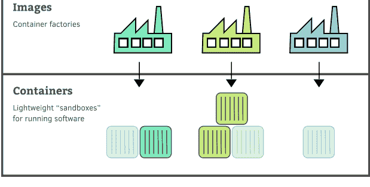

镜像非常适合共享和分发软件：它们使用一种旨在可移植的标准格式。Docker 提供了内置工具用于分发镜像。通过共享镜像，你可以在团队之间协作开发软件，并使你的软件可用于部署。

#### 在未安装 Ruby 的情况下运行 Ruby 脚本

我们即将进行一次“魔法”操作。使用 Docker，我们将在系统无需安装 Ruby 的情况下运行一个 Ruby 应用程序。

看看这个：

```
$ docker run ruby:2.6 ruby -e "puts :hello"
Unable to find image `ruby:2.6' locally
2.6: Pulling from library/ruby
cd8eada9c7bb: Pull complete
c277faec825: Pull complete
fcce419a96b1: Pull complete
045b51e26f75: Pull complete
3096baad6f147: Pull complete
f2db762ad32e: Pull complete
708e57760f1b: Pull complete
0647b805a41b: Pull complete
Digest: sha256:ad724f6982ba47c2d2a8a4ecb67267a1961a51802924ed443d6fb7994
Status: Downloaded newer image for ruby:2.6
hello
```

哇。刚才发生了什么？

如果你查看输出的最后一行，你会看到我们期待的 Ruby 脚本输出：“hello”。所以它不知怎么地成功了。但怎么做到的？为什么？

`docker run` 命令的格式如下：

```
$ docker run [OPTIONS] <image> <command>
```

该命令基于 `<image>` 启动一个新容器，并在容器内部执行 `<command>`。你可能会发现将其分为两部分来思考很有帮助：`docker run [OPTIONS] <image>` 告诉我们要运行什么类型的容器，而 `<command>` 则告诉我们要在这个容器内运行什么。

回顾我们的命令，我们有：

1. `docker run ruby:2.6`
2. `ruby -e "puts :hello"`

第一部分表示我们要运行一个基于 `ruby:2.6` 镜像的容器。正如我们之前所说（[第 6 页的“在我们开始之前”](https://example.com)），镜像是一个打包好的软件包，包含了运行（特定）容器所需的一切。`ruby:2.6` 镜像也不例外；它预装了 Ruby 2.6 及其所有依赖项，使我们能够创建能够运行此版本 Ruby 的容器。

命令的第二部分指定了 *我们想要在容器内部运行什么*。在这种情况下，我们表示想要运行 Ruby 解释器，并通过命令行选项 `-e` 传递一个脚本。这个脚本是你能想象到的最简单的脚本：它仅仅输出 “hello” 这个词。

#### 术语：运行镜像

> 我们有时可能会谈到**运行一个镜像 (running an image)**，但严格来说，这是不正确的。镜像不能直接运行；它们是创建容器的不可变工厂。相反，我们的意思是 *基于镜像创建一个容器*，而真正能运行的是容器。

我们的 `docker run` 命令可以在任何安装了 Docker 的机器上运行——即使是没有安装 Ruby 的机器。

这怎么可能？虽然 `ruby:2.6` 镜像安装了 Ruby 这一点没问题，但我们是怎么神奇地在自己的电脑上拥有它的？

事实上，我们并没有。

当我们执行 `docker run` 命令时，你可能注意到它提示 `Unable to find image 'ruby:2.6' locally`（在本地找不到镜像 'ruby:2.6'）。然后 Docker 开始下载 `ruby:2.6` 镜像，这就是为什么该命令运行需要一点时间。Docker 并不是一次性下载整个镜像，而是下载组成镜像的各个部分——称为 *层 (layers)*。因此，Docker 提供了一种无缝机制，在我们需要时精确地交付所需的镜像。

#### 为什么这么慢？

如果你亲自运行之前的命令，你可能会注意到一个微小的缺陷：它花费了 *很——长——一段* 时间。我知道像 Ruby 这样的解释型语言很慢，但这太离谱了。

之前的讨论有助于解释为什么该命令运行时间这么长。耗时的地方并不是执行我们那个小小的 Ruby 脚本，而是通过网络下载 `ruby:2.6` 镜像。每当你基于一个之前从未使用的镜像启动容器时，Docker 都需要先下载它。

虽然镜像通常比虚拟机 *小得多*（是 MB 级别而非 GB 级别），但每个 Docker 命令都要等待 20 秒会非常令人沮丧。幸运的是，我们不需要这样做。Docker 将下载的镜像存储在本地，因此下次你基于同一个镜像启动容器时，它几乎以原生速度启动。Docker 甚至会缓存镜像的 *单个层*，从而允许在镜像之间重用层，我们稍后会看到这一点。

让我们亲自验证一下。尝试第二次运行相同的命令。

```
$ docker run ruby:2.6 ruby -e "puts :hello"
hello
```

哇。这次快多了——没有关于下载镜像的输出了。

#### 清理工作

每次运行 `docker run` 命令时，Docker 都会创建一个 *新* 容器来运行该命令。我们现在已经运行了两次 Ruby 脚本，因此我们有两个几乎相同的容器用于运行这个 Ruby 脚本。

要列出正在运行的容器，我们使用：

```
$ docker ps
CONTAINER ID   IMAGE   COMMAND   CREATED   STATUS   PORTS   NAMES
```

如你所见，没有正在运行的容器——这是因为当我们的 Ruby 命令终止时，运行它的容器也随之终止了。然而，除非我们另有指示，否则 Docker 会保留这个已停止的容器，以备我们以后再次使用。

让我们通过添加 `-a` 选项来列出 `所有` 容器，包括已停止的容器：

```
$ docker ps -a
CONTAINER ID   IMAGE     COMMAND           CREATED       STATUS       PORTS               NAMES
974e2bcb8266   ruby:2.6  " ruby ... 1 seco... Exited...   ...          dazzling_ba...
7f8d7ddd6b5    ruby:2.6  " ruby ... 3 seco... Exited...   ...          hungry_heis...
```

在这里你可以看到两个容器：每次运行 Ruby 命令对应一个。然而，我们不再需要它们了；我们可以使用以下命令删除它们：

```
$ docker rm <container id> [<container id2> ...]
```

你的容器 ID 将与我的不同，因为它们是随机生成的。要删除这些容器，我会运行：

```
$ docker rm 974e2bcb8266 7f8d7ddd6b5
```

不过，你需要替换成你自己的容器 ID 才能运行。现在请执行此操作以清理你的容器。

在今后创建不再需要的容器时，我们可以使用 `--rm` 选项，它告诉 Docker 在容器完成任务后将其删除。这种在完成目的后即被删除的短寿命容器有一个专业的词汇叫 *ephemeral*（瞬时的），但我更喜欢用 *throwaway*（一次性的）这个词。以下是我们如何在一次性容器中运行 Ruby 脚本的方法：

```
$ docker run --rm ruby:2.6 ruby -e "puts :hello"
```

这是一个相当常见的模式，你在整本书中都会看到它。

#### 在未安装 Ruby 的情况下生成一个新的 Rails 应用

运行一个 Ruby 脚本很酷，但我们还能做什么？

如果能开始将 Docker 用于一些“真实世界”的任务就太好了，不是吗？假设我们想创建一个新的 Rails 项目（这并不离谱……毕竟我们都是 Ruby 开发者）。我们能做到吗？当然可以。

为了生成 Rails 项目，我们需要在容器中连续运行多个命令。我们可以构建一个非常长且丑陋的 `docker run` 命令，依次执行这些指令。但是，那样很难理解。

相反，我们可以尝试一些不同的做法。我们可以启动一个运行交互式 Bash shell 的容器。当我们这样做时，我们实际上是在容器 *内部* 获得了一个终端会话。从那里，我们可以运行任意数量的命令，就像我们拥有本地 Bash 会话一样。这是一个非常实用的技巧，建议你掌握。


让我们来试一试吧。

不过在开始之前，你需要在机器上找到一个目录，用于生成 Rails 项目文件。由于我们即将执行的 Docker 命令会影响到本地文件（稍后会详细介绍），建议你创建一个新的空文件夹，并在其中执行以下步骤。例如：

```
$ mkdir ~/docker_for_rails_developers
$ cd ~/docker_for_rails_developers
```

都准备好了吗？很好。现在我们将基于之前熟悉的 `ruby:2.6` 镜像，在容器内启动一个交互式 Bash shell：

```
$ docker run -i -t --rm -v ${PWD}:/usr/src/app ruby:2.6 bash
```

你可以看到我们使用了 `--rm` 选项来创建一个临时容器，使用完毕后就会被删除。还有一些我们之前没见过的新选项（`-i`、`-t` 和 `-v ${PWD}:/usr/src/app`）。稍后我们会详细介绍这些选项。现在，当你运行这条命令时，应该会看到如下所示的终端提示符：

```
root@0c286e8bda42:/#
```

这个不同的提示符表明我们已经成功地在容器*内部*运行了一个 Bash shell。`root@` 和 `#` 表示我们是 `root` 用户——这是容器内的默认用户。

从这个新的 Bash 提示符出发，我们现在可以向容器发送任何想要执行的命令。这就引出了一个问题……我们想运行什么呢？记住：我们正在尝试生成一个新的 Rails 项目。所以，首先让我们进入项目所在的文件夹：

```
root@0c286e8bda42:/# cd /usr/src/app
```

现在来安装 Rails gem：

```
root@0c286e8bda42:/usr/src/app# gem install rails
```

> **Rails 版本**
>
> 本书中的示例均基于 Rails 5.2.2（撰写时的最新版本）构建和测试。不过，除非使用了 Rails 新特性，否则大部分内容也应该适用于之前版本的 Rails。

你应该能看到 Rails gem 及其所有依赖项正在被安装。这意味着我们已经准备好生成项目了：

```
root@0c286e8bda42:/usr/src/app# rails new myapp --skip-test --skip-bundle
```

我们使用 `--skip-test` 选项来告诉 Rails 不要使用默认的 Minitest。这是因为在第 7 章中，我们会使用 RSpec 来演示如何在 Docker 环境中配置测试。

我们还使用了 `--skip-bundle` 选项。这告诉 Rails 在生成项目后不要运行 `bundle install`。这个容器只是我们用来生成 Rails 项目的临时工具——既然我们打算丢弃它，就没有必要安装项目依赖。

运行 `rails new` 命令后，会得到如下输出，显示 Rails 项目文件正如预期那样正在被创建：

```
create
create  README.md
create  Rakefile
create  .ruby-version
create  config.ru
create  .gitignore
create  Gemfile
«...»
create  vendor
create  vendor/.keep
create  storage
create  storage/.keep
create  tmp/storage
create  tmp/storage/.keep
remove  config/initializers/cors.rb
remove  config/initializers/new_framework_defaults_5_2.rb
```

很好！我们可以看到 Rails 文件已经生成了。但请记住，我们现在在容器*内部*，需要把这些文件弄到本地机器上。该怎么做呢？

首先，让我们退出 Bash shell，这将停止容器：

```
root@0c286e8bda42:/usr/src/app# exit
```

这会将我们带回熟悉的终端提示符：`$`。

现在让我们查看一下本地机器当前目录中的内容：

```
$ ls
myapp
$ cd myapp
$ ls
Gemfile      Rakefile   bin     config.ru  lib   package.json   storage
vendor       README.md  app     config     db    log            public
tmp
```

咦。容器内生成的文件竟然出现在了本地文件系统中。容器不是完全隔离的吗？这是怎么回事？

答案就在于我们在 `docker run` 命令中忽略的 `-v` 选项。在 Docker 术语中，这叫*挂载卷*——实际上就是将本地文件系统的一部分与容器共享。具体来说，`-v ${PWD}:/usr/src/app` 的含义是："将当前目录挂载到容器内的 `/usr/src/app`"（`${PWD}` 是一个 Unix 环境变量，指向当前目录）。这意味着我们本地目录中的任何文件在容器内的 `/usr/src/app` 中都可见。同样，如果我们在容器目录中创建、删除或编辑文件，这些更改也会反映在我们的本地文件系统上。

在这里，挂载本地卷意味着在容器内生成的 Rails 项目（位于 `/usr/src/app` 内）即使在容器终止后仍然保留在我们的本地目录中。此外，这个功能在开发过程中也很有用，它允许我们在本地编辑文件，更改会自动在容器内生效，而无需重新构建镜像。

值得注意的是，这种挂载行为有几个关键点。首先，如果容器内不存在 `/usr/src/app` 目录，Docker 会创建它。其次，如果该目录在容器内已存在，挂载的目录会覆盖并*遮蔽*其原有内容。

> **仅限 Linux 用户：更改文件所有权**
>
> 你会注意到新生成的 Rails 项目文件所有者是 root。这是因为默认情况下容器以 root（UID 1）身份运行。要修改文件，你需要更改它们的所有者：
>
> `$ sudo chown <your_user>:<your_group> -R myapp/`
>
> 每次在容器内生成文件时，你都需要执行此操作。更多详情请参阅[第 199 页的文件所有权和权限](#)。

最后，我们来看 `-i` 和 `-t` 选项。要理解这些选项，我们首先需要了解 Docker 的架构。

Docker 的核心——Docker Engine——是一个客户端-服务器应用程序。Docker CLI（`docker` 命令）只是一个轻量级客户端，它告诉一个独立的程序——Docker 守护进程——来执行我们的请求。守护进程负责执行启动、停止和管理容器等繁重工作。

下图展示了 Linux 上 Docker 的高层架构：

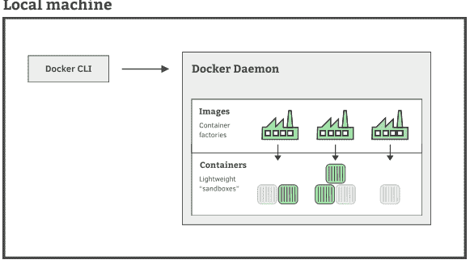

然而，Docker 是建立在 Mac 和 Windows 没有原生支持的 Linux 容器化技术之上的。Docker 通过安装一个运行 Docker 守护进程的轻量级 Linux 虚拟机来绕过这个问题。这导致 Docker for Mac/Windows 的架构略有不同，如下图所示。

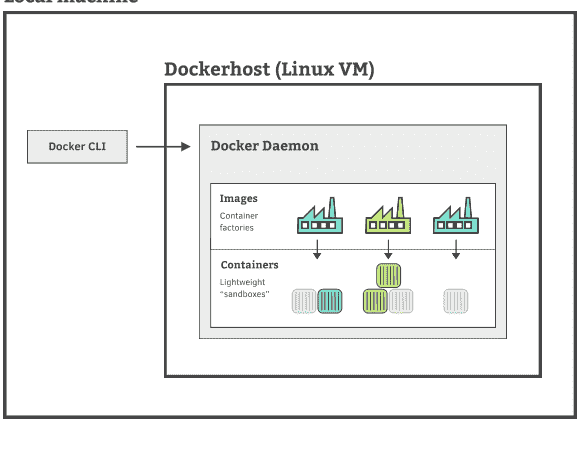

那么，这如何帮助我们理解为什么需要使用 `-i` 和 `-t` 选项呢？

Unix 进程有三个 I/O 通道：标准输入（stdin）、标准输出（stdout）和标准错误（stderr）。由于 Docker 守护进程运行在单独的进程中，Docker 必须主动采取措施将我们的 CLI 输入转发给 Docker 守护进程。

然而，默认情况下，`docker run` 只会将容器的输出转发给我们的客户端。当我们运行不需要输入的容器时，这没有问题。但有时候我们运行的进程确实需要输入。交互式 Bash 会话就是一个很好的例子——它会等待接收我们输入的命令。在这种情况下，我们需要明确告诉 Docker 将我们的 CLI 输入转发给 Docker 守护进程。我们通过 `-i` 选项来实现——"i" 代表 input（输入）。如果不指定这个选项，容器会立即终止，因为 Bash 没有收到任何输入就会退出。

然而，仅靠这还不够。交互式 Bash 会话必须在*终端模拟器*内运行，终端模拟器负责显示提示符和解释转义序列（如 Ctrl-C）等操作。如果我们启动一个容器来运行 bash，默认情况下它以非交互模式运行，执行提供的命令后就会终止。要在 Docker 容器内实现长期运行的交互式 Bash 会话，我们必须告诉 Docker 为我们设置一个终端模拟器（技术上是一个伪终端或 pty），放置在 Bash 前面。我们通过为 `docker run` 指定 `-t` 选项来实现。

如果这一切听起来很复杂，只需要记住：当你需要一个长期运行的交互式会话时，你需要同时指定 `-i` 和 `-t` 选项。实际上，这两个选项通常组合成简写形式 `-it`，你可以把它理解为 "i"-"n"-"t"eractive（交互式）。很巧妙吧。

至此，我们在这里的工作就完成了。

### 快速回顾

既然你已经初次体验了 Docker，让我们稍作停顿，回顾一下所学的内容。

本章中：

- 1. 我们在机器上安装了 Docker。
- 2. 我们运行了有生以来第一条 Docker 命令，一个 *helloworld* Ruby 脚本，无需在机器上安装 Ruby。
- 3. 我们了解了如何用 `docker ps` 列出正在运行的容器，以及用 `docker ps -a` 列出所有容器（包括已停止的）。

```
$ docker run ruby:2.6 ruby -e "puts :hello"
```


- 4. 我们使用 `docker rm <container id>` 删除了旧容器，并了解了如何使用 `docker run` 的 `--rm` 选项创建一次性容器。

- 5. 我们通过以下步骤使用容器生成了一个新的 Rails 项目：
    - 在容器内启动一个交互式 Bash shell
    ```bash
    $ docker run -i -t --rm -v ${PWD}:/usr/usr/src/app ruby:2.6 bash
    ```
    - 在容器内安装 Rails gem
    ```bash
    root@0c286e8bda42:/usr/src/app# gem install rails
    ```
    - 使用新安装的 Rails gem 生成项目
    ```bash
    root@0c286e8bda42:/usr/src/app# rails new myapp --skip-test \
    --skip-bundle
    ```

很好。我们已经朝着 Docker 精通之路迈出了坚实的一步。在下一章中，我们将学习如何运行新的 Rails 应用。

## 第 2 章：在容器中运行 Rails 应用

到现在为止，你应该开始熟悉 Docker 的概念了，比如 `镜像` 和基于这些镜像运行的 `容器`。如果记不住所有的命令和各种选项也不用担心。最重要的是，你已经开始理解高层概念了——其余的内容会在你越来越多地使用 Docker 的过程中自然而然地掌握。

在上一章中，我们创建了全新的 Rails 应用。在对使用 Docker 提供的 Ruby 生成应用这一酷炫功能的新鲜感逐渐消退之后，你可能面临着一个重要的问题：我到底该怎么运行它？

在本章中，我们将从上一章结束的地方继续，让新应用运行起来。那么，你是否已经烘焙、研磨、冲泡好了你选择的手工饮品？（我只要白开水就好。）好的，让我们开始吧……

### 我们如何运行 Rails 应用？

遗憾的是，我们无法仅凭 `ruby:2.6` 镜像启动 Rails 服务器——Rails 还有一些额外的需求。例如，我们需要一个 JavaScript 解释器（如 Node.js）来辅助资源管道，此外还需要安装 gem 依赖。那么，我们如何在容器中运行 Rails 服务器，同时确保这些需求得到满足呢？

我们可以采取几种方法。我们`可以`像上一章那样做：在基于 `ruby:2.6` 镜像的容器中运行 `bash`，然后从那里安装我们需要的东西。然而，`手动`执行命令并不容易重复。我们需要一种可靠、可重复的方式来随时随地快速启动 Rails 服务器。每次启动 Rails 服务器都要手动运行各种命令是行不通的。

另一种`可以`让容器运行 Rails 的方法是，将安装 Rails 所需依赖的命令组合在一起，形成一条冗长的复合 `docker run` 命令。然而，这条命令不仅庞大、丑陋、难以记忆，而且最糟糕的是它会很*慢*。每次安装指令都必须从头运行，包括安装 Node.js 和 gem 依赖。我们可不想每次启动 Rails 服务器都要等上好几分钟。

> **复合 docker run 命令**
> 
> 你可能会好奇如何在 `docker run` 中运行多条命令。问题在于 `docker run` 的设计是启动一个容器并运行*单条*命令。
> 
> 绕过这个限制的技巧是使用 bash 命令的 `-c` 选项，它会启动一个 Bash shell 并立即执行你作为字符串传入的内容。这样你就可以这样做：
> 
> `$ docker run <options> [image:version] \ bash -c "command1 && command2 && command3..."`
> 
> 聪明的 bash。

那么*真正*的解决方案是什么呢？

我们希望能够基于*预配置*状态运行容器，该状态包含运行 Rails 所需的一切。我们真正需要的是一个工厂——提示提示——来创建这些完美的 Rails 服务器容器。你注意到那个微妙的提示了吗？在上一章中，我们说过*镜像*是"创建特定容器的工厂"。听起来正是我们需要的。

### 定义我们的第一个自定义镜像

在现实生活中，工厂不会凭空出现。它必须根据蓝图来建造：描述其应有外观的详细计划和说明。Docker 的容器工厂——换句话说，镜像——也不例外。它们需要一个特殊的蓝图文件，恰如其分地命名为 Dockerfile。Dockerfile 使用特殊语法来精确描述镜像应如何构建。如果你听说过*基础设施即代码*的说法，这就是一个例子：Dockerfile 描述了机器镜像的配置方式，如[第 19 页的图](#page19)所示。

Dockerfile 由各种*指令*组成——如 `FROM`、`RUN`、`COPY` 和 `WORKDIR`——按惯例全部大写。不过，与其抽象地讨论它们，不如来看一个具体的例子。

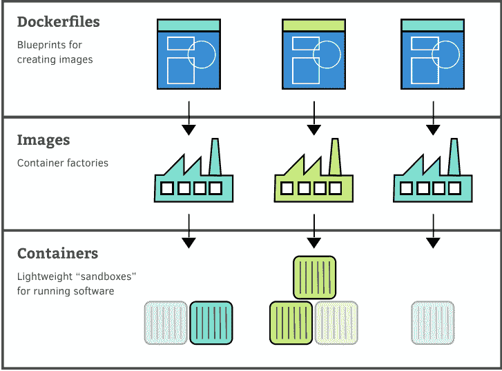

这是一个用于运行 Rails 应用的基本 Dockerfile。它并不完美——我们将在[第 3 章"微调我们的 Rails 镜像"，第 31 页](#)中进行几项改进——但目前够用了。现在无需创建这个文件；我们只讨论它：

```dockerfile
FROM ruby:2.6

RUN apt-get update -yqq
RUN apt-get install -yqq --no-install-recommends nodejs

COPY . /usr/src/app/

WORKDIR /usr/src/app
RUN bundle install
```

每个镜像都必须基于某个东西：另一个已存在的镜像。因此，每个 Dockerfile 都以 `FROM` 指令开头，指定要用作起点的镜像。通常，我们会寻找一个接近我们需要但更通用的起始镜像。这样我们就可以根据需要对其进行扩展和定制。

我们 Dockerfile 的第一行是：
```dockerfile
FROM ruby:2.6
```
这表示我们的镜像将基于 `ruby:2.6` 镜像，正如你可能猜到的那样，该镜像预装了 Ruby 2.6。我们选择从这个镜像开始，因为安装 Ruby 是我们最大的需求，所以这个镜像已经帮我们完成了大部分工作。

#### 最顶层：基础镜像

> 有几个特殊的镜像没有父镜像——被称为*基础镜像*——所有镜像最终都依赖于它们。它们包含操作系统所需的最小用户文件系统。

如果你想构建自己的精简镜像，可以 `FROM scratch`（读起来不错，不是吗？）构建镜像，其中 `scratch` 是一个最小的基础镜像。

甚至可以创建自己的基础镜像，¹ 尽管这是一个高级话题。我们不打算介绍它，因为你很可能永远不需要这样做。

我们 Dockerfile 的接下来两行是 `RUN` 指令，告诉 Docker 执行命令：

```dockerfile
RUN apt-get update -yqq
RUN apt-get install -yqq --no-install-recommends nodejs
```

这里，我们告诉 Docker 运行 `apt-get update -yqq`，然后运行 `apt-get install -yqq --no-install-recommends nodejs`——但这两条命令能为我们做什么呢？

你可能已经知道，`apt-get` 是用于在 Debian（以及其他一些）Linux 发行版上安装软件的命令。² 我们在 Dockerfile 中使用它，是因为我们镜像所基于的官方 Ruby 镜像是基于 Debian 的——具体来说，是一个名为 Stretch 的版本。³

`apt-get update` 命令告诉包管理器下载最新的包信息。许多 Dockerfile 都会有类似的行，因为没有它，`apt` 就没有任何包信息，因此无法安装任何东西。`-yqq` 选项是 `-y` 选项和 `-qq` 选项的组合，前者表示对所有提示回答"是"，后者启用"静默"模式以减少输出。

接下来，`apt-get install` 命令安装 Node.js，这是运行 Rails 的前提条件。`--no-install-recommends` 表示不安装其他推荐但非必需的包。

***

¹ docs.docker.com/engine/userguide/eng-image/baseimages/
² https://en.wikipedia.org/Wiki/Advanced_Packaging_Tool
³ https://github.com/docker/library/ruby/blob/a04dd529eaf80d22eb79062d2ba7909f03219a6e5905/2.5/stretch/Dockerfile#L1


非必要的软件包——我们不需要它们不需要，而且我们希望通过不安装不必要的文件，将镜像大小尽可能地保持在最小。

如果你熟悉 Linux 中的 `apt-get`，你可能会好奇为什么我们没有使用 `sudo` 以 root 身份运行命令。这是因为，默认情况下，容器内部的命令是由 root 用户运行的，因此 `sudo` 是不需要的（尽管正如我们在第 192 页提到的，这对于生产环境的应用来说具有安全影响）。

在查看 Dockerfile 的下一行之前，让我们先稍微转换一下思路。

请记住，镜像及其产生的容器与我们的本地机器是分开的——它们是隔离的沙箱环境。因此，我们需要一种方法将一些本地文件包含在我们要运行的容器中。

我们在第 10 页的“在未安装 Ruby 的情况下生成新的 Rails 应用”中已经看到，我们可以将本地目录挂载到正在运行的容器中。挂载卷（mounted volume）就像是容器与主机之间的共享目录，是我们使本地文件在容器内部可访问的一种方式。

然而，如果挂载卷是你将文件 đưa 入容器的唯一方式，那么它有一个严重的缺点。卷中的文件不是镜像本身的一部分；它们是在运行时（当你启动容器时）叠加到镜像之上的。如果挂载的文件是必不可少的，那么没有它们镜像就无法运行，但镜像的核心意义就是将运行所需的一切全部打包在一起。因此，将任何需要的文件直接“烘焙”（bake）到镜像本身中是一个良好的实践。

我们的 Dockerfile 中的下一行正是为了实现这个目的：

```
COPY . /usr/src/app/
```

这告诉 Docker 将本地当前目录 (`.`) 的所有文件复制到新镜像文件系统的 `/usr/src/app` 目录下。由于我们的本地当前目录就是 Rails 的根目录，实际上我们是在说：“将我们的 Rails 应用复制到容器的 `/usr/src/app` 路径下。” 本地机器上的源路径始终相对于 Dockerfile 所在的位置。

在将 Rails 文件添加到镜像的 `/usr/src/app` 之后，我们会希望运行各种需要在该文件目录下操作的命令。例如，不久后我们会想通过类似下面的命令，在容器中使用 Rails 服务器运行我们的应用：

```
$ docker run [OPTIONS] <our custom image> bin/rails server
```

不幸的是，这个命令会失败，因为默认情况下，容器的工作目录是 `/`，而这里并不包含我们的 Rails 应用文件——我们将它们复制到了 `/usr/src/app` 中。

不过，`WORKDIR` 指令可以帮我们解决这个问题。实际上，它执行了一个*更改目录* (`cd`) 命令，改变了镜像所认为的当前目录。我们的 Dockerfile 下一行使用了该指令将 `/usr/src/app` 设置为工作目录：

```
WORKDIR /usr/src/app
```

现在运行 `bin/rails server`（以及类似）命令将会生效，因为它们将在正确的目录下执行。

你可以在 Dockerfile 中使用多个 `WORKDIR` 指令，每个指令在另一个指令发出之前都保持有效。最后一个 `WORKDIR` 将成为由该镜像创建的容器的初始工作目录。

最后，我们来到了 Dockerfile 的最后一行：

```
RUN bundle install
```

该命令在容器的当前工作目录中执行，而之前的命令已将其设置为 `/usr/src/app`。因此，这将安装 Rails 项目 `Gemfile` 中定义的 gem，这些 gem 是启动应用程序所必需的。

#### 综合回顾

有了这些知识，我们的 Dockerfile 现在应该变得容易理解得多了。让我们再次回顾一遍：

```
FROM ruby:2.6

RUN apt-get update -yqq
RUN apt-get install -yqq --no-install-recommends nodejs

COPY . /usr/src/app/

WORKDIR /usr/src/app
RUN bundle install
```

首先，在第 1 行，我们声明自定义镜像将使用 `ruby:2.6` 镜像作为起点。接着，我们更新 `apt` 包管理器的软件包信息（第 3 行），以便它知道从哪里安装内容。然后我们使用它安装 `nodejs`（第 4 行），这是 Rails 的资源流水线（asset pipeline）所需要的。

在处理好 Rails 的前提条件后，我们将 Rails 应用文件从本地目录复制到容器的 `/usr/src/app` 中（第 6 行），以便它们被烘焙到镜像里。我们将此处设为镜像的当前工作目录（第 8 行），以便我们可以从正确的目录对镜像执行 Rails 命令。

最后，我们运行 `bundle install`（第 9 行）来安装 Rails 项目所需的 gem。

既然现在逻辑清晰了，让我们动手实际创建这个 Dockerfile 吧。首先，确保我们在 Rails 应用的顶层（根）目录下：

```
$ ls
Gemfile		Rakefile	bin	config.ru	lib	package.json	storage	vendor
README.md	app		config	db	log	public		tmp
```

然后打开你喜欢的编辑器，创建一个名为 `Dockerfile` 的文件，内容如上所示。我强烈建议通过手动输入而不是复制粘贴——在学习一项新技能时，亲手敲一遍有助于将其深植于脑海中并建立肌肉记忆。

有了这个精美的 Dockerfile，让我们将注意力转向如何使用它来创建实际的镜像。

#### 构建我们的镜像

从 Dockerfile 生成镜像的过程称为*构建镜像*（building an image）。我们使用 `docker build` 命令来完成，其格式如下：

```
$ docker build [options] path/to/build/directory
```

在我们的案例中，你应该还处于包含 Dockerfile 和项目文件的目录中，因此我们可以使用单个点 (`.`) 来表示当前目录。让我们试一下：

```
$ docker build .
Sending build context to Docker daemon 138.8kB
Step 1/6 : FROM ruby:2.6
---> f28a9e1d0449
Step 2/6 : RUN apt-get update -yqq
---> Running in 29677ed71d2b
Removing intermediate container 29677ed71d2b
---> 7613a31d9d69a
<...>
Step 6/6 : RUN bundle install
---> Running in 4550030ac412
<...>
Bundle complete! 15 Gemfile dependencies, 68 gems now installed.
Bundled gems are installed into `/usr/local/bundle`
<...>
Removing intermediate container 4550030ac412
---> ad1f0eddba18
Successfully built ad1f0eddba18
```

哇，输出内容真多。实际上发生了什么？

Docker 每次处理 Dockerfile 中的一条指令。第一条指令 —— `FROM` —— 的处理方式与所有其他指令不同。Docker 会检查本地系统中是否已经存在指定的镜像。如果镜像不可用，Docker 就会下载该镜像，就像我们在 [第 7 页的“在未安装 Ruby 的情况下运行 Ruby 脚本”](Running a Ruby Script Without Ruby Installed, on page 7) 中第一次使用 `ruby:2.6` 镜像运行 `docker run` 时一样。

Dockerfile 中的所有其他指令基本上以相同的方式处理。Docker 会基于上一步创建的镜像启动一个临时容器，并在其中执行当前的 Dockerfile 指令。然后，Docker 将执行指令所产生的更改*提交*（commit），为这一步创建一个新的*中间镜像*（intermediate image）。

你可以在输出中看到这一切，输出被分成了几个部分：每一部分对应 Dockerfile 中的一条指令。每一步的输出遵循一个非常规律的格式：

```
Line 1  Step <当前步骤>/<总步骤>  : <Dockerfile 指令>
2  ---> Running in <容器 ID>
3  [运行指令产生的任何输出]
4  Removing intermediate container <容器 ID>
5  ---> <镜像 ID>
```

为了提供上下文，我们得到了 Dockerfile 指令以及它在构建过程中的步骤（第 1 行）。接下来，我们看到用于执行当前 Dockerfile 指令的临时容器的 ID（第 2 行），随后是运行该指令产生的任何输出（第 3 行）。

每一个被创建的镜像 —— 即使是中间镜像 —— 都会被赋予一个唯一的、随机生成的镜像 ID。这是 Docker 在内部识别镜像的方式，也为我们提供了一种引用它们的方法。在本步创建的镜像 ID 显示在第 5 行。

最后，在第 4 行，Docker 告诉我们它正在删除本步中使用的临时容器。

在构建自定义镜像时，我们真正感兴趣的是最终镜像。它代表了 Dockerfile 中所有指令执行后的最终状态。这就是为什么输出最后会给我们最终的镜像 ID（如果你在同步操作，你的镜像 ID 会有所不同）：

```
Successfully built a1df0eddba18
```

这一切似乎都合理，但我们刚刚构建的镜像*在哪里*呢？

`docker build` 命令不会输出一个文件；它只是使新镜像可用，并将其添加到 Docker 已知的镜像列表中。Docker

管理图像在文件系统中的存储位置和方式。我们使用以下命令列出系统中的镜像：

```
$ docker images
REPOSITORY TAG IMAGE ID CREATED SIZE
<none> <none> a1df0eddba18 1 second ago 1.01GB
ruby 2.6 f28a9e1d9449 6 days ago 868MB
```

第一条记录就是我们刚刚构建的自定义镜像——它的镜像 ID 与 `docker build` 命令末尾指定的 ID 相符。

#### 使用我们的镜像运行 Rails 服务器

既然我们已经创建了自己的定制镜像，就应该能启动一个 Rails 服务器来运行我们的应用了。

现在就让我们试一试。

我们可以通过镜像 ID 来引用我们的镜像。不过，镜像 ID 又长又难记，所以通常你会给镜像指定一个有意义的名称。我们后面会在第 31 页的"命名和版本控制我们的镜像"中看到如何操作。但现在，通过镜像 ID 来引用已经足够让我们开始使用这个镜像了。我们继续，马上动手。

有了镜像 ID，我们就可以用以下命令在基于自定义镜像的容器内启动 Rails 应用。现在就运行它：

```
$ docker run -p 3000:3000 a1df0eddba18 \
  bin/rails s -B -0.0.0.0
```

除了新增的 `-p 3000:3000` 选项（我们稍后会很快在第 26 页的"访问应用：发布端口"中介绍），这就是一个普通的 `docker run` 命令。它的意思是："启动一个基于我们自定义镜像（a1df0eddba18）的容器，并在其中运行 `bin/rails s -B 0.0.0.0`。" 如果你以前没见过 `-B` 选项，我们会在第 28 页的"将 Rails 服务器绑定到 IP 地址"中解释为什么需要它。

我们应该能看到 Rails 正确启动：

```
=> Booting Puma
=> Rails 5.2.2 application starting in development
=> Run `rails server -h` for more startup options
Puma starting in single mode...
* Version 3.12.0 (ruby 2.6.0-p0), codename: Llamas in Pajamas
* Min threads: 5, max threads: 5
* Environment: development
* Listening on tcp://0.0.0.0:3000
Use Ctrl-C to stop
```

它确实启动了！目前一切顺利。

现在继续在浏览器中访问 http://localhost:3000。你应该能看到熟悉的 Rails 欢迎页面。

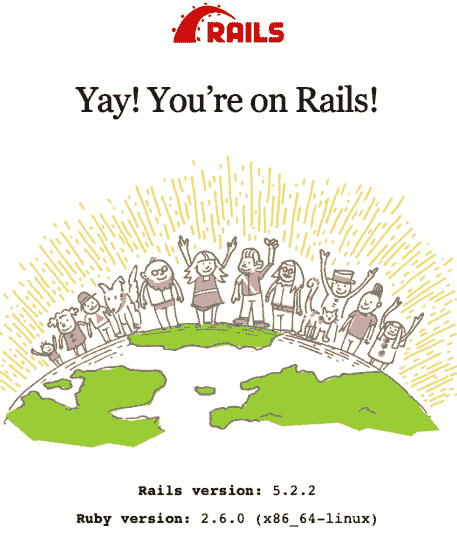

太棒了！我们能访问到我们的应用了。

在终端中，你会看到 Rails 日志输出更新，显示出我们的请求：

```
Started GET "/" for 172.17.0.1 at 2019-01-15 09:49:45 +0000
«...»
  Rendering /usr/local/bundle/gems/railties-5.2.2/lib/rails/templates/rails/welcome/index.html.erb
  Rendered /usr/local/bundle/gems/railties-5.2.2/lib/rails/templates/rails/welcome/index.html.erb (2.7ms)
Completed 200 OK in 17ms (Views: 10.0ms | ActiveRecord: 0.0ms)
```

我们成功了。现在你可以按 Ctrl-C 停止 Rails 服务器。

好了，我暂且敷衍到这里。是时候讨论一下我们一直在使用的各种 docker run 命令选项到底是做什么的了。戴好你的思考帽了吗？那我们就开始吧。

#### 访问应用：发布端口

我们知道，容器是隔离的沙盒。那为什么我们能通过访问本地机器上的 http://localhost:3000 来访问我们的应用呢？

事实上，如果无法从 Docker 外部访问容器，容器就不会那么有用了。例如，网络服务器的全部意义就在于它对发出请求的人们是可访问的。

尽管默认情况下，容器只能从其所连接的 Docker 网络内部访问（更多内容请参见第 63 页的"容器如何相互通信"），但我们可以通过 *docker run 的 -p 选项发布一个或多个端口*，使其在外部可访问。

在我们的命令中，我们指定了 `-p 3000:3000`；这会将容器的 3000 端口（第二个数字）发布到我们本地机器的 3000 端口上。这意味着对 http://localhost:3000 的请求将到达容器内运行在 3000 端口的 Rails 服务器。

这在实践中是如何运作的呢？

正如我们在第 14 页的"Linux 版 Docker 架构图"中所见，在 Linux 上，Docker 守护进程直接运行在本地机器上。在这种情况下，发布端口只是设置了一个端口映射（通过 iptables 规则），将对 http://localhost:3000 的请求转发给 Docker 引擎，而引擎知道将请求路由到容器所在的网络（如下图所示）。

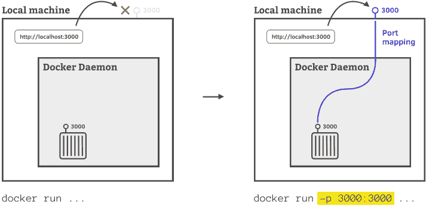

Docker for Mac/Windows 则更加复杂。还记得吗，在这里 Docker 守护进程是运行在一个轻量级 Linux 虚拟机中的，正如我们在第 14 页的"Docker for Mac/Windows 架构图"中所见。在虚拟机内部，其工作方式与 Linux 上的 Docker 完全相同——端口映射会将请求路由到容器。然而，还需要一些额外的魔法来将对 http://localhost:3000 的请求转发到虚拟机的 3000 端口；Docker for Mac/Linux 设置了端口转发来实现这一点，如下图所示。

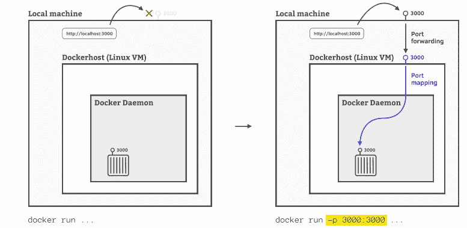

```
docker run -p 3000:3000
```

发布端口时，你不必使用与容器内部服务相同的外部端口。如果我们指定 `-p 80:3000`，它就会将我们本地机器的 80 端口映射到容器内监听 3000 端口的 Rails 服务器。这为我们向外部世界暴露服务提供了很大的灵活性。

#### 将 Rails 服务器绑定到 IP 地址

通常，要启动 Rails 服务器，我们只需运行 `bin/rails s`，但当我们用 `docker run` 启动 Rails 服务器时，我们使用了 `bin/rails s -b 0.0.0.0`。这是为什么呢？

当你用 `bin/rails s` 启动 Rails 服务器时，默认情况下，它只监听运行它的机器上的 `localhost`（或 `127.0.0.1`）请求。这提供了一个安全的默认设置，防止 Rails 应用服务器被外部访问。然而，在我们的情况中，服务器运行在容器内部，但请求来自外部。

当我们在本地机器上请求 http://localhost:3000 时，正如我们刚刚在第 26 页的"访问应用：发布端口"中看到的，请求被转发给 Docker 引擎。引擎进而通过将请求转换为 [容器 IP 地址]:3000 的方式，将请求路由到运行 Rails 服务器的容器。然而，由于 Rails 服务器只监听 `localhost` 上的请求，因此对于来自不同 IP 地址的这个请求没有任何响应。

要解决这个问题，我们必须告诉我们的 Rails 服务器 *绑定到所有* IP 地址，而不仅仅是 localhost，使用选项 `-b 0.0.0.0`。IP 地址 `0.0.0.0` 是一个特殊地址，意思是*"此机器上的所有 IPv4 地址"*。

#### 查找运行中容器的 IP 地址

如果你好奇如何找出一个运行中容器的实际 IP 地址，可以按以下步骤操作：

- 1. 获取容器 ID：

```
$ docker ps
CONTAINER ID IMAGE «more info»
d7230c4b0595 e28cf982ae39 «........»
```

- 2. 使用这个 docker inspect 命令，指定容器 ID：

```
$ docker inspect --format \ 
'{{ .NetworkSettings.IPAddress }}' d7230c4b0595
172.17.0.2
```

### 快速回顾

哇，真是内容充实的一章！让我们回顾一下要点：

- 1. 我们看到了第一个简陋的 Dockerfile，旨在让我们能用 Rails 服务器运行我们的应用：

```
FROM ruby:2.6

RUN apt-get update -yqq
RUN apt-get install -yqq --no-install-recommends nodejs

COPY . /usr/src/app/

WORKDIR /usr/src/app
RUN bundle install
```

- 2. 我们用以下命令从这个 Dockerfile 构建了自定义镜像：

```
$ docker build .
```

- 3. 我们通过执行以下命令列出了系统中的镜像：

```
$ docker images
```

- 4. 我们用以下命令启动 Rails 服务器来运行我们的应用：

```
$ docker run -p 3000:3000 a1df0eddba18 \ 
bin/rails s -b 0.0.0.0
```

并且我们看到它在 http://localhost:3000 上的浏览器中运行。

在下一章中，我们将开始对我们的 Dockerfile 进行进一步的改进。在此过程中，我们将学习如何给我们的镜像起友好的名称，并通过利用内置的缓存机制来加速镜像构建。


### 优化我们的 Rails 镜像

我们在上一章中涵盖了大量内容。我们看到了第一个 Dockerfile，并用它来构建一个专门为运行 Rails 应用而定制的自定义镜像。

然而，你可能还记得，我们说过这个 Dockerfile "够用"但"并不完美"（第 18 页，定义我们的第一个自定义镜像）。事实是，为了简单起见，我们走了一些捷径。既然你已经掌握了一些 Docker 基础知识，我们可以回头来解决这些问题。

在本章结束时，我们的 Dockerfile 将变得整装待发，准备好让我们深入开发拼图的最后一块——Docker Compose——不过我有点说得太早了。

所以请准备好工作服、一把趁手的扳手，以及大量的抛光剂——我是说，从比喻的角度来讲。

#### 为镜像命名和添加版本号

当我们使用以下命令运行 Rails 服务器时：

```
$ docker run -p 3000:3000 aldf0eddba18 \
bin/rails s -b 0.0.0.0
```

我们是通过 ID 来引用自定义镜像的：aldf0eddba18（你的会不同）。我们根本不可能记住这个。就像你不会用最新提交的 SHA-1 哈希值来引用 Git 分支一样，镜像也是如此。相反，我们通过标记的方式给镜像起一个易于识别的名称。假设我们想将镜像命名为 railsapp。我们可以通过运行以下命令来实现：

```
$ docker tag aldf0eddba18 railsapp
```

这条命令的含义是："'为标识为 'aldf0eddba18' 的镜像添加 'railsapp' 标记。"为了验证是否成功，我们可以列出镜像：

```
$ docker images
```

输出确认镜像名称（也称为*仓库*）已被设置为 railsapp：

| REPOSITORY | TAG | IMAGE ID | CREATED | SIZE |
|---|---|---|---|---|
| railsapp | latest | a1df0eddba18 | 8 minutes ago | 1.01GB |

注意 "tag" 字段显示为 latest。这是因为 docker tag 命令实际上接受的参数是一个*镜像引用*，它由两部分组成：镜像（仓库）名称，以及一个可选的标签：

```
<image_name>[:<tag>]
```

你可以将标签设置为由字母、数字、下划线、句点和破折号组成的任何有效字符串（有一些注意事项）。¹ 如果没有提供标签，将使用默认标签 latest。

不幸的是，这里的 "tag" 一词含义有些重叠。我建议将 docker tag 命令理解为同时为镜像添加*镜像/仓库名称*（在我们的例子中是 railsapp）和*标签*（在我们的例子中是默认的 latest）的*标记*。这有点奇怪，但你会习惯的。

我们可以给一个镜像添加任意多个不同的标签。例如，让我们通过运行以下命令为镜像添加版本号 1.0：

```
$ docker tag railsapp railsapp:1.0
```

这里我们将镜像引用为 railsapp，因为我们已经给它添加了该名称的标签（使用 railsapp:latest 也可以）。新标签 railsapp:1.0 由镜像名称 railsapp 和版本 1.0 组成。快速列出镜像可以看到操作成功：

```
$ docker images
```

| REPOSITORY | TAG | IMAGE ID | CREATED | SIZE |
|---|---|---|---|---|
| railsapp | 1.0 | a1df0eddba18 | 8 minutes ago | 1.01GB |
| railsapp | latest | a1df0eddba18 | 8 minutes ago | 1.01GB |

虽然有两行，分别显示带有 latest 和 1.0 版本标签的 railsapp 镜像，但 "image ID" 字段确认它们是同一个镜像。

我们无需在镜像构建后再添加标签，而可以在构建镜像时使用 `-t` 选项直接添加。通过添加多个 `-t` 选项可以指定多个标签，因此使用以下命令构建镜像就能达到与之前两条 docker tag 命令相同的效果：

```
$ docker build -t railsapp -t railsapp:1.0 .
```

¹ https://docs.docker.com/engine/reference/commandline/tag/#extended-description

为镜像命名后，我们现在可以使用镜像名称来启动 Rails 服务器，如下所示：

```
$ docker run -p 3000:3000 railsapp \
    bin/rails s -b 0.0.0.0
```

啊。好多了。

运行特定版本的镜像正如你所预期的那样：使用与之前相同的冒号表示法。例如，要明确使用镜像的 1.0 版本，我们可以运行：

```
$ docker run -p 3000:3000 railsapp:1.0 \
    bin/rails s -b 0.0.0.0
```

#### 默认命令

目前，每次我们想在容器中启动 Rails 服务器时，都必须在 docker run 命令中显式指定命令 `bin/rails s -b 0.0.0.0`：

```
$ docker run -p 3000:3000 railsapp \
    bin/rails s -b 0.0.0.0
```

这很遗憾，因为我们的自定义镜像的*主要目的*就是启动 Rails 服务器。如果能将如何启动 Rails 服务器的知识直接嵌入镜像中就好了。

我们可以通过在 Dockerfile 中添加一条新指令来实现。`CMD` 指令，读作 "command"，指定从镜像启动容器时要运行的*默认命令*。让我们在 Dockerfile 中使用它来默认启动 Rails 服务器：

```
FROM ruby:2.6

RUN apt-get update -yqq
RUN apt-get install -yqq --no-install-recommends nodejs

COPY . /usr/src/app/

WORKDIR /usr/src/app
RUN bundle install

CMD ["bin/rails", "s", "-b", "0.0.0.0"]
```

看这新一行，你可能注意到了用于指定命令的奇怪的数组表示法。这种形式——被称为 *Exec 形式*——是必需的，这样我们的 Rails 服务器才能作为容器中的第一个进程（PID 1）启动，并正确接收 Unix 信号（如终止信号）。这是推荐的形式，也是最常用的。

CMD 指令的另一种形式很少使用，它省略了数组表示法，直接书写命令：

```
CMD bin/rails s -b 0.0.0.0
```

这被称为 *Shell 形式*，因为 Docker 通过*命令 shell* 来执行命令，在其前面加上 `/bin/sh -c`——因此在我们的例子中，它会运行 `/bin/sh -c bin/rails s -b 0.0.0.0`。问题是 `/bin/sh -c` 而非 Rails 服务器成为容器内的第一个进程；由于 `/bin/sh -c` 不会将信号传递给其子进程，这会在尝试终止服务器时导致问题。通常，你可以完全避免使用这种形式。

好的，让我们使用新的 CMD 指令重新构建镜像，记住将最新版本标记为 railsapp：

```
$ docker build -t railsapp .
Sending build context to Docker daemon  138.8kB
<...>
Successfully built f87ad761cd0f
Successfully tagged railsapp:latest
```

有了新构建的镜像，我们可以省略 `bin/rails s -b 0.0.0.0`，直接启动 Rails 服务器：

```
$ docker run -p 3000:3000 railsapp
```

需要注意的是，CMD 指令只提供*默认*命令——你可以在执行 docker run 命令时指定不同的命令。例如，要列出 Rake 任务，我们可以运行：

```
$ docker run --rm railsapp bin/rails -T
```

注意使用了 `--rm` 来在容器运行结束后删除它。我们在这里使用而没有在运行 Rails 服务器时使用，是因为这个容器在生成 Rake 任务输出后就已经完成了它的使命，而运行 Rails 服务器的容器可以被重复使用。

#### 忽略不必要的文件

你可能还记得，我们用于运行命令的 Docker CLI 和执行大部分实际工作的 Docker 守护进程之间是分离的（正如我们在第 14 页 Docker for Linux 和 Docker for Mac/Windows 的架构图中所看到的）。构建镜像也不例外——实际上是 Docker 守护进程在构建镜像。

这在实践中是如何工作的？

当运行 docker build 命令时，CLI 工具会获取指定构建目录中的所有文件——这些文件统称为*构建上下文*——并将它们发送给 Docker 守护进程。守护进程随后处理 Dockerfile 并执行其中的指令来生成镜像。

我们需要一种方式来限制作为构建上下文发送的文件，因为发送更多文件会减慢构建速度（这在 Docker for Mac 或 Windows 上尤其明显，因为守护进程运行在虚拟化主机中）。此外，我们可能希望防止包含敏感信息的文件被包含在镜像中——特别是当我们计划公开分享镜像时。

要将某些文件和目录排除在构建上下文之外，我们将它们列在构建目录中的 `.dockerignore` 文件中。`.dockerignore` 文件的工作原理类似于你可能熟悉的 `.gitignore` 文件，尽管模式匹配语法略有不同。²

让我们为项目创建一个基本的 `.dockerignore` 文件：

```
# Git
.git
.gitignore

# Logs
log/*

# Temp files
tmp/*

# Editor temp files
*.swp
*.swo
```

我们排除了 git 目录（第 2 行），其中包含 Git 历史记录和配置，因为我们的镜像只需要最新版本的文件。虽然是一件小事，但顺便我们也排除了 `.gitignore` 文件（第 3 行）。

同样地，我们排除了所有日志（第 6 行）和临时文件（第 9 行），因为它们是生成的文件，可以安全地忽略。最后，我排除了 Vim 的临时 `.swp` 和 `.swo` 文件（第 12 和 13 行）——你可以根据你选择的编辑器做同样的操作。

这个 `.dockerignore` 文件是一个良好的起点，但你完全可以大展身手，忽略所有缓存或生成的文件。

让我们在放置好 `.dockerignore` 文件后重新构建镜像。

² https://docs.docker.com/engine/reference/builder/#dockerignore-file


```
$ docker build -t railsapp .
Sending build context to Docker daemon  102.9kB
«...»
Successfully built 577a1a5a2d2c
Successfully tagged railsapp:latest
```

构建上下文的大小在输出中显示为102.9 KB，比添加Docker `.dockerignore`文件之前的138.8 KB要小。随着时间的推移，尤其是在Git历史记录变大后，节省的空间会越来越多。

#### 镜像构建缓存

在开发过程中，我们会相当频繁地重建镜像，要么是为了安装新的gems（`bundle install`是Dockerfile中的一个步骤），要么是为了更新像Node.js这样的依赖项。

就像快速的测试套件通过缩短反馈循环来提供帮助一样，保持镜像构建尽可能快也很重要。Docker提供帮助的一种方式是缓存构建中的每个步骤，这意味着它只需要从Dockerfile中发生变化的第一条指令开始重新构建。这种变化可能是字面上删除或修改了Dockerfile指令，也可能与文件系统更改有关，我们很快就会看到。

由于自上次构建以来，我们的Dockerfile或文件没有变化，现在重新构建镜像将会极其快速。每个步骤都已经构建并缓存，所以Docker几乎不需要做什么工作。

让我们现在尝试重新构建镜像：

```
$ docker build -t railsapp .
Sending build context to Docker daemon  102.9kB
Step 1/7 : FROM ruby:2.6
 ---> f28a9e1d0449
Step 2/7 : RUN apt-get update -yqq
 ---> Using cache
 ---> 761da319d69a
Step 3/7 : RUN apt-get install -yqq --no-install-recommends nodejs
 ---> Using cache
 ---> 145b025f550c
Step 4/7 : COPY . /usr/src/app/
 ---> Using cache
 ---> 045a92afdc82
Step 5/7 : WORKDIR /usr/src/app
 ---> Using cache
 ---> 1d89cb7f0720
Step 6/7 : RUN bundle install
 ---> Using cache
 ---> 81ad2d531548
Step 7/7 : CMD ["bin/rails", "s", "-b", "0.0.0.0"]
---> Using cache
---> 577a1a5a2d2c
Successfully built 577a1a5a2d2c
Successfully tagged railsapp:latest
```

镜像应该构建得非常快。如果你查看输出，会看到对于每个步骤（除了FROM指令），它都明确显示了*Using cache*。这表明Docker不需要为该步骤创建新镜像：它只是重用了之前构建缓存的中间镜像。

当你修改Dockerfile指令为之前未构建过的内容时，给定步骤的缓存就会失效。此外，如果复制的自文件上次构建以来发生了变化，*COPY*指令的缓存也可能失效。比较是由Docker守护进程根据构建上下文中的文件进行的——因此，在`.dockerignore`文件中忽略不相关的文件也可以防止缓存失效。

由于Dockerfile是顺序执行的，每条指令都建立在之前的（中间）镜像基础上，当一个步骤的缓存失效时，Docker必须重新构建*每个后续步骤*。因此，较早步骤的失效会造成更大的影响，因为Docker需要重新构建更多的步骤。

理解这一点对于在开发过程中保持镜像构建快速，避免因破坏镜像构建缓存而带来不必要的*开销*很有用。

事实上，我们的Dockerfile在缓存工作原理方面已经存在一个轻微问题……

#### 缓存问题1：更新软件包

目前，我们的Dockerfile有以下两行：

```
RUN apt-get update -yqq
RUN apt-get install -yqq --no-install-recommends nodejs
```

虽然这可以工作，但潜藏着一个隐藏的问题。假设我们在后续阶段意识到需要安装一个额外的包——例如，Vim编辑器。我们将*vim*包添加到apt-get install RUN指令中，破坏了缓存并导致该指令重新运行：

```
RUN apt-get update -yqq
RUN apt-get install -yqq --no-install-recommends nodejs vim
```

然而，apt-get update RUN指令保持不变，将使用缓存的仓库详情。我们将无法获得新添加包的当前最新版本，而是获得*上次构建镜像时*的最新版本。这种行为几乎从来都不是我们想要的。

因此，建议始终将apt-get update和apt-get apt-get install命令合并为一个RUN指令，如下所示：³

```
RUN apt-get update -yqq && \
  apt-get install -yqq --no-install-recommends nodejs vim
```

这确保了每当你更改安装的软件包时，你也会同时获得最新的仓库信息。

最后，将apt-get install命令格式化为以下良好做法：

```
RUN apt-get update -yqq && apt-get install -yqq --no-install-recommends \
  nodejs \
  vim
```

每行一个包并按字母顺序排列包，可以更容易地看到安装了哪些包，并在安装了许多包时定位需要更改的包。

让我们现在修复Dockerfile中的这个问题。我们当前实际上不需要安装Vim，因此我们用于apt-get update和apt-get install的两个RUN指令将变为：

```
RUN apt-get update -yqq && apt-get install -yqq --no-install-recommends \
  nodejs
```

让我们重新构建镜像以包含此更改：

```
$ docker build -t railsapp .
Sending build context to Docker daemon  102.9kB
Step 1/6 : FROM ruby:2.6
 ---> f28a9e1d0449
<...>>
Successfully built 621ceaca3298
Successfully tagged railsapp:latest
```

#### 缓存问题2：不必要的Gem安装

假设我们想对README.md文件进行更改。在编辑器中打开此文件，并将Rails默认版本替换为以下内容：

```
# README

This is a sample Rails application from Docker for Rails Developers (PragProg).
It was generated using Docker without Ruby installed on the local machine.

We're using the app to discover the wonderful world of Rails with Docker.
```

现在让我们尝试一些事情。如果我们重新构建镜像会发生什么：

```
$ docker build -t railsapp .
Sending build context to Docker daemon  102.9kB
Step 1/6 : FROM ruby:2.6
 ---> f28a9e1d0449
Step 2/6 : RUN apt-get update -yqq && apt-get install -yqq --no-install-recommends nodejs
 ---> Using cache
 ---> 29c3dee2b8c7
Step 3/6 : COPY . /usr/src/app/
 ---> fff98079f6ac
Step 4/6 : WORKDIR /usr/src/app
 ---> Running in 3e36b19fecbf
Removing intermediate container 3e36b19fecbf
 ---> 34e46dae43ab
Step 5/6 : RUN bundle install
 ---> Running in f4528be7eb2b
«...»
Bundle complete! 15 Gemfile dependencies, 68 gems now installed.
Bundled gems are installed into `/usr/local/bundle`
«...»
Removing intermediate container f4528be7eb2b
 ---> 5965a3004093
Step 6/6 : CMD ["bin/rails", "s", "-b", "0.0.0.0"]
 ---> Running in fe59ed9392a7
Removing intermediate container fe59ed9392a7
 ---> 1fbb2af53579
Successfully built 1fbb2af53579
Successfully tagged railsapp:latest
```

哇，这花了相当长的时间。造成这种缓慢的最大原因是，我们所有的gems都是从头开始重建的，然而我们所做的只是更改了README.md文件——这是怎么回事？

如果你浏览输出，会看到步骤1到3都显示了Using cache。Docker不需要重建这些层，因为它可以将Dockerfile指令与该步骤的缓存中间镜像进行比较，并看到它们是相同的。

然而，步骤4（COPY . /usr/src/app/）的情况并非如此——此步骤未使用缓存。尽管Dockerfile指令保持不变，但由于它是COPY指令，Docker会检查被复制的文件（不包括`.dockerignore`文件中的任何文件），并将它们与之前复制的文件进行比较。它意识到README.md已更改，因此知道要从这个步骤开始重新构建。

如果文件发生更改，则需要创建一个包含更改文件的新镜像，这是无法避免的。然而，在我们的情况下，仅仅更改README.md就会导致bundle install再次运行，这很不幸。它既缓慢又完全不必要：我们对README.md的更改对
- 3. https://docs.docker.com/develop/develop-images/dockerfile_best-practices/#run
```

关于 Gem 依赖。它被重新运行的唯一原因是我们 Dockerfile 中的一个早期步骤失效了。

让我们看看是否有什么办法可以解决这个问题。

#### Gemfile 缓存技巧

事实证明，有一种有效的方法可以防止不相关文件的更改破坏我们的缓存并导致所有 gems 从头开始重新构建。这个技巧是*将应该*触发 gems 重新构建的文件复制操作与那些*不应该*触发的复制操作*分离开来*。

让我们更新我们的 Dockerfile 来实现这一点：

```
FROM ruby:2.6

RUN apt-get update -yqq && apt-get install -yqq --no-install-recommends \
    nodejs

COPY Gemfile* /usr/src/app/
WORKDIR /usr/src/app
RUN bundle install

COPY . /usr/src/app/

CMD ["bin/rails", "s", "-b", "0.0.0.0"]
```

前三个指令保持不变，但第 6 行是新的。它在其余代码*之前*将我们的 Gemfile 和 Gemfile.lock 复制到镜像中。

```
COPY Gemfile* /usr/src/app/
```

这创建了一个单独的、独立的层。只有当这两个文件中的任何一个发生变化时，Docker 对此层的缓存才会失效。

将 Gemfile 和 Gemfile.lock 复制到镜像中后，我们现在可以进入它们所在的目录并安装 gems：

```
WORKDIR /usr/src/app
RUN bundle install
```

最后，在 gems 安装完毕后，我们可以将剩余的源文件复制到镜像中：

```
COPY . /usr/src/app/
```

现在，在此步骤中复制的所有剩余文件的更改将只会破坏*此*指令处的缓存，这发生在我们的 gems 安装*之后*——这正是我们想要的。

现在，让我们使用这个更新后的 Dockerfile 重新构建镜像。不过请记住，我们现在已经更改了 Dockerfile 中除前三个指令之外的所有内容，因此我们预计缓存会在那之后被破坏。这意味着剩余的步骤将不得不从头开始构建，包括 `bundle install`，这将需要一些时间。

```
$ docker build -t railsapp .
```

有了新构建的镜像，让我们看看当我们再次修改 README.md 文件时会发生什么。请对 README.md 进行任何小的更改，保存更改，然后重新构建镜像：

```
$ docker build -t railsapp .
Sending build context to Docker daemon 102.9kB
Step 1/7 : FROM ruby:2.6
---> f28a9e1d0449
Step 2/7 : RUN apt-get update -yqq && apt-get install -yqq --no-install-recommends nodejs
---> Using cache
---> 29c3dee2b8c7
Step 3/7 : COPY Gemfile* /usr/src/app/
---> Using cache
---> 050a87002be1
Step 4/7 : WORKDIR /usr/src/app
---> Using cache
---> d227daeeed8le
Step 5/7 : RUN bundle install
---> Using cache
---> 616b88050c4b
Step 6/7 : COPY . /usr/src/app/
---> b18975b9ded
Step 7/7 : CMD ["bin/rails", "s", "-b", "0.0.0.0"]
---> Running in fad4be0e4ab20
Removing intermediate container fad4be0e4ab20
---> 9be0cf184e64
Successfully built 9be0cf184e64
Successfully tagged railsapp:latest
```

这比我们之前更改 README.md 时快多了。这一次，它没有导致 gems 被重建。Dockerfile 中的第 6-8 行可以使用缓存，因为那时还没有任何变化。Docker 只需要重新构建最后两个步骤，这两者都很快。

#### 最后的润色

我们的 Dockerfile 棒极了，不是吗？一件杰作。这个小宝贝将让我们的 Rails 应用程序开发真正进入新的境界。所以，让我们像所有真正的艺术家一样，在我们的作品上签名。

与画家在画布右下角签名不同，Docker 爱好者通常通过将 `maintainer` 标签设置为第二条指令来声明他们对镜像的所有权。标签只是与镜像关联的一段元数据。

我们使用 LABEL 指令设置标签，其格式如下：

`LABEL <key>=<value>`

这会给镜像一个名为 `key` 的标签，其值设置为 `value`。

为了指明谁负责维护该文件，我们可以修改我们的 Dockerfile 来指定他们的电子邮件地址，如下所示（你可以用你的电子邮件地址代替我的）：

```
FROM ruby:2.6
LABEL maintainer="rob@DockerForRailsDevelopers.com"
RUN apt-get update -yqq && apt-get install -yqq --no-install-recommends \
    nodejs
COPY Gemfile* /usr/src/app/
WORKDIR /usr/src/app
RUN bundle install
COPY . /usr/src/app/
CMD ["bin/rails", "s", "-b", "0.0.0.0"]
```

至此，我们的 Dockerfile 就完成了。

值得注意的是，标签可以用来在你的镜像上存储任何你喜欢的元数据。你可以使用任意数量的 LABEL 指令，或者将它们合并成一行，如下所示：

`LABEL <key>=<value> <key>=<value> <key>=<value> ...`

选择权在你手中。

在结束之前，记得用这个更改重新构建你的镜像：

```
$ docker build -t railsapp .
```

在这种情况下，因为我们在 Dockerfile 的早期引入了一个新指令，构建必然会变慢，因为 gems 确实必须从头开始安装。

### 快速回顾

我们的 Dockerfile 整理得相当不错。你可以放下扳手，脱下那些沾满油污的工作服，再次——比喻地说——把脚翘起来休息一下。你值得这样做。

让我们回顾一下我们涵盖的内容：

1.  我们学习了如何通过给镜像添加标签来命名和版本化它们，可以在构建之后：

`$ docker tag aldf0eddba18 railsapp`

或者在构建时（这里设置了两个标签）：

`$ docker build -t railsapp -t railsapp:1.0 .`

2.  我们使用 CMD 指令为镜像添加了默认命令：

`CMD ["/bin/rails", "-s", "-b", "0.0.0.0"]`

3.  我们通过使用 `.dockerignore` 阻止不必要的文件作为构建上下文的一部分发送给 Docker 守护进程，从而加速了镜像构建。

4.  我们确保在更改我们安装的包时始终使用最新的包仓库信息，方法是将 `apt-get update` 和 `apt-get install` 结合到一个 RUN 指令中：

`RUN apt-get update -yqq && apt-get install -yqq --no-install-recommends nodejs`

5.  我们通过在 Dockerfile 中更早地复制 Gemfiles，使它们可以单独缓存，从而防止文件更改导致 gems 重建：

`COPY Gemfile* /usr/src/app/`
`WORKDIR /usr/src/app`
`RUN bundle install`

6.  最后，我们通过使用 LABEL 指令设置维护者来指明谁对我们的镜像负责：

`LABEL maintainer="rob@DockerForRailsDevelopers.com"`

一天的工作表现不赖。

如果你认为使用 Docker 进行开发不可能变得更好，或者可能仍有一些保留意见，那么请做好准备。接下来，我们将发现一个更强大的工具，它将极大地增强我们的开发能力。前进！

## 第 4 章

### 用 Docker Compose 声明式地描述我们的应用

我们已经了解了如何使用 `docker run` 命令启动容器。然而，这仅限于一次启动一个容器。虽然这对于一次性任务来说很棒，但作为开发者，我们的应用程序通常由多个组件组成，或者用 Docker 的术语来说，是*服务*。例如，除了 Rails 服务器外，我们通常至少还需要一个数据库。

一旦你开始从整体上考虑应用程序，使用 `docker run` 运行容器就变得过于繁琐。我们需要一个不同的、更高层次的工具，让我们可以协调和管理构成应用程序的不同服务的容器。

这就是 Docker Compose。

#### Compose 入门

Docker Compose——或简称 Compose——是一个管理需要多个不同容器协同工作的应用程序的工具。Compose 是*声明式*的：你描述应用程序的每个部分——称为*服务*——而 Compose 则负责确保在正确的时间和以正确的方式运行正确的容器的繁重工作。它还管理创建和销毁应用程序所需的资源。例如，它为你的应用程序创建一个单独的私有网络，为你提供一个可预测的、隔离的环境。正如我们将在第二部分“迈向生产环境”（第 127 页）中看到的，它在我们如何使用 Docker 部署和扩展应用程序方面也起着关键作用。

Compose 在设计时考虑到了开发者。它让我们能够使用我们熟悉的概念与我们的应用程序进行交互——例如，“运行我们的”

"web service"或"停止数据库"。这与我们之前看到的底层`docker run`命令形成鲜明对比，在那些命令中，我们试图实现的目标语境更难看清。

不过，在我们能让Compose按我们的意愿工作之前，首先需要通过创建一个`docker-compose.yml`文件来描述我们的应用程序。这并不能取代Dockerfiles——创建容器的蓝图——的需求，但它描述了我们的应用程序需要哪些镜像以及它们如何协同运行。

以下是我们Rails项目的初始`docker-compose.yml`文件：

```
version: '3'

services:

  web:
    build: .  
    ports:
      - "3000:3000"
```

Compose文件总是以版本号（第1行）开始，它指定了所使用的文件格式。这有助于确保随着新功能或破坏性更改被添加到Compose中，应用程序仍能按预期运行。我们使用的是版本3——撰写本文时最新的主要版本。¹

接下来我们有一个名为services（第3行）的集合，用于分组我们应用程序的各个组成部分。目前，我们的Rails应用程序*就是*我们的整个应用程序，因此我们声明了一个单一服务——我们选择称之为web——来代表它（第5行）。我们很快将在[第5章，超越应用：添加Redis，第59页](chapter link)中添加另一个服务。

在web下嵌套的是它的各种配置选项（第6-8行）。

第一个是：

```
build: .
```

它告诉Compose在哪里找到应该用于构建我们镜像的Dockerfile。我们指定的路径是相对于`docker-compose.yml`文件的。在这种情况下，它在同一目录中。

接下来我们来看第7-8行：

```
ports:
  - "3000:3000"
```

1.  https://docs.docker.com/compose/compose-file/compose-versioning/

这相当于我们在`docker run`命令中指定的`-p 3000:3000`选项。如果你还记得，这被用来将容器的3000端口映射到我们本地机器的3000端口。为了使我们的Rails应用程序可以从本地机器访问，这是必需的。

#### 启动我们的应用程序

手握我们的`docker-compose.yml`，Compose现在已设置好来管理我们的应用程序。然而，在我们启动应用程序之前，首先需要做一些小小的清理工作。默认情况下，Ruby将输出缓冲到stdout，这与Compose配合得不太好。² 让我们通过关闭Ruby的输出缓冲来解决这个问题。

在你的`config/boot.rb`文件顶部添加以下行：

```
$stdout.sync = true
```

解决了这个问题，我们就可以启动应用程序了。我们现在可以使用以下命令来代替冗长的`docker run`命令：

```
$ docker-compose up
```

在我们查看输出之前，让我们讨论一下这个命令的作用。

当你运行`docker-compose up`时，Compose会确保必要的资源已经设置好，为每个服务启动容器之前会创建任何缺失的资源。

具体来说，它：

- 1. 创建一个专用于该应用程序的单独网络
- 2. 创建为应用程序定义的所有非本地挂载卷（我们目前还没有任何卷——更多关于这方面的内容请参见第6章，添加数据库：Postgres，第71页）
- 3. 为任何具有build指令的服务构建镜像
- 4. 为每个服务创建一个容器
- 5. 启动每个服务的容器

对于一个单一命令来说，这相当令人印象深刻。

如果我们将注意力转回到命令的输出，我们可以看到大部分这些过程的发生。首先网络被创建：

```
Creating network "myapp_default" with the default driver
```

按照惯例，Compose将网络命名为`<appname>_default`，其中appname是从包含目录推断出来的。

接下来它构建了web服务的镜像：

```
Building web
Step 1/8 : FROM ruby:2.6
 ---> f28a9e1d0449
Step 2/8 : LABEL maintainer="rob@DockerForRailsDevelopers.com"
 ---> Using cache
 ---> d69ea7d90f89
Step 3/8 : RUN apt-get update -yqq && apt-get install -yqq --no-install-recommends nodejs
 ---> Using cache
 ---> 463750079bef
<...>
Step 8/8 : CMD ["bin/rails", "s", "-b", "0.0.0.0"]
 ---> Running in b11e989011fc
Removing intermediate container b11e989011fc
 ---> a18b3079c84b
Successfully built a18b3079c84b
```

Compose通过标记为镜像赋予名称和版本：

```
Successfully tagged myapp_web:latest
```

使用`<appname>_<service_name>:latest`的约定，同样从包含目录推断appname。在我们的情况下，这变成了`myapp_web:latest`。

你可以通过在单独的终端窗口中运行以下命令来验证`myapp_web`镜像已被创建：

```
$ docker images
```

你应该能在输出的一行中看到它被列出：

| REPOSITORY | TAG | IMAGE ID | CREATED | SIZE |
| --- | --- | --- | --- | --- |
| myapp_web | latest | a18b3079c84b | 大约一分钟前 | 1.01GB |

Compose只会在镜像不存在时才构建它们，这要么是因为这是你第一次运行`docker-compose up`，要么是因为你已经删除了它们。这是一个重要的观点：你需要负责根据需要重建镜像（参见第55页，重建我们的镜像）；事实上，Compose在输出中提醒了我们这一点：

```
WARNING: Image for service web was built because it did not already exist.
To rebuild this image you must use `docker-compose build` or `docker-compose up --build`.
```

接下来，Compose基于刚刚创建的镜像，为我们的web服务创建并启动一个单一容器。它将使用格式`<appname>_<service name>_<n>`来命名容器：

```
Creating myapp_web_1 ... done
```

在一个称为*附加*（attaching）的过程中，Compose然后将我们的本地IO流（stdin、stdout和stderr）连接到正在运行的容器，这样我们就能看到它的输出：

```
Attaching to myapp_web_1
```

结果，我们能够看到Rails服务器在容器内启动：

```
web_1  | => Booting Puma
web_1  | => Rails 5.2.2 application starting in development
web_1  | => Run `rails server -h` for more startup options
web_1  | Puma starting in single mode...
web_1  | * Version 3.12.0 (ruby 2.6.0-p0), codename: Llamas in Pajamas
web_1  | * Min threads: 5, max threads: 5
web_1  | * Environment: development
web_1  | * Listening on tcp://0.0.0.0:3000
web_1  | Use Ctrl-C to stop
```

Rails服务器得以启动，这要归功于我们在[默认命令，第33页]中设置的默认CMD指令。我们也可以通过在`docker-compose.yml`文件中为web设置一个`command`选项来直接指定命令——这将覆盖Dockerfile中指定的CMD指令。

继续验证我们的应用程序是否正在运行：在浏览器中访问[http://localhost:3000](http://localhost:3000)。你应该会再次看到熟悉的Rails欢迎页面。

太棒了！我们的`docker-compose.yml`工作正常，一切都很好。

然后你可以通过按`Ctrl-C`来终止Compose；你应该会看到容器正在被关闭。

#### 容器未能正常关闭

> 不幸的是，Compose有一个间歇性的问题，你需要留意。偶尔，在用`Ctrl-C`终止Compose时，你可能会看到`^CERROR: Aborting`，并且发现容器没有被关闭。不幸的是，如果发生这种情况，你将不得不使用`docker-compose stop`手动停止容器。更多详细信息请参见第9章。

现在不需要运行这个，但如果我们不关心查看容器输出，我们可以通过指定`-d`选项以*分离*（detached）模式启动容器。这会在后台启动应用程序并返回到shell提示符。

```
$ docker-compose up -d
Starting myapp_web_46768de21d89 ... done
```

但请注意，Rails启动并使应用程序可用可能需要一些时间。

> **Rails启动问题？**

如果在启动服务器时遇到错误，提示类似于"A server is already running"，那么你遇到了Compose的一个bug。目前，只需删除你本地机器上的`tmp/pids/server.pid`文件。更好的解决方案请参见第9章。

#### 挂载本地卷

在我们离开`docker-compose.yml`之前，让我们做一个小的补充。

我们已经看到了如何使用`docker run`的`-v`选项在容器内挂载本地目录——我们在[在没有安装Ruby的情况下生成新的Rails应用]中这样做了，第10页，这样在容器内生成的Rails项目文件就可以在我们的本地机器上使用。

挂载的本地卷代表在本地机器和容器之间共享的某个文件系统。挂载卷中的文件在本地文件系统和容器之间双向同步。因此，本地卷挂载可以让我们在本地进行开发，并让容器中运行的Rails服务器自动拾取文件更改而无需重启——就像我们习惯的那样。

这次我们将使用Compose而不是`docker run`来设置这个本地挂载的卷。在我们的`docker run`命令中，我们使用了选项`-v $PWD:/usr/src/app`将我们当前的本地目录挂载到Rails容器内的`/usr/src/app`。我们可以通过在`docker-compose.yml`中添加以下内容来用Compose实现相同的效果：

```
version: '3'
services:
  web:
    build: .
    ports:
      - "3000:3000"
    volumes:
      - .:/usr/src/app
```

这里我们在为web服务添加的`volumes`属性下指定了我们的卷映射。尽管卷映射与我们使用的`docker run`选项非常相似，但有一个微小的差异。我们能够引用...

只需使用点号 (`.`) 而非 `$PWD` 环境变量即可表示当前目录。Compose 允许基于 `docker-compose.yml` 文件的所在位置使用此类相对路径——这是一个很棒的小奖励。

在应用此更改并重启应用后：

```
$ docker-compose up -d
```

我们现在能够遵循典型的开发流程：在本地编辑文件，然后只需刷新浏览器即可立即看到更改。

> **Rails 服务器未启动？**
>
> 在启动 Rails 时，你可能会遇到之前提到的相同问题。如果 Rails 认为服务器已经在运行，你需要删除本地机器上的 `tmp/pids/server.pid`。我们将在第 9 章中探讨更好的处理方法。

#### 启动和停止服务

在开发应用程序时，我们经常需要停止或启动组成该应用的各种服务。稍后，我们将深入探讨 Compose 为我们提供的实现此功能的细粒度控制。但在那之前，心中先了解容器从创建到不再需要的生命周期过程会很有帮助。

下图显示了容器生命周期的简化版本：

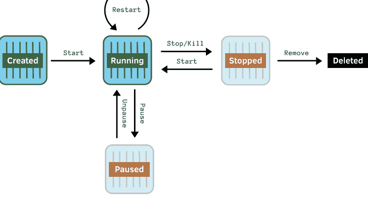

容器在“已创建” (created) 状态下产生。此时它不执行任何代码，仅仅是处于等待被调用状态。当容器启动时，它进入 *运行中* (running) 状态，在此状态下它积极地执行代码。我们之前看到的 `docker run` 命令会创建一个新容器，然后启动它使其运行。

在运行状态下，容器可以被重启、停止、杀死或暂停。暂停容器会挂起运行中的进程，以便稍后可以恢复。停止容器会尝试通过向容器内部的主进程发送终止信号 (SIGTERM) 来优雅地关闭——如果失败，则回退到使用杀死信号 (SIGKILL) 进行强制关闭。杀死容器则直接进入强制终止。

如果容器被停止、被杀死，或者其内部运行的主进程终止，容器将进入 *已停止* (stopped) 状态。已停止状态与已创建状态类似：容器在那里无所事事，直到被调用。从那里开始，容器要么被重启，或者如果你不再需要它，就将其从系统中移除。考虑到这一点，让我们看看在实践中如何使用 Compose 来实现。

首先，让我们检查当前有哪些容器正在运行。为此，我们使用 `ps` 命令：

```
$ docker-compose ps
    Name              Command          State           Ports
---------------------------------------------------------------------------
myapp_web_1   bin/rails s -b 0.0.0.0   Up    0.0.0.0:3000->3000/tcp
```

列表包括容器名称、用于启动它的命令、当前状态及其端口映射。在这里你可以看到我们的 Rails 服务器容器；它仍然运行在之前执行 `docker-compose up -d` 之后（Up 表示正在运行）。

如果我们现在想停止 Rails 服务器，可以使用 `stop` 命令。默认情况下，该命令将应用于 `docker-compose.yml` 文件中列出的 *所有* 服务。例如，要停止整个应用程序中的所有容器，我们将运行：

```
$ docker-compose stop
```

要针对 *特定* 服务，我们需要在操作后指定服务名称，如下所示：

```
$ docker-compose stop <service_name>
```

由于目前 `web` 是我们定义的唯一服务，这看起来似乎没什么意义。然而，我们很快就会添加更多服务，从 [第 5 章，《超越应用：添加 Redis》，第 59 页](#) 开始。通常我们需要将命令针对特定服务，因此记住这个模式非常有用——尤其是因为所有的 `docker-compose` 命令都遵循这一模式。

让我们停止 web 服务：

```
$ docker-compose stop web
Stopping myapp_web_1 ... done
```

现在在浏览器中加载 `localhost:3000` 将会失败，且列出容器将报告 Rails 服务器已终止：

```
$ docker-compose ps
Name     Command                  State     Ports
myapp_web_1  bin/rails s -b 0.0.0.0     Exit 1
```

在停止容器后，我们可以使用 `start` 命令将其重新启动：

```
$ docker-compose start web
Starting web ... done
```

还有一个 `restart` 命令，如果你做了一些配置更改并希望 Rails 服务器接收这些更改，该命令会非常方便。

```
$ docker-compose restart web
Restarting myapp_web_1 ... done
```

我们看到的各种 Compose 命令都依赖于底层的 docker 命令。不过，由于从现在起我们将使用 Compose，我们不会详细讲解那些命令。Compose 为我们提供了底层 docker 命令的所有功能，但采用了更简单、以应用为中心的命令。

#### 其他常见任务

除了启动和停止服务，在日常开发中我们还会频繁执行一些其他操作。我们将快速浏览一下重点，因为在接下来的章节中我们会用到它们。

##### 查看容器日志

我们已经看到，不带 `-d` 选项的 `docker-compose up` 会附加到它启动的容器并跟踪其输出。不过，还有一个专门用于查看容器输出的命令，它更加灵活。

让我们查看容器日志：

```
$ docker-compose logs -f web
```

你应该能看到一些显示 Rails 服务器启动的输出，类似于：

```
web_1 | => Booting Puma
web_1 | => Rails 5.2.2 application starting in development
web_1 | => Run `rails server -h` for more startup options
web_1 | Puma starting in single mode...
web_1 | * Version 3.12.0 (ruby 2.0.0-p0), codename: Llamas in Pajamas
web_1 | * Min threads: 5, max threads: 5
web_1 | * Environment: development
web_1 | * Listening on tcp://0.0.0.0:3000
web_1 | Use Ctrl-C to stop
```

`-f` 标志告诉命令跟踪输出——也就是说，保持连接并继续将日志中的任何新输出追加到屏幕上，类似于 Unix 的 `tail` 命令。

按下 `Ctrl-C` 以终止日志流。

需要意识到的是，此命令显示的是 *容器输出* 日志，而不是 Rails 服务器日志（后者默认存储在 `log/` 目录中）。然而，正如我们稍后在 [第二部分：走向生产环境，第 127 页](https://example.com) 中将看到的，在使用 Docker 时，将 Rails 配置为将日志输出到 stdout 是很常见的做法。

查看 Docker 官方文档以了解更多 `docker logs` 选项。

##### 运行一次性命令

到目前为止，我们一直使用镜像的默认 CMD 来运行 web 容器，该 CMD 会启动 Rails 服务器。如果我们想运行不同的命令怎么办？例如，我们经常需要使用 `db:migrate` 迁移数据库、运行测试、更新 gems，或者执行许多我们在开发过程中习惯使用的 Rails 命令。该如何操作？

实际上有两种不同的方法可以实现这一点，我们将用一个简单的例子来演示：在屏幕上回显（echo）一些内容。不要被这个简单的例子误导；这些方法使用的机制与我们在接下来的章节中运行所有常用命令时所采用的机制相同。

首先，我们可以使用 `docker run` 为一次性命令启动一个新容器。我们在服务名称之后提供命令，如下所示，这会覆盖 `docker-compose.yml` 文件或 Dockerfile 本身中指定的任何默认命令：

```
$ docker-compose run --rm web echo 'ran a different command'
ran a different command
```

`echo` 命令执行成功。请注意，与运行 Rails 服务器不同，容器在运行完命令后立即终止。这是因为 `echo` 命令完成并返回其退出状态，而 Rails 服务器的运行循环会使其一直执行，直到你要求它停止（或崩溃）。此外，由于这是一个一次性命令，我们使用了 `--rm` 选项，以便在命令完成后删除容器——否则，我们将面临大量多余容器堆积的情况。

运行一次性命令的第二种方法是完全避免启动新容器。相反，它依赖于一个正在运行的容器，并在该容器上执行命令。这可以通过 `docker-compose exec` 命令实现。

假设我们的 Rails 服务器正在运行，我们可以这样运行我们的 echo 示例：

```
$ docker-compose exec web echo 'ran a different command'
ran a different command
```

虽然这仅在容器已经运行时才有效，但由于它不启动新容器，我们无需记得清理额外的容器或使用 `--rm` 选项。

##### 重新构建镜像

我们可以要求 Compose 为我们构建镜像，而不是使用底层的 `docker build` 命令。这不仅可以避免在 `docker` 和 `docker-compose` 命令之间切换，而且因为我们的应用可能包含多个服务的 Dockerfile：我们的 `docker-compose.yml` 文件会跟踪哪个 Dockerfile 用于哪个服务。

要重新构建我们的 Rails 应用服务器镜像（在 Compose 中称为 web 服务），你可以执行以下命令：

```
$ docker-compose build web
```

你可能需要重新构建镜像的原因有几种。通常是因为你更新了 Gemfile，需要重新安装 gems（Dockerfile 包含 `bundle install` 命令）。有时是因为你必须修改 Dockerfile 以安装额外的依赖项。或者有时你想共享你的镜像，需要包含最新的代码更改（得益于 Dockerfile 的 `COPY` 指令），我们将在 [第二部分，走向生产环境，第 127 页](page127) 中看到。

##### 自行清理

你可能记得，当我们第一次为项目执行 `docker-compose up` 时，它会创建网络、卷以及应用所需的任何容器。


相应的 docker-compose down 命令会停止所有正在运行的容器，并将它们连同应用专用的网络和卷一并移除。

当你完成一个项目并希望释放其占用的资源空间时，这很有用。如果你只想移除应用的容器，可以使用 docker-compose rm 命令来实现这个目的。

#### 清理：释放未使用的资源

既然我们谈到了释放资源，还有一些其他命令可以帮助我们实现这一目标。

随着我们修改 Dockerfile 并重新构建镜像，一些镜像 inevitably 将不再被需要或使用，却仍占用着宝贵的磁盘空间。这些被称为*悬空*镜像；它们可以通过 docker image prune 命令移除。

有一整个系列的 prune 命令可以用来释放其他未使用的资源（例如，docker container prune）。甚至还有一条命令可以一次性释放所有资源：

```
$ docker system prune
```

### 快速回顾

我们在工具库中引入了一个强大的新工具：Docker Compose。它确实是使用 Docker 开发应用的一站式命令。

让我们来回顾一下我们所涵盖的内容。在本章中：

- 我们介绍了 docker-compose.yml 及其格式。

- 我们为自己的 Rails 应用创建了 docker-compose.yml，包括一个本地挂载的卷，以便对本地文件进行实时编辑。

- 我们了解了如何通过以下命令启动整个应用并启动 Rails 服务器：

```
$ docker-compose up
```

- 我们学习了使用 Compose 管理应用的各种命令：

  - 列出正在运行的容器

  ```
  $ docker-compose ps
  ```

  - 管理容器生命周期

  ```
  $ docker-compose [start|stop|kill|restart|pause|unpause|rm] <服务名称>
  ```

  - 查看日志

  ```
  $ docker-compose logs [-f] <服务名称>
  ```

  - 在`新的`、一次性的容器中运行一次性命令

  ```
  $ docker-compose run --rm <服务名称> <某个命令>
  ```

  - 在`现有的`容器中运行一次性命令

  ```
  $ docker-compose exec <服务名称> <某个命令>
  ```

  - 重新构建镜像

  ```
  $ docker-compose build <服务名称>
  ```

通过利用 Compose 的这些优点，我们将更复杂的 docker run 命令替换成了简洁、易于记忆和管理的命令。现在，我们只需一条命令就可以从零启动整个应用：

```
$ docker-compose up
```

万岁！

现在是时候开始使用 Compose 通过添加服务来扩展我们应用的功能了。

### 超越应用：添加 Redis

好吧，坦白交代。你看到本章标题时是不是在想"Redis？！数据库呢？！"如果是这样，我保证我没疯：先处理 Redis 有一个非常好的理由，你很快就会发现的。

首先，让我们回顾一下我们已经取得的成就。我们已经学会了 how to：

- 使用 Docker 生成一个全新的 Rails 项目，而无需安装 Ruby
- 启动 Ruby 服务器来运行我们的应用
- 确保我们的 gem 已安装并且是最新的
- 创建适合运行我们 Rails 应用的专属 Docker 镜像
- 使用 Docker Compose 来管理整个过程

这是一个不错的开始，但目前还不足以构建除最基本网站或应用之外的任何东西。我们缺少一个关键拼图：如何将我们的 Rails 应用连接到外部服务，比如……数据库。在本章中，你将学习如何做到这一点，从 Redis 开始（如果你不熟悉 Redis，它是一个内存中的键值存储，通常用于发布/订阅消息、队列、缓存等——所有酷孩子都在用它，而在本章之后，你也会的）。

为什么先 Redis 后数据库？因为，虽然向应用添加服务的过程相似，但事实证明 Redis 比数据库更容易集成到我们的应用中。相信我的话：按这个顺序来做会让你更顺畅。

事实上，本章教授的是向应用添加任何服务的基本技能，无论是数据库（我们将在下一章中完成）、后台工作人员、Elasticsearch，甚至是一个独立的 JavaScript 前端。很快，我们基于 Docker 的应用将与我们习惯的一样强大，甚至更胜一筹。

> **向 Aanand 致敬**
>
> 本章使用的演示应用灵感来自 Aanand Prasad 的演示，展示了如何使用 Compose 将基本的 Python Flask 应用连接到 Redis。
>
> Aanand 是 Fig（Docker Compose 的前身）的创建者，也是 Docker 的前员工。

#### 启动 Redis 服务器

那么我们想要 Rails 应用与 Redis 通信，对吧？首先，我们需要一个 Redis 服务器，我们的应用可以与它通信。正如你可能预料到的，我们不会在本机安装和运行 Redis。相反，让我们利用 Docker 的力量，在容器内启动一个 Redis 服务器。

最终，我们希望将 Redis 作为新服务添加到 Compose 中。然而，由于这是我们第一次添加服务，我们将采取循序渐进的步骤。我们先看看如何使用 `docker run` 在容器中运行 Redis，然后再回过头来让 Compose 自动为我们完成这项工作。随着你获得更多经验和信心，你将能够跳过这第一步，直接跳到在 Compose 中设置服务。

#### 使用 docker run

要使用 `docker run` 启动 Redis 服务器，我们会发出以下命令：

```
$ docker run --name redis-container redis
```

这个命令大部分应该是熟悉的：它告诉 Docker 基于官方 Docker redis 镜像运行一个容器。但是，有几个我们之前没见过的选项。

Docker 为每个新容器分配一个唯一的 `容器 ID` 来标识它。然而，这些长标识符对人类不太友好。就像我们在第 31 页给镜像打标签以赋予它更友好的名称一样，`--name` 选项告诉 Docker 给我们的新容器起一个易读的人名。

现在通过按 `Ctrl-C` 停止 Redis 服务器。

我们的最终目标是让 `docker-compose.yml` 文件完整描述我们的应用，包括所有依赖项。在了解了如何使用 `docker run` 启动 Redis 服务器之后，我们准备设置 Compose 来为我们管理 Redis。

让我们回顾一下 docker-compose.yml 文件：

```
version: '3'
services:
  web:
    build: .
    ports:
      - "3000:3000"
    volumes:
      - .:/usr/src/app
```

让我们修改它以包含一个我们称之为 `redis` 的新服务：

```
version: '3'
services:
  web:
    build: .
    ports:
      - "3000:3000"
    volumes:
      - .:/usr/src/app
  redis:
    image: redis
```

我们新 redis 服务的定义与我们 web 服务的定义大不相同。首先，它简单得多；它只有一个名为 image 的单一属性。

在定义服务时，有两种方式可以指定用于创建容器的镜像。我们的 web 服务使用 build 属性来指示 Compose 从 Dockerfile 构建我们的自定义镜像。然而，要使用预先存在的镜像，我们可以用 image 属性指定镜像的名称。这里我们指定 redis 镜像，就像在我们的 docker run 命令中一样。

除此之外，主要的区别在于我们没有指定什么。

我们没有发布任何端口。我们的 web 服务需要发布端口，以便我们本地机器上的 web 请求能够到达容器内运行的 Rails 服务器。然而，Redis 不需要外部访问；事实上，出于安全考虑，我们更希望它不被访问。通过不暴露端口，它被隐藏起来，对外部世界不可访问。

我们也没有指定任何要挂载的卷。web 服务使用卷将包含我们 Rails 项目代码的本地目录挂载到容器内。我们这样做是为了在我们本地编辑文件时，更改也能自动在容器内生效。对于 Redis，我们不需要这种行为——我们不会修改任何文件。

现在，让我们启动 Redis 服务器：

```
$ docker-compose up -d redis
```

我们可以通过查看日志来观察 Redis 的启动过程：

```
$ docker-compose logs redis
Attaching to myapp_redis_1
redis_1 | 1:C 15 Jan 2019 10:03:52.794 # 00000o0000o00000 o Redis is starting oo 00000o000o00o
redis_1 | 1:C 15 Jan 2019 10:03:52.794 # Redis version=5.0.3, bits=64, commit=000000000, modified=0, pid=1, just started
<...>>
redis_1 | 1:M 15 Jan 2019 10:03:52.796 * Running mode=standalone, port=6379
<...>>
redis_1 | 1:M 15 Jan 2019 10:03:52.796 # Server initialized
<...>>
redis_1 | 1:M 15 Jan 2019 10:03:52.796 * Ready to accept connections
```

很好！我们已经成功地将 Redis 设置为应用程序的一个新服务。

#### 手动连接到 Redis 服务器

我们刚刚使用 Compose 启动了 Redis，并从输出中看到它正在运行。然而，由于我们仍在熟悉 Docker，让我们手动连接到 Redis 服务器并与之交互，以向自己证明它确实可以工作。

一个快捷的方法是使用 Redis 命令行界面（`redis-cli`）。我们可以利用已有的 redis 镜像，它已经安装了 `redis-cli`。很方便。

我们无需在 Compose 中设置一个全新的、独立的服务，而是可以搭便车使用现有的 redis 服务，因为它使用了我们需要的 redis 镜像。运用我们在第 54 页“运行一次性命令”中学到的内容，我们可以运行以下命令来启动 `redis-cli` 并连接到我们的 Redis 服务器：

```
$ docker-compose run --rm redis redis-cli -h redis
```

这个命令的意思是：“在一个用于 redis 服务的临时容器（`--rm`）中，运行命令 `redis-cli -h redis`。” 运行它后，你应该会看到标准的 Redis 提示符，显示其运行所在的主机名和端口：

```
redis:6379>
```

请随意尝试。例如，尝试运行 `ping` 命令，它应该会给你“PONG”的响应。完成后，使用 `quit` 命令退出——这将终止 Redis 客户端，并因此终止容器。

所以，你看到了。我们的 Redis 服务器已经启动并运行，我们可以从一个单独的容器连接到它。请注意，我们使用的是 `docker-compose run`——而不是 `exec`——这是为了让 `redis-cli` 在一个新的、单独的容器中运行，尽管它基于相同的 redis 镜像。这表明我们能够从一个*不同的*容器访问 Redis 服务器。

但是，等一下！容器不应该是隔离的吗？为什么我们能从运行 `redis-cli` 的容器连接到运行 Redis 服务器的容器？

问得好。让我们在下一节中探讨这个问题。

#### 容器如何相互通信

如果两个容器是隔离的、独立的进程，为什么如我们刚才所见，它们能够相互通信？虽然容器中运行的*代码和进程*确实被沙箱化了，但这并不意味着容器无法与外部世界通信。如果容器之间不能通信，我们将无法将它们连接在一起，形成一个强大的、相互连接的服务系统来共同构成我们的应用程序。

如果你还记得第 47 页“启动我们的应用”中提到的，我们说过 `docker-compose up` 会为应用程序创建一个新的网络。默认情况下，我们应用的所有容器都连接到该应用的网络，并且可以相互通信。这意味着我们的容器，就像物理或虚拟服务器一样，可以使用 TCP/IP 网络进行自身以外的通信。

让我们使用以下命令列出当前定义的网络：

```
$ docker network ls
```

你应该会看到一些类似于以下内容的输出：

| NETWORK ID | NAME | DRIVER | SCOPE |
| :--- | :--- | :--- | :--- |
| 128925dfad81 | bridge | bridge | local |
| 5bd7167263e8 | host | host | local |
| e2af02026928 | myapp_default | bridge | local |
| d1145155d62a | none | null | local |

第一个名为 `bridge` 的网络是一个遗留网络，用于向后兼容一些较旧的 Docker 功能——既然我们已经切换到 Compose，我们现在不会使用它。同样，`host` 和 `none` 网络是 Docker 设置的特殊网络，我们不需要关心。

我们真正关心的网络叫做 `myapp_default`——这是 Compose 为我们创建的应用专用网络（Compose 使用 `<appname>_default` 的命名约定）。Compose 为我们创建这个网络的原因很简单：它知道我们定义的所有服务都属于同一个应用程序，因此它们不可避免地需要相互通信。

但是，这个网络上的容器如何找到彼此呢？

所有 Docker 网络（除了遗留的 bridge 网络）都内置了域名系统（DNS）名称解析。这意味着我们可以通过名称与在同一网络上运行的其他容器通信。Compose 使用服务名称（如我们在 `docker-compose.yml` 中定义的）作为 DNS 条目。因此，如果我们想访问我们的 web 服务，可以通过主机名 `web` 访问。这提供了一种基本形式的*服务发现*——一种一致的方法来查找基于容器的服务，即使在容器重启之后也能找到。

这就解释了为什么我们能从运行 `redis-cli` 的临时容器连接到作为 redis 服务运行的 Redis 服务器。这是我们使用的命令：

```
$ docker-compose run --rm redis redis-cli -h redis
```

选项 `-h redis` 表示“连接到名为 redis 的主机。” 这之所以可行，是因为 Compose 已经创建了我们的应用网络并为每个服务设置了 DNS 条目。特别是，我们的 redis 服务可以通过主机名 `redis` 来引用。

#### 我们的 Rails 应用与 Redis 通信

虽然我们使用 Compose 启动了一个 Redis 服务器很棒，但它本身对我们用处不大。运行 Redis 服务器的全部意义在于让我们的 Rails 应用能够与之通信，并将其用作键值存储。因此，让我们将 Rails 应用连接到 Redis 并实际使用它来做些事情。听起来很有趣吧？

现在，应用使用 Redis 的方式有一百万种。但就我们的目的而言，我们并不真正关心*用* Redis 来做什么；我们更关心*如何*使用它。我们将使用一个特意设计的基础示例：我们的 Rails 应用将简单地存储和检索一个值。然而，请记住更大的要点——一旦你知道如何设置 Rails 应用与容器中的 Redis 服务器通信，你就可以随心所欲地使用它。

准备好了吗？我们开始吧。

#### 安装 Redis Gem

要让我们的 Rails 应用与 Redis 通信，我们需要做的第一件事是安装 `redis` gem。你可能还记得，要更新我们的 gem，我们需要更新我们的镜像，正如我们在第 55 页所看到的。

所以首先，在我们的 Gemfile 中，像这样取消对 Redis gem 的注释：

```
gem 'redis', '~> 4.0'
```

接下来，停止我们的 Rails 服务器：

```
$ docker-compose stop web
```

然后重建我们的自定义 Rails 镜像：

```
$ docker-compose build web
```

这会运行 `bundle install`（以及其他操作），它安装了 Redis gem：

```
Building web
Step 1/8 : FROM ruby:2.6
«...»
Step 6/8 : RUN bundle install
«...»
Installing redis 4.1.0
«...»
Bundle complete! 16 Gemfile dependencies, 69 gems now installed.
Bundled gems are installed into `/usr/local/bundle`
«...»
Removing intermediate container 3831c10d2cb5
---> 1ca01125bd35
Step 7/8 : COPY . /usr/src/app/
---> 852d1cf2b419
Step 8/8 : CMD ["bin/rails", "-s", "-b", "0.0.0.0"]
---> Running in 280c7e2eb556
Removing intermediate container 280c7e2eb556
---> d98e3e532508
Successfully built d98e3e532508
Successfully tagged myapp_web:latest
```

养成在更新 Gemfile 后重建镜像以执行 `bundle install` 的习惯是很好的。也就是说，我们将在第 113 页学习一种更高级的 gem 管理方法，这种方法不仅速度更快，而且允许我们继续使用熟悉的 `bundle install` 工作流。

让我们再次启动新重建的 Rails 服务器：

```
$ docker-compose up -d web
```

#### 更新我们的 Rails 应用以使用 Redis

接下来，我们将从 Rails 应用中实际使用 Redis。如前所述，我们只想做一个基础演示，证明我们可以连接到 Redis 服务器并存储和检索值。所以让我们从在我们的 Rails 应用中生成一个带有单个 index 动作的欢迎控制器开始：


##### Linux 用户：文件所有权

确保您已通过运行以下命令更改文件所有权：

```
$ sudo chown <your_user>:<your_group> -R .
```

更多详情请参阅 [第 199 页的“文件所有权与权限”](#)。

```
$ docker-compose exec web bin/rails g controller welcome index
    create  app/controllers/welcome_controller.rb
    route  get 'welcome/index'
    invoke  erb
    create    app/views/welcome
    create    app/views/welcome/index.html.erb
    invoke  helper
    create    app/helpers/welcome_helper.rb
    invoke  assets
    invoke    coffee
    create      app/assets/javascripts/welcome.coffee
    invoke    scss
    create      app/assets/stylesheets/welcome.scss
```

现在，让我们将 `welcome#index` 操作（位于 `app/controllers/welcome_controller.rb`）修改如下：

```
class WelcomeController < ApplicationController
  def index
    redis = Redis.new(host: "redis", port: 6379)
    redis.incr "page hits"

    @page_hits = redis.get "page hits"
  end
end
```

在我们的 `index` 操作中，第 3 行，我们使用 Redis 客户端 gem 通过名称和预期的端口号连接到 Redis 服务器。然后，在第 4 行，我们递增一个名为 `"page hits"` 的 Redis 键值对。如果您想知道这段代码首次运行时会发生什么，请不用担心：如果找不到该键，Redis 会将其初始化为零，因此我们的代码将按预期工作。最后，在第 6 行，我们从 Redis 获取当前的页面访问次数，并将其存储在一个实例变量中，以便在视图中显示。

现在，让我们编辑视图文件 (`app/views/welcome/index.html.erb`) 以显示页面访问次数：

```
<h1>This page has been viewed <%= pluralize(@page_hits, 'time') %>!</h1>
```

最后，在 `config/routes.rb` 中，让我们更改自动生成的路由，以便我们可以从 `/welcome`（而不是 `/welcome/index`）访问新的 `WelcomeController` 的 `index` 操作：

```
Rails.application.routes.draw do
  get 'welcome', to: 'welcome#index'
end
```

现在，让我们在浏览器中访问我们的 Rails 应用 [http://localhost:3000/welcome](http://localhost:3000/welcome)。您应该会看到一个渲染了我们的 `welcome/index.html.erb` 文件的页面，如下图所示：


页面加载没有错误——这是一个好迹象。现在尝试重新加载页面。每次重新加载时，您都应该看到页面访问次数在增加。

这意味着什么？这意味着我们的 Rails 应用已连接到 Redis 服务器，将 "page hits" 的值从默认的 0 递增到 1，最后显示了带有页面访问次数的欢迎消息。更广泛地说，我们成功地让两个容器相互对话。这得益于 Compose 为应用创建了网络，并自动将容器连接到该网络。

#### 使用 Docker Compose 启动整个应用

我们刚刚将 Redis 作为新服务添加到 Compose 文件中，并配置了 Rails 应用以与其通信。在我们这样做时，Rails 服务器已经在运行，因此我们使用 `docker-compose run redis` 单独启动了 Redis 服务器。然而，Compose 的优势之一是，无论我们向应用添加多少服务，我们都可以用单个命令来管理整个应用，从而取代了对 Foreman 等 gem 的需要。[3]

我们可以一次性停止 Rails 服务器和 Redis 服务器：

```
$ docker-compose stop
```

您可以通过运行以下命令来验证两个服务都已停止：

```
$ docker-compose ps
```

您应该会看到类似这样的内容：

| Name | Command | State | Ports |
|------|---------|-------|-------|
| myapp_redis_1 | docker-entrypoint.sh redis ... | Exit 0 | |
| myapp_web_1 | bin/rails s -b 0.0.0.0 | Exit 1 | |

> 3. https://rubygems.org/gems/foreman

这表明 Redis 和我们的 web 服务都已停止；State 列显示 Exit 以及命令终止时的状态码（您的退出状态可能不同）。如果由于某种原因，其中一个仍在运行，请使用 `docker-compose stop`（或 `kill`）命令停止它们。

现在让我们再次启动整个应用——包括 Rails 服务器*和* Redis：

```
$ docker-compose up -d
```

现在如果我们运行：

```
$ docker-compose ps
```

我们可以看到两个服务都在运行：

| Name | Command | State | Ports |
| --- | --- | --- | --- |
| myapp_redis_1 | docker-entrypoint.sh redis... | Up | 6379/tcp |
| myapp_web_1 | bin/rails s -b 0.0.0.0 | Up | 0.0.0.0:3000->3000/tcp |

现在，见证真相的时刻到了。我们的 `welcome#index` 操作还能连接到 Redis 服务器吗？再次浏览到 [http://localhost:3000/welcome](http://localhost:3000/welcome)（或者如果页面仍然打开，请刷新页面），您应该会看到以下熟悉的屏幕（但访问计数器继续增加）：


### 快速回顾

使用容器运行我们应用的真正威力并不在于在单个容器中运行进程（虽然这很有用），而在于我们能够将容器连接在一起，使它们能够相互通信。

在本章中，我们已经了解了如何向应用程序添加服务，这些服务在单独的容器中运行。更重要的是，我们看到了如何使用 Docker 的内置网络让服务相互通信。

让我们回顾一下要点：

- 1. 我们使用 `docker run` 在容器中启动了一个 Redis 服务器。我们介绍了两个新选项：`--name` 用于为容器指定一个用户友好的名称，以及 `-d` 用于在分离模式下运行容器。
- 2. 我们在 Compose 中添加了一个单独的服务来运行 Redis 服务器。
- 3. 我们通过启动一个新容器来运行 `redis-cli`，验证了 Redis 服务器正在运行（并且我们可以从单独的容器连接到它）。
- 4. 我们讨论了 Docker 提供的网络功能，以及 Compose 如何促进容器之间的通信。
- 5. 我们将 Rails 应用连接到 Redis 服务器，使其存储并递增一个值，然后我们检索并显示了该值。
- 6. 最后，我们看到我们可靠的 `docker-compose up` 命令运行良好，将一次性启动 Rails*和* Redis 服务器。

接下来，我们将利用学到的 Compose 知识来添加一个 Postgres 数据库。我们将更进一步，了解即使运行数据库的容器被删除，如何确保数据持久化。

## 第 6 章：添加数据库：Postgres

我不知道你怎么想，但我对我们的进展感觉很好。我们一直在逐步提升技能，现在距离我们的 Docker 化 Rails 应用拥有我们在本地运行 Rails 时习惯的所有功能只有一步之遥了。

然而，还有一个明显的遗漏：我们还没有设置数据库。绝大多数 Rails 应用程序都需要某种持久化存储。

在本章中，我们将纠正这一点，利用我们添加 Redis 服务器的经验，来连接一个 Postgres 数据库。

阅读本章时，请记住要从大局出发。您学习的技能适用于*任何*您可能想添加到应用中的服务，无论是运行后台任务（如 Sidekiq）、Elasticsearch，还是为 Rails API 提供 JavaScript 前端。

### 启动 Postgres 服务器

我们希望为我们的 Rails 应用运行一个 Postgres 服务器。这个过程与我们添加 Redis 的过程非常相似。

在上一章中，我们首先熟悉了如何使用 `docker run` 运行 Redis 服务器。但是，现在我们已经有了一些添加服务的经验，让我们去掉辅助轮，直接跳到使用 Compose 设置 Postgres。

让我们将 Postgres 添加到我们的 `docker-compose.yml` 文件中：

```
version: '3'
services:
  web:
    build: .
    ports:
      - "3000:3000"
    volumes:
      - .:/usr/src/app
  redis:
    image: redis
  database:
    image: postgres
    environment:
      POSTGRES_USER: postgres
      POSTGRES_PASSWORD: some-long-secure-password
      POSTGRES_DB: myapp_development
```

我们使用官方 postgres 镜像定义了一个新的 database 服务。[^1] 我们依赖于该镜像的默认 CMD 指令——`CMD ["postgres"]`，它启动 Postgres 服务器。[^2]

与 redis 一样，我们的新 database 服务不需要端口映射或卷。我们不希望数据库在应用程序外部可访问，也不需要将任何文件挂载到 Postgres 容器中。

但是，我们确实指定了一个名为 `environment` 的新属性。您可能已经猜到它的作用：它告诉 Docker 在容器内设置后续的环境变量。在这里，我们指定 `POSTGRES_USER` 应设置为 `postgres`；`POSTGRES_PASSWORD` 应设置为 `some-long-secure-password`；`POSTGRES_DB` 应设置为 `myapp_development`。

我们为什么要设置这些？

就像非 Docker 化的 Postgres 允许您将某些参数指定为环境变量一样，[^3] Docker 化版本也是如此。[^4] 当 Postgres 启动时，如果设置了 `POSTGRES_USER`，其值将用作超级用户帐户的名称。类似地，如果设置了 `POSTGRES_PASSWORD`，它将用作超级用户密码。最后，如果设置了 `POSTGRES_DB`，它将用作启动时创建的默认数据库的名称。

- 1. https://hub.docker.com/_/postgres/
- 2. https://github.com/docker-library/postgres/blob/674466e0d47517f4e05ec2025ae996e71b26cae9/10/Dockerfile#L133
- 3. https://www.postgresql.org/docs/9.1/static/libpq-envars.html
- 4. https://hub.docker.com/_/postgres/


把数据库密码放在 docker-compose.yml 文件中并不理想：这个文件应该提交到版本控制，但提交包含密钥的文件存在安全风险。我们稍后会重新讨论这个问题。另外，严格来说，我们不需要设置 POSTGRES_USER，因为我们正在设置它的默认值。不过，我还是把它包含进来了，因为让事物可配置是个好习惯。⁵

好了。docker-compose.yml 更新完毕后，我们可以启动 Postgres 了：

```
$ docker-compose up -d database
```

我们以分离模式启动数据库服务。我们可以通过以下命令验证它是否正常运行：

```
$ docker-compose ps
 Name                Command               State           Ports 
---------------------------------------------------------------------------------
myapp_database_1   docker-entrypoint.sh pos...   Up       5432/tcp            
myapp_redis_1      docker-entrypoint.sh red...   Up       6379/tcp            
myapp_web_1        bin/rails s -b 0.0.0.0         Up       0.0.0.0:3000->3000/tcp
```

现在我们的应用有三个容器，我们可以看到新增的数据库正在运行。

作为进一步检查，我们可以查看数据库容器的输出：

```
$ docker-compose logs database
Attaching to myapp_database_1
database_1  | PostgreSQL init process complete; ready for start up.
database_1  | 
database_1  | 2019-01-15 10:07:29.394 UTC [1] LOG:  listening on IPv4 address "0.0.0.0", port 5432
database_1  | 2019-01-15 10:07:29.394 UTC [1] LOG:  listening on IPv6 address "::", port 5432
database_1  | 2019-01-15 10:07:29.397 UTC [1] LOG:  listening on Unix socket "/var/run/postgresql/.s.PGSQL.5432"
database_1  | 2019-01-15 10:07:29.409 UTC [60] LOG:  database system was shut down at 是以 2019-01-15 10:07:29 UTC
database_1  | 2019-01-15 10:07:29.414 UTC [1] LOG:  database system is ready to accept connections
```

请记住，这个命令显示的是*容器*的日志——即它的输出，而不是 Postgres 的日志文件输出。

⁵ https://12factor.net/config

### 从单独的容器连接到 Postgres

随着你对使用 Compose 越来越熟悉，你会发现自己越来越信任它能满足你的需求。一个快速的 `docker-compose ps` 可能就是你验证服务是否正常运行所需的全部（有时候你甚至会跳过这一步）。

然而，由于在容器内部运行 Postgres 这类服务对我们来说仍然相当新鲜，让我们额外花一步，从另一个容器手动连接它，就像我们之前对 Redis 做的那样。至少在学习的这个阶段，这有助于建立我对工具的信心。

与 Redis 的情况一样，postgres 镜像预装了 `psql`——Postgres 客户端。这意味着我们可以借助我们的新数据库服务来运行一个一次性容器，基于 postgres 镜像构建。不过，我们不使用镜像的默认命令（启动 Postgres *服务器*），而是运行一个命令来启动 Postgres *客户端*。

我们可以通过运行以下命令来实现：

```
$ docker-compose run --rm database psql -U postgres -h database
```

这里我们的意思是："为 database 服务启动一个新的、一次性的容器（`run --rm`），并在其中运行命令 `psql -U postgres -h database`。" 这个命令启动 Postgres 客户端，告诉它用 `postgres` 用户连接到主机名 `database`。我们依赖于这样一个事实：Compose 会神奇地为我们的应用设置一个网络，配置好 DNS，使得主机名 `database` 能够连接到运行我们数据库服务的容器。

我们本可以使用 `exec` 而不是 `run --rm`，这样可以避免启动新容器，而是在已经运行的数据库容器上执行命令。不过，我们特意想要额外的验证，即从不同的容器进行连接。

当你运行这个命令时，系统会提示你输入密码：

```
Password for user postgres:
```

请输入 `some-long-secure-password`——我们在 `docker-compose.yml` 文件中设置的密码。这应该会被接受，并带你进入 psql 提示符：

```
psql (11.1 (Debian 11.1-1.pgdg90+1))
Type "help" for help.

postgres=#
```

很好。我们已连接到运行着 Postgres 的数据库服务，并证明了一切都按预期工作。当你准备好时，可以通过输入 `\q <Enter>` 退出 psql 客户端。

### 将我们的 Rails 应用连接到 Postgres

我们刚刚看到数据库已经启动并运行，并且可以从应用网络中的其他容器访问。不过，在我们开始使用它之前，必须配置 Rails 应用以连接到数据库。

现在就来这么做。

#### 安装 Postgres Gem

首先，为了让我们的 Rails 应用与 Postgres 通信，我们需要安装 Postgres 客户端 gem。打开你的 `Gemfile` 并更新它，将：

```
gem 'sqlite3'
```

替换为：

```
gem 'pg', '~> 1.0'
```

要实际安装新 gem，我们需要运行 `bundle install`，我们通过重建镜像来实现这一点（我们在第 113 页进一步讨论 gem 管理）。首先停止我们的 Rails 服务器：

```
$ docker-compose stop web
```

然后重建我们的镜像：

```
$ docker-compose build web
Building web
Step 1/8 : FROM ruby:2.6
<<...>>
Step 6/8 : RUN bundle install
<<...>>
Installing pg 1.1.4 with native extensions
<<...>>
Bundle complete! 16 Gemfile dependencies, 69 gems now installed.
Bundled gems are installed into `/usr/local/bundle`
<<...>>
Removing intermediate container 9b01b1fa29fc
--> f9e6330d40b6
Step 7/8 : COPY . /usr/src/app/
--> 70fb0e2e0091
Step 8/8 : CMD ["bin/rails", "s", "-b", "0.0.0.0"]
--> Running in 16cc0923b855
Removing intermediate container 16cc0923b855
--> d4ffbe8f72d3
Successfully built d4ffbe8f72d3
Successfully tagged myapp_web:latest
```

Postgres gem 安装完成后，我们可以继续配置 `database.yml`。

#### 创建我们的应用数据库

创建 Rails 项目时，我们使用的是默认设置，假设数据库使用 sqlite。现在我们改用 Postgres，生成的 `database.yml` 文件就不正确了。我们需要将其更改为更适合的配置。

在编辑器中打开 `config/database.yml`，将其内容替换为以下 Postgres 配置：

```yaml
default: &default
  adapter: postgresql
  encoding: unicode
  host:     <%= ENV.fetch('DATABASE_HOST') %>
  username: <%= Env.fetch('POSTGRES_USER') %>
  password: <%= Env.fetch('POSTGRES_PASSWORD') %>
  database: <%= ENV.fetch('POSTGRES_DB') %>
  pool: 5
  variables:
    statement_timeout: 5000

development:
  <<: *default

test:
  <<: *default
  database: myapp_test

production:
  <<: *default
```

希望这一切对你来说看起来很熟悉。

我们通过环境变量指定最重要的配置（主机、用户名、密码和数据库）。通常这被认为是良好的实践，⁶ 不过，正如我们稍后看到的，Docker 提供了更安全的方法。目前，这些环境变量尚未为我们的 web 服务设置。

我们来解决这个问题。我们必须更新 `docker-compose.yml`，确保这些变量在我们的 Rails 应用容器中设置，如下所示：

```yaml
version: '3'

services:
  web:
    build: .
    ports:
      - "3000:3000"
    volumes:
      - .:/usr/src/app
    environment:
      DATABASE_HOST: database
      POSTGRES_USER: postgres
      POSTGRES_PASSWORD: some-long-secure-password
      POSTGRES_DB: myapp_development

  redis:
    image: redis

  database:
    image: postgres
    environment:
      POSTGRES_USER: postgres
      POSTGRES_PASSWORD: some-long-secure-password
      POSTGRES_DB: myapp_development
```

⁶ https://12factor.net/config

在没有 Docker 的世界里，我们通常会设置 `DATABASE_HOST` 为 `localhost`，因为数据库会运行在我们的本地机器上。但在这里，我们指定运行 Postgres 的服务名称：`database`。这得益于应用网络提供的 DNS，可以解析到我们的数据库服务容器。

我们还设置了 `POSTGRES_USER`、`POSTGRES_PASSWORD` 和 `POSTGRES_DB` 环境变量，使其与数据库服务设置的变量一致；这意味着我们的 web 服务将拥有正确的凭证来登录数据库。

这应该可以正常工作了，但注意我们现在有相当多的环境变量，其中两个在 web 和 database 服务中重复了。我们还说过不想在 `docker-compose.yml` 文件中包含密钥，这样我们就可以把它提交到源代码仓库。让我们一石二鸟，将这些环境变量提取到单独的文件中。

首先，创建一些目录来存放我们特定环境的配置：

```
$ mkdir -p .env/development
```

然后创建文件 `.env/development/web`（不带文件扩展名），包含我们 web 服务特定的环境变量：

```
DATABASE_HOST=database
```

再创建另一个文件 `.env/development/database`，包含数据库服务的变量：

```
POSTGRES_USER=postgres
POSTGRES_PASSWORD=some-long-secure-password
POSTGRES_DB=myapp_development
```


现在我们需要告诉 Compose 使用这些文件，而不是直接显式设置变量。我们通过 `env_file` 指令来实现：

```
version: '3'

services:
  web:
    build: .
    ports:
      - "3000:3000"
    volumes:
      - .:/usr/src/app
    env_file:
      - .env/development/database
      - .env/development/web

  redis:
    image: redis

  database:
    image: postgres
    env_file:
      - .env/development/database
```

我们可以将环境文件命名为任何我们喜欢的名称，但我选择了一个简单且合理的命名方案。同样，对于环境变量文件（目前在 `.env` 下），你可以自由使用任何文件结构和命名约定，只要你在 Compose 文件中正确引用它们即可。

完成这个小小的重构后，我们就可以使用标准 Rails 命令 `bin/rails db:create` 来创建我们的开发和测试数据库了，将命令指向我们的 web 服务：

```
$ docker-compose run --rm web bin/rails db:create
```

在这种情况下，我们使用 `run --rm` 而不是 `exec`，因为当前正在运行的 web 容器不会获得新添加的环境变量，直到我们重启它。而运行这个命令的新的一次性容器将会拥有这些变量。

你应该会看到以下输出，表明我们的数据库已成功创建：

```
Database 'myapp_development' already exists
Created database 'myapp_test'
```

你会注意到 `myapp_development` 数据库已经存在，这有点奇怪，因为这是第一次创建它。这是因为 postgres 镜像在首次启动时会自动创建一个默认数据库；如果设置了 `POSTGRES_DB` 环境变量，它将使用该值作为这个表的名称。在我们的例子中，这个值是 `myapp_development`，这就是该表已经存在的原因。

很好，我们离成功不远了。

### 重启 Rails 服务器

我们已经设置好 Rails 使用在容器中运行的 Postgres 数据库，并创建了数据库，最后一步是启动我们的 Rails 服务器，使用新的配置和环境变量。但是，因为 Compose 会直接复用现有的容器来启动服务，我们必须显式告诉它为我们的 web 服务重新创建容器。

下面是具体做法：

```
$ docker-compose up -d --force-recreate web
```

`--force-recreate` 表示"重新创建服务的容器"。

现在，继续访问 http://localhost:3000 来验证应用是否已连接到 Postgres；如果一切正常，你会看到标准的 Rails 启动页面；如果无法连接，ActiveRecord 会抛出 `PG::ConnectionBad` 错误。

就这样——我们已经成功运行了 Postgres。

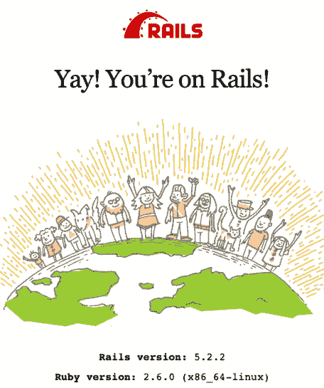

### 在实践中使用数据库

我们知道，在将 Rails 应用配置为与 Postgres 数据库通信后，Rails 应用已经成功启动；但是，我们正依靠*没有错误*来证明数据库已正确连接。虽然从技术上讲，这就是我们需要的全部，但让我们通过从应用中与数据库交互来确保它按预期工作。这也将给我们更多通过 Compose CLI 使用 Docker 开发 Rails 应用的练习。

让我们在 Rails 应用中生成一个基本的 `UsersController`。为了快速起见，我们将直接使用 Rails 的 `generate scaffold` 命令：

```
$ docker-compose exec web \
    bin/rails g scaffold User first_name:string last_name:string
    invoke  active_record
    create    db/migrate/20190115100954_create_users.rb
    create    app/models/user.rb
    invoke  resource_route
     route    resources :users
    invoke  scaffold_controller
    create    app/controllers/users_controller.rb
    invoke  erb
    create    app/views/users
    create    app/views/users/index.html.erb
    create    app/views/users/edit.html.erb
    create    app/views/users/show.html.erb
    create    app/views/users/new.html.erb
    «...»
```

| Linux 用户：文件所有权 |
| :--- |
| ⚠️ 记住要通过运行以下命令更改我们刚生成的文件的所有权：`$ sudo chown <your_user>:<your_group> -R .` 更多详情请见[第 199 页的文件所有权和权限](#)。 |

现在我们需要运行迁移来创建 Users 表。你应该开始习惯使用 Compose 针对我们的 web 服务运行标准 Rails 命令了，就像这样：

```
$ docker-compose exec web bin/rails db:migrate
== 20190115100954 CreateUsers: migrating =====================================
-- create_table(:users)
   -> 0.0585s
== 20190115100954 CreateUsers: migrated (0.0587s) ==========================
```

好的，我们应该可以开始了——来试试吧。在应用仍在运行时，在浏览器中导航至 [http://localhost:3000/users](http://localhost:3000/users)。你应该会看到熟悉的 Rails 脚手架页面，用于创建和列出用户，如下图所示。确保你能够创建和删除用户。

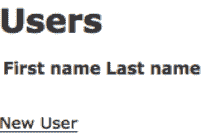

太好了，我们已经用 Compose 完全配置好了 Postgres。

### 将数据与容器解耦

我们已设置好数据库以在 Rails 应用中持久化数据，这很棒。然而，目前它的工作方式存在一个重大缺陷。让我们看看问题是什么，以及如何解决这个问题。

使用 Docker 的部分理念是，我们应该将容器视为一次性的——我们启动、使用然后删除的临时东西。然而，我们的 Postgres 数据库运行在容器中，通过在容器*内部*的磁盘上写入和修改文件来持久化数据。如果我们删除数据库容器，数据会怎样？是的，你猜对了：我们要和我们所有珍贵的数据说再见了。这可不是我们想要的。

现在我们将在数据库中存储重要数据，我们需要更仔细地考虑这个问题。

就像在我们的代码中，我们试图将频繁变化的东西与不常变化的东西解耦一样，我们希望将*数据*与生成和使用它的容器解耦。我们的数据应该*分离*存储，与运行数据库的容器分开。这样，我们可以删除、移除和重新创建容器，而不会影响数据。

答案是：我们将持久化数据存储在卷中，卷的本质就是与容器的生命周期解耦的。即使我们删除一个连接了卷的容器，卷仍会继续独立存在，安全地存储我们的数据。然后我们可以重新创建容器，连接上卷，一切就都好了。

Docker 允许我们创建几种不同类型的卷，任何一种都能胜任这项工作。例如，我们已经见过如何挂载本地卷。然而，还有另一种更适合我们目的的卷。我们并不关心文件存储在*哪里*或*如何*存储，我们只关心它们确实被单独存储在某个地方。为此，我们可以创建一个*命名*卷：一个自包含的文件存储*桶*，完全由 Docker 管理。

但理论就说到这里；让我们看看在实践中如何操作。

命名卷可以通过 `docker volume` 命令创建和管理。虽然了解这一点很有价值，但由于我们使用 Compose，我们可以让它来为我们管理卷。

以下是我们修改后的 `docker-compose.yml`，用于将持久化数据存储在卷上：

```yaml
# Line 1  version: '3'
# - 
# -  services:
# - 
# 5   web:
#      build: .
#      ports:
#        - "3000:3000"
#      volumes:
# 10       - .:/usr/src/app
#      env_file:
#        - .env/development/database
#        - .env/development/web
# - 
# - 
# 15 redis:
#      image: redis
# - 
# - 
#     database:
#      image: postgres
# 20    env_file:
#        - .env/development/database
#      volumes:
#        - db_data:/var/lib/postgresql/data
# - 
# 25 volumes:
# -    db_data:
```

第一步是告诉 Compose 我们需要一个命名卷。命名卷在顶层 `volumes` 属性下定义（第 25 行）；在这里，我们定义了一个名为 `db_data` 的命名卷（第 26 行）。

接下来，我们需要告诉 Compose 在我们的数据库容器内挂载命名卷，使用我们熟悉的 `volumes` 属性（第 22 行）。挂载命名卷（第 23 行）与挂载本地目录（第 10 行）类似——区别

这里（第23行）的冒号前面部分指的是命名卷的名称，而不是本地路径。我们在这里的含义是，“将 db_data 命名卷挂载到 /var/lib/postgresql/data”——即 Postgres 镜像用于存储我们希望持久化的数据库文件的目录。⁷

好的，让我们来试一下。我们已经更改了数据库服务的 Compose 定义，所以我们需要重启那个服务。然而，同样地，除非我们明确指示，否则 Compose 会为某个服务重复使用同一个容器，因此我们必须显式地告诉 Compose 重新创建数据库容器以应用我们新的卷设置。

首先停止数据库服务：

```
$ docker-compose stop database
```

然后我们显式地移除它的容器：

```
$ docker-compose rm -f database
```

Compose 通常会在移除容器前要求我们确认——`-f` (强制) 选项告诉它直接执行。

好了，是时候把我们的数据库重新启动起来了：

```
$ docker-compose up -d database
Creating volume "myapp_db_data" with default driver
Creating myapp_database_1 ... done
```

由于我们新的卷现在已经挂载到容器中，我们之前的任何数据库和数据都已被清空，因此我们需要重新创建并迁移数据库。

现在就来做这件事：

```
$ docker-compose exec web bin/rails db:create db:migrate
Database 'myapp_development' already exists
Created database 'myapp_test'
== 20190115100954 CreateUsers: migrating ==================
-- create_table(:users)
   -> 0.0127s
== 20190115100954 CreateUsers: migrated (0.0143s) ====================
```

好了，现在让我们确保我们的应用仍然正常工作。在浏览器中访问 http://localhost:3000/users ，确保你能看到我们的 User scaffold。太好了——卷似乎正常工作了。

> 7. https://hub.docker.com/_/postgres/

让我们来证明我们的数据现在即使删除了数据库容器也能持久化。首先，我们需要存储一些数据：通过 Rails scaffold 添加一个或多个用户。在下图中，我为自己创建了一个用户。


既然我们已经存储了一些数据，现在让我们停止数据库容器：

```
$ docker-compose stop database
Stopping myapp_database_1 ... done
```

然后删除它（当被询问时，你需要确认）：

```
$ docker-compose rm database
Going to remove myapp_database_1
Are you sure? [yN] y
Removing myapp_database_1 ... done
```

接下来，我们重新创建并启动它：

```
$ docker-compose up -d database
```

如果一切顺利，我们应该能看到我们的用户数据，与我们删除数据库容器之前完全一致。刷新浏览器（访问 http://localhost:3000/users），然后……我们的数据还在那里。万岁！

#### 但是我的数据到底在哪里？

我们说过 Docker 为命名卷管理文件系统的一个区域，但它到底在哪里呢？我们可以通过运行以下命令找出我们的 `db_data` 命名卷（Compose 会加上我们的应用文件夹前缀变成 `myapp_db_data`）的位置：

```
$ docker volume inspect --format '{{ .Mountpoint }}' myapp_db_data
/var/lib/docker/volumes/myapp_db_data/_data
```

如我们所见，命名卷存储在 `/var/lib/docker/volumes/` 目录下。在 Linux 上，这将是本地文件系统上的一个路径，但在 macOS 或 Windows 上，这指的是 Docker 宿主机虚拟机*内部*的路径。

> 8. https://docs.docker.com/storage/#choose-the-right-type-of-mount

### 快速回顾

在本章中，我们学习了如何为我们的 Rails 应用设置和配置数据库——这是绝大多数 Rails 应用通常都需要的。

让我们回顾一下我们涵盖的内容：

- 我们使用 Compose 在容器中启动了一个 Postgres 服务器。
- 我们通过从一个单独的容器使用 Postgres 客户端连接，验证了 Postgres 服务器正在运行。
- 我们配置了我们的 Rails 应用与 Postgres 通信，方法是安装 `pg` gem，修改 `database.yml` 文件，并运行 Rake 任务来创建数据库。
- 我们通过生成 scaffold、运行迁移以及插入、删除和更新记录来对新数据库进行了全面测试。
- 我们讨论了为什么将数据库容器与我们希望持久化的数据解耦是一个好主意。
- 最后，我们使用了一个命名卷来单独存储我们的数据，允许我们独立于容器管理其生命周期。

你现在已经看到了如何添加两个服务：Redis 和 Postgres。你应该能够运用同样的知识来添加你能想到的任何其他服务。事实上，在下一章中，我们将添加另一个服务，届时我们将把注意力从后端技术转移到探索如何为你的 Rails 应用集成一个现代化的 JavaScript 前端。

## 第七章：与 JavaScript 和谐共处

我们生活在一个 JavaScript 复兴的时代——它不再仅仅是语言纯粹主义者口中的“出气筒”。Rails 通过在其包含 Webpacker 的方式拥抱了现代 JavaScript 技术（如 React）：这是一个提供 webpack 支持的 gem。

作为 Rails 开发者，能够根据需要将这些技术融入我们的应用非常重要，因此我们的 Docker 环境需要支持我们在这方面的努力。

在本章中，我们将探索在 Rails 开发中集成 JavaScript 的各种选择。我们还将看到如何通过安装和配置 Webpacker 在我们的 Rails 应用中引入一个 React 前端。

在本章结束时，我们基于 Docker 的开发环境将能够与所有这些现代 JavaScript 的优秀特性良好协作。

### JavaScript 前端选项

在将 JavaScript 集成到 Rails 应用前端时，有许多不同的选择。或许最大的选择在于，你的 Rails 应用是否会提供前端服务。两种方式都是同样有效的选择，每种方式都有其优缺点，并会导致不同的设置。

如果你的 Rails 应用不提供前端服务，那意味着你将 Rails 应用用作 API 层。在这种情况下，你会有一个独立的前端，通常用纯 JavaScript 编写，无论是 React、Ember、Vue.js 还是其他技术。这种情况超出了本书的范围，因为它涉及非常具体的 JavaScript 设置。然而，总的来说，这相当简单，你将主要运用已经学过的技能。

这是一个基本的大纲：

- **重命名你的 web 服务。** 命名很重要。在这种情况下，你的 Rails 应用实际上是 API 或后端，因此你应该相应地命名它。
- **创建一个用于运行 JavaScript 前端应用的自定义镜像。** 就像我们创建自定义镜像来运行 Rails 应用一样，你也会为你的 JS 前端做同样的事情。它的 Dockerfile 可以基于标准的 Node.js 镜像¹ 构建，并添加应用特定的设置要求。
- **在你的 docker-compose.yml 中创建一个独立的前端服务。** 这将是你独立的 JavaScript 应用程序。你将通过环境变量配置它应该使用的 API 端点（Rails API 的域名和端口）。

另一方面，如果你使用 Rails 来提供前端服务，那就意味着使用 Rails 提供的设施。Rails 提供了两种机制来提供 JavaScript 前端：基于 Sprockets 的资产管道，或在 Rails 5.1 中添加的新方法 Webpacker。

传统的基于 Sprockets 的资产管道无需任何特殊设置即可开箱即用。作为运行 Rails 服务器的一部分，你的资产将按照标准 Rails 方式自动编译并在视图中提供。我们将在即将到来的测试章节第 95 页看到一个这样的例子。

让你的 Rails 应用与 Webpacker 协同工作在 Docker 环境中需要更多的设置。由于这是一种非常流行的方法，我们将在本章剩余部分引导你完成设置过程。

### 使用 Webpacker 的 Rails JavaScript 前端

Rails 自版本 5.1 以来就包含了一种构建丰富的 JavaScript 前端到你的应用中的方式，使用了一个名为 `webpacker` 的 gem。Webpacker 具有模块化架构，允许你集成不同的前端技术，无论是 React、Ember、Vue.js 甚至是 Elm。

以 React 为例，让我们看看如何在我们 Docker 化的应用中配置 Webpacker。

首先，Webpacker 需要 Yarn 和当前版本的 Node。这需要更新我们的 Docker 镜像：

```dockerfile
Line 1  FROM ruby:2.6
        LABEL maintainer="rob@DockerForRailsDevelopers.com"
```

> 1. https://hub.docker.com/_/node/


```dockerfile
# Allow apt to work with https-based sources
RUN apt-get update -yqq && apt-get install -yqq --no-install-recommends \
  apt-transport-https

# Ensure we install an up-to-date version of Node
# See https://github.com/yarnpkg/yarn/issues/2888
RUN curl -sL https://deb.nodesource.com/setup_8.x | bash -

# Ensure latest packages for Yarn
RUN curl -sS https://dl.yarnpkg.com/debian/pubkey.gpg | apt-key add -
RUN echo "deb https://dl.yarnpkg.com/debian/ stable main" | \
  tee /etc/apt/sources.list.d/yarn.list

# Install packages
RUN apt-get update -yqq && apt-get install -yqq --no-install-recommends \
  nodejs \
  yarn

COPY Gemfile* /usr/src/app/
WORKDIR /usr/src/app
RUN bundle install

COPY . /usr/src/app/

CMD ["bin/rails", "s", "-b", "0.0.0.0"]
```

要安装最新版本的 Yarn，我们需要将 Yarn 的 Debian 软件包仓库添加到源列表中（第 13–15 行）。然而，由于 Yarn 的软件仓库使用 HTTPS，我们必须安装 `apt-transport-https` 软件包（第 5–6 行）才能使其正常工作。

不幸的是，Yarn 与默认安装的（旧版）Node.js 之间存在依赖问题。我们在第 10 行通过将 Node 的软件仓库添加到源列表中来解决这个问题；这确保我们安装更新版本的 Node。

最后，在第 20 行，我们将 yarn 添加到我们要安装的软件包列表中。安装了 yarn 和更新版本的 Node 后，我们现在可以配置应用程序以使用 Webpacker 了。

如果我们早知道会使用 Webpacker 来创建应用程序，我们可以使用 `--webpack` 选项来包含支持——例如：

```
$ rails new myapp --webpack=react <其他选项>
```

`--webpack=react` 选项将会生成一个默认支持 React 的应用程序。然而，由于我们已经生成了应用程序，添加 Webpacker 支持需要几个手动步骤。

我们首先必须更新 Gemfile 以包含 Webpacker gem：

```ruby
gem 'webpacker', '~> 3.5'
```

然后通过重新构建镜像来运行 bundle install：

```
$ docker-compose build web
```

让我们停止 web 服务，因为它当前运行的是没有安装 Webpacker gem 的旧版本：

```
$ docker-compose stop web
```

现在我们可以在应用程序中安装 Webpacker：

```
$ docker-compose run web bin/rails webpacker:install
```

#### inotify 溢出错误

> 不幸的是，运行上一个命令时，你可能会遇到以下错误消息，这似乎是由 rb-inotify gem 中的 bug 引起的：²

`run() in thread failed: inotify event queue has overflowed.`

虽然不好看，但它似乎不会产生任何实质性的影响，你可以安全地忽略它。

接下来是 Webpacker React 集成：

```
$ docker-compose run web bin/rails webpacker:install:react
```

好的，我们的应用程序已经配置好了 Webpacker 和 React。然而，在真正完成之前，我们需要一种自动编译 React 资源的方法。

#### 使用 Webpacker 编译资源

作为 Webpacker 的一部分，Rails 提供了 `webpack-dev-server` 二进制文件。这是一个在后台运行的小型服务器，自动编译我们由 webpack 管理的文件。

如果你在本地开发，这只是你从终端发出的另一个命令。然而，Docker 的方式是将其作为独立服务运行在自己的容器中。

让我们为它在 `docker-compose.yml` 文件中添加一个新服务：

```yaml
version: '3'
  
services:
  web:
    build: .
    ports:
      - "3000:3000"
    volumes:
      - .:/usr/src/app
    env_file:
      - .env/development/web
      - .env/development/database
    environment:
      - WEBPACKER_DEV_SERVER_HOST=webpack_dev_server

  webpack_dev_server:
    build: .
    command: ./bin/webpack-dev-server
    ports:
      - 3035:3035
    volumes:
      - .:/usr/src/app
    env_file:
      - .env/development/web
      - .env/development/database
    environment:
      - WEBPACKER_DEV_SERVER_HOST=0.0.0.0

  redis:
    image: redis

  database:
    image: postgres
    env_file:
      - .env/development/database
    volumes:
      - db_data:/var/lib/postgresql/data

volumes:
  db_data:
```

Rails 的 `webpack_dev_server` 设计为在 Rails 应用程序的根目录下工作；这就是为什么我们从与 web 服务相同的 Dockerfile 构建（第 17 行）。

虽然它使用相同的镜像和代码，但我们用不同的命令启动新服务。不是启动 Rails 服务器，而是运行 `./bin/webpack_dev_server` 命令本身（第 18 行）。

我们在 `webpack-dev-server` 的默认端口 3035 上暴露该服务（第 20 行）。

我们希望 `webpack-dev-server` 在我们本地开发时自动检测并重新编译我们的更改，而无需重新启动。这就是为什么在第 22 行，与我们的 web 服务一样，我们将本地文件挂载到容器中。

`webpack-dev-server` 命令期望以与 Rails 应用程序相同的配置运行。幸运的是，由于我们已将配置提取到文件中，我们可以简单地重用相同的 `env_files`（第 23–25 行）。

然而，为了确保 `webpacker-dev-server` 响应来自任何 IP 地址的请求，我们将 `WEBPACKER_DEV_SERVER_HOST` 设置为 `0.0.0.0`（第 27 行），就像我们之前对 Rails 服务器所做的那样。

配置了 `webpack_dev_server` 服务后，我们还需要为 web 服务设置一个 Rails 环境变量，以便它知道在哪里找到 `webpack-dev-server`（第 14 行）。

现在我们需要启动 web 服务以使用我们的新镜像并获取这些配置更改：

```
$ docker-compose up -d web
```

然后启动我们的新服务：

```
$ docker-compose up -d webpack_dev_server
```

#### 一个 Hello World React 应用

我们这里的目的是确保我们能够配置 Rails 应用程序，使用 Docker，让我们能够使用 React 等现代 JavaScript 技术进行开发。为此，我们只需要展示一个简单的 React 应用程序能够编译并正确加载我们的设置。

当我们安装 Webpacker 时，它在 `app/javascript/packs/hello_react.jsx` 中添加了一个示例 "Hello World" React 应用程序，该应用程序渲染一个显示 "Hello React!" 的 `<div>`：

```jsx
import React from 'react'
import ReactDOM from 'react-dom'
import PropTypes from 'prop-types'

const Hello = props => (
  <div>Hello {props.name}!</div>
)

Hello.defaultProps = {
  name though: 'World'
}

Hello.propTypes = {
  name: PropTypes.string
}

document.addEventListener('DOMContentLoaded', () => {
  ReactDOM.render(
    <Hello name="React" />,
    document.body.appendChild(document.createElement('div')),
  )
})
```

我们将使用这个应用程序来验证 Webpacker 是否正确设置。首先，我们需要生成一个加载 React 应用程序的页面：

```
$ docker-compose exec web bin/rails g controller pages home
      create  app/controllers/pages_controller.rb
      route  get 'pages/home'
      invoke  erb
      create    app/views/pages
      create    app/views/pages/home.html.erb
      invoke  helper
      create    app/helpers/pages_helper.rb
      invoke  assets
      invoke    coffee
      create      app/assets/javascripts/pages.coffee
      invoke    scss
      create      app/assets/stylesheets/pages.scss
```

让我们修改生成的视图（`app/views/pages/home.html.erb`）来加载 React 应用程序；同时，让我们删除默认内容并给页面一个新的标题：

```erb
<%= javascript_pack_tag 'hello_react' %>

<h1>React App</h1>
```

好的，我们来试试这个。导航到 `http://localhost:3000/pages/home`，你应该会看到页面上显示 "Hello React!"。这确认了我们的 React 应用程序正在被编译和正确加载。

自动更新也能工作。更新 `app/javascript/packs/hello_react.jsx`，将 `defaultProps.name` 设置为你的姓名：

```jsx
<Hello name="<你的姓名>" />
```

现在当你重新加载浏览器时，你应该会看到页面已更新（除非你的姓名碰巧是 "React"）。

这个应用程序并不令人兴奋。但有了这些基础，你现在可以在 Rails 应用程序中以 React 进行开发，并构建你喜欢的任何内容。

### 快速回顾

就这样——我们终于做到了。我们现在有一个功能完备的 Rails 应用程序运行在 Docker 中，完全通过 Compose 管理。这是一件美好的事情，不是吗？让我们快速回顾一下本章涵盖的内容：

- 1. 我们安装了 Yarn 和更新版本的 Node，以满足 `Webpacker` 的要求。
- 2. 我们安装了 `Webpacker` gem。
- 3. 我们在 `docker-compose.yml` 文件中添加了一个新服务，运行 `webpack_dev_server` 来自动编译我们的 Webpacker JavaScript 资源。
- 4. 我们创建了一个 Hello World React 应用程序，以验证所有配置是否正确，能够编译和运行 React 应用程序。

现在我们的应用程序已经在其全部荣耀中运行起来，接下来我们将注意力转向在 Docker 化环境中设置和运行我们的测试。


## 第8章

### Docker化环境下的测试

在上一章中，我们通过添加 PostgreSQL 数据库完成了标准应用的配置。然而，开发工作尚未完全结束。作为专业的 Ruby 开发者，我们重视经过良好测试的代码，这能让我们有信心交付可靠的软件。当我们围绕 Docker 重建开发环境时，需要了解测试如何融入这一图景。无论你对测试有何个人偏好，重要的是要知道如何让我们的测试工具在 Docker 中正常运作并与之良好配合，以便在需要时使用它们。

在本章中，我们将设置流行的 Ruby 测试框架：RSpec。我选择 RSpec 而非 Rails 默认的 Minitest，有几个原因。首先，设置 RSpec 需要多费一点功夫，因此可以学到更多东西。其次，它恰好是我在 Rails 项目中首选的测试框架。

话虽如此，如果你是 Minitest 的忠实粉丝，也不必担心。本章仍然值得一读，以熟悉我们在常规工作流中所需的 Docker 命令。此外，所需的配置，尤其是 Capybara 的配置，将会非常相似，并且大部分可以移植到 Minitest 中。

如果你以前曾在 Rails 项目中设置过 RSpec，那么本章的大部分内容将会非常熟悉。事实上，眯起眼睛看，你甚至可能注意不到我们在使用 Docker。这既证明了你在 Docker 学习和理解方面已经取得了很大进步，也说明了 Docker 工具一旦设置好，就会退居幕后，直到你需要它们时才出现。

尽管如此，本章也并非没有挑战。使用 Docker 进行测试有一些细微之处需要我们去探究。我们还会发现，当我们配置使用 Capybara 的系统测试（system specs）以进行端到端的浏览器测试时，事情并不那么简单。

请记住，我们这里的重点不是如何测试你的代码——我假设你已经具备了这方面的知识和经验（如果你没有，市面上有大量关于此主题的好书[^1]）。我们只是对在 Docker 化环境中设置一些常见的测试工具感兴趣。

再次冲锋陷阵……

#### 设置 RSpec

既然我们的应用已经通过 Compose 正确配置，设置 RSpec 将会非常熟悉。让我们快速过一遍。

按照 rspec-rails 的说明[^2]，我们需要在 Gemfile 中添加以下内容：

```ruby
group :development, :test do
  # Call 'byebug' anywhere in the code to stop execution and get a debugger...
  gem 'byebug', platforms: [:mri, :mingw, :x64_mingw]
  gem 'rspec-rails', '~> 3.8'
end
```

首先，让我们停止 web 服务：

```sh
$ docker-compose stop web
```

接下来，我们需要重新构建镜像以运行 bundle install，然后从中创建一个新容器：

```sh
$ docker-compose build web
Building web
Step 1/12 : FROM ruby:2.6
<<...>>
Step 7/12 : RUN apt-get update -yqq && apt-get install -yqq --no-install-recommends nodejs yarn
<<...>>
Bundle complete! 18 Gemfile dependencies, 77 gems now installed.
Bundled gems are installed into `/usr/local/bundle`
<<...>>
Removing intermediate container dcb3ac9ef4e5
--> a1bf00e74754
Step 11/12 : COPY . /usr/src/app/
--> 395cd4848b46
Step 12/12 : CMD ["bin/rails", "s", "-b", "0.0.0.0"]
--> Running in 47ec46df6236
Removing intermediate container 47ec46df6236
 ---> ea5d358cb673
Successfully built ea5d358cb673
Successfully tagged myapp_web:latest
$ docker-compose up -d --force-recreate web
Recreating myapp_web_1 ... done
```

接下来我们需要安装 RSpec，设置其文件结构：

```sh
$ docker-compose exec web bin/rails generate rspec:install
    create  .rspec
    create  spec
    create  spec/spec_helper.rb
    create  spec/rails_helper.rb
```

设置好 RSpec 后，我们可以像这样运行测试：

```sh
$ docker-compose exec web bin/rails spec
```

然而，如你所料，这会报告我们目前没有测试：

```
No examples found.

Finished in 0.00509 seconds (files took 0.30574 seconds to load)
0 examples, 0 failures
```

让我们通过创建……来对 RSpec 进行一次真正的试驾

#### 我们的第一个测试

在项目中安装了 RSpec 之后，看到零个测试运行并不能让人满意。让我们现在就纠正这一点，创建我们的第一个测试，以便能看到一些实际的测试代码在运行。

让我们为 User 模型生成一个 spec：

```sh
$ docker-compose exec web bin/rails generate rspec:model user
    create  spec/models/user_spec.rb
```

##### Linux 用户：文件所有权

记得对生成的文件进行 chown 操作，以便你可以编辑它们（参见[文件所有权与权限，第199页](#)）：

```sh
$ sudo chown <your_user>:<your_group> -R .
```

在编辑器中打开新创建的 spec/models/user_spec.rb 文件。这不是一本关于测试的书——我们只需要一个基本的测试来展示 RSpec 按预期工作。以下代码应该可以奏效：

```ruby
require 'rails_helper'
RSpec.describe User do
  describe "validations" do
    it "requires first_name to be set" do
      expect(subject.valid?).to_not be
      expect(subject.errors[:first_name].size).to eq(1)
    end

    it "requires last_name to be set" do
      expect(subject.valid?).to_not be
      expect(subject.errors[:last_name].size).to eq(1)
    end
  end
end
```

现在我们再次运行测试：

```sh
$ docker-compose exec web bin/rails spec
```

我们看到我们的 specs 正确地失败了，因为我们尚未在 User 模型上实现任何验证：

```
Failures:

1) User validations requires first_name to be set
   Failure/Error: expect(subject.valid?).to_not be
     expected true to evaluate to false
   # ./spec/models/user_spec.rb:6:in `block (3 levels) in <top (required)>'

2) User validations requires last_name to be set
   Failure/Error: expect(subject.valid?).to_not be
     expected true to evaluate to false
   # ./spec/models/user_spec.rb:11:in `block (3 levels) in <top (required)>'

Finished in 0.09403 seconds (files took 17.39 seconds to load)
2 examples, 2 failures
```

让我们通过更新 User 模型（app/models/user.rb）使其看起来像这样，来让这些测试通过：

```ruby
class User < ApplicationRecord
  validates_presence_of :first_name, :last_name
end
```

现在我们重新运行 specs：

```sh
$ docker-compose exec web bin/rails spec
```

可以看到它们通过了：

```
Finished in 0.07523 seconds (files took 4.69 seconds to load)
2 examples, 0 failures
```

就这么简单。一旦设置完成，使用 RSpec 与 Docker 的关键区别仅仅在于我们必须在命令前加上 `docker-compose exec web`——希望你已经开始习惯这一点了。

#### 设置 Rails 系统测试

Rails 系统测试[^3]——在 Rails 5.1 中添加[^4]——允许你对应用执行高层级的端到端测试。与测试单个函数或方法是否按预期工作（单元测试）不同，它们基于用户如何与应用交互来测试应用——即通过 Web 界面。它们允许我们断言，当用户以某种方式与我们的应用交互时（例如填写表单、点击链接或按钮），应用会按我们预期的方式响应（例如显示正确的页面、页面上出现正确的内容）。

虽然这种端到端测试以前也是可能的——例如使用 *RSpec Feature specs*[^5]——系统测试带来了许多好处。我们不再需要担心测试期间数据库的清理工作，这通常使用 Database Cleaner gem 来完成[^6]；相反，系统测试在与 Rails 相同的进程中运行浏览器驱动代码，允许测试在事务中执行并回滚。

虽然运行速度较慢，但这种端到端测试可以说是应用中最重要的测试类型，因为它们验证了应用被创建来提供的能力是否确实按预期工作。即使有 100% 的单元测试覆盖率，配置文件中的一个拼写错误也可能导致整个应用无法正常运行。唯一确定的方法是打开浏览器并实际使用应用。你可能已经看出来了，我是这种测试的粉丝。

系统测试依赖 Capybara gem[^7] 才能运作——它提供了一个用于与浏览器交互的漂亮领域特定语言（DSL）。按照 Capybara 的说明[^8]，第一步是安装该 gem。

[^1]: https://pragprog.com/book/rspec3/effective-testing-with-rspec-3
[^2]: https://github.com/rspec/rspec-rails
[^3]: https://guides.rubyonrails.org/testing.html#system-testing
[^4]: https://guides.rubyonrails.org/5_1_release_notes.html#system-tests
[^5]: https://relishapp.com/rspec/rspec-rails/docs/feature-specs/feature-spec
[^6]: https://rubygems.org/gems/database_cleaner
[^7]: https://rubygems.org/gems/capybara
[^8]: https://github.com/teamcapybara/capybara#setup


现在让我们将其添加到 Gemfile 中：

```ruby
group :development, :test do
  # Call 'byebug' anywhere in the code to stop execution and get a debugger…
  gem 'byebug', platforms: [:mri, :mingw, :x64_mingw]
  gem 'rspec-rails', '~> 3.8'
  gem 'capybara', '~> 3.7'
end
```

接下来，我们需要通过重新构建镜像来安装这个新 gem。同时，我们将重新创建 web 容器：

```bash
$ docker-compose build web
$ docker-compose stop web
$ docker-compose up -d --force-recreate web
```

现在我们准备好创建第一个系统规格测试（system spec）了。默认情况下，RSpec 期望在 `spec/system` 目录下找到这些文件，所以现在就创建它：

```bash
$ mkdir spec/system
```

让我们先创建文件 `spec/system/page_views_spec.rb` 并将其编辑如下：

```ruby
require 'rails_helper'

RSpec.describe "PageViews" do
  it "shows the number of page views" do
    visit '/welcome'
    expect(page.text).to match(/This page has been viewed [0-9]+ times?!/)
  end
end
```

##### Linux 用户：文件所有权

同样地，你需要对文件执行 chown（参见第 199 页的 [文件所有权与权限](#)）：

```bash
$ sudo chown <your_user>:<your_group> -R .
```

在运行此测试之前，让我们切换到使用 RackTest 驱动程序来进行标准系统测试。这不仅速度更快，而且可以避免在真正需要之前安装一个支持 JavaScript 的完整浏览器驱动程序（默认是 Selenium）。

编辑 `spec/rails_helper.rb`，在最后一个 `end` 之前添加以下行：

```ruby
config.before(:each, type: :system) do
  driven_by :rack_test
end
```

这里使用了 RSpec 的 `before` 配置钩子，在运行每个系统规格测试之前执行一些设置；具体来说，我们使用了 `driven_by` 方法（这是 Rails 为系统测试提供的一个新方法）将 Capybara 驱动程序设置为 `rack_test`。

完成后，让我们运行测试：

```bash
$ docker-compose exec web rspec spec/system/
```

```
.

Finished in 27.2 seconds (files took 11.57 seconds to load)
1 example, 0 failures
```

太棒了！我们已经配置好了 Capybara 和系统规格测试。

##### 运行依赖于 JavaScript 的测试

好了，让我们提高一点难度。在 Docker 中设置支持 JavaScript 的测试不会那么简单。但我认为你已经准备好处理它了。

假设我们有一个增强版本的 `/welcome` 页面，它具有只有在启用 JavaScript 时才能运行的额外行为。事实上，当运行正常时，这段 JavaScript 会在页面上直接添加“ENHANCED!”的消息。

这是我在 `app/views/welcome/index.html.erb` 中比较粗糙的实现：

```erb
<% content_for :head do %>
  <script type="text/javascript">
    document.addEventListener("DOMContentLoaded", function(){
      document.getElementsByTagName('h1')[0].append(' ENHANCED!');
    });
  </script>
<% end %>

<h1>This page has been viewed <%= pluralize(@page_hits, 'time') %>!</h1>
```

为了让它工作，我们还需要对 `app/views/layouts/application.html.erb` 进行微调：

```erb
<!DOCTYPE html>
<html>
  <head>
    <title>Myapp</title>
    <%= csrf_meta_tags %>

    <%= stylesheet_link_tag 'application',
                            media: 'all',
                            'data-turbolinks-track': 'reload' %>

    <%= javascript_include_tag 'application',
                               'data-turbolinks-track': 'reload' %>

    <%= yield :head %>
  </head>
  <body>
    <%= yield %>
  </body>
</html>
```

让我们在 PageViews 系统规格测试中添加第二个场景来测试此行为（记住，我们这里的目的是演示如何配置 JavaScript 测试，所以我相信你在自己的应用中会编写更有用的测试）：

```ruby
require 'rails_helper'

RSpec.describe "PageViews" do
  it "shows the number of page views" do
    visit '/welcome'
    expect(page.text).to match(/This page has been viewed [0-9]+ times?!/)
  end

  it "is enhanced with JavaScript on", js: true do
    visit '/welcome'
    expect(page).to have_text("ENHANCED!")
  end
end
```

按照 RSpec 的惯例，我们通过指定 `js: true` 来表明这个新场景（第 9 行）预期只有在启用 JavaScript 的情况下才能通过。

然而，我们遇到了一个问题。如你所知，Capybara 使用的默认驱动程序是 RackTest，虽然运行速度快，但不支持 JavaScript。如果现在运行系统规格测试，即使（我们认为）该功能正常工作，测试也会失败。

为了能够运行依赖于应用程序执行 JavaScript 的规格测试，我们必须使用一个不同的、功能更全的驱动程序。有几种选择：

- Selenium，⁹ 支持多种浏览器，包括最近宣布支持无头模式（headless）的 Chrome¹⁰
- Capybara-webkit，¹¹ 一个针对 Qt 跨平台工具包的无头 WebKit 实现的驱动程序
- Poltergeist，¹² 一个使用 PhantomJS¹³ 的无头 WebKit 驱动程序

9. https://github.com/teamcapybara/capybara#selenium
10. https://developers.google.com/web/updates/2017/04/headless-chrome
11. https://github.com/thoughtbot/capybara-webkit
12. https://github.com/teampoltergeist/poltergeist
13. http://phantomjs.org

Rails 系统测试默认使用 Selenium，所以我们就用它。我选择通过 Selenium 使用 Chrome。Chrome 是最受欢迎的桌面浏览器，而且人们说它的无头支持比 Capybara-webkit 更好。¹⁴

要使用 Selenium，我们需要将 `selenium-webdriver` gem 添加到 Gemfile 中：

```ruby
group :development, :test do
  # Call 'byebug' anywhere in the code to stop execution and get a debugger…
  gem 'byebug', platforms: [:mri, :mingw, :x64_mingw]
  gem 'rspec-rails', '~> 3.8'
  gem 'capybara', '~> 3.7'
  gem 'selenium-webdriver', '~> 3.14'
end
```

然后通过重新构建镜像并重新创建 web 容器来安装它：

```bash
$ docker-compose build web
$ docker-compose stop web
$ docker-compose up -d --force-recreate web
```

但我们如何在 Docker 中运行 Chrome 呢？就像我们通常在 Docker 中运行任何软件一样——在容器中运行。已经有准备好的用于运行独立版本 Chrome 的镜像，事实上，我们将使用一个由 Selenium 官方维护的镜像。¹⁵

让我们将其添加到 Compose 文件中：

```yaml
selenium_chrome:
  image: selenium/standalone-chrome-debug
  logging:
    driver: none
  ports:
    - "5900:5900"
```

这增加了一个我们将其命名为 `selenium_chrome` 的新服务，其容器将基于 `selenium/standalone-chrome-debug` 镜像。我们选择了 debug 版本¹⁶ 而不是标准版本¹⁷，因为它包含并运行了一个 VNC 服务器。这使我们能够使用 VNC 客户端直观地看到容器内运行的 Chrome——如果你想实际看到测试运行，这非常有用。

我们还通过将日志驱动程序设置为 `none` 关闭了日志记录，因为 Selenium Chrome 镜像有我们不需要看到的冗长输出。我们创建了一个端口映射，以便在容器内 5900 端口运行的 VNC 服务器可以通过同一端口从容器外部访问。你可以查看 Docker 文档以了解更多关于可用日志选项的详细信息。¹⁸

让我们启动这个新服务，以便 Selenium Chrome 可用于我们的系统测试：

```bash
$ docker-compose up -d selenium_chrome
```

> **启动 Chrome 出现问题？**

如果在启动 `selenium_chrome` 服务时遇到错误，很可能是因为你已经在 5900 端口运行了另一个 VNC 客户端。例如，在 macOS 上，请确保在系统偏好设置中关闭了“屏幕共享”。

接下来，我们必须配置 Capybara 以使用运行在容器中的 Chrome。让我们创建文件 `spec/support/capybara.rb` 并添加以下配置：

```ruby
Capybara.register_driver :selenium_chrome_in_container do |app|
  Capybara::Session::Driver.new app,
    browser: :remote,
    url: "http://selenium-chrome:4444/wd/hub",
    desired_capabilities: :chrome
end
```

这向 Capybara 注册了一个名为 `:selenium_chrome_in_container` 的新驱动程序，配置为使用 Selenium 驱动程序来控制运行在 `http://selenium-chrome:4444/wd/hub` 的远程 Selenium Chrome 实例（第 5 行）。为什么是这个特定的 URL？Selenium 在 `http://<host>:<port>/wd/hub` 监听传入的客户端请求。端口 4444 是 Selenium 监听的默认端口，而主机名 `selenium_chrome` 与我们 `docker-compose.yml` 中的新服务相匹配，将能够到达运行 Chrome 的容器。你可能记得第 5 章《超越应用：添加 Redis》（第 59 页），Compose 设置了用于访问其他 Compose 服务的主机名。

> **Linux 用户：文件所有权**

一如既往，记得对文件执行 chown（参见第 199 页的文件所有权与权限）：

```bash
$ sudo chown <your_user>:<your_group> -R .
```

##### 配置 RSpec 系统测试

我们创建了一个新的 Capybara 驱动程序，但如何配置 RSpec 来使用它呢？

18. https://docs.docker.com/compose/compose-file/#logging


首先，我们需要编辑 `spec/rails_helper.rb` 来引入我们新的 Capybara 驱动，以便其被加载：

```
require 'rspec/rails'
# Add additional requires below this line. Rails is not loaded until this...
require_relative './support/capybara.rb'
```

通常，应用程序会自动引入 `spec/support` 目录下的所有 `.rb` 文件。如果你的应用程序是这种情况，那么这次引入可以省略。

好了，接下来做什么？回想一下，早些时候我们使用了 RSpec 的配置钩子，将 `rack_test` 设置为系统测试的默认驱动。现在我们需要将其配置为：非 JavaScript 系统测试继续使用该驱动，而 JavaScript 测试（在测试定义中用 `js: true` 标签标识）应使用我们新的 Selenium Chrome Capybara 驱动。

我们可以通过在 `spec/rails_helper.rb` 中添加以下行来实现（将它们添加到之前添加的 `before` 钩子和最后的 `end` 之间）：

```
config.before(:each, type: :system, js: true) do
  driven_by :selenium_chrome_in_container
  Capybara.server_host = "0.0.0.0"
  Capybara.server_port = 4000
  Capybara.app_host = 'http://web:4000'
end
```

指定了 `js: true` 的系统规格（System specs）将使用这个新配置（未指定的则继续使用旧配置，即设置 `rack_test` 驱动）。这个新配置将 Capybara 驱动（第 2 行）设置为 `selenium_chrome_in_container`：这是我们的新驱动，它通过远程 Selenium Chrome 浏览器运行测试。

由于执行测试的浏览器将在一个独立的容器中运行，而不是在同一台机器上，因此需要一些额外的配置。Capybara 将启动一个新的 Puma 服务器来运行应用程序的测试版本。通常，这发生在运行测试的同一台机器的 `localhost` 上，一切都能正常工作。然而，在这里，我们应用程序的这个测试版本需要能够从外部（即从 Selenium Chrome 容器）访问。这意味着我们必须在已知端口上启动测试应用——我选择了 4000 端口（第 4 行），但你可以选择任何端口。此外，就像我们使用 `-b 0.0.0.0` 启动 Rails 服务器以监听所有端口一样，Capybara 启动的测试应用服务器也必须监听所有 IP 地址。这就是为什么我们将 `server_host` 设置为 `0.0.0.0`（第 3 行）：如果不这样做，服务器将在 `localhost` 上启动，只有容器内部的传入请求能得到响应。

最后，我们需要告诉 Capybara 为应用程序使用一个在 Selenium Chrome 容器内部连接时有效的 URL（第 5 行）。记住，Docker 设置了 DNS 条目，允许我们通过名称引用其他服务的容器。因此，Selenium Chrome 容器将通过 URL `http://web:4000` 访问运行在 Rails 容器中的应用程序（我们之前已配置测试服务器在 4000 端口启动）。

好了。我们几乎准备好尝试这一切了，但首先必须再做一件事。我们已经告诉 Capybara 在 4000 端口启动测试应用，并且配置了在 Selenium Chrome 容器中远程运行的测试去访问它。然而，目前 4000 端口在 `web` 容器外部是不可访问的，因为该容器目前仅暴露了 3000 端口。

让我们通过在 `docker-compose.yml` 的 Web 端口配置中添加以下行来修复此问题：

```
ports:
  - "3000:3000"
  - "4000:4000"
```

为了使更改生效，我们需要停止 Web 容器并使用 `--force-recreate` 重新创建它。

```
$ docker-compose stop web
Stopping myapp_web_1 ... done
$ docker-compose up -d --force-recreate web
Recreating myapp_web_1 ... done
```

现在我们应该可以运行规格测试了：

```
$ docker-compose exec web rspec spec/system/
.Capybara starting Puma...
* Version 3.12.0 , codename: Llamas in Pajamas
* Min threads: 0, max threads: 4
* Listening on tcp://0.0.0.0:4000
.
Finished in 31.17 seconds (files took 8.8 seconds to load)
2 examples, 0 failures
```

这次运行测试时，依赖 JavaScript 的系统规格测试现在通过了。

#### 查看测试运行

正如我之前所说，我们特意选择了 `selenium/standalone-chrome-debug` 镜像，因为它包含一个运行中的 VNC 服务器。这允许我们连接并实际查看测试在浏览器中运行的情况。

为了看到容器的桌面，我们需要一个 VNC 客户端进行连接。如果你使用 Mac，可以使用 macOS 标准配备的“屏幕共享”应用。在 Linux 上，这取决于你的发行版和安装的软件，但通过包管理器安装 VNC 客户端应该足够简单。对于 Windows，有几种选择，其中一些是免费的。

好了，VNC 客户端准备好了吗？启动它并连接到 `vnc://localhost:5900`。5900 是 VNC 服务器的默认端口——你可能记得我们在 `docker-compose.yml` 中定义 `selenium_chrome` 服务时暴露了这个端口。系统会提示你输入密码，密码是 “secret”。现在输入，你应该会看到一个类似这样的窗口打开：

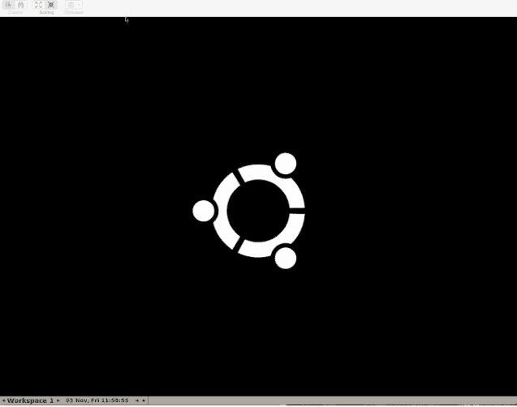

这向我们展示了在 `selenium_chrome` 服务容器中运行的 Linux 桌面。如果一切运行如预期，当我们重新运行测试时，应该会看到某些操作发生。让我们试一下：

```
$ docker-compose exec web rspec spec/system/
```

在 VNC 客户端窗口中，你应该看到一个新的 Chrome 浏览器打开并加载我们的应用程序页面（如图 108 页所示）。浏览器会很快再次关闭，因此你可能想在 JavaScript 场景中间添加一个 `sleep 10`，以便在页面加载后实际看到它。

- 19. [五个适用于 Windows 的 VNC 远程桌面访问应用](https://www.techrepublic.com/blog/five-apps/five-apps-for-vnc-remote-desktop-access-on-windows/)
- 20. [Selenium Docker 调试指南](https://github.com/SeleniumHQ/docker-selenium#debugging)

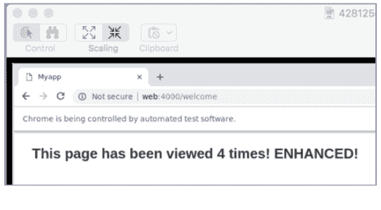

#### 无头浏览器（Headless Browsing）

能够看到测试运行是一个很有用的选项。我们通常在某些东西未按预期工作，想要观察实际发生的情况时需要它。然而，大多数时候我们并不关心是否能看到测试运行——我们只想让它们尽可能快地运行（是人类的极限，还是计算机的极限？）。出于这个原因，我们通常在*无头（headless）*模式下运行系统规格测试，而不会实际显示浏览器窗口。由于没有驱动真实 UI 的开销，测试运行速度会快得多。

为了实现这一点，让我们在 `spec/support/capybara.rb` 中注册第二个驱动，用于以无头模式运行 Selenium Chrome：

```
require "selenium/webdriver"

Capybara.register_driver :selenium_chrome_in_container do |app|
  Capybara::Selenium::Driver.new app,
    browser: :remote,
    url: "http://selenium_chrome:4444/wd/hub",
    desired_capabilities: :chrome
end

Capybara.register_driver :headless_selenium_chrome_in_container do |app|
  Capybara::Selenium::Driver.new app,
    browser: :remote,
    url: "http://selenium_chrome:4444/wd/hub",
    desired_capabilities: Selenium::WebDriver::Remote::Capabilities.chrome(
      chromeOptions: { args: %w(headless disable-gpu) }
    )
end
```

新的 Capybara 驱动定义与第一个几乎完全相同；唯一的区别是我们指定了启动 Chrome 时的 `headless` 和 `disable-gpu`。请注意，我们还必须引入 `selenium/webdriver`，因为我们需要使用 `Selenium::WebDriver::Remote::Capabilities` 类。

要切换到使用这个无头驱动，我们必须修改在 `spec/rails_helper.rb` 中添加的 RSpec 配置，以便在 JavaScript 系统规格测试中使用此驱动：

```
config.before(:each, type: :system, js: true) do
  driven_by :headless_selenium_chrome_in_container

  Capybara.server_host = "0.0.0.0"
  Capybara.server_port = 4000
  Capybara.app_host = 'http://web:4000'
end
```

现在如果你重新运行系统规格测试：

```
$ docker-compose exec web rspec spec/system/
```

你不会在 VNC 窗口中看到浏览器出现，但测试会通过。

#### 调试

任何关于测试的章节如果不提到在应用程序行为不符合预期时如何调试，都是不完整的。

假设我们的 `welcome_controller.rb` 存在问题。让我们使用 Rails 应用标准配备的 `byebug` 调试器。让我们在 `welcome_controller.rb` 中添加一个 `byebug` 断点：

```
class WelcomeController < ApplicationController
  def index
    redis = Redis.new(host: "redis", port: 6379)
    redis.incr "page hits"

    @page_hits = redis.get "page hits"
    byebug
  end
end
```

让我们停止 Rails 服务器：

```
$ docker-compose stop web
```

当我们想要与容器进行*交互式*会话时，我们会使用 `docker-compose run` 而不是 `docker-compose up`。让我们这样启动与 Web 服务器的交互式会话：

```
$ docker-compose run --service-ports web
```

默认情况下，`docker-compose run` 会忽略 `docker-compose.yml` 文件中为该服务指定的端口映射。`--service-ports` 选项更改了这一行为并确保它们被映射；如果没有这个选项，我们的 Rails 服务器将无法通过浏览器的 3000 端口访问。


现在，在浏览器中访问 http://localhost:3000/welcome：页面会挂起，因为请求命中了我们的 byebug 断点。回到终端，你应该会看到一个熟悉的 byebug 界面在等着你：

```
=> Booting Puma
=> Rails 5.2.2 application starting in development
=> Run `rails server -h` for more startup options
Puma starting in single mode...
<...>
[2, 11] in /usr/src/app/app/controllers/welcome_controller.rb

2:   def index
3:     redis = Redis.new(host: "redis", port: 6379)
4:     redis.incr "page hits"
5:
6:     @page_hits = redis.get "page hits"
7:     byebug
=> 8:   end
9:   end
10:
11:
(byebug)
```

你可以在这里随意实验，验证它是否正常工作；例如，你可以输出 `@page_hits` 变量来查看它的值。当你准备退出时，按 `c`（表示"continue"继续），然后按 `Enter`；请求会继续正常执行，页面应该会在浏览器中显示。按 `Ctrl-C` 停止 web 容器。

在继续之前，记得从 `welcome_controller.rb` 中移除 byebug 断点，然后重新启动 web 服务器：

```
$ docker-compose up -d web
```

> **Rails Server 无法启动？**
>
> 如果 Rails 启动失败，因为它认为已经有服务器在运行，请在你的本地机器上删除 `tmp/pids/server.pid`，然后重试。在第 9 章中，我们会看到更好的处理方案。

如果你使用 IntelliJ 或 RubyMine，它们内置了对通过 docker-compose 使用 Ruby 的支持，包括对其调试器的支持。²¹

### 快速回顾

到现在，使用 Docker 应该开始感觉很熟悉了。事实上，本章的大部分内容都是我们在 Rails 中会做的标准操作——Docker 没有妨碍我们。当涉及到需要 JavaScript 的测试时，事情变得有点棘手，但有了预构建的、基于 Selenium 驱动的 Chrome 镜像，安装这些工具变得轻而易举——这就是 Docker 的优势所在。

总结如下：

- 1. 我们设置并安装了 RSpec。
- 2. 我们了解了如何在 Docker 环境中运行我们的 specs。
- 3. 我们设置了系统 specs，并使用默认的 RackTest 驱动运行了测试。
- 4. 我们通过配置 Capybara 使用在单独容器中运行的、由 Selenium 驱动的 Chrome 浏览器，让我们的系统 specs 即使在需要 JavaScript 时也能工作。
- 5. 我们通过在正常使用中配置 headless Chrome，让我们的 JavaScript 系统测试更快。
- 6. 我们学会了如何调试我们的应用程序，即使它运行在容器内部。

虽然我们一直在逐步提升 Docker 技能，但你可能注意到有一个方面让人感觉有些迟钝——每当我们需要添加或修改 gem 时，重新构建镜像仍然感觉很慢。在下一章中，我们会探讨如何缓解这个问题并加快镜像构建速度。

---

## 第9章：高级 Gem 管理

我们现在已经有了一个基于 Docker 的可用开发环境。然而，有一个方面值得再多思考一下：gem 管理。

到目前为止，要安装或更新 gem，我们只是简单地重建 Rails 应用的镜像。这行之有效，因为 `bundle install` 是我们 Dockerfile 中的步骤之一。然而，正如我们即将看到的，与我们在非 Docker 化环境中管理 gem 的习惯相比，这种方法有一个小小的缺点（你可能已经发现了）。

在本章中，我们将探讨管理 gem 的另一种方法，它试图通过做出不同的权衡来避免这个缺点（首先，它更复杂一些）。

无论你是坚持使用到目前为止我们一直在用的简单方法，还是采用这种新方法，完全取决于你。我会介绍这项技术，解释其中的权衡，然后你可以根据自己的需求和偏好做出选择。成交吗？

### 现有方法的缺点

我们当前管理 gem 的方法是，每当需要更新 gem 时就重建镜像。然而，你可能已经注意到，每当我们修改 Gemfile 时，即使只是添加一个 gem，*所有* gem 都必须从头重新安装。结果，更新 gem 的时间比我们通常习惯的要长。

为什么会这样？

Bundler 和 Docker 镜像都在试图实现同一个目标：确保环境的一致性，但它们实现的方式不同。Docker 的镜像构建过程打破了 Bundler 的一些关键假设，这意味着它的工作方式与我们习惯的不太一样。

Bundler 主要是为长期运行的系统设计的，安装好的 gem 会一直保留在其中；主要的使用场景是更新*当前已安装*的 gem 集合。然而，重建镜像类似于从头构建一台新机器——在这种情况下，Bundler *并非*运行在长期运行的系统上。本质上，这就是问题的根源。

让我们再看一下我们的 Dockerfile，并走一遍重建镜像时会发生什么。以下是最后七行：

```
Line 1  COPY Gemfile* /usr/src/app/
Line 2  WORKDIR /usr/src/app
Line 3  RUN bundle install
Line 4  
Line 5  COPY . /usr/src/app/
Line 6  
Line 7  CMD ["bin/rails", "s", "-b", "0.0.0.0"]
```

当我们修改 Gemfile 时，它会破环第 1 行的缓存。这意味着后续步骤的缓存中间层都会被丢弃，包括在 bundle install 步骤（第 3 行）中之前安装的 gem。当镜像构建再次到达这一步时，就好像我们从未在这台机器上运行过 bundle install 一样。难怪 gem 必须从头重新安装。

这有多大问题？

这取决于你的情况。你的项目中 gem 可能多也可能少，对等待 gem 安装完成的容忍度也可能不同。我们基本方法的优点就在于——它很基本。没有额外需要配置或记住的东西——只需重建你的镜像，就完成了。对很多人来说，这可能是一个完全可以接受的选择。

然而，如果你不愿意等待 gem 构建完成，那么值得考虑另一个选项。

### 使用 Gem 缓存卷

正如我们所见，关键问题在于 Docker 的镜像构建（类似于从头构建一台机器）与 Bundler 的 gem 缓存机制相冲突。如果我们不跟镜像构建过程对抗，而是绕过它呢？我们在第 81 页已经看到，卷提供了与容器文件系统分离的持久化文件存储；我们可以用它来解决这个棘手的问题。

思路如下。

通过在 Bundler 安装 gem 的目录中挂载一个卷，我们可以执行 Bundler 命令来填充和管理这个卷上的 gem，这个卷就有效地成为了一个本地 gem 缓存。请记住，挂载的卷会覆盖容器文件系统，并且与之分离；它的文件在容器本身的生命周期之外持久存在。

让我们看看这在实践中是如何运作的。

首先，我们需要配置 Bundler 使用一个明确的、已知的目录来安装 gem，比如 .../gems。我们通过设置 `BUNDLE_PATH` 环境变量来实现这一点。让我们更新 Dockerfile 如下：

```
COPY Gemfile* /usr/src/app/
WORKDIR /usr/src/app

ENV BUNDLE_PATH /gems

RUN bundle install

COPY . /usr/src/app/

CMD ["bin/rails", "s", "-b", "0.0.0.0"]
```

不过，真正的魔力在于我们的 `docker-compose.yml` 文件：

```yaml
version: '3'

services:
  web:
    build: .
    ports:
      - "3000:3000"
      - "4000:4000"
    volumes:
      - .:/usr/src/app
      - gem_cache:/gems
    env_file:
      - .env/development/web
      - .env/development/database
    environment:
      - WEBPACKER_DEV_SERVER_HOST=webpack_dev_server

  webpack_dev_server:
    build: .
    command: ./bin/webpack-dev-server
    ports:
      - 3035:3035
    volumes:
      - .:/usr/src/app
      - gem_cache:/gems
    env_file:
      - .env/development/web
      - .env/development/database
    environment:
      - WEBPACKER_DEV_SERVER_HOST=0.0.0.0

  redis:
    image: redis

  database:
    image: postgres
    env_file:
      - .env/development/database
    volumes:
      - db_data:/var/lib/postgresql/data

  selenium_chrome:
    image: selenium/standalone-chrome-debug
    logging:
      driver: none
    ports:
      - "5900:5900"

volumes:
  db_data:
  gem_cache:
```

就像我们在第 81 页的"将数据与容器解耦"中所做的那样，我们创建一个新的命名卷——这次叫做 `gem_cache`——将它添加到我们的卷列表中。Compose 会处理这个卷存储在哪里的细节。

然后，在我们的 web 服务定义中，我们告诉 Compose 将我们的 `gem_cache` 卷挂载到容器中的 `/gems`，这正是 Bundler 现在配置为安装 gem 的位置。

要尝试这种方法，我们首先需要重建镜像：

```
$ docker-compose build web
```

我们的 web 服务应该已经停止了，而且我们之前已经移除了它的容器，所以要创建一个新的 web 容器以及 `gem_cache` 卷，我们只需执行：

```
$ docker-compose up -d web
Creating volume "myapp_gem_cache" with default driver
Recreating myapp_web_1 ... done
```

随着应用运行起来，以及我们的 `gem_cache` 创建完成，我们现在可以直接针对运行中的 web 容器执行 Bundler 命令：

```
$ docker-compose exec web bundle install
```

得益于我们的 `BUNDLE_PATH`，这会将项目的 gem 安装到容器的 `/gems` 目录。正如我们所知，由于我们的卷映射，那里正是我们挂载 `gem_cache` 卷的位置。因此，我们所有的 gem 现在都安装在 `gem_cache` 卷上。

---
²¹ https://blog.jetbrains.com/ruby/2017/05/rubymine-2017-2-eap-1-docker-compose/


既然我们的 gem 缓存已经填充完毕，让我们尝试安装一个新的 gem。假设我们要添加 Devise 用于身份验证。让我们将其添加到 Gemfile 中：

```
...
gem 'redis', '~> 4.0'
# Authentication
gem 'devise', '~> 4.4', '>= 4.4.1'
...
```

好了。现在，就像我们在非 Docker 环境中通常做的那样，通过运行 `bundle install` 命令来安装 gem：

```
$ docker-compose exec web bundle install
```

你应该会看到类似下面的输出：

```
The dependency tzinfo-data (>= 0) will be unused by any of the platforms
Bundler is installing for. Bundler is installing for ruby but the dependency
is only for x86-mingw32, x86-mswin32, x64-mingw32, java. To add those plat-
forms to the bundle, run `bundle lock --add-platform x86-mingw32 x86-mswin32
x64-mingw32 java`.
Fetching gem metadata from https://rubygems.org/.........
Fetching gem metadata from https://rubygems.org/.
Resolving dependencies.....
Using rake 12.3.2
Using concurrent-ruby 1.1.4
«...»
Fetching warden 1.2.8
Installing warden 1.2.8
Fetching devise 4.5.0
Installing devise 4.5.0
«...»
Using turbolinks-source 5.2.0
Using turbolinks 5.2.0
Using uglifier 4.1.20
Using web-console 3.7.0
Using webpacker 3.5.5
Bundle complete! 21 Gemfile dependencies, 90 gems now installed.
Bundled gems are installed into `/gems`
```

输出显示只有 Devise 是新安装的 gem——其他 gem 都是从我们的 gem 缓存中复用的。

还有一个最后的复杂点：我们的 `webpack_dev_server` 服务。由于它使用了与 `web` 服务相同的 Dockerfile，我们也需要重新构建它的镜像：

```
$ docker-compose build webpack_dev_server
```

同样地，然后我们需要使用新镜像重新创建 `webpack_dev_server` 容器：

```
$ docker-compose up -d webpack_dev_server
Recreating myapp_webpack_dev_server_1 ... done
```

由于我们的 `web` 和 `webpack_dev_server` 服务使用了同一个 `gem_cache` 卷，因此通过更新 `web` 服务而添加的 gems 将自动对 `webpack_dev_server` 服务可用，反之亦然。

让我们回顾一下这种策略的优缺点：

优点：

- 加快了所有 Bundler 操作的 gem 管理速度：添加、删除或更新 gems
- 在开发期间主要使用熟悉的 `bundle install` 工作流

缺点：

- Bundle 命令仅更新本地卷；我们最终仍然需要构建镜像
- 可能会在哪些 gems 被加载或使用方面产生混淆
- 对 Dockerfile 和 `docker-compose.yml` 的修改增加了额外复杂度，并且需要理解 gems 被叠加在本地卷中的细节

许多 Rails 开发者会发现这种方法很有吸引力，因为我们可以像习惯的那样使用 Bundler 显式管理 gems，而不是依赖于重新构建镜像来运行 `bundle install`。如果你能克服其复杂性，这种策略绝对会让你的本地开发感觉更流畅，尤其是当你经常更改 gems 时。

### 快速回顾

谁能想到 gem 管理会成为这样一个热门话题？有了这个新选项，你应该已经准备好应对任何情况了。

让我们回顾一下本章涵盖的内容：

1. 我们讨论了之前管理 gems 方法的缺点：任何 gem 变更都要求所有 gems 从头开始重新安装。
2. 我们探索了一种加速 gem 变更的方法，涉及为缓存 gems 创建一个卷。通过将卷挂载到容器中（并设置 `BUNDLE_PATH`），我们可以手动管理 gems 并受益于更快的构建速度。

希望你也开始意识到这里的元观点：我们的 Docker 配置问题是如何被识别、思考并最终通过创意方式解决的。你越是使用 Docker 并理解它的工作原理，你就越能自己发现改进的机会。

尽管 Compose 已经很出色，但并非没有缺陷。在结束开发章节之前，本着完全公开的精神，我们将探讨在使用 Compose 时可能会遇到的几个常见痛点。在接下来的章节中，你将了解到这些令人恼火的问题以及我们可以如何尽量减少它们的影响。

## 第 10 章

### 一些细微的烦恼

好吧，这挺尴尬的。

不幸的是，Compose 确实有几个令人恼火的问题。既然你在之前的章节中可能已经遇到过它们，或者在以后自己使用 Compose 时会遇到，那么忽略它们似乎是不负责任的。在这里，我们将依次快速查看每一个问题。

幸运的是，我们可以通过一点努力来解决第一个问题。然而，第二个问题仍然难以被解决。

#### Rails tmp/pids/server.pid 未被清理

出于某种原因，偶尔在使用 Compose 终止应用（按下 `ctrl-C`）时，Rails 服务器似乎没有干净地关闭，其 `server.pid` 文件（Rails 存储在 `tmp/pids/` 中）没有被删除。这意味着当你再次启动应用时：

```
$ docker-compose up
```

你可能会在输出中遇到以下错误：

> ...
A server is already running. Check /usr/src/app/tmp/pids/server.pid
...

pid 文件的存在让启动的 Rails 服务器认为已经有一个服务器在运行，因此它不会启动。

Rails 将 `server.pid` 文件保存在 `tmp/pids` 中。由于我们将本地应用目录挂载到容器中，该文件最终会出现在*本地机器*的 `tmp/pids/` 目录下，并一直保留直到我们将其删除。

我们该如何解决这个问题？

既然我们将应用目录挂载到了容器中，手动删除 `server.pid` 文件就很容易：

```
$ rm tmp/pids/server.pid
```

完成此操作后，Rails 服务器现在应该可以启动了：

```
$ docker-compose up
```

你应该在输出中看到 Rails 现在已经启动并运行。然而，如果这个问题持续发生，这并不能真正解决问题。幸运的是，我们可以实施一个替代方案（workaround）。

让我们看看这个方案，然后对其进行讨论：

1. 在你的 Rails 根目录下创建一个 `docker-entrypoint.sh` 文件，内容如下：

```
#!/bin/sh
set -e
if [ -f tmp/pids/server.pid ]; then
  rm tmp/pids/server.pid
fi
exec "$@"
```

2. 使该文件可执行：

```
$ chmod +x docker-entrypoint.sh
```

3. 在 Dockerfile 中指定 `ENTRYPOINT` 指令，在最后的 `CMD` 指令之前添加以下行：

```
ENTRYPOINT ["./docker-entrypoint.sh"]
```

4. 停止、重新构建并重启 web 服务：

```
$ docker-compose stop web
$ docker-compose build web
$ docker-compose up -d web
```

那么这一切是在做什么？

Entrypoint（入口点）是在启动新容器时运行的命令之前的前缀。在我们的案例中，我们将 `./docker-entrypoint.sh` 设置为 web 服务的 `ENTRYPOINT`。这意味着，当我们启动一个新的 web 容器时，它不再是简单地运行默认命令：

```
bin/rails s -b 0.0.0.0
```

由于有了新的 `ENTRYPOINT` 指令，它实际上会运行：

```
./docker-entrypoint.sh bin/rails s -b 0.0.0.0
```

因为这个 shell 脚本会被运行，所以我们需要在步骤 2 中给予该文件执行权限。

我们的 `docker-entrypoint.sh` shell 脚本具体在做什么？如果你不熟悉 Bash，让我们快速地逐步分析一遍（如果已经很清楚，请随意跳过）。

```
#!/bin/sh
set -e

if [ -f tmp/pids/server.pid ]; then
  rm tmp/pids/server.pid
fi

exec "$@"
```

在 Bash 脚本中，以 `set -e`（第 2 行）开始是一个好习惯——这使得脚本在任何后续命令以错误（非零退出状态）终止时快速失败。

第 4 行的 `if` 语句检查 `tmp/pids/server.pid` 文件是否存在；如果存在，我们在第 5 行将其删除。这是脚本的清理部分，确保我们的 Rails 服务器总能启动，即使留下了 `server.pid` 文件。

然而，我们最终希望容器启动的是 Rails 服务器，而不是这个 Bash 脚本。这就是第 8 行 `exec` 命令的作用。它的意思是，“通过运行以下程序来替换当前运行的进程（这个 Bash 脚本）”——就好像这个 shell 脚本从未存在过一样。但 `exec` 运行什么程序呢？`"$@"` 表示“提供给这个 Bash 脚本的所有参数”，在我们的例子中，就是 `bin/rails s -b 0.0.0.0`。所以实际上，我们在说：“用 Rails 服务器替换这个正在运行的 Bash 脚本。”

总而言之，`docker-entrypoint.sh` 充当了一个包装脚本（wrapper script），给了我们一个机会来清理 pid 文件，然后像什么都没发生过一样启动 Rails 服务器。现在你可以尽情运行 `docker-compose up`，无需担心这个讨厌的 bug 会影响你。

Entrypoint，尤其是遵循这种模式的 Entrypoint，是你工具箱中一个很好的工具；你可能会发现其他创新的用途。同样值得了解的是，你也可以直接在 Dockerfile 中使用 `ENTRYPOINT` 指令来指定入口点。更多详情请参阅 Docker 的文档[^1]。

> [^1]: https://docs.docker.com/engine/reference/builder/#entrypoint


 ## Compose 间歇性因 Ctrl-C 中止

当你使用 Compose 以默认的*附加*模式启动应用程序时——也就是说，*不带* -d 选项——Compose 会连接到每个容器的 stdout，实时跟踪输出。

当你按下 `Ctrl`-C 时，Compose 应该通过向主进程发送 SIGTERM 信号来指示容器终止。该进程应该优雅地退出，然后容器应该终止。当这一切正确发生时，按下 Ctrl-C 后 Compose 的输出为：

```
Killing myapp_web_1 ... done
Gracefully stopping... (press Ctrl+C again to force)
```

然而，对我来说大约有 10% 到 50% 的情况下，容器并没有优雅地关闭，而是出现以下情况：

```
^CERROR: Aborting.
```

终止失败，容器仍在运行。这可不好。

不幸的是，这似乎是一个长期存在的²、已知的³问题⁴。它似乎是由 PyInstaller 中的一个问题引起的，PyInstaller 是一个将 Python 脚本打包成可执行文件的开源工具，Compose 依赖于它。

这个问题令人烦恼，但并非致命。我们可以通过执行 `docker-compose stop`（或 `kill`）命令来手动关闭容器。然而，尽管这似乎是第三方依赖的问题，但它不可避免地会削弱我们对 Compose 本身的信心，这很遗憾。

尽管我研究了这个问题并尝试了各种建议的修复方法，但仍然找不到防止它发生的解决方法。如果你也遇到了这个问题，我的建议就是避免以附加模式启动应用程序，而是始终使用带有 -d 选项的*分离*模式。到目前为止，我在这种情况下还没有遇到过这个问题。

### 快速回顾

没有软件是完美的，但当使用工具的体验因 bug 而降低时，确实很遗憾。我必须承认：写这一章让我很心痛。我希望你使用 Docker 的体验是一致积极的。

不过，最终我觉得这些问题重要到足以引起你的注意。希望你现在应该已经了解主要问题，并做好面对它们的准备。

让我们回顾一下本章涵盖的内容：

- 我们探讨了一个问题：在终止容器时，`Rails tmp/pids/server.pid` 文件并不总是被移除。
- 我们学习了 `entrypoints`，它们会在启动新容器时运行的命令前被添加。
- 我们利用 entrypoint 创建了一个包装脚本，在启动容器时删除 `tmp/pids/server.pid`，从而 workaround 了一个已知的 bug。
- 我们讨论了 Compose 间歇性中止而不是优雅终止容器的问题，决定避免它的最佳方法可能是以分离模式（`-d`）运行 Compose。

好了，关于令人烦恼的事就说这么多。是时候想想积极的一面了。

### 关于开发中使用 Docker 的总结思考

随着开发部分的结束，让我们花点时间反思一下我们取得了什么成就。乍一看，很容易误以为我们费了很大劲却只回到了起点——一个标准的、能正常工作的 Rails 应用。

但事实上，我们已经获得了一些重要的好处：

- 我们的 `Dockerfile` 和 `docker-compose.yml` 文件为我们整个应用程序提供了声明式描述——包括所有必需的部分，比如数据库——有助于清晰地了解应用程序的构成。
- 即使之前什么都没有安装，我们也可以用一条命令启动整个应用程序。Docker 会下载并安装我们需要的所有东西。
- 我们不再需要在本机手动安装应用程序的主要软件依赖。不用再折腾让 Redis、Postgres 甚至 Ruby 在整个团队中以兼容版本安装和运行。Docker 为我们处理了所有这些。
- 最后一点非常重要。它还意味着我们的应用程序可以在任何安装了 Docker 的机器上运行。这给了我们自由和可移植性。
- 升级应用程序的某些部分就像更新 Compose 文件中引用的镜像版本号一样简单。例如，查看我们的应用在新版本 Ruby 上的表现，简直是小菜一碟。

基于所有这些原因，在开发中使用 Docker 本身就很有用——你应该为达到这个里程碑感到自豪。然而，旅程并未就此结束。当我们准备迈向生产环境时，Docker 还能带来更多好处。

---

# 第二部分

## 迈向生产环境

既然我们已经掌握了如何使用 Docker 开发应用的基础知识，我们有更大的目标要实现。在这一部分，我们将带着 Docker 化的 Rails 应用真正开始大展拳脚。

如何让我们的应用程序交到热切期待的用户手中？这是我们在探索过程中需要回答的关键问题，同时我们也会考虑沿途的现实因素。

系好安全带，因为我们要去的地方，不需要路。

---

## 第十一章

### 生产环境全景

Docker，更广泛地说，容器化，为软件的打包、运行和协调建立了一种新的范式。毫不奇怪，这对我们在生产环境中交付和管理软件的方式产生了重大影响。如果你在运维方面经验不足，特别是在现在有了 Docker 的情况下，这个世界可能会感觉像一座迷宫。因此，在我们动手准备将应用部署到类生产环境之前，我们首先需要熟悉一下地形。

在本章中，我们将先回顾在生产环境中交付和运行软件意味着什么。接下来，我们将探讨 Docker 如何改变这一格局，以及如果你拥抱 Docker，交付会是什么样子。我们将涵盖各种托管选项、你会遇到的工具（及其用途），以及在选择生产环境时需要权衡的因素。

本章的独特之处在于它纯粹是信息性的：没有需要跟着做的实际步骤。所以请放松下来，享受一下节奏的变化。

#### DevOps 中的 "Ops"

作为软件开发者，我们的关注点往往在开发阶段，包括发现、分析、测试和构建活动。

根据你的工作环境，你可能或多或少地参与运维——或简称 *Ops*——这涉及在生产环境中交付和运行软件。我们可以将其分解为几个不同的领域：

1. 资源供应（Provisioning）
2. 配置管理
3. 发布管理
4. 监控与告警
5. 运维操作

虽然你可能对这些概念有一些了解，但让我们描述一下它们，以便我们在同一认知水平上。

*资源供应——也就是创建东西。* 软件需要计算机和资源来运行。确保有足够的计算资源可用——如果没有就创建它们——这是其中重要的一部分。事实上，我们需要的不仅仅是*机器*或*实例*；当将应用部署到云端时，我们可能还需要其他物理或虚拟基础设施，例如：

- 网络，也称为虚拟私有云（VPC）
- 网络地址转换（NAT）网关
- 路由器
- 防火墙
- 互联网网关
- 代理服务器
- 安全规则

*配置管理。* 一旦我们的原始基础设施被创建，它通常还不能执行其真正的使命；它必须被配置。对于某些（可能是虚拟的）基础设施，如路由器或防火墙，这意味着确保它们应用了正确的设置或规则。对于服务器来说，这通常意味着安装运行应用程序所需的必要软件包和依赖。

*发布管理。* 大多数系统需要定期维护或持续开发，这意味着需要持续部署——或*发布*——新版本。通常，我们希望能够轻松、随时重复地发布，并对系统用户造成最小或没有影响。这可以通过自动化、良好的工具以及*蓝绿部署*或*金丝雀发布*等技术来实现。此外，当事情出错时，能够回滚到已知良好的软件版本的能力可能是无价的。

*监控与告警。* 在一个完美的世界里，我们的应用程序一旦部署，就会永远按预期运行。在现实中，事情会出错：服务器故障、软件有 bug、我们的假设不成立。与其把头埋进沙子里，不如主动采取措施了解我们软件的健康状况和运行状况。这通常涉及跟踪系统的健康指标，并在事情开始出错时收到告警。

*运维操作。* 在日常运行生产系统时，有一些常见的事情我们可能需要做：扩展以处理增加的负载、

通过缩减规模来节省成本、诊断和调试问题，以及通常意义上的维持系统运行。聪明的运维团队会尝试尽可能多地实现自动化，以最大限度地减少人为错误并释放时间，从而能够主动应对而非疲于救火。

采用 Docker 改变了我们思考这些领域的方式。

以配置管理为例。虽然 Chef、Puppet 或 Ansible 等工具极其流行，但它们在容器化世界中的作用大大降低了。通过 Docker，每件软件的依赖项都被构建在镜像中，使其与另一个容器中的依赖项相隔离。这极大地简化了问题。由于应用级依赖由应用自身在 `Dockerfile` 中管理，因此配置基础架构实例在很大程度上只需确保安装了 Docker 即可。

正如我们稍后将看到的，Docker 还有其他方面也有影响深远，尤其是关于我们如何发布和运行软件。

#### 容器编排

Docker 在两个关键方面改变了运维格局。首先，其内置的交付机制——将镜像 *push*（推送）到 Docker Registry 并根据需要 *pull*（拉取）下来的能力——解决了一个常见问题：我如何将软件部署到目标机器上？其次，容器让我们能够以基本相同的方式处理极其迥异的软件；无论容器中运行的是什么，我们都使用相同的机制来启动、停止和重启容器。

这种在交付机制和软件管理方面的标准化，重塑了我们对运维的思考方式。重心转移到了如何*协调一致*地配置、运行和更新构成一个应用程序的多个容器，这个过程被称为（容器）*编排（orchestration）*。

一类新工具应运而生以帮助编排我们的应用容器；它们被（相当不具创意地）命名为 *编排器（orchestrators）*。

那么这些编排器能为我们做什么？首先，它们提供了一个运行和管理容器化应用程序的环境或 *平台*。它们通过在运行软件所需的（物理或虚拟）服务器之上创建一层抽象来实现这一点。在部署应用程序时，将我们的“计算”服务器组视为一个单一的逻辑单元——集群（cluster）会更方便。这让我们能够说“将此应用部署到集群中”，而无需关心它如何部署或具体部署在哪个实例上——我们（基本上）可以让编排层为我们处理这些细节。

由于编排器为运行应用提供了平台，因此它们在发布新软件（发布管理）、了解并管理集群如何使用其资源（配置管理）以及重启服务或根据需求扩展规模（运行）等任务中处于核心地位。

这些工具的妙处在于它们是声明式的（declarative）而非命令式的（imperative）。我们不需要向编排器提供一份如果执行则能实现预期状态的指令列表，而只需指定预期状态，编排器就会计算出如何实现并维持该状态。这使我们能够在更高层级进行思考，而由编排器为我们处理许多无趣的底层细节。

因为编排器理解预期状态，所以它们能够更智能且对故障更具韧性。如果某个容器中运行的代码因某种原因崩溃，编排器可以自动重启它。如果集群中的整个节点失效（意味着其运行的所有容器都消失了），编排器同样可以恢复并在剩余节点上启动新的替代容器。

当你想要发布软件的新版本时，你告诉编排器预期状态现在使用新版本的镜像，编排器便开始执行更新工作。因此，编排器在部署中起着关键作用，并提供执行滚动更新（rolling updates）的能力，以帮助实现零停机部署。

编排器还可以通过其他方式提供帮助。为应用提供密钥和敏感配置是一个古老的问题。然而，为了正常运行，编排器需要一种安全、分布式的方案来管理集群的内部状态，并根据“知情必要”原则将其部分内容传达给节点和容器。这听起来与分布式密钥管理惊人地相似。因此，编排器将密钥管理作为应用级功能开放并不令人意外。

最后，由于编排器在生产环境的核心位置起着如此关键的作用，它们通常内置了高度复杂的安全特性——例如自动密钥轮转。

##### 两个编排器的故事：Swarm 与 Kubernetes

目前有两个可与 Docker 配合使用的竞争性编排层：Swarm 和 Kubernetes。两者有许多相似之处，但也有显著差异。

Swarm（或 Swarm *模式*）是 Docker 原生的解决方案，自 1.12 版本起就内置在 Docker Engine 中，因此你已经安装了它。虽然它花了一些时间才达到生产就绪状态，但 Swarm 现在是一个成熟、功能完备且低仪式感的编排器。虽然它仍缺少一两个令人向往的功能（如自动扩缩容），但它是一款设计精良的软件，能让你掌控强大的能力。你将在接下来的章节中亲身体验 Swarm。

另一个重量级选手是 Kubernetes，它是由 Google 创建的开源工具，但现在由云原生计算基金会 (CNCF) 管理。¹ Kubernetes 不仅支持自动扩缩容，还提供了对应用架构更强的控制力。然而，这种丰富的功能集和表达能力是有代价的：它比 Swarm 复杂得多，学习成本更高，且其配置文件更为冗长。此外，手动安装 Kubernetes 本身可能就是一项冗长而复杂的任务。

Kubernetes 和 Swarm 具有相似的高层架构。两者都区分运行容器的工作节点（worker nodes）和管理工作节点并编排其上容器的管理节点（manager nodes）。一个显著的区别是，Swarm 管理节点除了集群管理和编排职责*之外*，还可以运行工作负载容器，而 Kubernetes 管理节点则不行。另一点值得注意，Kubernetes 目前使用带有冒犯性的 master/slave（主/从）术语来指代管理节点和工作节点，但我希望这很快会改变。²

在学习 Swarm 或 Kubernetes 时，掌握它们的概念模型³'⁴ 是关键。尽管有相似之处，但每个都需要一段时间来习惯。例如，Swarm 有“栈（stack）”的概念，将应用程序视为一组底层服务。而 Kubernetes 则将其进一步分解为 Deployment，由 ReplicaSets 组成，而 ReplicaSets 又由 Pods 组成。

以下是两者的极简总结：

| | Swarm | Kubernetes |
|---|---|---|
| **开源** | 是 | 是 |
| **创建者** | Docker | Google |
| **监管方** | Docker | CNCF |
| **安装** | 简单 | 复杂 |
| **学习曲线** | 简单 | 困难 |
| **功能集** | 较小 | 庞大 |
| **内置自动扩缩容?** | 否 | 是 |
| **社区支持** | 良好 | 卓越 |

虽然 Swarm 仍有其用武之地，但 Kubernetes 似乎获得了大量的关注度和市场份额，并迅速成为了编排的事实标准。事实上，为了呼应这一点，Docker 已开箱内置了对 Kubernetes 的支持。⁵ 在现实中，Swarm 与 Kubernetes 并非非黑即白：值得花时间熟悉两者，并让这两个选项都可用。

考虑到这一点，Swarm 将是我们后续章节的重点。它具有更简单的概念模型和更简洁的配置，使其成为更好的学习工具。在体验过 Swarm 之后，学习 Kubernetes 会更容易，因为你将对编排器的工作原理有很好的感觉。

最后一点：虽然 Swarm 和 Kubernetes 是两个主要的编排器，但一些托管提供商拥有自己的平台特定编排层——尤其是 Amazon Elastic Container Service (Amazon ECS)。

##### IaaS vs. CaaS

既然我们对容器编排器的位置有了更好的理解，如果你考虑将容器部署到云端，仍然需要做出选择。你可以选择在基础设施层管理并自行设置编排器，或者可以使用一个处理底层基础设施并提供预装编排器的容器平台，以便你部署和扩展容器。

前者——即基础设施即服务 (IaaS) 平台——是基础方案。它们为你提供所有底层的构建模块，用于创建运行应用程序的环境。正如你所预期的，这在根据自身需求定制环境方面提供了最大的灵活性和自定义能力。然而，你必须承担配置实例、进行配置以及安装编排层的工作。

***

1. https://www.cncf.io
2. https://github.com/kubernetes/website/issues/6525
3. https://docs.docker.com/engine/swarm/key-concepts/
4. https://kubernetes.io/docs/concepts/
5. https://www.docker.com/products/orchestration


后者——即容器即服务（CaaS）平台——是容器化世界中最接近 Heroku 的方案。它们让你能够专注于应用程序，而无需过多担心其运行的基础设施。对于许多人来说，这是一个受欢迎的入门选择。通过这种方式，可以快速地让应用运行起来，并且你可以将大量责任（包括许多安全考虑）卸载到平台方。然而，这以牺牲灵活性和定制化为代价——你受限于平台所提供的能力。

这种选择并非像听起来那样非黑即白。即使在不同的 CaaS 平台之间，你会发现平台为你承担的工作量也各有不同。

接下来，在简要介绍 CaaS 领域的巨头之前，我们将探讨一些关于 IaaS 基础设施配置工具的选项，以备你选择这条路线。

#### 配置你的基础设施

如果你选择 IaaS 路线，理论上你可以选择任何云提供商；他们只是提供运行 Docker 容器所需的原始基础设施。

以下是你可能听说过的一些巨头：

- Amazon AWS⁶
- Microsoft Azure⁷
- Google Compute Engine (GCE)⁸
- DigitalOcean⁹

然而，你需要配置你的基础设施，特别是安装 Docker 和编排层的实例。有许多工具可以协助你完成这项工作。

#### Docker Machine

Docker Machine¹⁰ 是一个用于配置和管理 Docker 就绪实例的独立工具。它不仅能创建实例，还能同时在实例上安装 Docker。这使得 Docker Machine 成为一个非常轻量且友好的入门工具。

6. https://aws.amazon.com
7. https://azure.microsoft.com
8. https://cloud.google.com/compute/
9. https://www.digitalocean.com
10. https://docs.docker.com/machine/overview/

Docker Machine 使用了适配器模式，¹¹ 提供了不同的 *驱动程序 (drivers)*，能够在多种平台上创建实例。¹² 我们稍后将使用它在 [第 155 页创建本地 VirtualBox 实例](page155)，然后在 [第 173 页创建基于云的基础设施](page173)。

有时，你需要的不仅仅是配置实例。也许你有一些需要强制执行的安全约束，或者特定的网络要求，涉及以特定方式创建网络设备（防火墙、NAT 网关等）。在这种情况下，仅靠 Docker Machine 是不够的；你必须考虑使用其他工具来协助。

##### Chef, Puppet, 和 Ansible

传统上，像 Chef、Ansible 和 Puppet 这样的配置管理工具被用于配置基础设施及其环境，包括在实例上安装和管理软件。然而，正如我们之前讨论过的，由于 Docker 镜像现在承担了大部分服务器配置工作，对这些工具的需求大大降低了。

此外，这些工具都早于 Docker 出现——尤其是 Puppet (2005) 和 Chef (2009)——因此它们的诞生并非基于一个包含容器的世界观。即便如此，它们仍然可以用于引导部署包含 Docker 和编排层的集群，但根据你的需求，这可能会显得过于冗余（overkill）。

##### Terraform

HashiCorp 的 Terraform 发布于 2014 年，比 Docker *晚* 一年，是该领域相对的新成员。它并不把自己定义为一个功能完备的配置管理系统，而是一个 *基础设施编排器 (infrastructure orchestrator)*，其目标更为克制：以安全、可控的方式配置和更新你的基础设施。

它在配置服务器方面仅具备轻量级能力，允许你在有必要时使用其他工具。¹³ 然而，由于使用 Docker 时仅需要极少的服务器配置，仅使用 Terraform 是一个轻量且受欢迎的选择。¹⁴

11. [https://en.wikipedia.org/wiki/Adapter_pattern](https://en.wikipedia.org/wiki/Adapter_pattern)
12. [https://docs.docker.com/machine/drivers/](https://docs.docker.com/machine/drivers/)
13. [https://www.terraform.io/intro/vs/chef-puppet.html](https://www.terraform.io/intro/vs/chef-puppet.html)
14. [https://blog.gruntwork.io/why-we-use-terraform-and-not-chef-puppet-ansible-saltstack-or-cloudformation-7989dad2865c](https://blog.gruntwork.io/why-we-use-terraform-and-not-chef-puppet-ansible-saltstack-or-cloudformation-7989dad2865c)

#### CaaS 平台

既然我们已经简要概述了基于 IaaS 构建的选项，现在让我们将注意力转向容器即服务（CaaS）领域。

正如我们之前讨论过的，CaaS 产品让你能够更快地开展工作。它们提供托管服务，你的起点就是一个能够运行 Docker 化应用程序的平台。

在这个领域，*Kubernetes 是王者*。它是供应商提供的主流编排服务。这意味着，一旦你的 Kubernetes 工作负载集群启动并运行，你就通过 `kubectl` 命令与其交互，以部署、更新或扩展你的应用。同样，描述你想要运行的服务及其连接方式的配置清单（manifests）也需要采用 Kubernetes 格式。

每个产品的功能和成熟度略有不同，因此让我们审视一下主要参与者。

##### Amazon Elastic Container Service

这个列表中的异类是 Amazon Elastic Container Service (Amazon ECS)，¹⁵ 它采用的是亚马逊自有的容器编排层，而非 Kubernetes。

AWS 的 *方式*（ECS 也不例外）是提供构建块，让你从零开始构建云基础设施和应用。这为你提供了非常精细的控制权，但代价是你需要面对额外的复杂性，并且需要花费更多精力将各项组件连接在一起。大多数人对此要么非常喜爱，要么非常讨厌。

该服务可以通过 AWS 管理控制台¹⁶ 或通过 ECS CLI¹⁷ 进行管理，两者都可以让你配置所需的基础设施。此外，也可以使用 CloudFormation¹⁸——亚马逊专有的基础设施配置语言。

在 ECS 中，你使用 JSON 格式的配置（称为任务定义 task definitions¹⁹）来描述应用程序的容器。它还提供对 Compose 文件的兼容性²⁰（虽有一些限制），这让你能够绕过原生的任务定义格式。

尽管与 Compose 兼容，但你仍然必须理解 ECS 的概念模型，这包括 ECS 集群（clusters）、服务（services）、任务（tasks）、应用负载均衡器（ALB）和弹性负载均衡器（ELB）、VPC 等一系列复杂概念。

15. [https://aws.amazon.com/ecs/](https://aws.amazon.com/ecs/)
16. [https://aws.amazon.com/console/](https://aws.amazon.com/console/)
17. [https://docs.aws.amazon.com/AmazonECS/latest/developerguide/ECS_CLI.html](https://docs.aws.amazon.com/AmazonECS/latest/developerguide/ECS_CLI.html)
18. [https://aws.amazon.com/cloudformation/](https://aws.amazon.com/cloudformation/)
19. [https://docs.aws.amazon.com/AmazonECS/latest/developerguide/task_definitions.html](https://docs.aws.amazon.com/AmazonECS/latest/developerguide/task_definitions.html)

##### Google Kubernetes Engine

Google Kubernetes Engine (GKE)²¹ 提供了一种真正的 CaaS 模型，让你无需关心底层硬件。它提供完全托管的集群，这意味着他们负责基础设施的运行并确保集群保持健康。

创建一个基础集群只需一个简短、清晰的命令，例如：

```
$ gcloud container clusters create guestbook --num-nodes=3
```

这条命令的意思是“创建一个名为 guestbook 且包含三个节点的集群”，正如你所预期的，GKE 会为你处理基础设施的创建。还有许多其他可能的集群配置，²² 例如多区域集群。

GKE 似乎是该领域中最成熟、最用户友好的产品——考虑到 Kubernetes 诞生于 Google，这并不令人意外。

##### Amazon Elastic Container Service for Kubernetes

在撰写本文时，Amazon Elastic Container Service for Kubernetes (Amazon EKS)²³ 的一个关键缺陷是可用性有限——目前仅在美东弗吉尼亚 (us-east-1)、美西俄勒冈 (us-west-2) 和美东俄亥俄 (east-2) 区域提供。²⁴ 然而，这无疑会随着时间的推移而改善。

与 GKE 不同，EKS 的底层 AWS 特征较为明显。例如，由于 EKS 需要能够代表你创建 Amazon Elastic Compute Cloud (Amazon EC2)²⁵ 实例，因此在开始使用 EKS 之前，你必须创建具有正确权限的 AWS Identity & Access Management (IAM)²⁶ 服务角色。²⁷

20. https://docs.aws.amazon.com/AmazonECS/latest/developerguide/cmd-ecs-cli-compose.html
21. https://cloud.google.com/kubernetes-engine/
22. https://cloud.google.com/kubernetes-engine/docs/how-to/creating-a-cluster
23. https://aws.amazon.com/eks/
24. https://aws.amazon.com/about-aws/global-infrastructure/regional-product-services/
25. https://aws.amazon.com/ec2/
26. https://aws.amazon.com/iam/
27. https://docs.aws.amazon.com/eks/latest/userguide/getting-started.html

这在创建集群的命令中显而易见：

```
$ aws eks create-cluster
  --name prod \
  --role-arn \
    arn:aws:iam::012345678910:role/eks-service-role-AWSServiceRoleFor... \
  --resources-vpc-config \
    subnetIds=subnet-6782e71e,subnet-e7e761ac,securityGroupIds=sg-6979fe18
```

其中，像 IAM 角色、子网 ID 和安全组这样的 AWS 概念再次暴露出来。诚然，如果你通过 AWS 控制台创建集群，许多设置会是预填的；然而，这些设置对于新手来说可能确实有点吓人和令人望而却步。话虽如此，我们最终确实得到了一个跨不同可用区（AZs）分布的高可用集群。

EKS 往往比其他产品更昂贵，部分原因是 Amazon 对每个集群的管理层收取每小时 $0.20 的费用。

##### Azure Kubernetes Service

Azure Kubernetes Service (AKS)²⁸ 是一个强有力的竞争者，但在功能和易用性方面可能略逊于 GKE。

以下是用于创建集群的命令，以供比较：

```
az aks create \
  --name myAKSCluster \
  --resource-group myResourceGroup \
  --node-count 1 \
  --generate-ssh-keys \
  --service-principal <appId> \
  --client-secret <password>
```

这个领域变化迅速，所以 AKS 绝对值得关注。

#### 在这些 CaaS 平台之间选择

如果你在这些平台之间做决定，有很多关于每个平台相对优势的好文章。²⁹

Amazon 是其中的异类。ECS 有一个专有的编排层，而 EKS 需要更多手动工作来让你的集群启动并运行。两者都暴露了 AWS 特定的内部细节，让你在牺牲通常期望从托管服务获得的易用性的同时，获得更大的灵活性。

选择 Amazon 平台的主要原因包括：

-   已经深度投入 AWS
-   想与现有的 AWS 基础设施集成
-   想与其他 AWS 服务集成
-   团队拥有丰富的 AWS 经验
-   想构建高度定制化的东西

如果你没有现有的包袱，只是想快速启动并运行，我建议从 Google Kubernetes Engine 开始。它似乎是最成熟的产品，而且 Kubernetes 最初就是在 Google 诞生的。

#### 容器的无服务器（Serverless）

关于 *无服务器计算*³⁰,³¹,³² 这个名字有很多讨论，但撇开这点不谈，对越来越抽象的服务的需求正在增长。

以 Amazon 的 AWS Lambda³³ 等服务普及开来，无服务器计算已成为函数即服务（FaaS）的同义词。你提供一些代码，在特定事件发生时运行，平台负责如何以及在哪里运行它。尽管你提供的代码通常在幕后被转换成容器，但这是你不需要关心的实现细节。这种计算模型的好处是，你完全消除了配置基础设施的需要，并且扩展根据负载自动发生。

然而，一个主要缺点是，你受限于 FaaS 平台支持的语言和工具。³⁴ 相反，如果你提供自己的 Docker 镜像，而不是原始代码文件，你就能获得 FaaS 的所有好处，但运行时限制更少。你不是受平台限制，而是完全控制你的代码使用什么语言和工具。

听起来好得难以置信？嗯，未来已经到来——至少是有限的版本。到目前为止只有两种产品，但毫无疑问会有更多逐渐出现，并且这些服务会持续成熟。

- 30. https://twitter.com/thepracticaldev/status/857075416217010178
- 31. https://news.ycombinator.com/item?id=14742273
- 32. https://hackernoon.com/what-the-hell-does-serverless-mean-219a5f6e3c6a
- 33. https://aws.amazon.com/lambda
- 34. https://docs.aws.amazon.com/lambda/latest/dg/current-supported-versions.html

##### AWS Fargate

AWS Fargate³⁵ 是 Amazon 的一个新平台，为其 ECS 和 EKS 服务提供了无服务器的体验。ECS 和 EKS 默认都需要一些手动步骤来创建运行容器的 EC2 实例。Fargate 是 ECS 和 EKS 的即插即用计算引擎，无需考虑和管理服务器实例。

这在实践中如何运作？你指定你的容器，以及关于容器在运行时应如何管理的配置。根据你设置的 CPU 和内存参数，Fargate 将根据负载自动缩放你的容器；你不需要关心它们在哪里或如何运行。

Fargate 容器可用于运行一次性的、短期的任务——很像 AWS Lambda。此外，Fargate 目前是唯一支持传统风格应用程序和微服务的无服务器产品。

尽管 Fargate 消除了在生产环境中运行容器的许多编排负担，但与 AWS EKS 一样，你仍然需要与底层 AWS 服务进行一些交互来配置网络和指定安全策略。

Fargate 的定价基于虚拟 CPU 和内存使用情况，目前比运行 EC2 实例贵两到六倍不等。当你考虑到一个 EC2 实例能够运行多个容器时，差距就更大了。所以，虽然它是一个有趣的服务，值得关注，但在它真正获得发展势头之前，价格需要下降。

##### Microsoft Azure Container Instances

Microsoft Azure Container Instances (ACI)³⁶ 是一种功能有限得多的容器无服务器服务。它不能用于运行像我们一直在构建的 Rails 应用这样的标准容器化应用程序。相反，它适用于从头开始构建为无服务器的应用程序；它适合离散任务（如数据处理）或事件驱动的应用程序。

与 Fargate 一样，定价基于虚拟 CPU 和内存使用情况，这两个服务的成本大致相同。

- 35. https://aws.amazon.com/fargate/
- 36. https://azure.microsoft.com/en-gb/services/container-instances/

#### 如何决定什么适合我？

当选择你的生产环境时，没有正确答案；没有一种方案是万能的。与其给你具体的建议或推荐，更重要的是强调一些你在决定时需要考虑的关键标准。

以下是需要考虑的权衡：

**前期成本与长期成本。** 服务的单位成本通常随着它们为你管理的内容增加而增加；IaaS 通常比 CaaS 便宜，而 CaaS 又比无服务器便宜。然而，管理越少，所需的前期工程投入就越大。通常是更大、更成熟的公司走 IaaS 路线；他们有足够的资金，并且更确定他们能长期存在，从而受益于多年的成本节省。对于小公司，尤其是初创公司，除非这些前期成本能带来关键的竞争优势，否则很难证明其合理性。

**专注度与开发人员带宽。** 与成本类似，你能否承担在 IaaS 上构建平台而不是使用托管服务快速实现某些功能所花费的时间和专注度损失？普遍的观点是，你应该专注于让你和你的产品独特的地方——在大多数情况下，这不会是你的生产环境。

**支持和维护成本。** 如果你使用 CaaS 平台，服务由他人管理、维护和改进。如果出了问题，很可能是别人的问题去解决。如果你自己构建解决方案，请准备好承担更多的支持和维护责任。

**控制权与灵活性。** 使用 CaaS，你改变系统基本功能或能力的能力有限，而 IaaS 让你拥有构建系统的终极控制权。考虑你需要多少控制权，以及在哪些维度上。某些行业有非常具体的安全或审计要求，可能需要定制解决方案。然而，Kubernetes 为你提供了许多构建软件的选项，因此它可能提供你所需的灵活性。

**区域可用性。** 如果你在悉尼，而为圣保罗的用户交付软件，为了避免高延迟，你的应用程序可能应该托管在最终用户附近。一些托管的 CaaS 服务区域可用性有限，这可能会排除某些产品。

**所需专业知识水平与团队能力。** 构建自己的安全云平台，即使利用了一些可能在


IaaS 将需要你的团队具备更专业的技能和经验。如果你的团队不具备这些，请尽量避开。

*供应商/平台锁定*。使用某个特定的工具或服务，既会将你与其绑定，也会让你从其他选择中解脱。采用 Kubernetes 必然意味着要以其概念模型进行思考，以特定的方式定义配置文件，更广泛地说，是围绕它构建团队的工作流：这些都是锁定的形式。另一方面，在宿主机上使用 Kubernetes 管理应用，与其他平台非常相似（甚至相同），因此它减少了托管平台的锁定。同样，在 IaaS 之上构建提供了一定的自由度，但将你与托管供应商耦合在一起。请明智地选择你的“毒药”。

### 快速回顾

在本章中，我们退后一步，补充了一些关于选择生产平台的背景知识，并讨论了部署和运行应用程序涉及的内容。虽然其中很多内容你可能已经熟悉，但我们采用了非常以 Docker 为中心的视角，以理解在采用 Docker 后，生产环境的格局发生了怎样的变化。

具体而言：

- 1. 我们回顾了“运维 (Ops)”的含义，并探讨了使用 Docker 如何解决其中一些常见的难题。
- 2. 我们学习了编排工具，它们为我们提供了一个平台，用于创建和管理计算集群，从而能够以弹性方式交付和运行我们的容器化应用。
- 3. 我们讨论了 Swarm 和 Kubernetes，简要概述了它们的相对优劣。
- 4. 我们考虑了是基于 IaaS 平台构建，还是选择 CaaS 提供商这种更托管的路径。
- 5. 我们研究了你可能用来配置 IaaS 基础设施的工具。
- 6. 我们快速浏览了一些流行的 CaaS 平台。
- 7. 我们权衡了在决定哪个平台和工具适合你时所涉及的取舍。

有了这些见解，让我们再次深入探讨实际细节，将注意力转向为我们的应用准备生产环境。全速前进！

## 第 12 章：准备生产环境

听过烹饪术语 *mise en place* 吗？字面意思是 *每样东西各就各位*；它指的是在正式开始烹饪之前所做的准备工作。我看过足够多的《拉姆齐厨房噩梦》，知道任何一个有自尊心的厨师在没有准备的情况下都不会开始工作。同样，尽管我们渴望看到应用在生产环境中运行，但首先需要处理一些准备工作。

在本章中，我们将为部署到生产环境打好基础，首先介绍如何在以 Docker 为中心的世界中配置不同的环境。我们还将预编译资产并将其烘焙到镜像中，以便在生产环境中提供服务。

最后，我们将学习如何共享自定义镜像，使其能够在本地机器之外使用。

砧板和削皮刀准备好了吗？让我们开始吧。

### 配置生产环境

Rails 开创了对多环境的开箱即用支持。这如何与我们的 Docker 设置相结合？我们知道生产配置将与开发配置不同，但我们需要哪些设置，又该如何组织这些内容？

之前，我们为配置创建了以下文件结构：

```
$ tree .env
.env
└── development
    ├── database
    └── web
1 directory, 2 files
```

让我们创建一份开发配置的副本，作为生产配置的起点：

```
$ cp -r .env/development .env/production
```

这应该会给我们留下以下文件结构：

```
$ tree .env
.env
├── development
│   ├── database
│   └── web
└── production
    ├── database
    └── web

2 directories, 4 files
```

现在让我们编辑 `.env/production/web` 文件，使其看起来像这样：

```
DATABASE_HOST=database
RAILS_ENV=production
SECRET_KEY_BASE=
RAILS_LOG_TO_STDOUT=true
RAILS_SERVE_STATIC_FILES=true
```

我们必须记得将 `RAILS_ENV` 设置为 `production`，以便应用以生产模式启动。

Rails 使用 `SECRET_KEY_BASE` 作为安全机制来对设置的 Cookie 进行签名，从而验证接收到的 Cookie 是否可信。我们故意将其留空，因为我们需要为生产配置生成一个新的密钥。现在让我们使用 Rails 方便的 Rake 任务来完成：

```
$ docker-compose exec web bin/rails secret
9d60d5e01990f81bbbal5b1f4c523cffaa08f08b01a70e5a6c37126m0a6126e711c2f1d7623b6d
5140c03686462cda96634415e f61c1b35fa44c14eaba505769692c74
```

将生成的密钥粘贴到 `.env/production/web` 文件中，作为 `SECRET_KEY_BASE` 环境变量的值。

默认情况下，Rails 在磁盘的 `logs/<environment>.log` 中记录日志。在 Docker 环境中，我们不希望日志写入容器 *内部* 的文件系统，因为从外部很难获取。相反，我们希望配置应用将日志输出到 `stdout`，这样我们就可以使用 Docker 的日志命令查看。我们可以通过将 `RAILS_LOG_TO_STDOUT` 环境变量（Rails 5 中添加）设置为 `true` 来实现。

此外，我们将让 Rails 提供静态资产服务，因此我们需要将 `RAILS_SERVE_STATIC_FILES` 设置为 `true`，以便它们在生产环境中可用。

现在让我们编辑 `.env/production/database` 文件，内容如下：

```
POSTGRES_USER=postgres
POSTGRES_PASSWORD=my-production-password
POSTGRES_DB=myapp_production
```

我们更改了 Postgres 密码，使其与开发环境不同。我们还将数据库名称从 `myapp_development` 更新为 `myapp_production`。

虽然还有更多可以微调的地方，但我们已经完成了生产环境的核心配置。

#### 生产镜像：预编译资产

在开发环境中，默认情况下，Rails 为每个请求编译资产，以便自动获取我们的更改。然而，在生产环境中，通常我们会预编译一次资产，然后将它们作为静态文件提供，以实现更快的加载速度。Rails 为此提供了以下 Rake 任务：

```
bin/rails assets:precompile
```

到目前为止，为了让应用在生产环境中运行而需要做的更改仅仅是配置更改，或者是在开发环境中也没问题的微调。但在这里，应用的生产版本需要额外的文件：编译后的资产。

在我们的 Docker 设置中如何实现这一点？

解决方案是创建第二个“生产风味”的镜像，在构建时预编译资产，这样编译后的资产就被烘焙到了镜像本身中。通常，让开发环境尽可能与生产环境相似是一个好主意。然而，某些更改（例如生产环境需要预编译资产）要求开发环境和生产环境必须有轻微的分歧。

让我们为生产镜像创建 Dockerfile。首先复制一份：

```
$ cp Dockerfile Dockerfile.prod
```

接下来，让我们更新 `Dockerfile.prod`，通过在 `ENTRYPOINT` 命令之前添加以下行来预编译资产：

```
RUN bin/rails assets:precompile
ENTRYPOINT ["./docker-entrypoint.sh"]
CMD ["bin/rails", "-s", "-b", "0.0.0.0"]
```

现在我们有了一个用于创建镜像生产版本的 Dockerfile。虽然可能还会有进一步的优化，但这已经是一个很好的开始了。它允许我们部署应用的生产版本并看到它运行。请注意，我们还没有构建镜像：我们很快就会处理。

#### 共享镜像

到目前为止，在开发过程中，我们一直在本地机器上构建自定义镜像。最初，我们使用此命令：

```
$ docker build [OPTIONS] .
```

我们很快进阶到使用 Compose 为我们构建镜像——例如：

```
$ docker-compose build web
```

然而，我们遇到了一个问题。随着应用在构建流水线环境（如测试、集成、预发布和生产）中推进，我们需要在 *不同的机器* 上运行这些在本地构建的相同镜像。我们如何将镜像传输到不同的机器上？

一种可能性是在每台需要镜像的机器上重新构建，但这既浪费又耗时。镜像不仅仅是将代码打包在隔离容器中运行的一种便捷方式。由于它们包含了运行软件所需的一切，它们成为了共享的完美单元。

Docker 有一套内置的镜像分发机制。事实上，我们已经见过它在运行了。回想一下，例如我们最早的 Docker 命令之一：

```
$ docker run ruby:2.6 ruby -e "puts :hello"
```

当我们尝试运行一个基于 `ruby:2.6` 镜像的容器时，Docker 检测到我们本地没有该镜像，于是开始下载它。

```
Unable to find image 'ruby:2.6' locally
2.6: Pulling from library/ruby
cd8eada9c7bb: Pull complete
c2677faec825: Pull complete
fcce419a96b1: Pull complete
045b51e26e75: Pull complete
3b969ad6f147: Pull complete
f2db762ad32e: Pull complete
708e57760f1b: Pull complete
06478b05a41b: Pull complete
Digest: sha256:ad724f6982b4a7c2d2a8a4ecb67267a1961a518029244ed943e2d448d6fb7994
Status: Downloaded newer image for ruby:2.6
hello
```


我们希望自己的镜像也能具备这种能力。

仔细想想，这个机制的前提是镜像需要托管在某个地方：一个 Docker 知道如何找到的地方。

这就是 **Docker 注册中心** 的用武之地。

就像你可以通过推送到 GitHub 等集中式托管服务来共享 Git 仓库一样，我们可以通过将 Docker 镜像推送到一个集中式的 Docker 镜像托管服务——或者用 Docker 的术语来说，*Docker 注册中心*——来共享它们。

Docker 提供了一个自己的托管注册中心，叫做 Docker Hub，¹ 通过一个免费账户，*你可以拥有无限的公共仓库和一个私有仓库*。如果需要更多私有仓库，你可以注册其付费计划之一。² 然而，[正如我们稍后将在第 152 页看到的](https://example.com)，还有其他选择，包括托管你自己的 Docker 注册中心。³

为了简化，在本书的剩余部分，我们将*使用* Docker Hub 作为我们的注册中心，因此要跟着操作，你需要一个 Docker Hub 账户。如果还没有，我们现在就来创建一个。

在浏览器中访问 [hub.docker.com](https://hub.docker.com) 并注册一个账户。你需要选择一个用户名——称为 *Docker ID*。我建议使用与你的 GitHub 账户相同的名称以保持简单，尽管这不是必须的。完成后，请回到这里。

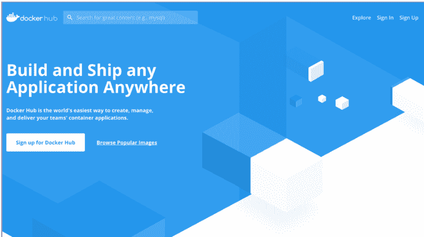

- 1. [https://hub.docker.com](https://hub.docker.com)
- 2. [https://hub.docker.com/billing-plans/](https://hub.docker.com/billing-plans/)
- 3. [https://docs.docker.com/registry/deploying/](https://docs.docker.com/registry/deploying/)

#### 明确地引用镜像

之前，[当我们在第 31 页命名我们的镜像时](https://example.com)，我们简单地将其称为 `railsapp`。同样，Compose 自动将我们的 web 服务镜像命名为 `myapp_web`。虽然这些名称在单个 Docker Machine 上工作得很好，但它们不适合在 Docker 注册中心上共享我们的镜像。

为什么？因为如果不同的人、团队或组织都想要一个名为 `railsapp` 或 `myapp_web` 的镜像怎么办？我们如何知道要引用哪个镜像？这是一个已解决的问题：通过引用镜像的*名称*和一个用户账户，我们可以消除歧义，明确我们指的是哪个镜像，并允许人们随意命名他们的镜像而不用担心名称冲突。

我们使用以下命名约定来明确地引用一个特定的镜像（更准确地说，是一个特定*版本*的镜像）：

```
`<注册中心主机名>[:端口]/<用户名>/<镜像名>[:<标签>]`
```

注册中心主机名是可选的；省略它表示你引用的是默认注册中心：Docker Hub。如果提供了注册中心主机名而没有明确的端口，则假定使用标准的 SSL 端口 443。⁴

正如我们稍后将看到的，需要一个账户才能在注册中心存储镜像，一个账户可以容纳任意数量的、名称不同的镜像。`<用户名>/<镜像名>` 组合指代给定用户账户中的特定镜像。实际上，直到可选标签之前的所有内容都称为*仓库名*：

```
`<注册中心主机名>[:端口]/<用户名>/<镜像名>`
```

一个仓库可以存储该镜像的多个带标签的版本；我们通过指定一个明确的标签，或者，[正如我们之前在第 31 页看到的](https://example.com)，让默认标签 `latest` 被使用，来引用该镜像的特定版本。

例如，因为我的 Docker Hub 用户名是 `robisenberg`，所以要在 Docker Hub 上共享名为 `myapp_web` 的镜像的最新版本，我将使用仓库名 `robisenberg/myapp_web`。

#### 示例中的仓库名称

> ⚠️ 在接下来的命令中，你需要将我的账户名 (`robisenberg`) 替换为你自己的账户名。

- 4. [https://docs.docker.com/registry/deploying/#run-an-externally-accessible-registry](https://docs.docker.com/registry/deploying/#run-an-externally-accessible-registry)

你可能想知道我们是如何能够下载像 `ruby:2.6`、`redis` 和 `postgres` 这样不完全限定的镜像名称的。问得好。Docker 通过将某些流行镜像称为 *Docker 官方镜像* 来提升它们的地位。这些镜像被放置在一个特殊的顶级命名空间中，使你可以简单地通过其镜像名来引用它们。然而，对于我们自己的镜像，我们将始终需要使用包含我们仓库名的完全限定镜像名称。

#### 将我们的镜像推送到注册中心

现在我们已经有了用户账户，并理解了完全限定镜像名称，我们准备通过将我们的镜像*推送到* Docker 注册中心来共享它。正如我们之前所说，我们将使用 Docker Hub，因为它是免费的（在特定限制内）、无需设置，并且是默认的。

现在，我们更关心共享我们镜像的生产版本（而不是开发版本），尽管共享开发镜像的方式完全相同。请记住，在本节中，在一个*真正的*项目中，我们不会自己从本地机器构建和推送镜像：这将作为 CI 流水线的一部分自动发生。然而，这并没有什么魔法，所以学习如何手动操作将为设置你的 CI 提供很好的基础。

首先，我们需要用我们想要推送到的正确仓库名来标记我们的镜像。正如我们之前在第 31 页所看到的，如果我们的镜像已经构建好了，我们可以使用以下命令为其添加标签：

```bash
$ docker tag <镜像引用> robisenberg/<镜像名>
```

其中 `<镜像引用>` 可以是镜像 ID 或我们已经给它的名称。然而，由于我们还没有构建我们的生产镜像，我们可以一步完成构建和标记。

现在就来执行：

```bash
$ docker build -f Dockerfile.prod -t robisenberg/myapp_web:prod .
«...»
Successfully built 6828234d25af
Successfully tagged robisenberg/myapp_web:prod
```

`-f` 选项允许我们指定一个不同的文件名作为 Dockerfile 来构建镜像：在本例中，是我们的生产镜像 (`Dockerfile.prod`)。正如我们之前所看到的，`-t` 选项用 `robisenberg/myapp_web:prod` 标记镜像；这表示 Docker Hub 上的仓库 `robisenberg/myapp_web` 和一个特定的标签 `prod`。

好的，现在我们已经有了一个用正确仓库名正确标记的镜像，下一步就是将我们的镜像*推送到*我们的 Docker Hub 仓库。然而，在我们能够这样做之前，我们必须首先从命令行登录我们的 Docker Hub 账户。运行以下命令，并在提示时输入你的（Docker Hub）用户名和密码：

```bash
$ docker login
Login with your Docker ID to push and pull images from Docker Hub. If you don't have a Docker ID, head over to https://hub.docker.com to create one.
Username: robisenberg
Password:
Login Succeeded
```

成功登录后，我们现在可以通过执行以下命令将镜像推送到我们的 Docker Hub 账户：

```bash
$ docker push robisenberg/myapp_web:prod
The push refers to repository [docker.io/robisenberg/myapp_web]
e596ed08a285: Pushed
ba1dbb2e536f: Pushed
68de2d8742b3: Pushed
58c9140d449b: Pushed
3261213dc16c: Pushed
7dc2478de08a: Pushed
5f96433196b2: Pushed
a102504f2bb1: Pushed
713891529def: Pushed
723beaa0cfe6: Layer already exists
c273f4e91860: Layer already exists
a334a91e3fd1: Layer already exists
1a36262221c3: Layer already exists
d2217ead3a1c: Layer already exists
b53b57a50746: Layer already exists
d2518892581f: Layer already exists
c581f4ede92d: Layer already exists
prod: digest: sha256:83148118939d4ae1b992e70ee08d0c155325e5c4dfed9f270dd8473ec3a56e0a size: 3897
```

让我们验证我们的镜像已被推送到 Docker Hub。访问 [hub.docker.com](https://hub.docker.com) 并登录你的账户。你应该能看到它像[第 153 页的图](#figure-on-page-153)中那样列在那里。

现在我们的镜像托管在 Docker Hub 上，我们可以在任何连接了互联网且安装了 Docker 的机器上运行这个镜像，就像我们的 ruby:2.6 hello 示例一样，我们的镜像会被自动下载。

在本章结束之前，请考虑最后一点。你可能不想将你的 Docker 镜像分享给全世界。就像你可以拥有私有 Git 仓库一样，Docker Hub 也允许你拥有私有镜像仓库。尽管，默认情况下，


### 创建机器

如果我们要在生产环境中部署应用，就需要有地方来部署它。也就是说，需要基础设施：能够运行代码的机器实例。

正如我们在第11章《生产环境全景》第129页所见，有许多工具可用于创建和配置我们的基础设施。不过，由于这是一本关于 Docker 的书，我们将坚持使用 Docker 自己的工具——Docker Machine 来处理这个问题。

Docker Machine 是一个命令行工具，可以为我们创建支持 Docker 的实例。它采用了适配器模式，提供了多种不同的*驱动*（driver），能够在不同平台上创建实例。这意味着我们可以使用类似的命令来创建实例，无论是在本地机器上运行的虚拟实例，还是基于云的基础设施。

在本章中，我们将使用 VirtualBox 来运行本地实例。如果你还没有安装 VirtualBox 并且想跟着操作，需要先安装它。VirtualBox 的文档非常全面。前往安装部分，按照你所使用平台的说明进行安装。完成后回到这里。

#### Windows 10：Hyper-V 还是 VirtualBox？

如果你是通过 Docker for Windows 安装的 Docker——它依赖emet 依赖于微软的 *Hyper-V*——你需要使用 Hyper-V 而不是 VirtualBox 来进行本地虚拟化。确保你按照 Docker 的示例正确设置了 Hyper-V，以便与 Docker Machine 协同工作。

与 VirtualBox 用户不同，你需要使用类似下面的命令来使用 Hyper-V 创建机器：

```
$ docker-machine create \
    --driver hyperv \
    --hyperv-virtual-switch "myswitch" \
    local-vm-1
```

都设置好了吗？很好。

现在你已经运行了 VirtualBox，我们可以创建一个新的虚拟机来运行我们的应用：

```
$ docker-machine create --driver virtualbox local-vm-1
Running pre-create checks...
Creating machine...
(local-vm-1) Copying /Users/rob/.docker/machine/cache/boot2docker.iso to /Users/rob/.docker/machine/machines/local-vm-1/boot2docker.iso...
(local-vm-1) Creating VirtualBox VM...
(local-vm-1) Creating SSH key...
(local-vm-1) Starting the VM...
(local-vm-1) Check network to re-create if needed...
(local-vm-1) Waiting for an IP...
Waiting for machine to be running, this may take a few minutes...
```

```
Detecting operating system of created instance…
Waiting for SSH to be available…
Detecting the provisioner…
Provisioning with boot2docker…
Copying certs to the local machine directory…
Copying certs to the remote machine…
Setting Docker configuration on the remote daemon…
Checking connection to Docker…
Docker is up and running!
To see how to connect your Docker Client to the Docker Engine running on
this virtual machine, run: docker-machine env local-vm-1
```

这个命令的意思是"创建一个名为 `local-vm-1` 的 VirtualBox 实例"。输出显示了它为配置实例所经过的各个步骤。你可以看到，例如，它使用了一个名为 boot2docker.iso 的镜像；boot2docker 是一个轻量级的 Linux 发行版，专为运行 Docker 而优化。

我们可以通过列出 docker-machine 所知道的实例来验证我们的实例是否已创建：

```
$ docker-machine ls
NAME        ACTIVE DRIVER      STATE   URL                      SWARM DOCKER  ERRORS
local-vm-1  -      virtualbox  Running  tcp://19…                       v18.09.1
```

我们能用这个新实例做什么？让我们来试一试。

首先，我们可以通过 SSH 登录到它：

```
$ docker-machine ssh local-vm-1
    ( '<')
   /) TC (\   Core is distributed with ABSOLUTELY NO WARRANTY.
  (/--\_–\)          www.tinycorelinux.net
docker@local-vm-1:~$
```

我们可以看到 Docker 已经安装好了：

```
docker@local-vm-1:~$ docker -v
Docker version 18.09.1, build 4c52b90

登录到机器后，我们可以直接在这里执行 Docker 命令，以在这个新主机上启动 Docker 服务。

或者，如果我们退出这个 SSH 会话并返回到本地机器：

```
docker@local-vm-1:~$ exit
```

我们可以通过在 SSH 命令末尾指定一个命令字符串来针对这个新实例执行命令：

```
$ docker-machine ssh <instance name> "<command>"
```

这通过 SSH 登录实例并运行命令。通常，这对于一次性命令来说更方便，避免了必须手动登录 SSH 和终止会话的麻烦。

我们现在来试试：

```
$ docker-machine ssh local-vm-1 "echo 'hello'"
hello
```

正如你所见，这在我们本地的 VirtualBox 实例上运行了命令并显示了输出。

#### 配置 Docker CLI

还有另一种方式来对我们的 docker-machine 管理的实例执行操作：我们可以配置（本地的）Docker 客户端来与我们新实例的 Docker 引擎通信。这是我们之前看到的 Docker 客户端-服务器架构的一个巨大优势。我们可以在本地使用相同的客户端 CLI 命令，让它在任何我们选择的远程机器上生效；我们只需配置 CLI 指向不同的机器。

通过环境变量来配置 Docker CLI 指向不同实例的 Docker 引擎。不过，我们不必手动管理它们；Docker Machine 提供了一个快捷方式。如果你回头看创建新实例时的输出，最后一行说：

> 要了解如何将你的 Docker 客户端连接到此虚拟机上运行的 Docker 引擎，请运行：docker-machine env local-vm-1

我们现在来运行：

```
$ docker-machine env local-vm-1
export DOCKER_TLS_VERIFY="1"
export DOCKER_HOST="tcp://192.168.99.100:2376"
export DOCKER_CERT_PATH="/Users/rob/.docker/machine/machines/local-vm-1"
export DOCKER_MACHINE_NAME="local-vm-1"
# Run this command to configure your shell:
# eval $(docker-machine env local-vm-1)
```

这个命令打印必须设置的环境变量，但实际上并不设置它们。要设置它们，我们可以按照输出中的指示运行：

```
$ eval $(docker-machine env local-vm-1)
```

我们当前的终端会话现在已配置好，我们的 Docker 命令将在新的虚拟实例上运行，而不是在我们正常的 Docker 安装上运行。

我们推送的镜像是公开的，有一个设置可以将其设为私有（我们也可以通过界面先创建一个私有仓库）。

事实上，共享镜像有很多选择，这取决于你的需求。Docker Hub 只是众多托管注册表之一。其他选项包括：

- Amazon Elastic Container Registry⁹
- Google Cloud Container Registry⁶
- Microsoft Azure Container Registry⁷
- Quay⁸

出于安全（或其他）原因，一些组织可能需要托管自己的内部 Docker 注册表。Docker Registry 是一个开源项目⁹，你可以在自己的基础设施上运行它。¹⁰ 另一个不错的选择是 Harbor，¹¹ 这是一个由 CNCF¹² 维护的功能更全面的 Docker 注册表。

---

⁵ https://aws.amazon.com/ecr/
⁶ https://cloud.google.com/container-registry/
⁷ https://azure.microsoft.com/en-gb/services/container-registry/
⁸ https://quay.io
⁹ https://github.com/docker/distribution
¹⁰ https://docs.docker.com/registry/deploying/
¹¹ https://goharbor.io/
¹² https://www.cncf.io

### 快速回顾

啊，好多了；我们可以脱下围裙了。我们的准备工作——*或称为 mise en place*——已经完成。

让我们回顾一下本章涵盖的内容：

1. 我们配置了应用以在生产环境中运行，设置了必要的环境变量。
2. 我们创建了一个增强的生产镜像，预先编译了我们的资源。
3. 我们讨论了需要让我们的镜像在不同机器上可用，你了解了 Docker 注册表如何促进这一点。
4. 我们看到了需要明确引用特定版本镜像的命名约定：
   `[<registry 主机名>[:<端口>]/<用户名>/<镜像名称>[:<标签>]`
5. 你创建了 Docker Hub 账户（如果你还没有的话）。
6. 我们构建了生产镜像并将其推送到公共 Docker 注册表（Docker Hub），使其可在我们的生产机器上下载。

有了我们的生产配置到位，镜像推送到 Docker Hub，我们就准备好了开始将应用部署到类生产环境。

## 第13章：类生产演练场

我们就快完成了。在上一章中，我们配置了应用程序，使其准备好运行在生产环境中，并将镜像推送到 Docker Hub。不过，在我们开始设置基于云的基础设施并在那里部署之前，我们要先站稳脚跟，可以这么说，通过在本地进行一次练习。

在本章中，我们将利用虚拟化技术——特别是 VirtualBox——在我们的本地机器上创建虚拟基础设施，以模拟生产环境。我们将创建一个单节点集群，能够运行 Docker 容器。我们不仅会部署我们的应用程序，还会看到如何扩展应用并在这个单实例上运行多个副本。

在此过程中，我们将了解 Docker 提供的用于创建基础设施、部署和管理生产应用的其他工具。尽管我们在本地工作，但这些技能可以直接转化为在云基础设施上做同样的事情。


为了验证这一点，我们可以重新运行：

```
$ docker-machine ls
NAME           ACTIVE DRIVER       STATE     URL                      SWARM            DOCKER    ERRORS
local-vm-1     *     virtualbox   Running   tcp://19...                                v18.09.1
```

你可以看到，我们的新实例在“Active”列中有一个星号。如果我们使用的是本地 Docker Engine，这里则会是空的。

这在实践中意味着什么？我们所有标准的 Docker 命令现在都将应用于并运行在我们的新 VirtualBox 实例上。例如，如果我们列出镜像，输出的将不再是我们已知在本地 Docker 安装中的各种镜像，而是一个空列表：

```
$ docker images
REPOSITORY    TAG      IMAGE ID    CREATED    SIZE
```

这是因为在我们的新实例上，还没有构建或拉取任何镜像。

这就引出了一个重要问题：我们如何在新实例上获取镜像？你可能已经知道了，但让我们通过重新运行本书中第一个 Docker 命令来回答这个问题，不过这一次，我们将目标指向我们的新实例：

```
$ docker run ruby:2.6 ruby -e "puts :hello"
Unable to find image 'ruby:2.6' locally
2.6: Pulling from library/ruby
cd8eda9c7bb: Pull complete
c2677faec825: Pull complete
fcce419a96b1: Pull complete
045b51e26e75: Pull complete
3b969ad6f147: Pull complete
f2db762ad32e: Pull complete
708e57760f1b: Pull complete
06478b05a41b: Pull complete
Digest: sha256:ad724f6982b4a7c2d2a8a4ecb67267a1961a518029244ed943e2d448d6fb7994
Status: Downloaded newer image for ruby:2.6
hello
```

运行此命令会导致 Docker 在我们的新实例上拉取 `ruby:2.6` 镜像，因此现在当我们再次列出镜像时，可以看到它就在那里：

```
$ docker images
REPOSITORY    TAG    IMAGE ID       CREATED      SIZE
ruby          2.6    f28a9e1d0449   6 days ago   868MB
```

在将 Docker CLI 配置为指向新实例后，我们可以在本地运行 Docker 命令，并让它们无缝地在远程实例上生效。远程实例上不可用的镜像将根据需要下载，就像在本地一样。

### Docker Swarm 简介

请记住，我们将这个虚拟实例视为我们应用程序的生产实例。我们的目标是在此实例上启动应用程序，以便它可以用于处理真实的请求。

有多种方法可以实现这一点。例如，你 *可以* 使用底层的 Docker 命令来启动应用程序的各种容器。但是，既然我们已经通过 `docker-compose.yml` 文件为应用程序创建了一个很好的抽象，那样做似乎没什么吸引力。如果你在想我们可以直接使用 Compose 来管理新实例上的应用，那么你的想法已经接近我们的目标了。

然而事实是，Compose 作为一个工具，其设计初衷是为了在 *开发阶段* 提供帮助。一旦进入生产环境，我们将面临一组完全不同的关注点，这些关注点在开发时其实并不影响我们，例如：

- 如何提高应用程序对故障的容错能力？
- 如何扩展应用程序以处理波动的负载？
- 如何在不给用户带来（或极少带来）停机时间的情况下部署新版本？

相反，[正如我们之前在第 132 页看到的](#)，Docker 提供了一个容器 *编排器* Swarm，用于管理生产环境中的应用。

使用 Swarm（该工具），你可以创建由一个或多个连接实例组成的集群——*swarms*；它们作为一个单一的、具备容错能力的单元，在其中运行容器化服务。Swarm 是声明式的：我们告诉它我们希望应用程序处于某种状态，然后它会通过各种手段来实现这一目标。正如你所希望的，它利用了我们用来定义应用程序的 `docker-compose.yml` 格式。

### 我们的第一个（单节点）Swarm

现在是深入研究 Swarm 并开始动手实践的时候了。

之前，我们创建了一个纯粹的 Docker 实例：`local-vm-1`。要将我们的实例转变为 swarm，我们必须显式地对其进行初始化。在 CLI 目标指向新实例的情况下，我们可以通过运行以下命令来实现：

```
$ docker swarm init --advertise-addr <IP address of instance>
```

其中 `<IP address of instance>` 在我们的例子中是 `local-vm-1` 的公共 IP 地址。我们可以通过重新运行以下命令轻松找到它：

```
$ docker-machine ls
NAME       ---   ---   ---   URL
local-vm-1 *   ---   ---   tcp://192.168.99.100:2376   ---   ---   ---
```

实例的 IP 地址列在“URL”列中。对我来说，IP 地址是 192.168.99.100，但你的可能会有所不同。

现在让我们运行这个命令（替换为正确的 IP）：

```
$ docker swarm init --advertise-addr 192.168.99.100
Swarm initialized: current node (kun8Bndruiehxydse3dxevdq4a) is now a manager
```

要向此 swarm 添加 worker，请运行以下命令：

```
docker swarm join --token SWMTKvn-1-64vcnpwr3s6pmo cr3ha8fy3m73pbi71hz7ccq89
owty12uvlr d80-a0g24egq899rbidxnwx7q3f4 192.168.99.100:2377
```

要向此 swarm 添加 manager，请运行 `docker swarm join-token manager` 并按照说明操作。

目前，我们将维持一个单节点的 Swarm 集群。不过，你会注意到输出的指令中提到了如何将更多实例连接到 swarm——我们稍后再回来讨论这个。

好了，单节点 swarm 已就绪。我们如何将应用程序部署到其中？

### 向 Swarm 描述我们的应用

你可能已经非常习惯地将我们的应用描述为 Compose 文件中定义的一组服务。然而，`docker-compose.yml` 文件是 *面向开发* 的；它让我们能够轻松地重新构建镜像，而不会陷入部署配置等不必要的细节中。但是，现在当我们进入部署阶段时，我们需要一个 *面向部署* 的东西。

Swarm 引入了 *stack*（堆栈）的概念，指由一组 *可部署* 的服务组成的应用程序。我们使用 Compose 文件的面向部署变体（称为 *stack 文件*）向 Swarm 描述我们的 stack。虽然你有时仍会听到它被地称为 Compose 文件，但我们将坚持使用后者，因为它可以将其与普通的 Compose 文件明确区分开来。

准备好创建你的第一个 stack 文件了吗？将我们的 `docker-compose.yml` 文件复制一份，命名为 `docker-stack.yml`，然后将其修改为如下所示：

```yaml
version: '3'

services:
  web:
    image: robisenberg/myapp_web:prod
    ports:
      - "80:3000"
    env_file:
      - .env/production/database
      - .env/production/web

  redis:
    image: redis

  database:
    image: postgres
    env_file:
      - .env/production/database
    volumes:
      - db_data:/var/lib/postgresql/data

volumes:
  db_data:
```

你会注意到一些变化。首先，我们完全移除了 `webpack_dev_server` 和 `selenium_chrome` 服务：这些仅在开发和测试时需要。

其余的变化与 `web` 服务相关。我们移除了 `web` 服务的 `build` 属性，因为从 Dockerfile 构建镜像仅在 Compose 中有效；在 Swarm 中，我们必须指定一个预先存在的镜像来使用。在这里，我们指定了推送到 Docker Hub 的生产镜像的全限定名：`robisenberg/myapp_web:prod`（第 5 行）；特别是，我们指定了标签为 `prod` 的镜像版本。

我们还移除了 `web` 服务的 `volumes` 属性，之前我们用它将本地 Rails 文件夹挂载到容器中（以便实时代码重载）并挂载 gem 缓存（以加快 gem 更改速度）。由于我们不在生产环境中进行开发或修改代码，这两者都不是必要的。

我们将 `env_files` 修改为指向我们的生产配置（第 9-10 行）。

最后，我们更改了 `web` 服务的映射端口，使其在默认的 HTTP 端口 80 上暴露 Rails 服务器（第 7 行）。

我们还可以使用很多其他选项和功能（参见 https://docs.docker.com/compose/compose-file/#deploy），但这个基本的 `docker-stack.yml` 文件是一个很好的起点。不过，在我们使用它部署应用之前，我们需要对其进行一些修改以设置数据库。

### 迁移数据库

我们在第 78 页看到，如果默认数据库不存在，Postgres 镜像会自动创建它。然而，目前没有机制能确保迁移（migrations）已被运行；在开发环境中，我们只是手动执行此操作。我们需要确保应用程序启动时拥有一个已完成迁移的数据库。

你 *可能会* 想到的一种实现方法是使用我们在第 121 页为了解决服务器 PID 问题而引入的 entrypoint 概念。我们已经有一个 `docker-entrypoint.sh` 文件在启动应用之前运行；这可能会引导你尝试如下方式迁移数据库：

```bash
#!/bin/sh

set -e

if [ -f tmp/pids/server.pid ]; then
  rm tmp/pids/server.pid
fi

# 糟糕的主意...
bin/rails db:migrate

exec "$@"
```

虽然这种方法看起来 *应该* 有效，但遗憾的是它无法很好地扩展。如果你同时启动三个应用的副本，每个副本都会尝试迁移数据库，这可能会导致锁定问题，从而阻止应用启动。另一个缺点是你无法 *独立* 迁移数据库；它与应用启动绑定在一起。

更好的解决方案是创建一个单独的 *服务*，其唯一职责就是迁移数据库。与我们的其他长周期服务不同，这将是一个 *一次性容器*（参见 https://blog.alexellis.io/containers-on-swarm/）——它将执行一个预期会终止的单一命令（我们很快会看到如何声明这一点）。这种方法的妙处在于，它给了我们精细的控制力，只需重新启动 `db-migrator` 服务，即可在任何时间点迁移我们的生产数据库。不过，这也带来了一个挑战。


让我们来思考一下时机问题。与我们的 redis 和 database 服务不同，它们没有依赖项，而我们的 web 服务依赖于 database 服务可用才能成功启动（它也依赖 redis，但由于我们只在控制器中连接，这不会在启动时导致错误）。然而，服务启动的*顺序*是不确定的；它受到镜像大小、下载速度、负载以及容器命令执行初始化所需时间的影响。如果我们的 web 服务在 database 服务准备好接受连接之前启动，会发生什么？

我们很大程度上被保护得不必在意这种缺乏确定性的情况，因为——多亏了 Swarm 的默认行为——我们的 web 服务如果因任何原因启动失败，包括无法连接到数据库，都会自动重启。然而，使用一次性容器会改变情况。如果我们计划中的 database-migrator 服务在 Postgres 准备好接受连接之前启动，它将以`PG::ConnectionBad`错误失败并终止。我们的一次性容器将错过它唯一的机会，导致我们的数据库未被迁移。这不是一个好看的场面。

通常，我们应该设计我们的应用程序，使其能够适应服务的来来回回，以及在预期不可用时保持弹性。⁷ 在这里，一个好的解决方案是将`rails db:migrate`命令包装在一个脚本中，该脚本等待直到数据库不仅是启动状态，而且准备好处理连接。你可以将其视为一个*就绪健康检查*。我们将使用一个名为`wait-for`⁸的 shell 脚本来为我们执行这个检查。

在你的 Rails 根目录中下载`wait-for`脚本。

我们需要将这个文件包含在我们的`myapp_web:prod`镜像中，所以我们很快就会重新构建镜像。然而，`wait-for`脚本依赖于`netcat` Unix 工具⁹可用，以确定数据库是否在其指定端口上接受连接，所以我们还需要安装它。

修改你的`Dockerfile.prod`文件，将`netcat`添加到`apt-get install`命令中：

```
RUN apt-get update -yqq && apt-get install -yqq --no-install-recommends \
  netcat \ # needed for `wait-for` TCP connection checking
  nodejs \
  yarn
```

我们还需要在镜像中使`wait-for`脚本可执行。在 Linux 或 macOS 上，你可以通过在本地运行`chmod +x wait-for`来实现；当文件添加到镜像中时，它将保留其执行权限。然而，这在 Windows 上不起作用，因为文件权限的处理方式不同。相反，我们可以在我们的`Dockerfile.prod`文件本身中设置此文件的权限（无论你使用哪个平台，显式地这样做都不是坏事）：

```
COPY . /usr/src/app/
```

```
RUN ["chmod", "+x", "/usr/src/app/wait-for"]
```

好的，是时候重新构建我们的镜像了。不过要记住tails.remember，我们的 Docker Engine 目前 targeting `local-vm-1`。由于这个 VM 正在模拟我们的生产环境，在这里重新构建我们的镜像没有意义：我们通常在本构建镜像或作为我们 CI 管道的一部分。所以让我们快速切换回 targeting 我们的本地 Docker Engine：

```
eval $(docker-machine env -u)
```

现在让我们用这些更改重新构建我们的镜像并将其推送到 DockerHub：

```
docker build -f Dockerfile.prod -t robinsberg/myapp_web:prod .
docker push robinsberg/myapp_web:prod
```

现在我们准备在`docker-stack.yml`文件中定义我们的一次性`db-migrator`服务：

```
db-migrator:
  image: robinsberg/myapp_web:prod
  command: ["/wait-for", "--timeout=300", "database:5432", "--", "bin/rails", "db:migrate"]
  env_file:
    - .env/production/database
    - .env/production/web
  deploy:
    restart_policy:
      condition: none
```

该命令（第3-4行）表示："等待（最多5分钟（300秒））直到名为 database 的主机在端口5432上接受连接，一旦可用，就运行命令`bin/rails db:migrate`。" 这意味着即使数据库需要相当长的时间才能使用，我们的数据库迁移也会成功完成。

`restart_policy`（第9行）防止 Swarm 在其终止后尝试重新启动它；这个设置赋予了服务其一次性的特性。

搞定了。现在我们的应用程序可以在数据库完全迁移的情况下部署了。

### 在 Swarm 上部署我们的应用程序

有了我们新创建的`docker-stack.yml`，我们有了 Swarm 可以使用的应用程序描述。我们准备将我们的应用程序部署到我们的（单节点）swarm 上。

首先，我们必须记得重新定位到我们的 swarm：

```
$ eval $(docker-machine env local-vm-1)
```

现在我们可以用以下命令部署我们的应用程序：

```
$ docker stack deploy -c docker-stack.yml myapp
Creating network myapp_default
Creating service myapp_web
Creating service myapp_redis
Creating service myapp_database
Creating service myapp_db-migrator
```

这表示："将`docker-stack.yml`中描述的服务部署为名为`myapp`的堆栈。" 你可以看到各种服务正在被创建。

我们可以通过运行以下命令列出我们堆栈中的服务：

```
$ docker stack services myapp
ID  NAME               MODE  REP…  IMAGE                    PORTS
p9… myapp_db-migrator  rep…  0/1   robinsberg/myapp_w…
s5… myapp_web          rep…  1/1   robinsberg/myapp_w…  *:80->3000/tcp
ue… myapp_database     rep…  1/1   postgres:latest
ws… myapp_redis        rep…  1/1   redis:latest
```

部署在 Swarm 上的服务可以通过为服务创建额外的*副本*容器来扩展。"replicas"列显示正在运行的副本数与期望的副本数（默认情况下为1）。

当你运行此命令时，你可能会发现我们的一个或多个服务尚未启动，在"replicas"列中显示为"0/1"。可能需要一段时间直到所有服务都启动，尤其是在第一次部署时，因为每个服务的镜像都需要从头开始下载。请等待直到除`db-migrator`之外的所有服务都已启动，通过重新运行命令并等待直到"replicas"列显示"1/1"（`db-migrator`运行后终止）。

作为快捷方式，你也可以运行类似的命令：

```
$ docker service ls
ID  NAME               MODE  REP…  IMAGE                    PORTS
ue… myapp_database     rep…  1/1   postgres:latest
p9… myapp_db-migrator  rep…  0/1   robinsberg/myapp_w…
ws… myapp_redis        rep…  1/1   redis:latest
s5… myapp_web          rep…  1/1   robinsberg/myapp_w…  *:80->3000/tcp
```

这列出了已部署到 swarm 的所有服务。如果 swarm 上部署了多个堆栈，你会在这里看到所有堆栈的服务。然而，由于我们只部署了一个堆栈，输出与`docker stack services myapp`相同，后者列出了*特定*堆栈的服务。

好的，既然服务正在运行，我们应该能够在浏览器中加载我们的应用程序了。在你的本地机器上，访问`http://<实例 IP 地址>/welcome`，我的地址是`http://192.168.99.100/welcome`（如果你忘记了实例的 IP 地址，可以通过运行`docker machine ip`获取）。你应该会看到我们的点击计数器正确计数并在每次页面加载时递增。这表明 Redis 正在运行，我们的应用程序已成功连接到它。

同样，访问`http://<实例 IP 地址>/users`（对我来说，是`http://192.168.99.100/users`），你会看到我们的 User 脚手架，表明我们的数据库正在运行，我们的应用程序已成功连接到它。

我们现在已成功将我们的应用程序部署到单独的 VirtualBox 实例，该实例构成了我们的单节点 swarm 集群。

### 任务和 Swarm 的扩展模型

在 Swarm 上运行的服务是自我调节的。也就是说，我们为服务定义一个*期望状态*，即应该为它运行多少个容器，而 Swarm 采取行动以确保实现和维护此状态。

正是这种自我调节是实现扩展的关键，也是 Swarm 自我修复特性的关键，我们将在下一章中看到。

Swarm 由不同的部分组成。我们可以将一部分视为*协调器*。在告诉 Swarm 部署服务后，协调器负责确定服务是否处于期望状态，如果不是，则采取行动纠正这一点。

如果协调器看到需要额外的容器，它会创建一个*任务*，这代表希望一个容器存在的愿望。然后它查看集群中有哪些节点可用，并将任务分配给节点。

在我们的单节点集群中，协调器别无选择，只能将所有任务分配到我们的唯一节点上。然而，你可以想象，在多节点设置中，任务可以均匀地分配到集群中的多个实例上。

集群中的节点与协调器检查以了解它们被分配了什么任务。然后它们负责为每个任务创建一个容器，从而实现系统的期望状态。

一个例子应该能让这一点更清楚。当我们部署 web 服务时，我们没有指定需要的副本容器数量，因此默认的1被假定。协调器看到我们希望有一个 web 服务容器在运行，但最初一个都没有。它为 web 服务创建一个任务

将任务分配给节点。节点发现自身被分配了一个Web服务任务后，就会启动Web容器，从而满足我们期望的状态。

我们可以通过以下命令列出某个栈中的所有任务：

```
$ docker stack ps myapp
ID NAME IMAGE DESIRED... CURRENT... 
qo... myapp_db-migrator... robise... Shutdown Complet... 
ic... myapp_database.1 postgr... Running Running... 
8a... myapp_redis.1 redis... Running Running... 
iw... myapp_web.1 robise... Running Running...
```

该列表还显示了任务的当前状态，可能是“运行中”，也可能是启动过程中的状态（如“挂起”或“准备中”），或是其他可能的状态。[10]

我们也可以列出某个特定服务的任务。例如，要查看为`myapp_web`服务运行的任务，我们可以执行：

```
$ docker service ps myapp_web
```

### 扩展服务

目前，我们的每个服务都由单个任务（因此也是单个容器）支撑。我们可以指示Swarm增加或减少支撑服务的容器数量——这被称为服务扩展。

根据之前的讨论，Swarm如何实现扩展应该很清楚了。假设Swarm收到一个新的Web服务定义，其中指定需要三个容器。编排器发现目前只调度了一个任务，因此需要再创建两个容器。它随即创建两个新任务，并将它们调度到集群中可用的节点上。节点（或多个节点）分配这些任务，然后为每个分配到的任务启动一个容器。瞧，我们已将服务扩展到了三个容器。

好了，理论讲得够多了，让我们看看实际操作。

### 更新我们的应用

如果我们现在扩展应用，可能很难看出区别。我们怎么知道请求是由不同容器处理的呢？首先让我们对应用做一些修改，使情况更明显。

将`app/controllers/welcome_controller.rb`编辑成如下内容：

```ruby
class WelcomeController < ApplicationController
  def index
    redis = Redis.new(host: "redis", port: 6379)
    redis.incr "page hits"

    @page_hits = redis.get "page hits"
    @hostname = Socket.gethostname
  end
end
```

现在让我们在视图（`app/views/welcome/index.html.erb`）中输出主机名：

```erb
<% content_for :head do %>
  <script type="text/javascript">
    document.addEventListener("DOMContentLoaded",function(){
      document.getElementsByTagName('h1')[0].append(' ENHANCED!');
    });
  </script>
<% end %>

<h1>This page has been viewed <%= pluralize(@page_hits, 'time') %>!</h1>
<p>Request handled by host: <b><%= @hostname %></b></p>
```

我们修改了代码，因此需要重新构建镜像。但是，请记住，我们当前的Docker CLI配置为指向VirtualBox实例。实际上，我们应该切换回本地的Docker安装来构建镜像，而不是使用swarm实例。通常，你不需要记住这一点，因为镜像可以作为持续集成/持续交付（CI/CD）流水线的一部分来构建。

让我们将Docker CLI切换回以本地Docker安装为目标。我们通过运行以下命令来实现：

```
$ eval $(docker-machine env -u)
```

这将取消设置我们之前设置的环境变量，正是这些变量使我们的Docker CLI指向了由Docker Machine创建的VirtualBox实例。

现在我们可以重新构建镜像了：

```
$ docker build -f Dockerfile.prod -t robisenberg/myapp_web:prod .
<<,...>>
Successfully built dd61876489b2
Successfully tagged robisenberg/myapp_web:prod
```

如前所述，下一步是将更新后的镜像推送到Docker Registry——在我们的例子中是Docker Hub：

```
$ docker push robisenberg/myapp_web:prod
```

现在让我们切换回以VirtualBox swarm实例为目标：

```
$ eval $(docker-machine env local-vm-1)
```

现在我们可以更新Web服务了。最简单的方法是重新部署整个栈。Swarm会检查Docker Registry中指定镜像的最新版本，并更新服务以使用这些版本：

```
$ docker stack deploy -c docker-stack.yml myapp
Updating service myapp_database (id: uebqig2as2r5purj7jj578brq)
Updating service myapp_db-migrator (id: p9qxhekimvz7x9glgd8pt7x5c)
Updating service myapp_web (id: s5e5ka2xss1p4yrm2rjrz9ci8)
Updating service myapp_redis (id: ws7b498dfpxeninbgeo19lqq)
```

你也可以使用以下命令更新服务的镜像：

```
$ docker service update --image robisenberg/myapp_web:prod myapp_web
myapp_web
overall progress: 1 out of 1 tasks
1/1: running   [==================================================>]
verify: Service converged
```

现在访问页面 http://\<实例IP地址\>/welcome（对我而言是 192.168.99.100/welcome）。你现在应该能看到运行Web服务的容器的主机名。对我来说是 c1ca8a915a90，但你的会不同。

多次刷新页面：你会发现主机名始终相同（因为我们只有一个生产任务在运行它）。

### 扩展应用

好的，我们即将扩展应用。让我们回顾一下服务列表显示的内容：

```
$ docker service ls
ID            NAME                MODE        REPLICAS  IMAGE                          PORTS
ue...         myapp_database      replicated  1/1       postgres:latest
p9...         myapp_db-migrator   replicated  1/1       robisenberg/myapp_w...
ws...         myapp_redis         replicated  1/1       redis:latest
s5...         myapp_web           replicated  1/1       robisenberg/myapp_w...  *:80->3000/tcp
```

`myapp_web`服务只有一个容器（副本 1/1）。

现在让我们扩展服务：

```
$ docker service scale myapp_web=3
myapp_web scaled to 3
overall progress: 3 out of 3 tasks
1/3: running   [==================================================>]
2/3: running   [==================================================>]
3/3: running   [==================================================>]
verify: Service converged
```

如果我们再次检查，会看到Web服务有三个副本在运行：

```
$ docker service ls
ID NAME MODE REP... IMAGE PORTS
ue... myapp_database rep... 1/1 postgres:latest
p9... myapp_db-migrator rep... 0/1 robinsenberg/myapp_w...
ws... myapp_redis rep... 1/1 redis:latest
s5... myapp_web rep... 3/3 robinsenberg/myapp_w... *:80->3000/tcp
```

因此，我们现在有三个容器，每个容器都运行着我们Rails应用的一个副本。Swarm在服务的副本之间进行负载均衡，将服务请求分发给支撑该服务的容器。然而，负载均衡是非确定性的，Swarm可以将请求发送给它认为合适的任何容器。

现在进行真正的测试：让我们看看负载均衡的实际效果。刷新页面 `http://<实例IP地址>/welcome`。当你多次刷新页面时，应该能看到主机名在变化，表明不同的容器正在处理请求。

你可能发现在浏览器中刷新时主机名没有变化；这可能是由于浏览器在多个请求之间复用了TCP连接。你可以尝试按住刷新快捷键（`Ctrl-R` 或 `Cmd-R`）——这将快速多次重新加载页面，使你能够看到主机名的变化。

或者，使用 `curl` 获取页面，在多次请求中你会看到主机名发生变化：

```
$ curl -4 http://localhost:3000/welcome
```

注意：这里的 `-4` 是告诉 `curl` 使用 IPv4。

Swarm通过设置期望的容器数量，赋予你自由扩展Web应用的能力：

```
$ docker service scale myapp_web=<n>
```

### 快速回顾

这是又一个内容丰富的章节。你现在掌握了使用Docker部署应用的主要工具。

让我们回顾一下本章内容：

- 1. 我们介绍了Docker Machine，并用它创建了一个支持Docker的虚拟化实例：
  `$ docker-machine create --driver virtualbox local-vm-1`
- 2. 我们通过SSH登录到新实例：

***

> 10. https://docs.docker.com/engine/swarm/how-swarm-mode-works/swarm-task-states/


### 部署到云端

云端：我们的最终前沿。我们已经了解了如何部署到本地 Swarm 集群（尽管只有一个节点）。在本章中，我们将更进一步，创建在云端运行的基础设施。我们将首先在 DigitalOcean 上创建集群，然后看看这与在 Amazon Web Services (AWS) 上创建集群有多么相似。

到本章结束时，我们的应用程序将部署并运行在 DigitalOcean 和 AWS 中。虽然我们的云部署不是生产级别的，但你将获得一些宝贵的经验，并开始感受到实际应用中一些关键的考量因素。

请注意，由于本章中使用的云服务并非免费，运行应用程序会产生一些（少量的）费用。不过，假设你勤勉地在完成后清理或停止资源，这些费用将微不足道——仅为几分钱。

#### 创建 DigitalOcean 集群

在将应用部署到云端之前，我们需要云端实例来承载它。我们将从在 DigitalOcean 上创建 Docker swarm 开始。价格¹ 非常低廉：最小的标准 *Droplet*（他们对实例的称呼）每小时 0.007 美元。实际来说，一个运行 48 小时的三节点集群仅需 1 美元。

为了跟进操作，你需要一个自己的 DigitalOcean 账号。访问 DigitalOcean 主页并填写注册表单。² 由于使用其云资源需要付费，你需要输入信用卡详细信息。

创建账号后，你需要生成一个 API 令牌，以便能够从命令行设置基础设施。登录并导航到 API tokens 页面，点击“Generate New Token”按钮。³ 给你的令牌起个名字（例如 `docker-for-rails-developers`），授予读/写权限，然后复制生成的令牌。我建议你在终端中将其设置为环境变量 `DIGITAL_OCEAN_TOKEN`，以便在以下命令中使用。在 Linux 或 Mac 上，你可以通过这一行命令实现：

```
export DIGITAL_OCEAN_TOKEN=<your token>
```

将此行放入你的 `.bash_rc` 文件或等效文件中，记得立即执行 `source` 该文件，使其在当前的终端会话中生效。Windows PowerShell 也有类似的方法。⁴

账号设置完成后，让我们创建第一个云实例。我们将像前一章那样使用 `docker-machine create` 命令，但指定 `digitalocean` 驱动而不是 `virtualbox`：

```
$ docker-machine create \
  --driver digitalocean \
  --digitalocean-access-token $DIGITAL_OCEAN_TOKEN \
  --digitalocean-region lon1 \
  do-manager-1
Running pre-create checks...
Creating machine...
(do-manager-1) Creating SSH key...
(do-manager-1) Creating Digital Ocean droplet...
(do-manager-1) Waiting for IP address to be assigned to the Droplet...
Waiting for machine to be running, this may take a few minutes...
Detecting operating system of created instance...
Waiting for SSH to be available...
Detecting the provisioner...
Provisioning with ubuntu(systemd)...
Installing Docker...
Copying certs to the local machine directory...
Copying certs to the remote machine...
Setting Docker configuration on the remote daemon...
Checking connection to Docker...
Docker is up and running!
To see how to connect your Docker Client to the Docker Engine running on
this virtual machine, run: docker-machine env do-manager-1
```

每个驱动都有自己的一套自定义配置选项。⁵ 我们需要使用 `--digitalocean-access-token`，以便 `docker-machine` 有权访问并在我们的账号中创建实例。我还选择了一个伦敦区域 (`--digitalocean-region lon1`) 以靠近我所在地——你可以从 DigitalOcean 提供的区域列表中选择一个离你较近的区域。⁶

我们将新实例命名为 `do-manager-1`，因为我们将用它作为 Swarm 集群的管理器。如果运行以下命令，你可以看到它已被列出：

```
$ docker-machine ls
NAME            ACTIVE  DRIVER         STATE     URL                    SWARM            DOCKER   ERRORS
do-manage...    -       digitaloc...   Running   tcp://46...                              v18.09.1
local-vm-1      *       virtualbox     Running   tcp://19...                              v18.09.1
```

就像之前的本地 VirtualBox 实例一样，我们可以通过运行 `docker-machine ssh <instance name>` 来 SSH 登录到该实例：

```
$ docker-machine ssh do-manager-1
Welcome to Ubuntu 16.04.5 LTS (GNU/Linux 4.4.0-141-generic x86_64)

 * Documentation:  https://help.ubuntu.com
 * Management:     https://landscape.canonical.com
 * Support:        https://ubuntu.com/advantage

  Get cloud support with Ubuntu Advantage Cloud Guest:
    http://www.ubuntu.com/business/services/cloud

18 packages can be updated.
15 updates are security updates.
```

在登录状态下，让我们将该实例初始化为 Swarm 管理器。为此，我们需要知道实例的内部 IP 地址，可以通过运行以下命令找到：

```
# ifconfig eth0
eth0      Link encap:Ethernet  HWaddr 3a:87:d5:2e:22:9a
          inet addr:46.101.90.10  Bcast:46.101.95.255  Mask:255.255.240.0
          inet6 addr: fe80::3887:d5ff:fe2e:229a/64 Scope:Link
          UP BROADCAST RUNNING MULTICAST  MTU:1500  Metric:1
          RX packets:5519 errors:0 dropped:0 overruns:0 frame:0
          TX packets:3666 errors:0 dropped:0 overruns:0 carrier:0
          collisions:0 txqueuelen:1000
          RX bytes:77351515 (77.3 MB)  TX bytes:359679 (359.6 KB)
```

IP 地址列在第二行的 `inet addr` 值处，对我来说是 `46.101.90.10`，但对你来说会有所不同。现在我们可以将该实例初始化为 Swarm 管理器：

```
root@do-manager-1:~# docker swarm init --advertise-addr 46.101.90.10
```

Swarm initialized: current node (e2gaylk0nnr1geabo40cn3uf9) is now a manager

要向此 Swarm 添加工作节点（worker），请运行以下命令：

```
docker swarm join --token SWMTTKN-1-0axyrlp8w6yu6l48t4epmiq1m4ubf9q2y2o2f
dmnqlu7n2vnyj08-aoqoyn5s82bpas82emb3sae27 46.101.90.10:2377
```

要向此 Swarm 添加管理器，请运行 `docker swarm join-token manager` 并按照指示操作。

现在我们已经设置好了 Swarm 管理器实例，可以退出该机器了：

```
root@do-manager-1:~# exit
logout
```

为了在生产环境中实现冗余和弹性，你通常会在具有多个实例的集群上运行容器。这样，如果单个节点宕机，丢失的容器可以在其余实例上重新启动。我们将创建一个三节点集群。为此，让我们按如下方式创建两个 `worker` 实例：

```
$ docker-machine create \ 
  --driver digitalocean \ 
  --digitalocean-access-token $DIGITAL_OCEAN_TOKEN \ 
  --digitalocean-region lon1 \ 
  do-worker-1
Running pre-create checks...
Creating machine...
«...»
Docker is up and running!
To see how to connect your Docker Client to the Docker Engine running on this virtual machine, run: docker-machine env do-worker-1
```

```
$ docker-machine create \ 
  --driver digitalocean \ 
  --digitalocean-access-token $DIGITAL_OCEAN_TOKEN \ 
  --digitalocean-region lon1 \ 
  do-worker-2
Running pre-create checks...
Creating machine...
«...»
Docker is up and running!
To see how to connect your Docker Client to the Docker Engine running on this virtual machine, run: docker-machine env do-worker-2
```

我们现在在 DigitalOcean 账号中创建了更多机器，可以通过运行以下命令验证：

```
$ docker-machine ssh local-vm-1
```

并在本地 shell 会话中对其发出命令：

```
$ docker-machine ssh <instance name> "<command>"
```

3. 我们学习了如何配置 Docker 客户端以目标指向虚拟实例上的 Docker Engine：

```
$ eval $(docker-machine env local-vm-1)
```

以及如何再次重置它：

```
$ eval $(docker-machine env -u)
```

4. 我们将原生的 Docker 实例变成了单节点 Swarm 集群：

```
$ docker swarm init --advertise-addr <IP address of instance>
```

5. 在创建了名为 `docker-stack.yml` 的生产版本 `docker-compose.yml` 后，我们使用以下命令将应用程序作为 stack 部署到 Swarm 上：

```
$ docker stack deploy -c docker-stack.yml myapp
```

6. 我们学习了如何列出 stack 中的服务：

```
$ docker stack services myapp
```

或者列出 Swarm 上的所有服务：

```
$ docker service ls
```

7. 我们学习了如何部署应用程序的更新版本：

```
$ docker stack deploy -c docker-stack.yml myapp
```

8. 我们通过运行多个容器扩展了 Web 服务，利用了 Swarm 内置的负载均衡：

```
$ docker service scale myapp_web=<n>
```

还不错。

现在我们已经开始熟悉 Docker Machine 和 Swarm，并了解了如何部署和扩展应用程序，是时候进入“大联盟”了。在下一章中，我们将最终脱离本地机器，进入广阔的云端世界。


#### 部署到我们的 DigitalOcean Swarm

我们现在在 DigitalOcean 上拥有一个三节点集群。下一步是将我们的应用部署到上面。使用 Swarm 时，无论我们是部署到单节点集群（如我们在前一章所做的）、三节点集群（如我们即将做的），甚至是二十节点集群，都使用相同的流程。

首先，我们需要配置 Docker CLI 指向 swarm 中的一个管理节点（可以有多个管理节点）。我们可以使用 docker-machine 为管理节点设置环境变量来实现：

```
$ eval $(docker-machine env do-manager-1)
```

然而，目前这两个新实例还不是我们 Swarm 集群的一部分。当我们初始化 swarm 时，输出提供了添加工作节点的以下说明：

要将工作节点添加到此 swarm，请运行以下命令：

```
docker swarm join --token SWMTKN-1-0axry1rp0wxy6u48t4Ep1ml4mubf9q2y2o2fdmqlu7n2vnj08-aqoyn55bypasn82emb3sae27 46.101.90.10:2377
```

现在让我们让工作节点实例加入 swarm。为了方便起见，我建议在终端会话中为 swam token 和管理节点的内部 IP 地址设置临时环境变量：

```
SWARM_TOKEN=SWMTKN-1-0axry1rp0wxy6u48t4Ep1ml4mubf9q2y2o2fdmqlu7n2vnj08-aqoyn55bypasn82emb3sae27
MANAGER_INTERNAL_IP=46.101.90.10
```

现在我们可以使用以下命令让工作节点加入 swarm：

```
$ docker-machine ssh do-worker-1 \
  "docker swarm join --token $SWARM_TOKEN $MANAGER_INTERNAL_IP:2377"
```

This node joined a swarm as a worker.

以及：

```
$ docker-machine ssh do-worker-2 \
  "docker swarm join --token $SWARM_TOKEN $MANAGER_INTERNAL_IP:2377"
```

This node joined a swarm as a worker.

如果我们使用合适的脚本环境，可以通过如下脚本自动化创建工作节点实例并加入 swarm（使用 Bash）：

```
SWARM_TOKEN=SWMTKN-1-0axry1rp0wxy6u48t4Ep1ml4mubf9q2y2o2fdmqlu7n2vnj08-aqoyn55bypasn82emb3sae27
MANAGER_INTERNAL_IP=46.101.90.10

for i in 1 2
do
  # create the node
  docker-machine create \
    --driver digitalocean \
    --digitalocean-access-token $DIGITAL_OCEAN_TOKEN \
    do-worker-$i
  # join the swarm
  docker-machine ssh do-worker-$i \
    "docker swarm join --token $SWARM_TOKEN $MANAGER_INTERNAL_IP:2377"
done
```

然后，部署我们的应用只需运行 docker stack deploy 命令。我们现在来执行：

```
$ docker stack deploy -c docker-stack.yml myapp
Creating network myapp_default
Creating service myapp_db-migrator
Creating service myapp_web
Creating service myapp_redis
Creating service myapp_database
```

应用部署完成后，我们可以在 Swarm 集群上看到我们的服务正在运行（虽然它们全部启动可能需要一点时间）：

```
$ docker service ls
ID    NAME                 MODE      REPLICAS  IMAGE               PORTS
tj... myapp_database       replicated  0/1     postgres:latest
zy... myapp_db-migrator    replicated  0/1     robisenberg/myapp_w...
sx... myapp_redis          replicated  0/1     redis:latest
vo... myapp_web            replicated  0/1     robisenberg/myapp_w...  *:80->3000/tcp
```

我们还可以查看此堆栈实际运行的容器（请记住，每个服务可能运行多个容器）：

```
$ docker stack ps myapp
ID    NAME                 IMAGE      ...  DESIRED...  CURRENT...  ...  ...
gm... myapp_database.1     postgr...  ...  Running     Prepari...
g8... myapp_redis.1        redis:...  ...  Running     Startin...
xx... myapp_web.1          robise...  ...  Running     Prepari...
kh... myapp_db-migrator...  robise...  ...  Running     Prepari...
```

就是这样。我们的应用已在 Swarm 集群上运行。让我们访问 http://任意节点IP/welcome——你应该能看到点击计数器。也可以导航到 http://任意节点IP/users 查看 User 脚手架是否也能正常工作。

如果你好奇我们的数据库是如何存在的，这要归功于我们数据库服务的 Postgres 镜像，它会自动创建默认数据库，正如我们设置的 `POSTGRES_DB` 环境变量所指定的。数据库也已经被迁移，这多亏[我们在第163页添加的便捷的数据库迁移服务](https://example.com)。

#### 可视化容器

正如我们所讨论的，Swarm 的编排器会将容器（更严格地说，*运行容器的任务*）调度到它认为合适的任何节点上。这意味着我们无法知道某个服务的容器最终会在哪里运行。

出于教育目的，我们将使用一个新的"可视化"工具，它提供了一个 Web 界面来查看集群中的节点以及其上运行的容器；Docker 为此提供了一个便捷的镜像。通常你不会在生产环境中运行可视化工具，但它将让我们了解容器是如何跨集群调度的。

让我们在 `docker-stack.yml` 文件中添加一个可视化服务：

```
visualizer:
  image: dockersamples/visualizer:stable
  ports:
    - "8080:8080"
  volumes:
    - "/var/run/docker.sock:/var/run/docker.sock"
  deploy:
    placement:
      constraints: [node.role == manager]
```

为了查看 Web 界面，我们需要公开一个端口。可视化工具在内部运行在 8080 端口。由于我们集群中没有其他服务使用此端口，我们选择将其作为我们公开的公共端口（第3-4行）。

可视化工具依赖于访问一个名为 `/var/run/docker.sock` 的文件，该文件在 Docker 主机上可用。我们将其作为卷挂载到容器中（第6行）。

##### 好奇一下：'/var/run/docker.sock'

`/var/run/docker.sock` 文件是 Docker 守护进程创建的套接字，允许其他进程通过（主要是）RESTful API 与其通信。我们可以使用 `curl` 来尝试一下——例如：

```
$ SOCKET=/var/run/docker.sock
$ ENDPOINT=http://v1.37/containers/json
$ docker-machine ssh do-manager-1 \
  "curl --unix-socket $SOCKET $ENDPOINT"
```

你应该会看到列出各种容器的 JSON 输出。

有关更多详细信息，请参阅 API 文档和版本历史。

接下来是第7-9行。我们之前没有见过服务的 `deploy` 属性。Swarm 使用此属性下的属性来指定各种与部署相关的配置选项。这里我们指定了一个*放置约束*：

```
[node.role == manager]
```

这表示"仅将此服务部署到作为 swarm 管理节点的节点上"。这是必要的，因为只有 swarm 管理节点才会拥有可视化工具需要显示的关于 swarm 的完整信息。

好的，现在让我们将新的可视化服务部署到我们的 swarm 上：

```
$ docker stack deploy -c docker-stack.yml myapp
Updating service myapp_database (id: tjlxvqm3vfox9pflor3u4q2ly2l)
Creating service myapp_visualizer
Updating service myapp_db-migrator (id: zy14gm5i9nosigi21o9sr2f51l)
Updating service myapp_web (id: v089agpdh1ay7sfo8bb741r7ycbpt)
Updating service myapp_redis (id: sxum5cqsgxqwcu jgy08g741f8v9y)
```

等待可视化工具运行起来——以下命令会在可视化工具服务运行完成时为其显示 "1/1" 的副本数：

```
$ docker stack services myapp
```

| ID | NAME | MODE | REPLICAS | IMAGE | PORTS |
|---|---|---|---|---|---|
| sx... | myapp_redis | replicated | 1/1 | redis:latest | |
| tj... | myapp_database | replicated | 1/1 | postgres:latest | |
| vo... | myapp_web | replicated | 1/1 | robisenberg/myapp_w... | *:80->3000/tcp |
| za... | myapp_visualizer | replicated | 0/1 | dockersamples/visua... | *:8080->8080/... |
| zy... | myapp_db-migrator | replicated | 0/1 | robisenberg/myapp_w... | |

⁷ https://hub.docker.com/_/postgres/
⁸ https://docs.docker.com/develop/sdk/examples/
⁹ https://docs.docker.com/engine/api/v1.37/
¹⁰ https://docs.docker.com/engine/api/version-history/
¹¹ https://docs.docker.com/compose/compose-file/#deploy
¹² https://docs.docker.com/engine/reference/commandline/service/create/#specify-service-constraints---constraint


现在我们可以通过在集群中任意 IP 地址的 8080 端口访问可视化工具的 Web 界面。同样地，要获取 DigitalOcean 节点的 IP 地址，你可以运行：

```
$ docker-machine ls
NAME           …   …   …   URL                     …   …   …
do-manager-1   *   …   …   tcp://46.101.90.10:2376         …
do-worker-1   -   …   …   tcp://139.59.180.203:2376       …
do-worker-2   -   …   …   tcp://142.93.32.124:2376        …
local-vm-1    -   …   …   tcp://192.168.99.100:2376       …
```

例如，我可以访问 http://139.59.180.203:8080（你的 IP 地址会有所不同）。你应该会看到类似于下图所示的内容：

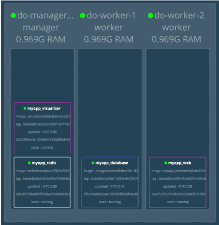

我们看到三列：每个节点对应一列。你可以看到我们的每个服务都有一个容器在运行，并且容器分布在集群中。可视化工具服务正在我们的管理节点上运行——这得益于我们的放置约束。

保持这个窗口打开，因为当我们……时，观察变化会很有用。

#### 扩展 Web 服务

目前，我们的集群中每个服务只有一个容器（或副本）在运行。然而，使用 Swarm，我们可以扩展服务以满足实际或预期的需求。这里我们讨论的是对应用进行水平扩展——为某个服务运行多个容器，每个容器都能处理一定量的负载。

准备好尝试了吗？让我们将 Web 服务扩展到运行三个容器；在你运行以下命令时，观察可视化工具中发生的变化：

```
$ docker service scale myapp_web=3
myapp_web scaled to 3
overall progress: 3 out of 3 tasks
1/3: running  [==================================================>]
2/3: running  [==================================================>]
3/3: running  [==================================================>]
verify: Service converged
```

你应该会看到可视化工具实时更新，容器在启动并进入"running"状态时发生变化。当命令完成后，你会看到现在有三个 Web 容器。注意它们运行在集群中的不同节点上，如下图所示：

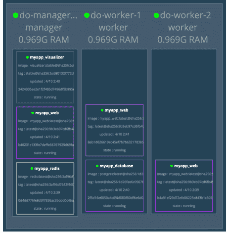

如果你没有运行可视化工具，你可以通过以下命令验证每个服务有*多少个*容器在运行：

```
$ docker stack services myapp
ID    NAME             MODE  REPL  IMAGE                  PORTS
sx…   myapp_redis      repl  1/1   redis:latest
tj…   myapp_database   repl  1/1   postgres:latest
vo…   myapp_web        repl  3/3   robisenberg/myapp_w…   *:80->3000/tcp
za…   myapp_visualizer repl  1/1   dockersamples/visua…   *:8080->8080/…
zy…   myapp_db-migrator rep…  0/1   robisenberg/myapp_w…
```

并通过以下命令查看它们运行在*哪里*：

```
$ docker stack ps myapp
ID    NAME                  IMAGE        ...  DESIRED...  CURRENT...  ...  ...
92... myapp_visualizer.1   docker...        Running     Running...
gm... myapp_database.1     postgr...       Running     Running...
g8... myapp_redis.1        redis:...       Running     Running...
xx... myapp_web.1          robise...       Running     Running...
kh... myapp_db-migrator... robise...       Shutdown    Complet...
uz... myapp_web.2          robise...       Running     Running...
hy... myapp_web.3          robise...       Running     Running...
```

要缩减服务，你可以使用与之前相同的命令，但指定比当前运行数量更少的副本数。例如，要缩回到单个 Web 容器，我们可以运行：

```
$ docker service scale myapp_web=1
```

同样地，在可视化工具中，你应该只会看到一个 Web 容器。

虽然我们可以通过 `docker service scale` 命令来扩展服务，但有时我们希望在*部署时*就指定这一点。在我们的 `docker-stack.yml` 文件中，我们可以在 `deploy` 下使用 `replicas` 属性来指定服务运行的容器数量。

让我们修改 `docker-stack.yml`，使我们的 Web 服务在部署时启动两个容器：

```yaml
web:
  image: robisenberg/myapp_web:*prod*
  ports:
    - "80:3000"
  env_file:
    - .env/production/database
    - .env/production/web
  deploy:
    replicas: 2
```

让我们在实践中看看。当我们部署应用时：

```
$ docker stack deploy -c docker-stack.yml myapp
Updating service myapp_database (id: tjlxqvm3vxop9flor3u4q21y2)
Updating service myapp_visualizer (id: zame53zwvvmmm70m6njrf0zd2)
Updating service myapp_db-migrator (id: zy14mg5nosigzi9i0ysr2f51y)
Updating service myapp_web (id: vo89apdhl4y0sfobb47ly8ctp)
Updating service myapp_redis (id: sxum5csqxwcujgy0g7418fv9y)
```

我们现在应该在可视化工具中看到两个 Web 容器正在运行。

#### 部署到 AWS 而非 DigitalOcean

在本章中，我们创建了一个运行在 DigitalOcean 上的三节点 Swarm 集群。然而，你可能会想，"那都很好，但如果要部署到（插入你选择的云提供商）呢？"好问题。

在本章结束之前，我们将看看将应用部署到第二个云提供商：AWS 需要什么。这个过程与 DigitalOcean 的非常相似；只有两三个关键区别。

以下是步骤：

- 1. 如果你还没有 AWS 账户，请先注册，然后设置 AWS 环境变量：

```
export AWS_ACCESS_KEY_ID=<your access key id>
export AWS_SECRET_ACCESS_KEY=<your secret access key>
export AWS_DEFAULT_REGION=<your default region>
```

- 2. 创建管理节点实例：

```
$ docker-machine create \
>     --driver amazonec2 \
>     --amazonec2-open-port 80 \
>     --amazonec2-open-port 8080 \
>     --amazonec2-region eu-west-2 \
>     aws-manager-1
```

注意，我们使用特定于 AWS 的 `--amazonec2-open-port` 选项来开放防火墙，允许我们访问 80 端口（用于 Web）和 8080 端口（用于可视化工具）。

- 3. 与之前一样，获取管理节点的内部 IP 地址：

```
$ docker-machine ssh aws-manager-1 "ifconfig eth0"
```

- 4. 将用户添加到 docker 组：

```
$ docker-machine ssh aws-manager-1 \
    'sudo usermod -a -G docker $USER'
```

对于 DigitalOcean，docker-machine 的 SSH 会话配置为以 root 用户连接。然而，对于 AWS 驱动程序，我们通过 SSH 以 ubuntu 非 root 用户连接。为了能够运行 Docker 命令，我们将 ubuntu 用户添加到 docker 组。¹³

- 5. 初始化集群：

```
$ docker-machine ssh aws-manager-1 \
    "docker swarm init --advertise-addr 172.31.29.132"
```

捕获输出中给出的 swarm token。

- 6. 创建两个实例并将它们连接到集群：

```
SWARM_TOKEN=SWMTKN-1-3nzypy20thm9zd1whfsyu4kcmhxfnyo6hbivrgbec5yyz2o9yq-2zvdcauxzl1ncs75oe8775qdg
for i in 1 2
do
    # create the node
    docker-machine create \
        --driver amazonec2 \
        --amazonec2-open-port 80 \
        --amazonec2-region eu-west-2 \
        aws-worker-$i

    # add ubuntu user to `docker` group
    docker-machine ssh aws-worker-$i \
        'sudo usermod -a -G docker $USER'

    # join the swarm
    docker-machine ssh aws-worker-$i \
        "docker swarm join --token $SWARM_TOKEN 172.31.29.132:2377"
done
```

- 7. 将我们的 CLI 指向管理节点：

```
eval $(docker-machine env aws-manager-1)
```

- 8. 更新安全组以允许 swarm 端口。

Docker 文档指出，Swarm 需要开放以下端口：¹⁴

- TCP 端口 2377 用于集群管理通信
- TCP 和 UDP 端口 7946 用于节点间通信
- UDP 端口 4789 用于覆盖网络流量

对于 DigitalOcean，这些端口默认是开放的。然而，对于 AWS，情况稍微复杂一些。Docker Machine 实例被添加到名为 `docker-machine` 的安全组中，该安全组限制入站连接（ingress）到少量端口，不包括上面列出的端口。为了使 Swarm 正常工作，我们必须添加这些端口。

登录到 AWS 控制台，进入 EC2 > 安全组。点击 `docker-machine` 安全组，然后点击其入站规则选项卡。在这里，点击编辑规则并添加缺失的规则。可以使用 AWS CLI 将此过程自动化。¹⁵

***

¹³ https://docs.docker.com/install/linux/linux-postinstall/#manage-docker-as-a-non-root-user
¹⁴ https://docs.docker.com/engine/swarm/swarm-tutorial/#open-protocols-and-ports-between-the-hosts
¹⁵ https://semaphoreci.com/community/tutorials/bootstrapping-a-docker-swarm-mode-cluster


- 9. 部署应用：

`$ docker stack deploy -c docker-stack.yml myapp`

- 10. 现在你应该可以通过访问 `http://ip address of a node/welcome` 来访问该应用。你可以通过以下命令列出节点 IP：

`$ docker-machine ls`

> **记得关灯（清理资源）**
>
> 当你完成本章的操作后，记得停止或删除你的云实例，以避免持续产生费用。
>
> 要停止实例，你可以运行：
>
> `$ docker-machine stop <instance 1> <instance 2> ...`
>
> 或者要完全删除它们，运行：
>
> `$ docker-machine rm <instance 1> <instance 2> ...`

### 快速回顾

太棒了！我们像专家一样熟练地使用了 Docker Machine 和 Swarm。我们将应用程序部署到了两个（而不仅仅是一个）云提供商那里，并在过程中创建了所需的基础设施。

回顾一下：

- 1. 我们涵盖了在 DigitalOcean 或 AWS 上创建多节点 Swarm 集群的必要步骤。
- 2. 我们通过将 Docker CLI 的目标指向管理节点，将应用程序部署到 Swarm 集群：

`$ eval $(docker-machine env do-manager-1)`

然后部署应用程序：

`$ docker stack deploy -c docker-stack.yml myapp`
- 3. 我们使用了可视化工具（visualizer）来查看容器在节点上的分布情况。
- 4. 我们学习了可以在 `docker-stack.yml` 文件中指定的 `deploy` 选项，包括放置约束（placement constraints）。
- 5. 我们通过以下命令扩大了服务规模：

`$ docker service scale myapp_web=3`

以及在 `docker-stack.yml` 中为服务指定副本数量：

```yaml
service:
  deploy:
    replicas: 2
```

很遗憾地说，我们的 Docker 冒险之旅（至少在本书中）即将结束。在下一章——也是最后一章中，我们将为全书收尾，并为你提供一些在 Docker 之旅中继续前行的有用建议，特别是关于部署到生产环境方面。

## 第 15 章：结语与后续步骤

恭喜！你已经走到了最后。

让我们花一点时间回顾一下在本书中的旅程。我们从基础知识开始：什么是容器和镜像？我们看到了 Docker 如何提供打包（镜像）、交付（自动拉取镜像）和执行运行时（容器）。我们学习了这些基础组件如何为软件交付提供一种全新的思考方式。

本书的其余部分是一个扩展教程，引导你完成使用 Docker 创建、开发和部署一个功能完整的 Rails 应用的过程。我们使用容器生成了 Rails 应用，并为运行 Rails 应用创建了自定义镜像，并且逐步对其进行了增强。我们引入了 Docker Compose，使用它构建了一个包含 Redis 和一个具有解耦数据卷的数据库在内的多服务应用程序。

我们让 Docker 化设置与 JavaScript 良好协作，学习了如何处理标准资产流水线（asset pipeline）和 webpacker（Rails 集成现代 JavaScript 前端的新方法）。我们还介绍了如何测试应用，甚至运行了在 Chrome 浏览器中依赖 JavaScript 的端到端测试（包括无头和有头模式）。

然而，即使在 Docker 世界里，也没有什么东西是完美的。我们探讨了在操作 Docker 时可能会遇到的一些烦恼，并尽力减轻这些影响。

最后，我们开始了迈向生产环境的旅程。在快速浏览生产环境概况以了解所需能力和可用工具后，我们增强了应用，使其能够在生产环境中部署。我们学习了如何将 Docker 镜像推送到注册表（Registry），使其可以交付到其他机器。接着我们引入了 Swarm，并在本地机器上创建了我们自己的类生产环境实验场。

最后，我们将此提升到更高水平，将应用部署到云端，在 DigitalOcean 和 AWS 上分别使用了三节点集群，并以此演示了 Swarm 的扩缩容能力。

这确实取得了巨大的成就（尤其是对于这本书的规模来说！）。庆祝方式就交给能干的你来决定了，不过我建议你的庆祝方式要比简单的“拍拍肩膀”更宏大一些。

然而，尽管我们已经开始了迈向生产的旅程，但要实现一个完全具有弹性、由 CI/CD 流水线驱动、安全且可扩展的生产环境，涵盖的内容实在太多了。希望你已经体会到了 Docker 所提供的强大能力，看到了它的潜力并受到启发去学习更多知识。

这个简短的章节是一个杂锦包，包含了我们无法在其他地方塞进的各种内容。除了在你的脑海中种下一些有用的想法种子外，本章还将为你提供关于继续 Docker 之旅的一些指引。

### 下一步我该学习什么？

好问题。毫无疑问，学习永无止境。你知道得越多，就越意识到自己的无知。这就是生活（C’est la vie）。

为了在这个过程中提供帮助，我将分享我对（我认为是）进一步学习的有价值领域的看法。对于每个主题，我将提供一个简要总结，但你需要进行一些深入挖掘才能了解更多，并思考如何将这些应用于你的应用程序。有些领域在你的具体情况下会更具吸引力或更有用，因此请深入研究你需要的领域，不必在意那些不需要的。

祝学习愉快！

#### 限制资源

随着你在集群中运行更多容器，你可能会发现需要限制分配给某些容器的 CPU 资源和内存。Swarm 和 Kubernetes 都提供了一种方式来指定容器允许使用的资源限制。

以下是一个 Swarm 的示例，意味着 `some-service` 的容器最多只能获得 50 MB 的内存和十分之一个 CPU 核心。

```yaml
services:
  some-service:
    deploy:
      resources:
        limits:
          cpus: "0.1"
          memory: 50M
```

#### 自动扩缩容（Autoscaling）

有什么比运行命令来扩展服务更好的吗？那就是 *无需* 运行任何命令就能扩展服务。这就是所谓的自动扩缩容。它涉及监控容器的关键使用情况和负载指标，并在它们接近过载时进行检测。此时，将启动该服务的新容器以满足额外需求。当负载降低时，再次检测到此情况，服务将缩减规模，释放更多资源。

遗憾的是，Swarm 没有提供内置的自动扩缩容，尽管你可以通过让集群中的每个节点导出指标（使用类似 cAdvisor 将指标发送到 Prometheus 等中央指标服务）来自己构建。如果这听起来工作量太大，你可以考虑各种开源解决方案，例如 Orbiter。你的最后一个选择是切换到使用 Kubernetes 进行容器编排。虽然它更复杂，但功能更全面，并且内置了自动扩缩容。

#### 零停机、蓝绿部署

一个优秀的持续部署流水线的顶峰是能够以无缝、安全的方式部署应用更新，而无需停机或对用户产生影响。通常，这通过 *蓝绿* 部署来实现，即启动应用程序的第二个版本，然后将流量（通常是逐步地）切换到新版本。旧版本应用会被保留（至少保留一段时间），以防出现需要回滚的问题。

Docker Swarm 提供了一些执行此类滚动更新的能力。虽然这很有用，但遗憾的是，Swarm 目前还不

支持*会话亲和性*（*sticky sessions*），也称为粘性会话。也就是说，一旦部署了应用的新版本，任何新会话都将由最新版本处理，但任何现有用户会话仍将继续由旧版本提供服务。这很重要，因为旧版本可能在某些方面与你更新后的应用版本不兼容，特别是在路由或数据库架构发生变化时。

你仍然可以通过 Swarm 实现零停机部署，但这需要一些额外的工作，通常需要在应用前面运行一个*确实*提供会话亲和性的反向代理。Kubernetes 也可以实现零停机部署，但同样涉及一些工作。[9]

### 安全性

在本书中教你全面保护云基础设施安全是力所不及的，但如果你正在构建生产环境，这将是一个关键领域，必须做好。遗憾的是，并没有*一刀切*的方法，尤其是因为不同云平台之间的差异可能很大。

一个好的起点是 Docker 官方关于此主题的文档。[10] 确保你查看了菜单下"Security"下的各个页面——页面底部没有"Next"按钮。关键主题包括：只使用可信镜像、扫描镜像漏洞、不以 root 身份运行容器[11]，以及将防火墙锁定到所需的最少端口，还有更多锁定 Docker 安装的深入方法。

### 更高级的架构可能性

到目前为止，我们使用 Swarm 内置的负载均衡功能将传入请求分发到支撑给定服务的不同容器。然而，随着经验的增长，你可能希望使用更复杂的设置，例如使用 HAProxy[12] 或 NGINX[13] 来进行自己的代理和负载均衡。

这不仅是可能的，而且你可以在自己的容器中运行 HAProxy 或 NGINX 实例，使用你的配置文件构建自己的镜像。你还可以使用 Docker 的网络原语[14]来创建不同的网络配置。

这可以让你将容器相互隔离，并控制哪些容器可以与其他容器通信。

#### 密钥管理

在本书中，我们遵循了十二要素应用的许多原则。[15] 例如，我们将应用配置外部化，使其作为环境变量可用。[16] 然而，事实证明环境变量并不是特别安全——它们对整个进程可用，容易泄露，并且违反了最小权限原则。[17] Docker 提供了一个更安全、内置的选项，称为 Docker secrets。[18]

Docker secrets 通过 `docker secret create` 命令添加到 swarm 中（首先需定向到 swarm 管理器）。或者，你也可以在部署文件（Compose 格式）中指定 secrets。[19]

Secrets 在 Swarm 存储它们的数据结构中是加密的（静态加密），并且在到达需要它们的容器的整个旅程中都是加密的（传输中加密）。它们通过挂载在 `/run/secrets/<secret_name>` 的内存文件系统提供给容器。只有明确被授予访问 secret 权限的容器才能访问它。

甚至还有内置的 secret 轮换机制，[20] 这让你更有可能做正确的事，频繁地轮换你的 secret。

#### 故障时重启

默认情况下，当容器内运行的进程终止时，容器会停止。有时，这种行为正是我们想要的。例如，我们的 database-migrator 服务应该完成迁移数据库的工作然后退出。

然而，我们在生产中运行的 Rails 应用容器呢？如果某些原因导致应用崩溃（例如，内存泄漏的情况），容器本身能够更有弹性并更优雅地处理故障，那就好了。谁愿意在半夜被叫醒去修复问题呢？

Docker 允许你定义一个*重启策略*，说明当容器终止时应如何表现。[21] 将此设置为 `on-failure`：

```
deploy:
  restart_policy:
    condition: on-failure
```

如果我们的 Rails 应用崩溃，Swarm 现在将自动重启它。这里有一篇很好的文章，提供了更多细节。[22]

#### 多阶段构建

大型 Docker 镜像推送和拉取的速度更慢。随着你对 Docker 更加熟悉，你会希望找到减小镜像体积的方法。自 17.05 版本起，Docker 引入了一项称为多阶段构建[23]的功能——这让你在单个 Dockerfile 中使用多个 FROM 语句。每个新的 FROM 都被视为一个新阶段，并作为全新的镜像开始。然而，COPY 指令已经得到增强，允许你从*早期阶段*复制文件。

最明显的用例是需要大量开发工具来生成最终产物的情况。比如像 Jekyll[24] 或 Middleman[25] 这样的静态站点生成器——你需要各种工具来开发和生成站点，但一旦静态文件生成完毕，它们就是运行站点所需的全部内容。多阶段构建让你可以创建一个生成站点的初始阶段，以及一个单独的、最终的阶段，将这些文件复制到干净的 Web 服务器镜像中。同样适用于 Go 等编译型语言，通常你唯一需要包含在最终镜像中的是编译后的二进制文件。

就我们的 Rails 应用而言，一个快速的胜利可能是将预编译的资源复制到最终镜像中，避免需要所有 JavaScript 依赖。如果你发挥创意并看看其他人在做什么，还有其他节省空间的方法。

#### Docker 统计信息

通常，特别是在生产环境中，能够快速获取有关资源使用情况的指标是很有用的。Docker 文档[26] 提供了关于你可以查看的各种指标的有用信息。

其中最简单且最有用的之一是 `docker stats` 命令。这提供了各种指标，包括 CPU、内存使用量和网络 IO，这些对于生产环境中监控或调试容器很有帮助。

这是 Docker 文档中的一个例子：[27]

```
$ docker stats redis1 redis2
```

| CONTAINER | CPU % | MEM USAGE / LIMIT | MEM % | NET I/O | BLOCK I/O |
| :--- | :--- | :--- | :--- | :--- | :--- |
| redis1 | 0.07% | 796 KB / 64 MB | 1.21% | 588 B / 648 B | ... |
| redis2 | 0.07% | 2.746 MB / 64 MB | 4.29% | 1.266 KB / 648 B | ... |

#### 在 Compose 文件之间共享配置

我们目前正在维护两个 Compose 格式的配置：`docker-compose.yml` 和 `docker-compose.prod.yml`。你可能会发现，随着应用的开发，不同环境的 Compose 文件之间存在相当多的重复。

Compose 提供了一种机制，让你提取共同之处。[28] 它允许你指定多个 Compose 文件来实现这一点：

`docker-compose -f <file1> -f <file2> ... -f <fileN> up -d`

Compose 合并指定文件中的配置，后文件中 的配置优先于先文件中的配置。

一如既往，保留或消除重复都有权衡。从好的方面来说，将重复提取到公共文件使环境之间的*差异*更加清晰——这些是你必须为环境指定的部分，超出公共基础之外。这也（可能）使更新两组服务的配置（略微）更快。从不好的方面来说，你必须从多个文件中拼凑定义才能整体理解你的应用。你可能已经猜到了，我认为在这种情况下，保留重复的好处超过了我们程序员保持 DRY 的本能。[29]

然而，值得知道你手头有这个选项。例如，这也可以用于将常见的、一次性的容器管理任务放在单独的 Compose 文件中，而不是与应用放在同一个文件中。

---

[9] https://medium.com/@diegomrtnzg/redirect-your-users-to-the-same-pod-by-using-session-affinity-on-kubernetes-baebf6a1733b

[10] https://docs.docker.com/engine/security/security/

[11] https://docs.docker.com/engine/security/userns-remap/

[12] http://www.haproxy.org

[13] https://www.nginx.com

[14] https://docs.docker.com/v17.09/engine/swarm/networking/

[15] https://12factor.net

[16] https://12factor.net/config

[17] http://movingfast.io/articles/environment-variables-considered-harmful/

[18] https://docs.docker.com/engine/swarm/secrets/

[19] https://docs.docker.com/engine/swarm/secrets/#use-secrets-in-compose

[20] https://docs.docker.com/engine/swarm/secrets/#example-rotate-a-secret

[21] https://docs.docker.com/config/containers/start-containers-automatically/#use-a-restart-policy

[22] https://blog.codeship.com/ensuring-containers-are-always-running-with-dockers-restart-policy/

[23] https://docs.docker.com/develop/develop-images/multistage-build/

[24] https://jekyllrb.com

[25] https://middlemanapp.com

[26] https://docs.docker.com/config/containers/runmetrics/

[27] https://docs.docker.com/config/containers/runmetrics/#docker-stats

[28] https://docs.docker.com/compose/extends/

[29] https://en.wikipedia.org/wiki/Don%27t_repeat_yourself


#### 数据库弹性

确保定期备份生产数据库对于在发生错误时能够恢复至关重要；可以通过在容器内运行常规的数据库转储（dump）命令来备份数据库。然而，稍微棘手的是如何在生产环境中自动实现这一过程。

有多种不同的处理方式：

- *平台特定*。某些容器平台允许你调度容器（例如，Amazon ECS 计划任务）。$^{30}$ 使用这些调度器，你可以定期运行容器来备份数据库。此外，平台可能会提供备份功能；例如，Amazon Elastic Block Store (Amazon EBS) 卷提供了自动增量快照能力。$^{31}$ 这是一种低麻烦且可靠的维护备份方法。
- *在 Docker 宿主机上运行 Cron*。没有什么能阻止你在 Docker 宿主机上设置 `cron` 或类似的调度器，从而触发一个容器（或非容器化脚本）来备份数据库。有些人喜欢这种方法，尤其是因为它简单。然而，缺点是你的 Docker 宿主机可能变成一个难以维护的“特殊雪花”（special snowflake）。你的数据库备份机制存在于容器化之外，因此你失去了容器化带来的所有好处。
- *使用第三方工具*。例如，针对 Postgres 的 Barman。$^{32}$

#### 容器自动驾驶 (Containers on Autopilot)

一种名为*自动驾驶模式 (autopilot pattern)*$^{33}$ 的更广泛方法正开始出现。这涉及将标准运维任务（如扩容和弹性）直接构建到容器化服务本身之中。

与其将这种运维逻辑分散地交给外部调度器和独立的任务容器，不如让你的应用容器具备执行自身生命周期管理的智能。例如，想象启动一个配置好的 Postgres 容器，它会检查其数据库是否已填充数据，如果发现没有，则会去获取并恢复最新的备份。如果执行得好，维护和弹性将变得自动化。

30. https://docs.aws.amazon.com/AmazonECS/latest/developerguide/scheduled_tasks.html
31. https://docs.aws.amazon.com/AWSEC2/latest/UserGuide/snapshot-lifecycle.html
32. https://www.pgbarman.org/about/
33. http://autopilotpattern.io

Joyent$^{34}$ 一直在倡导这种方法，并就该主题发表了数篇$^{35}$极具说服力的文章$^{36}$。它还提供了一个名为 ContainerPilot$^{37}$ 的开源工具，以帮助协调生命周期事件。或者，你也可以自行构建解决方案。我预计随着时间的推移，我们会在这个领域看到更多进展。

#### 数据库复制与高可用性

要复制你的数据库，通常需要依赖数据库内置的功能（而不是尝试使用共享文件系统这种极其幼稚的方法）。

Postgres 提供了许多不同的集群选项。$^{38}$ 然而，不必重新造轮子，你可以利用他人在此领域的工作成果——例如：

- Patroni$^{39}$
- Barman$^{40}$
- Crunchy$^{41}$

你会发现，针对其他数据库的集群和复制工作也已经有了类似的实现。

34. https://www.joyent.com
35. https://www.joyent.com/blog/app-centric-micro-orchestration
36. https://www.joyent.com/blog/persistent-storage-patterns
37. https://www.joyent.com/containerpilot
38. https://wiki.postgresql.org/wiki/Replication_Clustering_and_Connection_Pooling
39. https://github.com/zalando/patroni
40. https://hub.docker.com/r/postdock/barman/
41. http://info.crunchydata.com/blog/an-easy-recipe-for-creating-a-postgresql-cluster-with-docker-swarm

## 附录 1

### 平台差异

尽管 Docker 力求完全的平台独立性，但平台之间至少在一个显著方面存在差异。让我们快速看一下是怎么回事。

#### 文件所有权与权限

在不同 Docker 平台（Mac, Linux 和 Windows）处理文件所有权和权限的方式上存在一些微妙的差异。当你从容器内部向挂载卷写入文件时，这些差异可能会导致轻微的问题。

问题源于容器内部和外部通常使用不同的用户账户。通常，你在机器上使用常规用户账户，但在容器内部，默认用户是容器的 root 账户。这意味着在容器内创建的文件由该 root 用户所有。

当你退出容器时，问题来了：你能够修改这些由 root 拥有的文件吗？每个平台的答案略有不同。

在 Docker for Windows 上，容器内创建的文件具有允许任何人修改的文件权限（等同于 Unix 文件权限 777）。这意味着在容器外部使用和修改这些文件没有问题。

Docker for Mac 使用其独立的名为 osxfs 的文件共享系统。[^1] 它采用了一些技巧[^2]，使挂载的文件看起来像是由容器中访问/创建它们的任何用户所有。然而在现实中，本地文件系统上的文件由拥有它们的所有 macOS 用户账户所有。在实践中，这意味着挂载的文件在容器内部和外部都是可读可写的，而无需修改文件所有权。

在 Linux 上，没有任何魔法或技巧可以让你免受容器内部与本地机器容器外部文件所有权差异的影响。如果容器内的文件由 root 所有，那么在容器外部它们仍然由 root 所有。我们必须采取某种措施，确保容器内生成的文件在容器外部也能由我们编辑。

我们可以采取两种方法之一：

1. 使用 `--user "$(id -u):$(id -g)"` 选项，该选项使用本地用户的 ID 和组 ID 运行命令——例如：
   `$ docker-compose exec --user "$(id -u):$(id -g)" web bin/rails generate controller welcome index`

2. 通过在 Rails 根目录下运行以下命令来修改文件所有权 (chown)：
   `$ sudo chown <your_user>:<your_group> -R .`

对我来说，后者似乎最直接，这也是我在本书中建议的方法。为了减少输入，你甚至可以创建 Rake 任务或 shell 命令别名。

1. https://docs.docker.com/docker-for-mac/osxfs/
2. https://stackoverflow.com/questions/43097341/docker-on-macosx-does-not-translate-file-ownership-correctly-in-volumes

## 附录 2

### 寻找可用的镜像

在整本书中，我们使用了一些不同的*已知*镜像。你可能会好奇，如果你需要自己寻找可用的镜像该怎么做。当你读完本书时，能够自给自足并独立解决问题是非常重要的，所以让我们现在深入研究一下。

假设我们要运行一个 Postgres 数据库，需要找到一个提供该功能的镜像。有两种寻找镜像的方法：使用 Docker Hub（Docker 用于存储镜像的在线服务）或使用 Docker 命令行界面 (CLI)。让我们依次来看看。

#### 使用 Docker Hub

你可能记得我们在第一章中已经访问过 Docker Hub 来创建账户。让我们再次访问，看看如何使用它来查找镜像。

在浏览器中访问 [hub.docker.com](https://hub.docker.com)。在主搜索框中输入 "postgres" 并按下 **Enter**。你应该会看到如下结果界面：

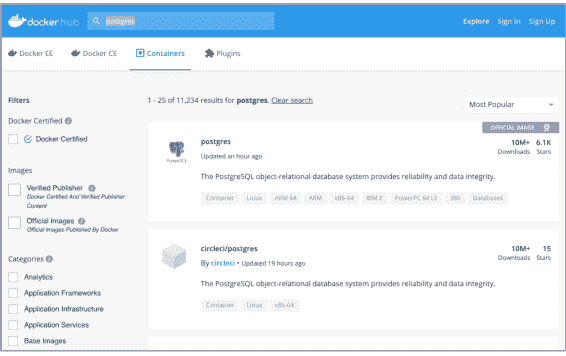

顶部的结果应该是 Postgres 官方镜像。点击它，它将带你进入以下信息页面：¹

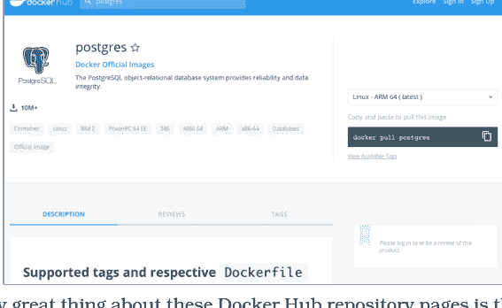

这些 Docker Hub 仓库页面真正出色的一点是，镜像提供者（在这种情况下是 Postgres）可以（而且通常会）提供关于如何使用该镜像的详细信息。

我建议尽可能地坚持使用 Docker 官方镜像²，因为这些镜像经过 Docker 的安全漏洞审核，并且他们承诺及时应用安全更新。除此之外，你无法保证镜像运行的是什么软件，也无法保证镜像更新的速度。

#### 使用 Docker CLI

另一种寻找镜像的方法是使用 Docker CLI。例如，要查找与 Postgres 相关的镜像，可以使用以下命令：

```
$ docker search postgres
```

如果你现在运行此命令，将看到类似下面的输出：

| NAME | DESCRIPTION | STARS | OFFICIAL | AUTOMATED |
| :--- | :--- | :--- | :--- | :--- |
| postgres | The PostgreSQL object-r... | 3828 | [OK] | |
| kiasaki/alpine-postgres | PostgreSQL docker image... | 33 | [OK] | |
| nornagon/postgres | | 10 | [OK] | |
| macadmins/postgres | Postgres that accepts r... | 8 | [OK] | |

1. https://hub.docker.com/_/postgres/
2. https://docs.docker.com/docker-hub/official_images/


如你所见，官方的 postgres 镜像首先显示，随后是其他几个镜像。镜像按照被“星标（starred）”的次数排序，这代表了该镜像的受欢迎程度。输出结果中还有一个列，用于告知我们这是否是一个官方（换句话说，是 Docker 批准的）镜像。同样，只要有可能，请尽量使用来自 Docker Hub 的官方镜像。

### 符号 (SYMBOLS)
- "$@" 语法, 123
- \* (星号) 表示活动实例, 159
- - (短横线) 表示活动实例, 159
- . (点)
  - 表示当前目录, 23
  - 挂载本地卷, 50

#### A
- -a 选项, 10
- 中止错误 (abort error), 124
- ACI (Azure Container Instances), 141
- 适配器模式 (adapter pattern), 136
- (AKS) (Azure Kubernetes Service), 139
- 警报，运维角色, 130
- Amazon AWS
  - 账户, 184
  - 部署至, 173, 184–186
  - Elastic Container Registry, 153
  - Elastic Container Service, 134, 137, 139, 196
  - Elastic Container Service for Kubernetes (EKS), 138–139
  - Fargate, 141
  - Lambda, 140
  - 管理控制台 (Management Console), 137
  - 准备 IaaS, 135
  - 快照 (snapshotting), 196
- Ansible, 136
- API 端点, 88
- DigitalOcean 的 API 令牌, 174
- 应用 (apps)
  - 连接到 Redis, 64–67
  - 连接到数据库, 75–79
  - 使用 stack 文件向 Swarm 描述, 161–165
  - 相关目录, 11
  - 在未安装 Ruby 的情况下生成, 10–15
  - 整体视图, xiii–xiv
  - 在后台启动
    - 使用分离模式 (detached mode), 49
  - 使用 Compose 启动, 47–50
  - 失败后重启, 194
  - 在容器中运行, 17–29
  - Compose 文件中的版本号, 46
- apt-get, 20, 37
- apt-transport-https, 89
- 资源流水线 (asset pipeline), 22, 88
- 资源 (assets)
  - 使用 webpacker 编译, 90–92
  - 在镜像中预编译, 147
  - 静态资源, 146
- 星号 (\*) 表示活动实例, 159
- 附加模式 (attached mode), 124
- 附加 (attaching), 49
- 自动驾驶模式 (autopilot pattern), 196
- 自动扩缩容 (autoscaling), 133, 191
- AWS, *参见* Amazon AWS
- AWS_ACCESS_KEY_ID, 184
- AWS_DEFAULT_REGION, 184
- AWS_SECRET_ACCESS_KEY, 184
- Azure
  - 容器实例 (ACI), 141
  - 容器注册表 (Container Registry), 153
  - Kubernetes 服务 (AKS), 139
  - 准备 IaaS, 135

#### B
- -b 选项, 25, 28
- 备份, 196
- Barman, 196–197
- 基础镜像 (base images), 20
- Bash
  - 复合运行, 18
  - entrypoints 替代方案, 123
  - 输入选项, 15
  - 在容器中运行, 10–12
  - 停止, 12
  - 终端模拟器选项, 15
- 蓝绿部署 (blue-green deployment), 130, 191
- boot2docker, 157
- 断点 (breakpoints), 109
- 桥接网络 (bridge network), 63
- 构建 (build)
  - 忽略不必要的文件, 35
  - 使用 Compose 启动应用, 47
  - 同时打标签 (tagging), 32
  - 使用, 23–25
  - 构建缓存, 36–41
  - 构建选项, 46
  - 构建 (building)
    - 构建上下文, context 35,
    - 镜像, 23–25
    - 使用 Compose 构建镜像, 46–47, 55,
    - 多阶段构建, 194
- bundle install
  - 缓存 gems, 38–41
  - gem 管理, 65, 113–119
  - Postgres gems, 75
  - 重新构建镜像, 36
  - Redis gems, 65
  - RSpec, 96
    - 跳过, 12
  - 使用, 22, 117
  - webpacker, 90
- BUNDLE_PATH, 115
- bytebug 调试器, 109

#### C
- ← 选项 18,
- CaaS
  - 与 IaaS 的对比, 142
  - 平台, 134, 137–140
- 缓存 (caching)
  - 构建缓存, 36–41
  - gems, 38–41, 114–118
  - 失效缓存, 37
  - 分层 (layers), 9
  - 性能, 36
  - 更新软件包问题, 37
- cadvisor, 191
- 金丝雀发布 (canary releases), 130
- Capybara
  - 关于, 95
  - 配置, 104
  - JavaScript 测试驱动, 102
  - 无头测试 (headless testing), 108
  - 安装, 99
  - JavaScript 测试, 102–109
  - 系统测试, 99–101
- Capybara-webkit, 102
- *ERROR: Aborting 错误, 49
- Chef, 136
- chown, 66, 80, 97, 100, 104
- Chrome
  - 关于, 103
  - 启动错误, 104
  - 无头测试, 108
  - JavaScript 测试, 102–109
  - 运行, 103
- CI (持续集成), xv, 151
- 云 (cloud)
  - 成本, 173
  - 部署至, 173–187
  - 部署至 AWS, 173, 184–186
  - 部署至 DigitalOcean, 173–183
  - 使用 CaaS 部署, 134, 137–140
  - 使用 IaaS 部署, 134–135
  - 服务扩缩容, 181–183
  - 停止部署, 186
- 云原生计算基金会 (CNCF), 133, 153
- CloudFormation, 137
- 集群，创建 DigitalOcean 集群, 173–182, *另见* swarms
- CMD 指令
  - 默认命令, 33
  - Exec 形式, 33
  - 在 Compose 中覆盖, 49
  - Postgres，启动 72
  - Shell 形式, 34
- CNCF (云原生计算基金会), 133, 153
- 代码 (code)
  - 本书相关代码, xvii
  - 基础设施即代码, 18
  - 命令选项, 49
- 命令行界面 (command-line interface)
  - 配置 Docker CLI 以部署至 AWS, 185
  - 配置 Docker CLI 以部署至 DigitalOcean, 178
  - 配置 Docker CLI 用于机器, 158–160
  - 在 Docker 架构中, 13
  - Elastic Container Service, 137
  - 查找可用的镜像, 201–202
  - 登录 Docker Hub, 152
  - Redis, 62
- 社区版 (Community Edition), 3
- Compose
  - 添加服务, 60–62
  - 使用其构建镜像, 46–47
  - 清理, 55
  - 命令模式, 52
  - 缺点, 121–126
  - 创建 docker-compose.yml 文件, 46
  - Elastic Container Service 兼容性, 137
  - 错误，关于, 124
  - 启动 Rails 错误, 50–51
  - 强制重新路由, 79
  - 安装, 4
  - JavaScript 前端, 88
  - 使用其启动应用, 47–50
  - 查看容器日志, 53
  - 挂载卷, 47, 50
  - 具名卷 (named volumes), 82–84
  - Postgres，连接到应用, 75–79
  - Postgres，设置, 71–81
  - Postgres，启动服务器, 71–73
  - Rails 服务器，错误, 121–123
  - 重新构建镜像, 55
  - Redis 服务器，添加, 60–62
  - 相关资源, 4
  - 运行一次性命令, 54
  - 在文件之间共享配置, 105
  - 启动和停止服务, 51–53
  - 启动连接到 Redis 的应用, 62
  - 停止, 49
  - 理解, 45–47
- Compose 文件, *参见* Stack 文件
- 配置管理运维角色, 130
  - 编排器 (orchestrators) 角色, 132
  - 工具, 130
- ContainerPilot, 197
- 容器 (containers)
  - 关于, xiii
  - 向其中添加文件, 21
  - 附加, 49
  - 自动驾驶, 196
  - 备份, 196
  - 通信, 63
  - 从独立容器连接到 Postgres, 74
  - 使用 Compose 创建, 47
  - 将数据从容器中解耦, 81–84
  - 默认用户, 11
  - 定义, 6
  - 删除, 10, 24, 34, 56, 83
  - 分离模式, 49, 73, 124
  - DNS 解析, 64
  - 关闭时的错误, 49
  - 强制重新创建, 79
  - ID, 24, 29
  - IP 地址, 29
  - 杀死 (killing), 52, 68, 124
  - 生命周期, 51
  - 限制资源, 190
  - 列出运行中的容器, 9, 52
  - 列出停止的容器, 10
  - 日志, 53
  - 名称, 49, 60
  - 一次性 (one-shot), 163
  - 编排, 131–134
  - 暂停, 52
  - 副本 (replica), 166
  - 重启, 52–53, 193
  - 在其中运行 Bash shell, 10–12
  - 在其中运行 Rails 应用, 17–29
  - 安全, 192
  - 无服务器计算 (serverless computing), 140–141
  - 停止, 12, 49, 52, 56, 124
  - 临时/可丢弃容器, 10, 24
  - 理解 *run*, 8–10
  - 可视化, 179–183
  - 与虚拟机的对比, xv, 6
  - 工作目录, 21
- 容器即服务, *参见* CaaS
- 持续部署, xv, 191
- 持续集成 (CI)
  - Docker 的优势, xv
  - 推送镜像, 151
- Cookie, 146
- COPY 指令
  - 关于, 21
  - 失效缓存问题, 37
  - 多阶段构建, 194
- 复制 (copying)
  - 数据库, 197
  - 文件, 21, 40
  - 镜像, 147
  - 分离触发重新构建的文件, 40
- 成本
  - Azure Container Instances, 141
  - CaaS, 142
  - 云服务, 173
  - DigitalOcean, 173
  - EKS, 139
  - Fargate, 141
  - IaaS, 142
  - 生产环境, 139, 141–142
  - 扩缩容, xv
  - 无服务器计算, 142
- cp, 147
- 创建规格 (create spec), 97
- cron, 196
- Crunchy, 197
- Ctrl-C
  - Compose 中止错误, 124
  - 退出容器日志流, 54
  - 停止 Compose, 49
  - 停止 Rails 服务器, 26
  - 停止 Redis 服务器, 60
- curl, 171
- D
  - -d 选项, 49, 73, 124
  - 悬空镜像 (dangling images), 56
  - 短横线 (-) 表示活动实例, 159
  - Database Cleaner, 99
  - DATABASE_HOST, 77
- 数据库 (databases)
  - 添加, 71–85
  - 配置, 76
  - 将应用连接至, 75–79
  - 从独立容器连接到 Postgres, 74
  - 连接错误, 79
  - 创建开发和测试数据库, 78
  - 默认数据库, 78
  - 迁移 (migrations), 80, 163
  - 名称, 147
  - 复制 (replicating), 197
  - 弹性/恢复能力, 196
  - 分离服务, 163
  - 启动服务器, 71–73
  - 在卷中存储持久化数据, 81–84
  - Swarm 设置, 163
  - 实际使用, 80
- db:create, 78
- 调试，测试, 109
- 删除
  - 容器, 10, 24, 34, 56, 83
  - 手动删除 server.pid 文件, 122
  - 丢弃型容器, 10, 24
- 依赖，Docker 优势, xiv
- deploy 属性, 180
- deploy 命令, 170, 178
- 部署, *另见* orchestrators
  - 至 AWS, 173, 184–186
  - 蓝绿部署, 130, 191
  - 金丝雀发布, 130
  - 至云端, 173–187
  - 使用 CaaS 部署至云端, 134, 137–140
  - 使用 IaaS 部署至云端, 134–135
  - 持续部署, 191
  - 至 DigitalOcean, 173–183
  - Docker 优势, xv
  - 发布管理, 130, 132
  - 在部署时扩缩容服务, 183
  - stack, 170
  - 停止, 186
  - 使用 Swarm, 191
- Deployment (Kubernetes), 133
- 分离模式, 49, 73, 124
- DIGITAL_OCEAN_TOKEN, 174
- DigitalOcean
  - 成本, 173
  - 创建集群, 173–178
  - 部署至, 173–183
  - 准备 IaaS, 135


#### directories (目录)
- 将文件复制到镜像中，21
- 创建，11
- 使用 . (点) 表示当前目录，23
- 列出内容，12
- 挂载卷，13, 21
- 工作目录，21
- 分发，Docker 的优势，xiv，另见 images
- DNS 解析，64
- Docker，另见 Compose; Swarm
  - 优势，xiii-xv, 125
  - 架构，13
  - 基础知识，3-16
  - 能力，xiii
  - 社区版 (Community Edition)，3
  - Docker ID，149
  - 企业版 (Enterprise Edition)，3
  - 安装，3-6
  - 操作系统支持，xvii
  - 相关资源，xv, xvii
  - 统计信息，194
  - 版本，3
- Docker CLI
  - 配置，158-160
  - 配置以部署到 AWS，185
  - 配置以部署到 DigitalOcean，178
  - 在 Docker 架构中的位置，13
  - 查找可用的镜像，201-202
  - 登录到 Docker Hub，152
- Docker Compose，见 Compose
- Docker daemon (Docker 守护进程)
  - 构建上下文，35
  - 发布端口，27
  - 理解，13-15
  - `/var/run/docker.sock` 文件，180
- Docker Engine
  - 发布端口，27
  - 理解，13-15
- Docker for Mac, 4, 27, 199
- Docker for Windows, 5, 27, 199
- Docker Hub, 149-152, 201
- Docker ID, 149
- Docker Machine, 135, 155-160
- Docker Registry (Docker 镜像仓库), 149-154
- Docker Toolbox, 5
- docker-compose
  - 模式，52
  - 使用，51-56
- docker-compose run, 63
  - 创建开发和测试数据库，78
  - 调试测试，109
  - 手动连接 Redis 服务器，63-64
  - Postgres，启动客户端，74
- docker-compose up
  - 网络创建，47, 63
  - Postgres，启动，73
  - 使用，47-50
- docker-compose.yml
  - 创建，46
  - 挂载本地卷，50
- DOCKER_CERT_PATH, 158
- DOCKER_HOST, 158
- DOCKER_MACHINE_NAME, 158
- DOCKER_TLS_VERIFY, 158
- Dockerfile
  - 构建缓存，36-41
  - 构建镜像，23-25
  - 使用 Compose 构建镜像，46
  - Gemfile 缓存，38-41
  - CMD 默认命令，33
  - 定义自定义镜像，18-23
  - 忽略不必要的文件，34, 37
  - 指令，18
  - 维护者标签，41
  - 为镜像打标签，31-33
  - 理解，18-21
  - 镜像版本控制，32
- `.dockerignore` 文件, 35, 37
- Domain Name System (域名系统)，见 DNS
- down, 55
- driven_by, 100
- drivers (驱动)
  - Capybara, 102, 104
  - Docker Machine, 136
  - JavaScript 测试, 102-109
  - 日志，103
  - RackTest, 100, 102
  - 系统测试, 100
- Droplets, 173
- DRY 原则，195

#### E
- `-e` 选项, 8, 123
- echo 一次性命令示例, 55
- ECS, 见 Elastic Container Service
- 社区版的 Edge 版本, 3
- EKS (Elastic Container Service for Kubernetes), 138-139
- Elastic Container Registry, 153
- Elastic Container Service
  - 备份, 196
  - CaaS, 137, 139
  - 命令行界面, 137
  - 特定平台的编排, 134
- Elastic Container Service for Kubernetes (EKS), 138-139
- 端到端测试，见 system testing
- endpoints (端点), 88
- 企业版 (Enterprise Edition), 3
- ENTRYPOINT 指令, 122
- entrypoints (入口点), 122, 163
- env_file, 78, 92, 162
- environment 属性, 72
- environment variables (环境变量)
  - AWS, 184
  - 使用 webpacker 编译资产, 92
  - 配置 Docker CLI, 158
  - 部署到 DigitalOcean, 174, 178
  - 提取到单独的文件, 77
  - gem 缓存卷, 115
  - 日志, 146
  - Postgres, 72, 76, 147
  - 打印, 158
  - 生产模式, 146
  - 堆栈文件, 162
  - 静态资产, 146
- ephemeral containers (临时容器)，见 throwaway containers
- errors (错误)
  - Chrome, 启动, 104
  - Compose, 中止错误, 124
  - Compose, 已运行错误, 50-51
  - 连接到数据库, 79
  - inspectify 溢出, 90
  - Rails 服务器, 50-51, 110, 121-123
  - 关闭容器, 49
- eval, 158
- exec, 55, 74, 99, 123
- CMD 的 Exec 形式, 33
- 执行权限, 123
- exit, 12

#### F
- `-f` 选项, 54, 83, 151
- FaaS, 无服务器计算, 140-141
- Fargate, 141
- Fig., 60
- file ownership (文件所有权)
  - 将 Redis 连接到应用, 66
  - 修改文件, 13
  - 平台差异, 199
  - 测试, 97, 100, 104
  - 使用数据库, 80
- files (文件)，见 file ownership; mounting
  - 添加到容器, 21
  - 配置文件结构, 145
  - 复制目录, 20, 140
  - 项目文件目录, 11
  - 本地编辑, 13
  - 文件名选项, 151
  - 忽略不必要的, 34, 37
  - 名称, 78
  - 预编译资产, 92
  - 分离触发重新构建的文件, 40
  - 在 Compose 文件之间共享配置, 195
- follow output 选项, logs, 54
- `--force-recreate` 选项, 79
- Foreman, 67
- FROM, 19, 24, 194
- Function as a Service (FaaS), 无服务器计算, 140-141

#### images (镜像)
- 构建, 23-25
- 使用 Compose 构建, 46-47, 55
- 构建, 多阶段, 194
- 缓存层, 9
- 复制, 147
- 悬空镜像 (dangling), 56
- 定义, 6
- 定义自定义镜像, 18-23
- 查找可用的, 201-203
- 进入新实例, 159
- 中间镜像, 24
- JavaScript 前端, 88
- 标签 (labels), 42
- 列出, 25
- 名称, 25, 31-33, 48, 150
- 官方镜像 (Official Images), 151
- 为生产环境预编译资产, 147
- 清理 (pruning), 56
- 推送, 151-154
- 使用 Compose 重新构建, 55
- 镜像仓库 (registries), 149-154
- 使用其运行 Rails 服务器, 25
- 运行特定版本的镜像, 33
- 安全, 192, 202
- 共享, 148-154
- 为服务指定镜像, 61
- 堆栈文件, 162
- 启动, 19
- 理解, 8-10
- 版本控制, 32, 48
- images 命令, 25
- Infrastructure as a Service, 见 IaaS
- 基础设施即代码 (infrastructure as code), 18
- inspectify 溢出错误, 90
- 输入选项, 13, 15
- inspect, 29, 84
- install 命令, 11
- installation (安装)
  - 使用 apt get, 20
  - 缓存 gems, 38-41
  - Capybara, 99
  - Compose, 4
  - Docker, 3-6
  - 安装后的 Docker 优势, xiv
  - gems, 22, 117
  - Node.js, 20, 88
  - 软件包和缓存问题, 37
  - Rails 应用的软件包, 20
  - Postgres gem, 75
  - Rails gem, 11
  - Redis gem, 64
  - RSpec, 97
  - Selenium, 103
  - 验证, 5
  - VirtualBox, 156
  - Yarn, 89
- instances (实例)
  - 创建, 157, 174
  - 在云端创建, 174
  - 创建机器, 155-160
  - 将镜像导入到实例, 159
  - 初始化为 swarm 管理员, 175
  - 列出, 157
  - 在 DigitalOcean 上, 173-178
  - 扩展服务规模, 169-171
  - 部署到云端时停止, 186
  - Swarm, 160-171
- IntelliJ, 110
- 中间镜像, 24
- 失效的缓存, 37
- IO 流, 附加 (attaching), 49
- IP addresses (IP 地址)
  - 将 Rails 服务器绑定到, 28
  - 实例, 161, 167, 175
  - 管理员, 184
  - 运行中的容器, 29
  - 使用 Capybara 测试, 105
- `-it` 选项, 15

#### J
- JavaScript
  - 前端选项, 87-93
  - 系统测试, 104-109
  - 测试, 101-109
- Jekyll, 194
- Joyent, 197

#### K
- key 标签, 42
- kill, 68, 124
- 终止容器, 52, 68, 124
- kubectl, 137
- Kubernetes
  - 关于, 142
  - 自动扩缩容, 133, 191
  - CaaS 平台, 137-140
  - 持续部署, 192
  - Google Compute Engine, xv
  - 限制资源, 190
  - 与 Swarm 的对比, 132

#### L
- LABEL 指令, 42
- labels, 维护者, 41
- Lambda, 140
- latest 标签, 32, 150
- layers (层)
  - 自动下载, 8
  - 缓存, 9
- Linux, 另见 file ownership
  - 关于, xvi
  - Docker 架构, 14
  - 文件所有权基础, 200
  - 安装 Docker, 4-5
  - 命名卷位置, 84
  - 发布端口, 27
  - 使用 VNC 查看测试, 106
- listing (列出)
  - 容器, 9, 52
  - 目录内容, 12
  - 镜像, 25
  - 实例, 157
  - 网络, 63
  - 运行中的容器, 9, 52
  - 部署到 swarm 的服务, 166
  - 已停止的容器, 10
  - 任务, 168
- load balancing (负载均衡), 171, 192
- logs (日志)
  - 容器日志, 53-54
  - follow output 选项, 54
  - JavaScript 测试, 103
  - Rails, 54, 146
  - 相关资源, 54
  - 关闭日志驱动, 103
- logs 命令, 53
- ls, 12, 157, 166

#### M
- macOS
  - 关于, xvi
  - Docker 架构, 14
  - 文件所有权, 199
  - 安装 Docker, 4
  - 命名卷位置, 84
  - 发布端口, 27
  - 屏幕共享 (Screen Sharing), 104, 106
  - 使用 VNC 查看测试, 106
- machines (机器)
  - 配置 Docker CLI, 158-160
  - 创建, 155-160, 176
  - 在 DigitalOcean 中创建, 176
  - 维护者标签, 41
  - managers (管理员)
    - 部署到 AWS, 184
    - 部署到 DigitalOcean, 178
    - 将实例初始化为, 175
    - 编排器 (orchestrators), 133
- memory, 限制资源, 190
- metadata and labels (元数据和标签), 42
- metrics (指标), 194
- microservices (微服务), 141
- Microsoft Azure
  - Container Instances, 141
  - Container Registry, 153
  - Kubernetes Service, 139
  - 供应 IaaS, 135
- Middleman, 194
- migrations, 数据库迁移, 80, 163
- Minitest
  - 关于, 95
  - 跳过默认值, 12
- mkdir, 11
- monitoring operations (监控操作), 其作用, 130
- mounting (挂载)
  - gem 缓存卷, 114-118
  - 将本地文件挂载到复杂组件, 92
  - 命名卷, 82
  - 卷 (volumes), 13, 21, 47, 50, 82, 199
  - 卷与文件所有权, 199
  - 使用 Compose 挂载卷, 47, 50

#### N
- `--name` 选项, 60
- named volumes (命名卷)
  - gem 缓存卷, 116
  - 位置, 84
  - 存储持久化数据, 82-84


#### 名称
- 容器, 49, 60
- 数据库, 147
- 环境文件, 78
- 镜像, 25, 31-33, 48, 150
- 网络, 48, 63
- 仓库, 150
- 服务, 64, 88
- 指定文件名, 151
- network 命令, 63
- 网络
  - bridge, 63
  - 容器间通信, 63
  - 使用 Compose 创建, 47
  - 默认网络, 63
  - host, 63
  - 列出网络, 63
  - 名称, 48, 63
  - none, 63
  - 基础网络, 192
- new (Rails), 12
- NGINX, 192
- --no-install-recommends 选项, 20
- Node.js
  - 镜像, 88
  - 安装, 20, 88
  - 版本, 89
- none 网络, 63

#### O

- 一次性容器, 163
- 操作系统
  - 比较, 199
  - 支持, xvii
- 运维的角色, 129
- Orbiter, 191
- 编排器, *另见* Kubernetes; Swarm
  - 简介, xiv
  - 比较, 131-134
  - 使用 CaaS 部署到云, 134, 137-140
  - 使用 IaaS 部署到云, 134-135
  - 选择, 132
  - 使用, 131-140
- osxfs, 199

#### P

- -p 选项, 25-26
- 包管理器
  - Dockerfile, 20
  - 安装 Docker, 4
- 包, *另见* 镜像
  - 使用 apt-get 安装, 20
  - 安装时避免不必要的文件, 20
  - 包管理器, 4, 20
  - 更新和缓存问题, 37
- 页面访问量示例, 65-68
- 密码, Postgres, 72, 74, 77, 147
- Patroni, 197
- 暂停容器, 52
- 性能
  - 缓存镜像, 36
  - gem 管理, 113, 118
  - 忽略不必要的文件, 35
  - 限制资源, 190
  - 在容器中运行应用, 18
  - 启动容器, 9
  - 测试, 无头测试, 108
  - 测试, 系统测试, 99, 108
- 点号 (.)
  - 表示当前目录, 23
  - 挂载本地卷, 50
- 权限
  - 执行权限, 123
  - 平台差异, 199
- PG::ConnectionBad 错误, 79
- PhantomJS, 102
- ping, 62
- 放置约束, 180
- 平台比较, xvii, 199
- playground, *参见* VirtualBox
- Pods, 133
- Poltergeist, 102
- 端口
  - AWS, 184-185
  - 使用 Compose 构建镜像时的端口, 46
  - 转发, 27
  - JavaScript 测试, 103-104
  - 映射, 103, 109
  - 不发布, 61
  - 发布, 26
  - 注册中心, 150
  - 安全, 192
  - Selenium, 104
  - stack 文件, 162
  - 在已知端口启动, 105
  - 系统测试, 105
  - 可视化工具, 179
  - VNC, 103, 107
- ports: 选项, 46
- Postgres
  - 添加, 71-85
  - 备份工具, 196
  - 客户端, 启动, 74
  - 客户端, 停止, 74
  - 集群, 197
  - 配置, 76
  - 将应用连接到数据库, 75-79
  - 从独立容器连接到数据库, 74
  - 连接错误, 79
  - 创建开发和测试数据库, 78
  - 将数据与容器解耦, 81-84
  - 默认数据库, 78
  - 镜像, 72, 201-203
  - 安装, 75
  - 数据库迁移, 80, 163
  - 密码, 72, 74, 77, 147
  - 服务器, 启动, 71-73
  - 在实践中使用数据库, 80
- postgres 镜像, 72
- POSTGRES_DB, 72, 77, 147
- POSTGRES_PASSWORD, 72, 77, 147
- POSTGRES_USER, 72, 77, 147
- Prasad, Aanand, 60
- 预编译, 147
- 打印
  - 环境变量, 158
  - quiet 选项, 20
- 生产环境, *另见* 部署; 编排器
  - 配置, 145-147
  - 数据库弹性, 196
  - 环境, xv, 129-143
  - 使用 VirtualBox 作为演练场, 155-172
  - 在镜像中预编译资源, 147
  - 准备工作, 145-154
  - 推送镜像, 151-154
  - 服务伸缩, 168-171
  - 无服务器计算, 140-141
  - 共享镜像, 148-154
  - Swarm, 160-171
- Prometheus, 191
- prompt 选项, 20
- 配置资源
  - 使用 CloudFormation, 137
  - 使用 Docker Machine, 135
  - IaaS, 135-136
  - 运维的角色, 130
- 代理, 192
- prune, 56
- 清理, 56
- ps, 9, 29, 52, 168
- psql, 74
- 发布端口, 26, 61
- Puppet, 136
- push, 152
- 推送镜像, 151-154
- PyInstaller, 124

- q, 停止 Postgres 客户端, 74
- -qq 选项, 20
- Quay, 153
- quiet 选项, 打印, 20
- 退出, 62

#### R

- RackTest 驱动, 100, 102
- Rails, *另见* Rails 服务器; 冒险之旅, xiii
  - 资源管线, 22, 88
  - 安装 Rails gem, 11
  - 系统测试, 99-101, 104-109
  - 版本, 11
- Rails 应用, *参见* 应用
- rails new, 12
- Rails 服务器
  - 绑定 IP 地址, 28
  - 错误, 110, 121-123
  - 日志, 54
  - 为 Postgres 重启, 79
  - 运行, 25
  - 使用 Compose 启动, 49
  - 启动错误, 50-51
  - 停止, 26, 67
- RAILS_ENV, 146
- RAILS_LOG_TO_STDOUT, 146
- RAILS_SERVE_STATIC_FILES, 146
- React, 87-93
- README 文件缓存示例, 38-41
- 强制重建, 79
- Redis
  - 简介, 59
  - 命令行界面, 62
  - 连接到应用, 64-67
  - 安装 gem, 64
  - 页面访问量示例, 65-68
  - 服务器, 手动连接, 62
  - 服务器, 启动, 60-62
  - 服务器, 停止, 60, 67
  - 使用 Compose 启动连接到 Redis 的应用, 67
- reds gem, 64
- redis-cli, 62
- 注册中心, 149-154
- 发布管理
  - 运维的角色, 130
  - 编排的角色, 132
- 移除, *参见* 删除
- 副本容器, 166
- ReplicaSets, 133
- 仓库
  - 镜像, 149-154
  - 名称, 150
  - 私有仓库, 149, 152
  - 为镜像打标签, 151
- 仓库名标签, 150
- require, 105
- 资源
  - 限制, 190
  - 清理未使用的资源, 56
- 本书资源
  - Compose, xv
  - Docker, xv, xvii
  - 安装, 4
  - 日志, 54
  - 安全, 192
  - 镜像来源, 201-203
  - VirtualBox, 156
- restart, 53
- 重启策略, 194
- 重启容器, 52-53, 193
- rm (Compose), 56, 83
- rm 命令, 10
- -rm 选项, 10, 34, 78

- 默认 root 用户, 11
- 轮换密钥, 193
- RSpec
  - 简介, 95
  - 调试, 109
  - 第一个测试, 97
  - 无头测试, 108
  - 安装, 97
  - JavaScript 测试, 101-109
  - 设置, 96
  - 系统测试, 99-101, 104-109
  - 查看测试, 103, 106
- Ruby
  - 在未安装 Ruby 的情况下生成应用, 10-15
  - 在未安装 Ruby 的情况下运行脚本, 7-10
- RubyMine, 110
- run, *另见* docker-compose run
  - 命令, 18
  - 在未安装 Ruby 的情况下生成应用, 10-15
  - 运行 Ruby 脚本, 7-10
  - 使用镜像运行 Rails 服务器, 25
  - 使用该命令启动 Redis 服务器, 60
  - 使用, 7-10
- RUN 指令, 20
- run() 在线程中的失败错误, 90
- 运行时
  - Docker 的优势, xiv
  - 挂载的卷, 21

#### S

- 伸缩
  - 自动伸缩, 133, 191
  - 成本, xv
  - Docker 的优势, xiv-xv
  - 缩容, 183
  - 水平伸缩, 181
  - 使用 Swarm, 167-171, 181-183
- 场景, 102
- 调度器, 196
- scratch, 20
- 屏幕共享, 104, 106
- secret 命令, 193
- 密钥管理, 132, 193
- SECRET_KEY_BASE, 146
- 安全
  - 容器, 192
  - Cookies, 146
  - 部署到 AWS, 185
  - 将环境变量提取到单独文件中, 77
  - Fargate, 141
  - 托管内部仓库, 153
  - 镜像, 192, 202
  - 不发布端口, 61
  - 编排器, 132
  - 端口, 192
  - Postgres 环境变量, 77
  - Postgres 密码, 73
  - 节点上的资源, 192
  - 密钥管理, 193
- Selenium
  - 无头测试, 108
  - 安装, 103
  - JavaScript 测试, 102-109
  - selenium-webdriver gem, 103
  - selenium/chrome-debug 镜像, 103
- 服务器已在运行错误, 121
- server.pid 错误, 121-123
- 服务器计算, 140-141
- 服务器, *另见* Rails 服务器
  - 使用 webpack 编译资源, 90-92
  - Postgres, 启动, 71-73
  - 发布端口, 27
  - Redis, 手动连接, 62
  - Redis, 停止, 60, 67
  - VNC, 103, 106
- --service-ports 选项, 109
- 服务
  - 添加 Postgres 示例, 71-85
  - 添加 Redis 示例, 60-62
  - 使用 swarm 部署, 165-167
  - 使用 Compose 描述, 45
  - 分离模式, 73
  - DNS 解析, 64
  - 强制重建, 79
  - 主机名, 64
  - 使用 Compose 启动应用, 47-50
  - 列出部署到 swarm 的服务, 166
  - 列出特定服务的任务, 168
  - 名称, 64, 88
  - 放置约束, 180
  - 副本容器, 166
  - 伸缩, 168-171, 181-183
  - 分离数据库服务, 163
  - 指定使用的镜像, 61
  - 使用 Compose 启动和停止, 51-53
  - 更新镜像, 170
- services 集合, 46
- 会话亲和性, 191
- set, 123
- 设置, *另见* 安装
  - Docker 的优势, xiv
  - RSpec, 96
  - 测试, 96
- Shell
  - 复合 run 命令, 18
  - entrypoints 变通方法, 123
  - 输入选项, 15
  - 在容器中运行, 10-12
  - Shell 格式的 CMD, 34
  - 停止, 12
  - 终端模拟器选项, 15
- $SIGNL, 52
- $SIGTERM, 52
- --skip-bundle 选项, 12
- --skip-test 选项, 12
- sleep, 107
- 快照, 196
- specs, *参见* RSpec
- SSH, 157, 175, 184
- Command Edition 的稳定版, 3
- stack 命令, 166
- stack 文件
  - 简介, 161
  - 使用, 161-165
- stacks
  - 简介, 133, 161
  - 定义, 161
  - 部署, 170
  - 使用, 161-165
- start, 53
- 启动镜像, 19
- 静态资源, 146
- 统计信息, 194
- stats, 194
- stderr, 连接, 49
- stdin, 连接, 49
- stdout, 连接, 49
- 粘性会话, 191
- stop, 49, 52, 67, 124
- 停止
  - Compose, 49
  - 容器日志流, 54
  - 容器, 12, 49, 52, 56, 124
  - 部署到云时的实例, 186
  - Postgres 客户端, 74
  - Rails 服务器, 26, 67
  - Redis 服务器, 60, 67
  - 使用 Compose 停止服务, 51-53
  - Shell, 12
- sudo, 21
- Swarm
  - 简介, 160
  - 持续部署, 191
  - 使用 swarm 部署, 165-167, 173-178, 191
  - 使用 DigitalOcean 部署, 173-178
  - 与 Kubernetes 对比, 132
  - 限制资源, 190
  - 故障恢复, 194
  - 伸缩, 167-171, 181-183
  - 密钥, 193
  - 单节点模式, 160-167
  - stack 文件, 161-165
  - 任务, 161-165
  - 可视化容器, 179-183
- swarm 命令, 160
- swarms
  - 在 DigitalOcean 上创建, 173-178
  - 定义, 160
  - 部署到 DigitalOcean, 178-183
  - 使用 swarm 部署, 165-167
  - 部署到 AWS 时初始化, 184
  - 将工作节点加入 swarm, 177
  - 伸缩, 167-171
  - 密钥, 193
  - 单节点示例, 160-167

使用，160–171
容器可视化，179–183

system（系统）
  pruning（剪枝剪/清理），56
  system tests（系统测试），99–101, 104–109

system prune，56
system testing（系统测试），99–101, 104–109

#### T

t 选项，11, 13, 32, 151
tag（标签），31–33

tagging（打标签）
  默认标签，32
  镜像，31–33, 48, 150–151
  多标签，32
  注册表，150
  仓库名称标签，150

task definitions（任务定义），137
tasks（任务），167–171
TCP，63, 171
terminal emulator option（终端模拟器选项），13, 15
Terraform，136

testing（测试），95–111
  关于，95
  创建测试数据库，78
  调试，109
  第一个测试，97–99
  无头模式（headless），102, 108
  JavaScript，101–109
  Minitest 作为默认，12
  设置，96
  系统测试，99–101, 104–109
  查看测试，103, 106

throwaway containers（临时容器）
  ID，24
  移除，10, 24

twelve-factor app principles（12 要素应用原则），193

#### U

up，47–50, 63, 73
update，170

updating（更新）
  使用 React 自动更新，93
  编排器的角色，132
  软件包和缓存问题，37
  服务，170

users（用户）
  容器默认用户，11
  Postgres，80, 84

#### V

-v 选项，11, 13
value（标签值），42

/var/run/docker.sock 文件，180
version 命令，5

versions（版本）
  依赖管理，xiv
  Docker，3
  Node.js，89
  Rails，11
  部署中的回滚，130
  Compose 文件中的版本号，46
  镜像版本化，32, 48

virtual machines（虚拟机）
  与容器的对比，xv, 6
  创建，xiv
  Docker 的优势，xiv

VirtualBox，155–172
  关于，155
  创建机器，155–160
  安装，156
  资源配置，156
  服务扩容，169–171
  Swarm，160–171

virtualization（虚拟化）
  使用 Hyper-V，5, 156
  使用 VirtualBox，155–172

visualizer tool（可视化工具），179–183

VNC，查看测试，103, 106
volume 命令，82

volumes（卷）
  使用 Compose 创建，47
  gem 缓存卷，114–118
  位置，84
  映射，50
  挂载，13, 21, 47, 50, 82, 199
  挂载命名卷，82
  命名卷，82–84, 116
  存储持久化数据，81–84

volumes 属性，50, 82

#### W

--webpack 选项，89
--webpack=react 选项，89

webpack_dev_server，90–92, 117

webpacker
  编译资产，90–92
  gem 缓存卷，117
  JavaScript 前端选项，87–93

WEBPACKER_DEV_SERVER_HOST，92

Windows
  创建机器，156
  Docker 架构，14
  文件所有权，199
  Hyper-V，156
  命名卷位置，84
  发布端口，27
  使用 VNC 查看测试，106

WORKDIR，22

workers（工作节点）
  创建，176
  加入集群 (swarm)，177
  编排器，133

#### Y

-y 选项，20
Yarn，88
-yqq 选项，20

---

谢谢！

您觉得这本书怎么样？请告诉我们。请花一点时间发送电子邮件至 support@pragprog.com 分享您的反馈。讲述您的故事，您有机会赢取免费电子书。请在邮件主题中使用“Book Feedback”。

准备好迎接下一本出色的 Pragmatic Bookshelf 书籍了吗？请访问 [https://pragprog.com](https://pragprog.com) 并使用优惠券代码 BUYANOTHER2019，在购买下一本电子书时可享受 7 折优惠。

在禁止、限制或不受欢迎的地方无效。请勿在水边使用电子书。如果皮疹持续，请就医。不适用于 *The Pragmatic Programmer* 电子书，因为它比 Pragmatic Bookshelf 本身还要古老。副作用可能包括知识和技能的增加、市场竞争力的提升以及深层的满足感。请定期增加“剂量”。

感谢您一直以来的支持，

Andy Hunt，出版商

---

### 更多 Rails 资源

为您以及团队中所有 Rails 新手提供的经典 Rails 入门指南，以及关于 Rails 测试的最佳实践。

### Agile Web Development with Rails 5.1（使用 Rails 5.1 进行敏捷 Web 开发）

按照 Rails 核心团队推荐的方式学习 Rails，成千上万的开发者已经使用了这本影响深远的第三版教程和参考书。如果您是 Rails 新手，您将获得循序渐进的指导；如果您是经验丰富的开发者，您将获得关于最新版本 Ruby on Rails 的全面内部信息。这部获奖经典的新版本已针对 Rails 5.1 和 Ruby 2.4 进行了完全更新，包含关于系统测试、Webpack 和高级 JavaScript 的信息。

Sam Ruby 和 David Bryant Copeland
(494 页) ISBN: 9781680502510. $57.95
https://pragprog.com/book/rails51

### Rails 5 Test Prescriptions（Rails 5 测试处方）

您的 Rails 代码是否饱受臃肿、脆弱或不准确的困扰？通过定期应用测试驱动开发 (TDD) 来解决这些问题。您将使用 Rails 5.2、Minitest 5 和 RSpec 3.7，以及像 factory_bot 和 Cucumber 等流行的测试库。更新内容包括 Rails 5.2 系统测试和 Webpack 集成。按照“医嘱”操作，让您的应用程序状态变得更好。副作用可能包括代码质量提升、Bug 减少以及开发者更快乐。

Noel Rappin
(404 页) ISBN: 9781680502503. $47.95
https://pragprog.com/book/nrtest3

---

### 升级技能

从日常编程到架构设计，从今天开始提升您的技能。

### Exercises for Programmers（程序员练习册）

编写软件时，您需要处于最佳状态。优秀的程序员通过练习来保持技能敏锐。通过 50 多个基于真实场景的练习题，让自己变得敏锐并保持敏锐。如果您是新晋程序员，这些挑战将帮助您学习进入该领域所需的知识；如果您是资深专家，可以使用这些练习来学习下一个项目所需的热门新语言。

Brian P. Hogan
(118 页) ISBN: 9781680501223. $24
https://pragprog.com/book/bhwb

### A Common-Sense Guide to Data Structures and Algorithms（数据结构与算法常识指南）

如果您最后一次接触算法是在大学课程或工作面试中，那么您可能错过了它们能为您的代码带来的好处。学习不同的排序和搜索技术，以及何时使用每一种。了解如何有效地使用递归。探索用于特定应用的结构，如树和图。使用大 O 表示法来决定哪些算法最适合您的生产环境。初学者将学习如何从一开始就使用这些技术，而经验丰富的开发者将重新发现他们可能已经忘记的方法。

Jay Wengrow
(220 页) ISBN: 9781680502442. $45.95
https://pragprog.com/book/jwdsal

---

### 实战编程

我们将向您展示如何让新旧代码地更加务实且高效。

### Your Code as a Crime Scene（将代码视为犯罪现场）

开膛手杰克和遗留代码库之间的共同点比您想象的要多。本书受法医心理学方法的启发，教您预测代码库未来的策略，评估重构方向，并理解团队如何影响设计。凭借法医心理学和代码分析的独特结合，无论您使用什么编程语言，这本书都能为您提供所需的策略。

Adam Tornhill
(218 页) ISBN: 9781680500387. $36
https://pragprog.com/book/atcrime

### The Nature of Software Development（软件开发的本质）

您需要从软件项目中获得价值。您希望它“免费、立刻且完美”。我们无法让您直接达到那个目标，但我们可以帮您实现“更便宜、更快捷、更好”。本书将引导您从对价值的渴望，深入到能够帮助优秀的敏捷项目更快、以更低成本交付更好软件的具体活动中。作者通过简单的草图和寥寥数语，邀请您跟随他在半个世纪的软件开发以及从敏捷方法诞生之初就参与其中的学习与理解之路。

Ron Jeffries
(176 页) ISBN: 9781941222379. $24
https://pragprog.com/book/rjnsd

---

### 迷宫与数学之美

重新发现迷宫和纯数学的乐趣以及迷人的诡谲之处。

### Mazes for Programmers（程序员的迷宫）

一本关于迷宫的书？认真的吗？

是的！

不是因为您每天都在创建迷宫，也不是因为您特别喜欢解迷宫。

而是因为这很有趣。还记得编程曾经很有趣的时候吗？这本书将带您回到刚开始编程的那些日子，那时您希望让您的代码做一些事情，画一些东西，或者解决一些谜题。它有趣是因为它让您能够探索并扩展您的代码，并提醒您纯粹思考的感觉。

有时，您会觉得生活就像在一个充满了相似且曲折的小通道的迷宫中。现在，您可以通过编码找到出路。

Jamis Buck
(286 页) ISBN: 9781680500554. $38
https://pragprog.com/book/jbmaze

### Good Math（好数学）

数学是美丽的——它既可以有趣且令人兴奋，也可以非常实用。《好数学》将引导您探索两千年数学史中一些最引人入胜的话题：从埃及分数到图灵机；从数字的真实含义到证明树、群对称和机械计算。如果您曾好奇高中几何中那些艰难完成的证明之外还有什么，或者是什么限制了您桌上电脑的能力，那么这本书就是为您准备的。

Mark C. Chu-Carroll
(282 页) ISBN: 9781937785338. $34
https://pragprog.com/book/mcmath


### The Pragmatic Bookshelf

The Pragmatic Bookshelf features books written by developers for developers. The titles continue the well-known Pragmatic Programmer style and continue to garner awards and rave reviews. As development gets more and more difficult, the Pragmatic Programmers will be there with more titles and products to help you stay on top of your game.

### 在线访问我们

**本书主页**
https://pragprog.com/book/rdocker
本书源代码、勘误表及其他资源。欢迎给我们反馈！

**保持更新**
https://pragprog.com
加入我们的公告邮件列表（低频次），或在 Twitter 上关注我们 @pragprog，获取新书、促销、优惠券、热门提示等。

**新品推荐**
https://pragprog.com/news
查看最新实用开发动态、新书及其他产品。

### 购买本书

如果你喜欢这本电子书，也许你会想要一本纸质书。你可以在我们的商店购买：https://pragprog.com/book/rdocker

### 联系我们

| | |
|---|---|
| 在线订购： | https://pragprog.com/catalog |
| 客户服务： | support@pragprog.com |
| 国际版权： | translations@pragprog.com |
| 学术用途： | academic@pragprog.com |
| 投稿给我们： | http://write-for-us.pragprog.com |
| 或致电： | +1 800-699-7764 |
